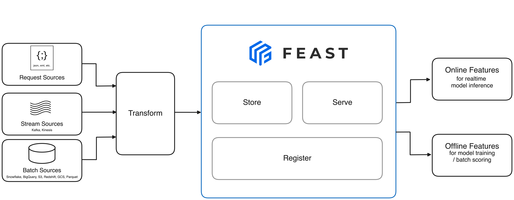

# Feast Architecture

This document describes the high-level architecture of Feast, the open-source feature store for machine learning. It is intended for contributors, AI agents, and anyone who needs to understand how the codebase is organized.

## System Overview

Feast manages the lifecycle of ML features: from batch and streaming data sources through transformations, storage, registration, and low-latency serving for real-time inference. The system is designed around pluggable backends—every storage layer, compute engine, and registry can be swapped independently.



The above diagram shows Feast's core flow:

- **Request Sources**, **Stream Sources** (Kafka, Kinesis), and **Batch Sources** (Snowflake, BigQuery, S3, Redshift, GCS, Parquet) feed into Feast
- **Transform** — feature transformations applied at ingestion or request time
- **Store** — features are stored in offline (historical) and online (low-latency) stores
- **Serve** — features are served for real-time model inference
- **Register** — feature definitions are registered in a metadata catalog
- **Online Features** — served for real-time model inference
- **Offline Features** — used for model training and batch scoring

For the full deployment guide (Snowflake/GCP/AWS), see [How-To Guides](https://docs.feast.dev/how-to-guides/feast-snowflake-gcp-aws).

### Component Overview

| Layer | Component | Implementations |
|-------|-----------|-----------------|
| **SDK / CLI** | `feast.feature_store` | Python, Go, Java |
| **Registry** | Metadata catalog | File (S3/GCS), SQL (Postgres/MySQL/SQLite) |
| **Provider** | Orchestrator | PassthroughProvider |
| **Offline Store** | Historical retrieval | BigQuery, Snowflake, Redshift, Spark, DuckDB, Postgres, Trino, Athena |
| **Online Store** | Low-latency serving | Redis, DynamoDB, Bigtable, Postgres, SQLite, Cassandra, Milvus, Qdrant |
| **Compute Engine** | Materialization jobs | Local, Spark, Kubernetes, Ray, Snowflake, AWS Lambda |

## Core Concepts

| Concept | Description | Definition File |
|---------|-------------|-----------------|
| **Entity** | A real-world object (user, product) that features describe | `sdk/python/feast/entity.py` |
| **FeatureView** | A group of features sourced from a single data source | `sdk/python/feast/feature_view.py` |
| **OnDemandFeatureView** | Features computed at request time via transformations | `sdk/python/feast/on_demand_feature_view.py` |
| **StreamFeatureView** | Features derived from streaming data sources | `sdk/python/feast/stream_feature_view.py` |
| **FeatureService** | A named collection of feature views for a use case | `sdk/python/feast/feature_service.py` |
| **DataSource** | Connection to raw data (file, warehouse, stream) | `sdk/python/feast/data_source.py` |
| **Permission** | Authorization policy controlling access to resources | `sdk/python/feast/permissions/permission.py` |

## Key Abstractions

### FeatureStore (`sdk/python/feast/feature_store.py`)

The main entry point for all SDK operations. Users interact with Feast through this class:

- `apply()` — register feature definitions in the registry
- `get_historical_features()` — point-in-time correct feature retrieval for training
- `get_online_features()` — low-latency feature retrieval for inference
- `materialize()` / `materialize_incremental()` — copy features from offline to online store
- `push()` — push features directly to the online store
- `teardown()` — remove infrastructure

### Provider (`sdk/python/feast/infra/provider.py`)

Orchestrates the offline store, online store, and compute engine. All cloud providers (GCP, AWS, Azure, local) use `PassthroughProvider`, which delegates directly to the configured store implementations.

### OfflineStore (`sdk/python/feast/infra/offline_stores/offline_store.py`)

Abstract base class for historical feature retrieval. Key methods:

- `get_historical_features()` — point-in-time join of features with entity timestamps
- `pull_latest_from_table_or_query()` — extract latest entity rows for materialization
- `pull_all_from_table_or_query()` — extract all rows in a time range
- `offline_write_batch()` — write features to the offline store

Implementations: BigQuery, Snowflake, Redshift, Spark, Dask, DuckDB, Postgres, Trino, Athena, and more under `infra/offline_stores/contrib/`.

### OnlineStore (`sdk/python/feast/infra/online_stores/online_store.py`)

Abstract base class for low-latency feature serving. Key methods:

- `online_read()` — read features by entity keys
- `online_write_batch()` — write materialized features
- `update()` — create/update cloud resources
- `retrieve_online_documents()` — vector similarity search (for embedding stores)

Implementations: Redis, DynamoDB, Bigtable, Snowflake, SQLite, Postgres, Cassandra, MongoDB, MySQL, Elasticsearch, Milvus, Qdrant, and a HybridOnlineStore that combines multiple backends.

### Registry (`sdk/python/feast/infra/registry/`)

The metadata catalog that stores all feature definitions (entities, feature views, feature services, permissions). Two main implementations:

- **FileRegistry** (`registry.py`) — serializes the entire registry as a single protobuf file, stored on local disk, S3, GCS, or Azure Blob. Uses `RegistryStore` backends for storage.
- **SqlRegistry** (`sql.py`) — stores metadata in a SQL database (PostgreSQL, MySQL, SQLite).

### ComputeEngine (`sdk/python/feast/infra/compute_engines/base.py`)

Abstract base class for materialization — the process of copying features from the offline store to the online store. Key method:

- `materialize()` — execute materialization tasks, each representing a (feature_view, time_range) pair

Implementations: Local (single-machine), Spark, Kubernetes (K8s Jobs), Ray, Snowflake (SQL-based), AWS Lambda.

### Feature Server (`sdk/python/feast/feature_server.py`)

A FastAPI application that exposes Feast operations over HTTP:

- `POST /get-online-features` — retrieve online features
- `POST /push` — push features to online/offline stores
- `POST /materialize` — trigger materialization
- `POST /materialize-incremental` — incremental materialization

Started via `feast serve` CLI command.

## Permissions and Authorization

The permissions system (`sdk/python/feast/permissions/`) provides fine-grained access control:

| Component | File | Purpose |
|-----------|------|---------|
| `Permission` | `permission.py` | Policy definition (resource type + action + roles) |
| `SecurityManager` | `security_manager.py` | Runtime permission enforcement |
| `AuthManager` | `auth/auth_manager.py` | Token extraction and parsing |
| `AuthConfig` | `auth_model.py` | Auth configuration (OIDC, Kubernetes, NoAuth) |

Auth flow: Client sends token → AuthManager extracts identity → SecurityManager checks Permission policies → access granted or denied.

## CLI

The Feast CLI (`sdk/python/feast/cli/cli.py`) is built with Click and provides commands for:

- `feast apply` — register feature definitions
- `feast materialize` / `feast materialize-incremental` — run materialization
- `feast serve` — start the feature server
- `feast plan` — preview changes before applying
- `feast teardown` — remove infrastructure
- `feast init` — scaffold a new feature repository

## Kubernetes Operator

The Feast Operator (`infra/feast-operator/`) is a Go-based Kubernetes operator built with controller-runtime (Kubebuilder):

| Component | Location | Purpose |
|-----------|----------|---------|
| CRD (`FeatureStore`) | `api/v1/featurestore_types.go` | Custom Resource Definition |
| Reconciler | `internal/controller/featurestore_controller.go` | Main control loop |
| Service handlers | `internal/controller/services/` | Manage Deployments, Services, ConfigMaps |
| AuthZ | `internal/controller/authz/` | RBAC/authorization setup |

The operator watches `FeatureStore` custom resources and reconciles Deployments, Services, ConfigMaps, Secrets, CronJobs, and HPAs to run Feast components in Kubernetes.

## Directory Structure

```
feast/
├── sdk/python/feast/              # Python SDK (primary implementation)
│   ├── cli/                       #   CLI commands (Click)
│   ├── infra/                     #   Infrastructure abstractions
│   │   ├── offline_stores/        #     Offline store implementations
│   │   ├── online_stores/         #     Online store implementations
│   │   ├── compute_engines/       #     Materialization engines
│   │   ├── registry/              #     Registry implementations
│   │   ├── feature_servers/       #     Feature server deployments
│   │   └── common/                #     Shared infra code
│   ├── permissions/               #   Authorization system
│   ├── transformation/            #   Feature transformations
│   └── feature_store.py           #   Main FeatureStore class
├── go/                            # Go SDK
├── java/                          # Java SDK (serving + client)
├── protos/                        # Protocol Buffer definitions
├── ui/                            # React/TypeScript web UI
├── infra/                         # Infrastructure and deployment
│   ├── feast-operator/            #   Kubernetes operator (Go)
│   ├── charts/                    #   Helm charts
│   └── terraform/                 #   Cloud infrastructure (IaC)
├── docs/                          # Documentation (GitBook)
├── examples/                      # Example feature repositories
└── Makefile                       # Build targets
```

## Data Flow

### Training (Offline)

```
Data Source → OfflineStore.get_historical_features() → Point-in-Time Join → Training DataFrame
```

1. User defines `FeatureView` + `Entity` + `DataSource`
2. User calls `store.get_historical_features(entity_df, features)`
3. OfflineStore performs point-in-time join against the data source
4. Returns a `RetrievalJob` that materializes to a DataFrame or Arrow table

### Serving (Online)

```
OfflineStore → ComputeEngine.materialize() → OnlineStore → FeatureServer → Inference
```

1. `feast materialize` triggers the compute engine
2. ComputeEngine reads latest values from the offline store
3. Values are written to the online store via `OnlineStore.online_write_batch()`
4. Feature server or SDK reads from online store via `OnlineStore.online_read()`

### Push-Based Ingestion

```
Application → FeatureStore.push() → OnlineStore (+ optionally OfflineStore)
```

Features can be pushed directly without materialization, useful for streaming or real-time features.

## Extension Points

Feast is designed for extensibility. To add a new backend:

1. **Offline Store**: Subclass `OfflineStore` and `OfflineStoreConfig` in `infra/offline_stores/contrib/`
2. **Online Store**: Subclass `OnlineStore` and `OnlineStoreConfig` in `infra/online_stores/`
3. **Compute Engine**: Subclass `ComputeEngine` in `infra/compute_engines/`
4. **Registry Store**: Subclass `RegistryStore` in `infra/registry/`

Register the new implementation in `RepoConfig` (see `repo_config.py` for the class resolution logic).

## Related Documents

- [Development Guide](docs/project/development-guide.md) — build, test, and debug instructions
- [Operator README](infra/feast-operator/README.md) — Kubernetes operator documentation
