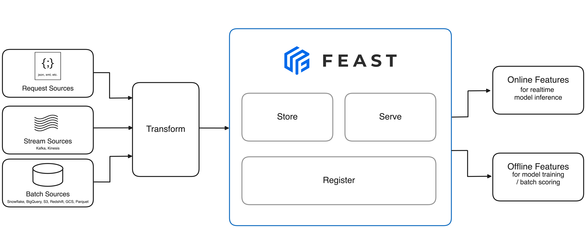
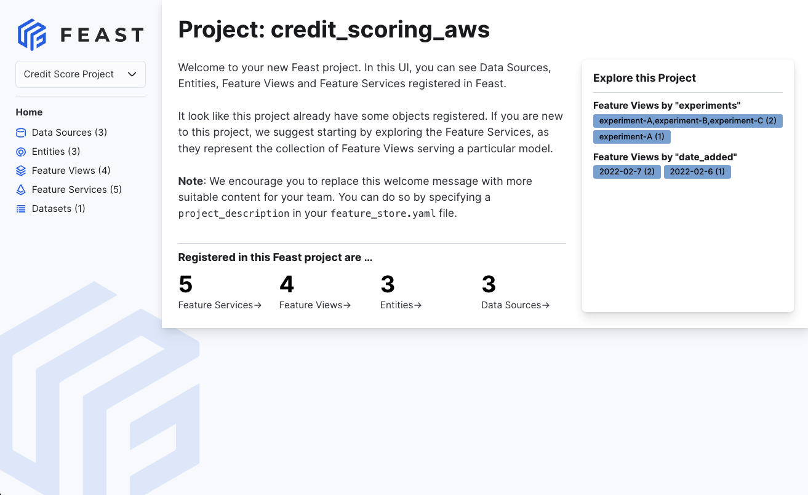

<!--Do not modify this file. It is auto-generated from a template (infra/templates/README.md.jinja2)-->

<p align="center">
    <a href="https://feast.dev/">
      
    </a>
</p>
<br />

[](https://github.com/feast-dev/feast/actions/workflows/unit_tests.yml)
[](https://github.com/feast-dev/feast/actions/workflows/master_only.yml)
[](https://github.com/feast-dev/feast/actions/workflows/java_master_only.yml)
[](https://github.com/feast-dev/feast/actions/workflows/linter.yml)
[](https://docs.feast.dev/)
[](http://rtd.feast.dev/)
[](https://github.com/feast-dev/feast/blob/master/LICENSE)
[](https://github.com/feast-dev/feast/releases)

## Overview

Feast (**Fea**ture **St**ore) is an open source feature store for machine learning. Feast is the fastest path to manage existing infrastructure to productionize analytic data for model training and online inference.


Feast allows ML platform teams to:

* **Make features consistently available for training and serving** by managing an _offline store_ (to process historical data for scale-out batch scoring or model training), a low-latency _online store_ (to power real-time prediction)_,_ and a battle-tested _feature server_ (to serve pre-computed features online).
* **Avoid data leakage** by generating point-in-time correct feature sets so data scientists can focus on feature engineering rather than debugging error-prone dataset joining logic. This ensure that future feature values do not leak to models during training.
* **Decouple ML from data infrastructure** by providing a single data access layer that abstracts feature storage from feature retrieval, ensuring models remain portable as you move from training models to serving models, from batch models to realtime models, and from one data infra system to another.

Please see our [documentation](https://docs.feast.dev/) for more information about the project, or sign up for an [email newsletter](https://feast.dev/).

## 📐 Architecture


The above architecture is the minimal Feast deployment. Want to run the full Feast on Snowflake/GCP/AWS? Click [here](https://docs.feast.dev/how-to-guides/feast-snowflake-gcp-aws).

## 🐣 Getting Started

### 1. Install Feast
```commandline
pip install feast
```

### 2. Create a feature repository
```commandline
feast init my_feature_repo
cd my_feature_repo/feature_repo
```

### 3. Register your feature definitions and set up your feature store
```commandline
feast apply
```

### 4. Explore your data in the web UI (experimental)


```commandline
feast ui
```

### 5. Build a training dataset
```python
from feast import FeatureStore
import pandas as pd
from datetime import datetime

entity_df = pd.DataFrame.from_dict({
    "driver_id": [1001, 1002, 1003, 1004],
    "event_timestamp": [
        datetime(2021, 4, 12, 10, 59, 42),
        datetime(2021, 4, 12, 8,  12, 10),
        datetime(2021, 4, 12, 16, 40, 26),
        datetime(2021, 4, 12, 15, 1 , 12)
    ]
})

store = FeatureStore(repo_path=".")

training_df = store.get_historical_features(
    entity_df=entity_df,
    features = [
        'driver_hourly_stats:conv_rate',
        'driver_hourly_stats:acc_rate',
        'driver_hourly_stats:avg_daily_trips'
    ],
).to_df()

print(training_df.head())

# Train model
# model = ml.fit(training_df)
```
```commandline
            event_timestamp  driver_id  conv_rate  acc_rate  avg_daily_trips
0 2021-04-12 08:12:10+00:00       1002   0.713465  0.597095              531
1 2021-04-12 10:59:42+00:00       1001   0.072752  0.044344               11
2 2021-04-12 15:01:12+00:00       1004   0.658182  0.079150              220
3 2021-04-12 16:40:26+00:00       1003   0.162092  0.309035              959

```

### 6. Load feature values into your online store
```commandline
CURRENT_TIME=$(date -u +"%Y-%m-%dT%H:%M:%S")
feast materialize-incremental $CURRENT_TIME
```

```commandline
Materializing feature view driver_hourly_stats from 2021-04-14 to 2021-04-15 done!
```

### 7. Read online features at low latency
```python
from pprint import pprint
from feast import FeatureStore

store = FeatureStore(repo_path=".")

feature_vector = store.get_online_features(
    features=[
        'driver_hourly_stats:conv_rate',
        'driver_hourly_stats:acc_rate',
        'driver_hourly_stats:avg_daily_trips'
    ],
    entity_rows=[{"driver_id": 1001}]
).to_dict()

pprint(feature_vector)

# Make prediction
# model.predict(feature_vector)
```
```json
{
    "driver_id": [1001],
    "driver_hourly_stats__conv_rate": [0.49274],
    "driver_hourly_stats__acc_rate": [0.92743],
    "driver_hourly_stats__avg_daily_trips": [72]
}
```

## 📦 Functionality and Roadmap

The list below contains the functionality that contributors are planning to develop for Feast.

* We welcome contribution to all items in the roadmap!
* Have questions about the roadmap? Go to the Slack channel to ask on #feast-development.

* **Data Sources**
  * [x] [Snowflake source](https://docs.feast.dev/reference/data-sources/snowflake)
  * [x] [Redshift source](https://docs.feast.dev/reference/data-sources/redshift)
  * [x] [BigQuery source](https://docs.feast.dev/reference/data-sources/bigquery)
  * [x] [Parquet file source](https://docs.feast.dev/reference/data-sources/file)
  * [x] [Azure Synapse + Azure SQL source (contrib plugin)](https://docs.feast.dev/reference/data-sources/mssql)
  * [x] [Hive (community plugin)](https://github.com/baineng/feast-hive)
  * [x] [Postgres (contrib plugin)](https://docs.feast.dev/reference/data-sources/postgres)
  * [x] [Spark (contrib plugin)](https://docs.feast.dev/reference/data-sources/spark)
  * [x] Kafka / Kinesis sources (via [push support into the online store](https://docs.feast.dev/reference/data-sources/push))
* **Offline Stores**
  * [x] [Snowflake](https://docs.feast.dev/reference/offline-stores/snowflake)
  * [x] [Redshift](https://docs.feast.dev/reference/offline-stores/redshift)
  * [x] [BigQuery](https://docs.feast.dev/reference/offline-stores/bigquery)
  * [x] [Azure Synapse + Azure SQL (contrib plugin)](https://docs.feast.dev/reference/offline-stores/mssql.md)
  * [x] [Hive (community plugin)](https://github.com/baineng/feast-hive)
  * [x] [Postgres (contrib plugin)](https://docs.feast.dev/reference/offline-stores/postgres)
  * [x] [Trino (contrib plugin)](https://github.com/Shopify/feast-trino)
  * [x] [Spark (contrib plugin)](https://docs.feast.dev/reference/offline-stores/spark)
  * [x] [In-memory / Pandas](https://docs.feast.dev/reference/offline-stores/file)
  * [x] [Custom offline store support](https://docs.feast.dev/how-to-guides/customizing-feast/adding-a-new-offline-store)
* **Online Stores**
  * [x] [Snowflake](https://docs.feast.dev/reference/online-stores/snowflake)
  * [x] [DynamoDB](https://docs.feast.dev/reference/online-stores/dynamodb)
  * [x] [Redis](https://docs.feast.dev/reference/online-stores/redis)
  * [x] [Datastore](https://docs.feast.dev/reference/online-stores/datastore)
  * [x] [Bigtable](https://docs.feast.dev/reference/online-stores/bigtable)
  * [x] [SQLite](https://docs.feast.dev/reference/online-stores/sqlite)
  * [x] [Azure Cache for Redis (community plugin)](https://github.com/Azure/feast-azure)
  * [x] [Postgres (contrib plugin)](https://docs.feast.dev/reference/online-stores/postgres)
  * [x] [Cassandra / AstraDB (contrib plugin)](https://docs.feast.dev/reference/online-stores/cassandra)
  * [x] [Custom online store support](https://docs.feast.dev/how-to-guides/customizing-feast/adding-support-for-a-new-online-store)
* **Feature Engineering**
  * [x] On-demand Transformations (Alpha release. See [RFC](https://docs.google.com/document/d/1lgfIw0Drc65LpaxbUu49RCeJgMew547meSJttnUqz7c/edit#))
  * [x] Streaming Transformations (Alpha release. See [RFC](https://docs.google.com/document/d/1UzEyETHUaGpn0ap4G82DHluiCj7zEbrQLkJJkKSv4e8/edit))
  * [ ] Batch transformation (In progress. See [RFC](https://docs.google.com/document/d/1964OkzuBljifDvkV-0fakp2uaijnVzdwWNGdz7Vz50A/edit))
* **Streaming**
  * [x] [Custom streaming ingestion job support](https://docs.feast.dev/how-to-guides/customizing-feast/creating-a-custom-provider)
  * [x] [Push based streaming data ingestion to online store](https://docs.feast.dev/reference/data-sources/push)
  * [x] [Push based streaming data ingestion to offline store](https://docs.feast.dev/reference/data-sources/push)
* **Deployments**
  * [x] AWS Lambda (Alpha release. See [RFC](https://docs.google.com/document/d/1eZWKWzfBif66LDN32IajpaG-j82LSHCCOzY6R7Ax7MI/edit))
  * [x] Kubernetes (See [guide](https://docs.feast.dev/how-to-guides/running-feast-in-production))
* **Feature Serving**
  * [x] Python Client
  * [x] [Python feature server](https://docs.feast.dev/reference/feature-servers/python-feature-server)
  * [x] [Java feature server (alpha)](https://github.com/feast-dev/feast/blob/master/infra/charts/feast/README.md)
  * [x] [Go feature server (alpha)](https://docs.feast.dev/reference/feature-servers/go-feature-server)
* **Data Quality Management (See [RFC](https://docs.google.com/document/d/110F72d4NTv80p35wDSONxhhPBqWRwbZXG4f9mNEMd98/edit))**
  * [x] Data profiling and validation (Great Expectations)
* **Feature Discovery and Governance**
  * [x] Python SDK for browsing feature registry
  * [x] CLI for browsing feature registry
  * [x] Model-centric feature tracking (feature services)
  * [x] Amundsen integration (see [Feast extractor](https://github.com/amundsen-io/amundsen/blob/main/databuilder/databuilder/extractor/feast_extractor.py))
  * [x] DataHub integration (see [DataHub Feast docs](https://datahubproject.io/docs/generated/ingestion/sources/feast/))
  * [x] Feast Web UI (Beta release. See [docs](https://docs.feast.dev/reference/alpha-web-ui))


## 🎓 Important Resources

Please refer to the official documentation at [Documentation](https://docs.feast.dev/)
 * [Quickstart](https://docs.feast.dev/getting-started/quickstart)
 * [Tutorials](https://docs.feast.dev/tutorials/tutorials-overview)
 * [Running Feast with Snowflake/GCP/AWS](https://docs.feast.dev/how-to-guides/feast-snowflake-gcp-aws)
 * [Change Log](https://github.com/feast-dev/feast/blob/master/CHANGELOG.md)
 * [Slack (#Feast)](https://slack.feast.dev/)

## 👋 Contributing
Feast is a community project and is still under active development. Please have a look at our contributing and development guides if you want to contribute to the project:
- [Contribution Process for Feast](https://docs.feast.dev/project/contributing)
- [Development Guide for Feast](https://docs.feast.dev/project/development-guide)
- [Development Guide for the Main Feast Repository](./CONTRIBUTING.md)

## ✨ Contributors

Thanks goes to these incredible people:

<a href="https://github.com/feast-dev/feast/graphs/contributors">
  
</a>