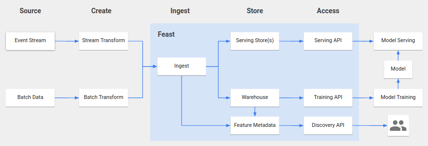

# Feast - Feature Store for Machine Learning

<p style='border: 1px solid red; border-radius: 0.5rem; background-color: #ffd699; padding: 0.6rem;'>Note: This repo is a fork of <a href="https://github.com/gojek/feast">github.com/gojek/feast</a>.</p>

## Farfetch Section

### How-to: Build locally

This project runs on CI for all commits (on all branches) and creates artifacts based on the commit hash.
Using Cloud Build locally is generally not however, it can be useful if debugging the `cloudbuild.yaml`.

Install the required dependencies: https://cloud.google.com/cloud-build/docs/build-debug-locally

```bash
cloud-build-local --config=cloudbuild.yaml --dryrun=false --substitutions SHORT_SHA=$(git rev-parse --short HEAD) .
```

### How-to: Build single step locally

Some steps can be build directly on your own machine - follow the commands that `cloudbuild.yaml` is invoking.

If you do not have the required dependencies, you can translate the `cloudbuild.yaml` step into a Docker command. E.g.:

```bash
docker run --rm --name feast-build \
    -v $(pwd):/workspace \
    -v go_cache:/cache/go \
    -v m2_cache:/cache/m2 \
    -w /workspace/protos \
    -e GO111MODULE=on \
    -e GOPATH=/cache/go \
    -e MAVEN_OPTS=-Dmaven.repo.local=/cache/m2 \
    -e FEAST_VERSION=ff-$(git rev-parse --short HEAD)-dev \
    --entrypoint make \
    gcr.io/konnekt-core/protoc-go:3.6.1 \
    gen-go
```

```bash
docker run --rm --name feast-build \
    -v $(pwd):/workspace \
    -v go_cache:/cache/go \
    -v m2_cache:/cache/m2 \
    -w /workspace \
    -e GO111MODULE=on \
    -e GOPATH=/cache/go \
    -e MAVEN_OPTS=-Dmaven.repo.local=/cache/m2 \
    -e FEAST_VERSION=ff-$(git rev-parse --short HEAD) \
    --entrypoint mvn -- \
    maven:3.6.2-jdk-11-slim \
    --projects=core \
    -Drevision=ff-$(git rev-parse --short HEAD) \
    -Dtestbucket=dev-konnekt-data-deep-1-feast-tmp \
    test
```

```bash
docker run --rm --name feast-build \
    -v $(pwd):/workspace \
    -v go_cache:/cache/go \
    -v m2_cache:/cache/m2 \
    -w /workspace/sdk/python \
    -e GO111MODULE=on \
    -e GOPATH=/cache/go \
    -e MAVEN_OPTS=-Dmaven.repo.local=/cache/m2 \
    -e FEAST_VERSION=ff-$(git rev-parse --short HEAD) \
    -e SKIP_BIGQUERY_TEST=true \
    --entrypoint sh -- \
    python:3.7-buster \
    -c 'pip install -r requirements-test.txt && pip install . && pytest ./tests'
```

### How-to: Run locally

```bash
mvn --projects core,ingestion -Drevision=dev -DskipTests=true --batch-mode package
docker-compose up --build
```

### How-to: Run locally in IDE

```bash
docker run --rm --name postgresql \
    -e POSTGRESQL_USERNAME=postgres \
    -e POSTGRESQL_PASSWORD=password \
    -e POSTGRESQL_DATABASE=postgres \
    -p 5432:5432 \
    bitnami/postgresql:11.5.0-debian-9-r84
```

```text
LOG_TYPE=JSON;PROJECT_ID=dev-konnekt-data-deep-1;TRAINING_DATASET_PREFIX=feast_training;JOB_RUNNER=DataflowRunner;JOB_WORKSPACE=gs://dev-konnekt-data-deep-1-dataflow-workspace;JOB_OPTIONS={};STORE_SERVING_TYPE=noop;STORE_SERVING_OPTIONS={};STORE_WAREHOUSE_TYPE=bigquery;STORE_WAREHOUSE_OPTIONS={"project": "dev-konnekt-data-deep-1", "dataset": "feast_warehouse"};STORE_ERRORS_TYPE=stdout;STORE_ERRORS_OPTIONS=;DATAFLOW_PROJECT_ID=dev-konnekt-data-deep-1;DATAFLOW_LOCATION=europe-west4
```
## Overview

Feast (Feature Store) is a tool to manage storage and access of machine learning features.

It aims to:
* Support ingesting feature data via batch or streaming
* Provide scalable storage of feature data for serving and training
* Provide an API for low latency access of features
* Enable discovery and documentation of features
* Provide an overview of the general health of features in the system

## High Level Architecture



The Feast platform is broken down into the following functional areas:

* __Create__ features based on defined format and programming model
* __Ingest__ features via streaming input, import from files or BigQuery tables, and write to an appropriate data store
* __Store__ feature data for both serving and training purposes based on feature access patterns
* __Access__ features for training and serving
* __Discover__ information about entities and features stored and served by Feast

## Motivation

__Access to features in serving__: Machine learning models typically require access to features created in both batch pipelines, and real time streams. Feast provides a means for accessing these features in a serving environment, at low latency and high load.

__Consistency between training and serving__: In many machine learning systems there exists a disconnect between features that are created in batch pipelines for the training of a model, and ones that are created from streams for the serving of real-time features. By centralizing the ingestion of features, Feast provides a consistent view of both batch and real-time features, in both training and serving.

__Infrastructure management__: Feast abstracts away much of the engineering overhead associated with managing data infrastructure. It handles the ingestion, storage, and serving of large amount of feature data in a scalable way. The system  configures data models based on your registered feature specifications, and ensures that you always have a consistent view of features in both your historical and real-time data stores.

__Feature standardisation__: Feast presents a centralized platform on which teams can register features in a standardized way using specifications. This provides structure to the way features are defined and allows teams to reference features in discussions with a singly understood link. 

__Discovery__: Feast allows users to easily explore and discover features and their associated information. This allows for a deeper understanding of features and theirs specifications, more feature reuse between teams and projects, and faster experimentation. Each new ML project can leverage features that have been created by prior teams, which compounds an organization's ability to discover new insights. 

## Notice

Feast is still under active development. Your feedback and contributions are important to us. Please check our [contributing guide](CONTRIBUTING.md) for details.

## Source Code Headers

Every file containing source code must include copyright and license
information. This includes any JS/CSS files that you might be serving out to
browsers. (This is to help well-intentioned people avoid accidental copying that
doesn't comply with the license.)

Apache header:

    Copyright 2019 The Feast Authors

    Licensed under the Apache License, Version 2.0 (the "License");
    you may not use this file except in compliance with the License.
    You may obtain a copy of the License at

        https://www.apache.org/licenses/LICENSE-2.0

    Unless required by applicable law or agreed to in writing, software
    distributed under the License is distributed on an "AS IS" BASIS,
    WITHOUT WARRANTIES OR CONDITIONS OF ANY KIND, either express or implied.
    See the License for the specific language governing permissions and
    limitations under the License.
