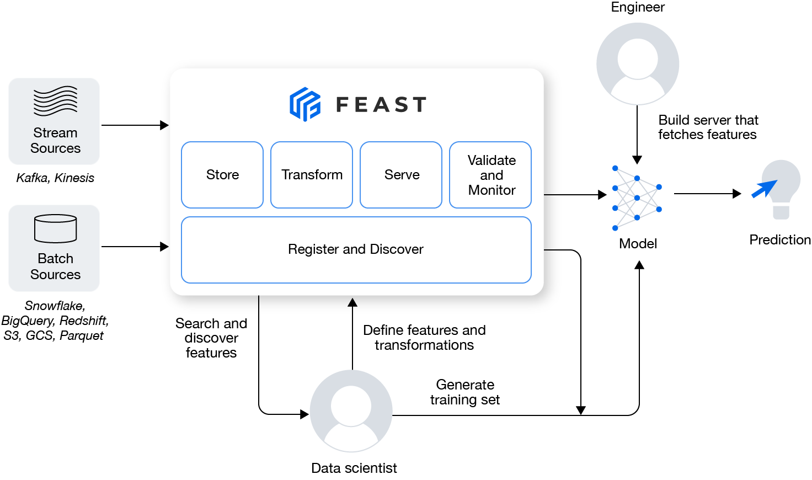

<!--Do not modify this file. It is auto-generated from a template (infra/templates/README.md.jinja2)-->

<p align="center">
    <a href="https://feast.dev/">
      
    </a>
</p>
<br />

[](https://github.com/feast-dev/feast/actions/workflows/unit_tests.yml)
[](https://github.com/feast-dev/feast/actions/workflows/master_only.yml)
[](https://github.com/feast-dev/feast/actions/workflows/java_master_only.yml)
[](https://github.com/feast-dev/feast/actions/workflows/linter.yml)
[](https://docs.feast.dev/)
[](http://rtd.feast.dev/)
[](https://github.com/feast-dev/feast/blob/master/LICENSE)
[](https://github.com/feast-dev/feast/releases)

## Overview

Feast is an open source feature store for machine learning. Feast is the fastest path to productionizing analytic data for model training and online inference.

Please see our [documentation](https://docs.feast.dev/) for more information about the project.

## 📐 Architecture


The above architecture is the minimal Feast deployment. Want to run the full Feast on Snowflake/GCP/AWS? Click [here](https://docs.feast.dev/how-to-guides/feast-snowflake-gcp-aws).

## 🐣 Getting Started

### 1. Install Feast
```commandline
pip install feast
```

### 2. Create a feature repository
```commandline
feast init my_feature_repo
cd my_feature_repo
```

### 3. Register your feature definitions and set up your feature store
```commandline
feast apply
```

### 4. Build a training dataset
```python
from feast import FeatureStore
import pandas as pd
from datetime import datetime

entity_df = pd.DataFrame.from_dict({
    "driver_id": [1001, 1002, 1003, 1004],
    "event_timestamp": [
        datetime(2021, 4, 12, 10, 59, 42),
        datetime(2021, 4, 12, 8,  12, 10),
        datetime(2021, 4, 12, 16, 40, 26),
        datetime(2021, 4, 12, 15, 1 , 12)
    ]
})

store = FeatureStore(repo_path=".")

training_df = store.get_historical_features(
    entity_df=entity_df,
    features = [
        'driver_hourly_stats:conv_rate',
        'driver_hourly_stats:acc_rate',
        'driver_hourly_stats:avg_daily_trips'
    ],
).to_df()

print(training_df.head())

# Train model
# model = ml.fit(training_df)
```
```commandline
            event_timestamp  driver_id  conv_rate  acc_rate  avg_daily_trips
0 2021-04-12 08:12:10+00:00       1002   0.713465  0.597095              531
1 2021-04-12 10:59:42+00:00       1001   0.072752  0.044344               11
2 2021-04-12 15:01:12+00:00       1004   0.658182  0.079150              220
3 2021-04-12 16:40:26+00:00       1003   0.162092  0.309035              959

```

### 5. Load feature values into your online store
```commandline
CURRENT_TIME=$(date -u +"%Y-%m-%dT%H:%M:%S")
feast materialize-incremental $CURRENT_TIME
```

```commandline
Materializing feature view driver_hourly_stats from 2021-04-14 to 2021-04-15 done!
```

### 6. Read online features at low latency
```python
from pprint import pprint
from feast import FeatureStore

store = FeatureStore(repo_path=".")

feature_vector = store.get_online_features(
    features=[
        'driver_hourly_stats:conv_rate',
        'driver_hourly_stats:acc_rate',
        'driver_hourly_stats:avg_daily_trips'
    ],
    entity_rows=[{"driver_id": 1001}]
).to_dict()

pprint(feature_vector)

# Make prediction
# model.predict(feature_vector)
```
```json
{
    "driver_id": [1001],
    "driver_hourly_stats__conv_rate": [0.49274],
    "driver_hourly_stats__acc_rate": [0.92743],
    "driver_hourly_stats__avg_daily_trips": [72]
}
```

## 📦 Functionality and Roadmap

The list below contains the functionality that contributors are planning to develop for Feast

* Items below that are in development (or planned for development) will be indicated in parentheses.
* We welcome contribution to all items in the roadmap!
* Want to influence our roadmap and prioritization? Submit your feedback to [this form](https://docs.google.com/forms/d/e/1FAIpQLSfa1nRQ0sKz-JEFnMMCi4Jseag\_yDssO\_3nV9qMfxfrkil-wA/viewform).
* Want to speak to a Feast contributor? We are more than happy to jump on a call. Please schedule a time using [Calendly](https://calendly.com/d/x2ry-g5bb/meet-with-feast-team).

* **Data Sources**
  * [x] [Snowflake source](https://docs.feast.dev/reference/data-sources/snowflake)
  * [x] [Redshift source](https://docs.feast.dev/reference/data-sources/redshift)
  * [x] [BigQuery source](https://docs.feast.dev/reference/data-sources/bigquery)
  * [x] [Parquet file source](https://docs.feast.dev/reference/data-sources/file)
  * [x] [Synapse source (community plugin)](https://github.com/Azure/feast-azure)
  * [x] [Hive (community plugin)](https://github.com/baineng/feast-hive)
  * [x] [Postgres (community plugin)](https://github.com/nossrannug/feast-postgres)
  * [x] [Spark (community plugin)](https://github.com/Adyen/feast-spark-offline-store)
  * [x] Kafka source (with [push support into the online store](https://docs.feast.dev/reference/alpha-stream-ingestion))
  * [ ] HTTP source
* **Offline Stores**
  * [x] [Snowflake](https://docs.feast.dev/reference/offline-stores/snowflake)
  * [x] [Redshift](https://docs.feast.dev/reference/offline-stores/redshift)
  * [x] [BigQuery](https://docs.feast.dev/reference/offline-stores/bigquery)
  * [x] [Synapse (community plugin)](https://github.com/Azure/feast-azure)
  * [x] [Hive (community plugin)](https://github.com/baineng/feast-hive)
  * [x] [Postgres (community plugin)](https://github.com/nossrannug/feast-postgres)
  * [x] [Trino (community plugin)](https://github.com/Shopify/feast-trino)
  * [x] [Spark (community plugin)](https://github.com/Adyen/feast-spark-offline-store)
  * [x] [In-memory / Pandas](https://docs.feast.dev/reference/offline-stores/file)
  * [x] [Custom offline store support](https://docs.feast.dev/how-to-guides/adding-a-new-offline-store)
* **Online Stores**
  * [x] [DynamoDB](https://docs.feast.dev/reference/online-stores/dynamodb)
  * [x] [Redis](https://docs.feast.dev/reference/online-stores/redis)
  * [x] [Datastore](https://docs.feast.dev/reference/online-stores/datastore)
  * [x] [SQLite](https://docs.feast.dev/reference/online-stores/sqlite)
  * [x] [Azure Cache for Redis (community plugin)](https://github.com/Azure/feast-azure)
  * [x] [Postgres (community plugin)](https://github.com/nossrannug/feast-postgres)
  * [x] [Custom online store support](https://docs.feast.dev/how-to-guides/adding-support-for-a-new-online-store)
  * [ ] Bigtable
  * [ ] Cassandra
* **Streaming**
  * [x] [Custom streaming ingestion job support](https://docs.feast.dev/how-to-guides/creating-a-custom-provider)
  * [x] [Push based streaming data ingestion](reference/alpha-stream-ingestion.md)
  * [ ] Streaming ingestion on AWS
  * [ ] Streaming ingestion on GCP
* **Feature Engineering**
  * [x] On-demand Transformations (Alpha release. See [RFC](https://docs.google.com/document/d/1lgfIw0Drc65LpaxbUu49RCeJgMew547meSJttnUqz7c/edit#))
  * [ ] Batch transformation (SQL. In progress. See [RFC](https://docs.google.com/document/d/1964OkzuBljifDvkV-0fakp2uaijnVzdwWNGdz7Vz50A/edit))
  * [ ] Streaming transformation
* **Deployments**
  * [x] AWS Lambda (Alpha release. See [RFC](https://docs.google.com/document/d/1eZWKWzfBif66LDN32IajpaG-j82LSHCCOzY6R7Ax7MI/edit))
  * [x] Kubernetes (See [guide](https://docs.feast.dev/how-to-guides/running-feast-in-production#4.3.-java-based-feature-server-deployed-on-kubernetes))
  * [ ] Cloud Run
  * [ ] KNative
* **Feature Serving**
  * [x] Python Client
  * [x] REST Feature Server (Python) (Alpha release. See [RFC](https://docs.google.com/document/d/1iXvFhAsJ5jgAhPOpTdB3j-Wj1S9x3Ev\_Wr6ZpnLzER4/edit))
  * [x] gRPC Feature Server (Java) (See [#1497](https://github.com/feast-dev/feast/issues/1497))
  * [x] Push API
  * [ ] Java Client
  * [ ] Go Client
  * [ ] Delete API
  * [ ] Feature Logging (for training)
* **Data Quality Management (See [RFC](https://docs.google.com/document/d/110F72d4NTv80p35wDSONxhhPBqWRwbZXG4f9mNEMd98/edit))**
  * [x] Data profiling and validation (Great Expectations)
  * [ ] Metric production
  * [ ] Training-serving skew detection
  * [ ] Drift detection
* **Feature Discovery and Governance**
  * [x] Python SDK for browsing feature registry
  * [x] CLI for browsing feature registry
  * [x] Model-centric feature tracking (feature services)
  * [x] Amundsen integration (see [Feast extractor](https://github.com/amundsen-io/amundsen/blob/main/databuilder/databuilder/extractor/feast_extractor.py))
  * [ ] REST API for browsing feature registry
  * [ ] Feast Web UI
  * [ ] Feature versioning


## 🎓 Important Resources

Please refer to the official documentation at [Documentation](https://docs.feast.dev/)
 * [Quickstart](https://docs.feast.dev/getting-started/quickstart)
 * [Tutorials](https://docs.feast.dev/tutorials/tutorials-overview)
 * [Running Feast with Snowflake/GCP/AWS](https://docs.feast.dev/how-to-guides/feast-snowflake-gcp-aws)
 * [Change Log](https://github.com/feast-dev/feast/blob/master/CHANGELOG.md)
 * [Slack (#Feast)](https://slack.feast.dev/)

## 👋 Contributing
Feast is a community project and is still under active development. Please have a look at our contributing and development guides if you want to contribute to the project:
- [Contribution Process for Feast](https://docs.feast.dev/project/contributing)
- [Development Guide for Feast](https://docs.feast.dev/project/development-guide)
- [Development Guide for the Main Feast Repository](./CONTRIBUTING.md)

## ✨ Contributors

Thanks goes to these incredible people:

<a href="https://github.com/feast-dev/feast/graphs/contributors">
  
</a>