# TODO Resolution Execution Plan

**Total Pending TODOs:** 21
**Execution Strategy:** Parallel resolution with dependency management

---

## Dependency Analysis

### Wave 1: Independent P0 Critical (2 items - PARALLEL)
- **017:** Unvalidated SQL identifiers (no deps)
- **018:** Credentials in SQL SET (no deps)

### Wave 2: Independent P1 Important (4 items - PARALLEL)
- **002:** SQL injection identifiers (no deps) - DUPLICATE of 017
- **004:** Append-only duplicates (no deps)
- **005:** Non-deterministic tie-breaking (no deps)
- **016:** Duplicate function (no deps)
- **019:** MOR double-scan (no deps)

### Wave 3: Dependent P1 (3 items - AFTER Wave 2)
- **020:** TTL value validation (depends on 003 - RESOLVED ✓)
- **021:** Overly broad exceptions (depends on 015)
- **022:** Missing test coverage (depends on 014, 015)

### Wave 4: Independent P2 Moderate (10 items - PARALLEL)
- **006:** No catalog caching (no deps)
- **007:** Python loop deduplication (no deps)
- **008:** Missing created_timestamp dedup (no deps)
- **009:** Memory materialization (no deps)
- **010:** Hardcoded event_timestamp (no deps)
- **011:** Incomplete type mapping (no deps)
- **012:** Small file problem (no deps)
- **013:** Missing offline_write_batch (no deps)
- **014:** Credential exposure (no deps)
- **015:** Exception swallowing (no deps)
- **023:** Redundant logger import (no deps)

---

## Dependency Graph (Mermaid)

```mermaid
graph TD
    subgraph "Wave 1: P0 Critical (Parallel)"
        T017[017: SQL Identifiers]
        T018[018: Credentials in SET]
    end

    subgraph "Wave 2: P1 Independent (Parallel)"
        T002[002: SQL Injection IDs]
        T004[004: Append-Only]
        T005[005: Tie-Breaking]
        T016[016: Duplicate Function]
        T019[019: MOR Double-Scan]
    end

    subgraph "Wave 3: P1 Dependent"
        T020[020: TTL Validation]
        T021[021: Broad Exceptions]
        T022[022: Test Coverage]
    end

    subgraph "Wave 4: P2 Moderate (Parallel)"
        T006[006: Catalog Cache]
        T007[007: Loop Dedup]
        T008[008: Timestamp Dedup]
        T009[009: Memory]
        T010[010: Hardcoded TS]
        T011[011: Type Mapping]
        T012[012: Small Files]
        T013[013: Write Batch]
        T014[014: Cred Exposure]
        T015[015: Exception Swap]
        T023[023: Logger Import]
    end

    %% Dependencies
    T015 --> T021
    T014 --> T022
    T015 --> T022

    %% Wave ordering
    T017 -.-> T002
    T018 -.-> Wave2[Wave 2 Start]
    T002 -.-> T020
    T004 -.-> T020
    T005 -.-> T020
    T016 -.-> T020
    T019 -.-> T020

    style T017 fill:#ff6b6b
    style T018 fill:#ff6b6b
    style T002 fill:#ffd93d
    style T004 fill:#ffd93d
    style T005 fill:#ffd93d
    style T016 fill:#ffd93d
    style T019 fill:#ffd93d
    style T020 fill:#ffd93d
    style T021 fill:#ffd93d
    style T022 fill:#ffd93d
```



---

## Execution Plan

### Can We Do Everything in Parallel?
**No** - We have 3 dependency chains:
1. **020** depends on **003** (RESOLVED ✓) - Can run in Wave 3
2. **021** depends on **015** - Must wait for 015 in Wave 4
3. **022** depends on **014** and **015** - Must wait for both in Wave 4

### Optimal Execution Strategy

**Phase 1:** Wave 1 (2 agents in parallel)
- Spawn 2 agents for P0 critical issues
- Wait for completion

**Phase 2:** Wave 2 + Wave 4 (15 agents in parallel)
- Spawn 5 agents for P1 independent
- Spawn 10 agents for P2 moderate
- Wait for completion (specifically 014, 015)

**Phase 3:** Wave 3 (3 agents in parallel)
- Spawn 3 agents for P1 dependent (after 014, 015 complete)
- Wait for completion

**Phase 4:** Commit & Resolve
- Create single commit with all changes
- Update all TODO files to status: resolved
- Push to remote

---

## Agent Spawn Commands

### Phase 1: P0 Critical
```
Task(pr-comment-resolver, "017: Unvalidated SQL identifiers")
Task(pr-comment-resolver, "018: Credentials in SQL SET")
```

### Phase 2: P1 Independent + P2 Moderate
```
Task(pr-comment-resolver, "002: SQL injection identifiers")
Task(pr-comment-resolver, "004: Append-only duplicates")
Task(pr-comment-resolver, "005: Non-deterministic tie-breaking")
Task(pr-comment-resolver, "016: Duplicate function")
Task(pr-comment-resolver, "019: MOR double-scan")
Task(pr-comment-resolver, "006: No catalog caching")
Task(pr-comment-resolver, "007: Python loop deduplication")
Task(pr-comment-resolver, "008: Missing created_timestamp dedup")
Task(pr-comment-resolver, "009: Memory materialization")
Task(pr-comment-resolver, "010: Hardcoded event_timestamp")
Task(pr-comment-resolver, "011: Incomplete type mapping")
Task(pr-comment-resolver, "012: Small file problem")
Task(pr-comment-resolver, "013: Missing offline_write_batch")
Task(pr-comment-resolver, "014: Credential exposure")
Task(pr-comment-resolver, "015: Exception swallowing")
```

### Phase 3: P1 Dependent
```
Task(pr-comment-resolver, "020: TTL value validation")
Task(pr-comment-resolver, "021: Overly broad exceptions")
Task(pr-comment-resolver, "022: Missing test coverage")
```

---

## Notes

- **002 vs 017:** Issue 002 and 017 are duplicates (same SQL identifier problem). Will resolve both.
- **Already Resolved:** Issues 001 and 003 are marked as resolved, skipping.
- **Total Agents:** 20 agents across 3 phases
- **Estimated Time:** ~45-60 minutes for all phases
