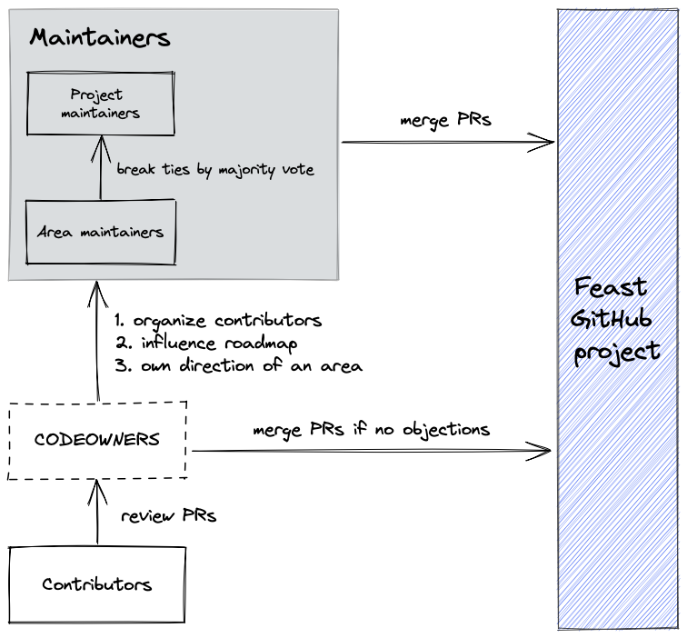

<h1> Feast Governance </h1>

- [Introduction](#introduction)
- [Feast community overview](#feast-community-overview)
- [Feast governance model overview](#feast-governance-model-overview)
- [Roles And Responsibilities](#roles-and-responsibilities)
  - [Users](#users)
  - [Contributors](#contributors)
  - [CODEOWNERS](#codeowners)
  - [Maintainers (project + area)](#maintainers-project--area)
    - [Types of maintainers](#types-of-maintainers)
    - [Optional maintainer responsibilities](#optional-maintainer-responsibilities)
  - [Becoming a Maintainer](#becoming-a-maintainer)
    - [Who is eligible to become a maintainer?](#who-is-eligible-to-become-a-maintainer)
    - [Process](#process)
    - [Earning a Nomination](#earning-a-nomination)
  - [Losing Maintainer Status](#losing-maintainer-status)
- [Decision Making Process](#decision-making-process)
  - [Lazy consensus](#lazy-consensus)
  - [Voting](#voting)
  - [Changes to Governance](#changes-to-governance)
- [Roadmap Creation](#roadmap-creation)
  - [RFCs Process](#rfcs-process)
    - [When to Use RFCs](#when-to-use-rfcs)
- [Resources](#resources)

# Introduction

Feast is an open-source feature store for machine learning that allows teams to define, manage, store, and serve features to operational ML systems.

The Feast project aims for open and transparent governance and decision-making, thus encouraging community building and contribution.

A formal governance structure helps us to 

*   Provide a structure for individuals to become involved in the project.
*   Communicate all processes for members to operate within the project.
*   Document a system for open product development, roadmapping, and planning.
*   Provide a means for making decisions if consensus cannot be reached.

# Feast community overview

On a high level, the key moving parts of the community are:
- **GitHub activity** (issues + pull requests) 
- **Slack community** ([slack.feast.dev](slack.feast.dev))
  - `#feast-development` is where design discussions happen amongst contributors
  - Other Slack channels exist for users to ask and answer questions.
- **RFCs** ([drive folder](https://drive.google.com/drive/u/0/folders/1msUsgmDbVBaysmhBlg9lklYLLTMk4bC3)) for detailed discussions
- **Community calls** (biweekly) to discuss best practices, contributions, and announce changes
- **Maintainer syncs** (monthly) for [maintainers](maintainers.md) to discuss project direction and health

With this structure, users and contributors largely self-organize and contribute changes as per [lazy consensus](#lazy-consensus). If there is active opposition and unresolvable conflict, then maintainers step in to break ties or make decisions.

We dive more deeply into the governance model below.

# Feast governance model overview

Feast is a meritocratic, consensus-based community project. 

Anyone interested in the project can join the community to:
- contribute to the project design
- participate in the decision-making process. 

The general decision making workflow is as follows:

</img>

> **Note**: There may not always a corresponding CODEOWNER for the affected code, in which case the responsibility falls on other maintainers or contributors with write access to review + merge the PR

# Roles And Responsibilities

## Users

Users are community members who require the operational ML functionality of Feast. They are the most important community members, and without them, the project would have no purpose. Anyone can be a user; there are no special requirements.

Feast asks its users to participate in the project and community as much as possible. User contributions enable the project team to ensure that they satisfy the needs of those users. Frequently, user contributions include (but are not limited to):

*   Providing developers with feedback on the project (user experience)
*   Providing feature requests
*   Filing bug reports or flagging issues
*   Providing moral support
*   Evangelizing the project

Users who continue to engage with the project and its community will often become more and more involved. Such users may find themselves becoming contributors, as described in the next section.

## Contributors

Contributors are community members who contribute in concrete ways to the project. Anyone can become a contributor, and contributions can take many forms, as detailed in the [all-contributors project](https://allcontributors.org/docs/en/emoji-key#table). There is no expectation of commitment to the project, no specific skill requirements, and no selection process.

In addition to their actions as users, contributors may also find themselves doing one or more of the following:

*   Supporting new users (existing users are often the best people to help new users)
*   Creating, triaging or commenting on Issues
*   Doing code reviews or commenting on technical documents
*   Writing, editing, translating or reviewing the documentation
*   Organizing events or evangelizing the project

Contributors engage with the project through the issue tracker and slack community, or by writing or editing documentation. They submit changes to the project itself via Pull Requests (PRs), which will be considered for inclusion in the project by existing maintainers (see next section). 

Contributors should follow the following guides when creating PRs:
- [Contribution Process](https://docs.feast.dev/project/contributing)
- [Development Guide](https://docs.feast.dev/project/development-guide).

As contributors gain experience and familiarity with the project, their profile and commitment within the community will increase. At some stage, they may find themselves being nominated for being a maintainer.

## CODEOWNERS

On top of maintainers who will be in the CODEOWNERS file, other contributors can also be added as a lower commitment way to contribute by reviewing / responding to PRs. 

CODEOWNERS will generally be the first point of contacts in reviewing pull requests and will have commit privileges.

## Maintainers (project + area)

Maintainers are community members who have shown that they are committed to Feast’s continued development through ongoing engagement with the community.  Because of this, maintainers have the right to merge PRs and have voting rights.

> **Note**: maintainers, like other contributors, must make changes to Feast via pull requests (with code review). This applies to all changes to documentation, code, configuration, governance, etc. 

### Types of maintainers

There are two kinds of maintainers

1. **Project maintainers** control overall project organization and resolving disputes. They also
     - Attend a regular maintainers sync 
     - Participate in strategic planning, approve changes to the governance model, and manage the copyrights within the project outputs.
     - (optional) Attend community calls
     - (optional) Planning project roadmaps and articulating vision
     - (optional) Guide design decisions to reinforce key project values (e.g. simplicity)
2. **Area maintainers** own a specific technical area (which may span code modules), often specifically targeting a user journey or tech stack. They
   - are generally point people in GitHub or Slack on discussions in that area (e.g. tagged in `#feast-development`)
   - (optional) help drive roadmap decisions

> **Note:** project maintainers may also be area maintainers, but this does not give their ideas increased weight over other area maintainers. 

Decisions that need tie breakers may require intervention via project maintainers majority consensus.

### Optional maintainer responsibilities
Other optional activites a maintainer (project or area maintainer) may participate in:
  *   Monitor email aliases and our Slack (#feast-general, #feast-development, #feast-beginners).
  *   Perform code reviews for other maintainers and the community. The areas of specialization listed in [OWNERS.md](OWNERS.md) can be used to help with routing an issue/question to the right person.
  *   Triage GitHub issues, applying [labels]([https://github.com/feast-dev/feast/labels](https://github.com/feast-dev/feast/labels)) to each new item. Labels are extremely useful for future issue follow ups. Adding labels is somewhat subjective, so please use your best judgment. 
  *   Triage build issues, filing issues for known flaky builds or bugs, fixing or finding someone to fix any master build breakages.
  *   Make sure that ongoing PRs are moving forward at the right pace or closing them.

## Becoming a Maintainer

### Who is eligible to become a maintainer?
Anyone can become a maintainer. Typically, a potential maintainer will need to show that they understand the project, its objectives, and its strategy. They will also have provided valuable contributions to the project over a period of time. Maintainers must also act in the interest of the community.

### Process
Any existing maintainer can nominate new maintainers. Once they have been nominated, there will be a vote by the rest of the maintainers. Maintainer voting is one of the few activities that takes place in private. This is to allow maintainers to express their opinions about a nominee without causing embarrassment freely. The approval requires **three maintainers +1 vote** and **no -1 vote from a maintainer**.

The nominee is entitled to request an explanation of any ‘no’ votes against them, regardless of the vote's outcome. This explanation will be provided by the maintainers and will be anonymous and constructive.

Nominees may decline their appointment as a maintainer. Becoming a maintainer means that they will be spending a substantial time working on Feast for the foreseeable future. It is essential to recognize that being a maintainer is a privilege, not a right. That privilege must be earned, and once earned, the rest of the maintainers can remove it in extreme circumstances.

Lazy consensus does not apply to becoming a maintainer. A vote must be held. Voting takes place through the [maintainer mailing list](https://groups.google.com/g/feast-maintainers). A vote must stay open for at least 7 days. 

### Earning a Nomination

There is not a single path of earning a nomination for maintainer at Feast, however, we can give some guidance about some actions that would help:

*   Start by expressing interest to the maintainers that you are interested in becoming a maintainer. 
*   You can start tackling issues labeled as ‘help wanted’, or if you are new to the project, some of the ‘good first issue’ tickets.
*   As you gain experience with the codebase and our standards, we will ask you to do code reviews for incoming PRs (i.e., all maintainers are expected to shoulder a proportional share of community reviews).
*   We will expect you to start contributing increasingly complicated PRs, under the guidance of the existing maintainers.

## Losing Maintainer Status

If a maintainer is no longer interested and cannot perform the maintainer duties listed above, they can volunteer to be moved to emeritus status. The maintainer status is attributed for life otherwise. An emeritus maintainer may request reinstatement of commit access from the rest of maintainers. Such reinstatement is subject to lazy consensus approval of active maintainers. 

Emeritus status is a nominal title, and confers no special rights (like voting) or access. Emeritus members are functionally identical to normal contributors, with the exception that they can request for reinstatement of their commit access.

In extreme cases, maintainers can lose their status by a vote of the maintainers per the voting process below.

# Decision Making Process

Decisions about the future of Feast are made through discussion with all community members, from the newest user to the most experienced maintainer. All non-sensitive project management discussion takes place on the project issue tracker system. Occasionally, sensitive discussion occurs on a private channel of our Slack.

To ensure that the project is not bogged down by endless discussion and continual voting, the project operates a policy of lazy consensus. This allows the majority of decisions to be made without resorting to a formal vote.

## Lazy consensus

Decision making typically involves the following steps:
*   Proposal *(via GitHub issue + GitHub PR)*
*   Discussion *(in Slack channels at #feast-development and GitHub)*
*   (optional) Maintainers voting (if there is active opposition + consensus is not reached through discussion)
*   Decision

Any community member can make a proposal for consideration by the community. To initiate a discussion about a new idea, they should create an issue or submit a PR implementing the idea to the issue tracker. This will prompt a review and, if necessary, a discussion of the idea. The goal of this review and discussion is to gain approval for the contribution. Since most people in the project community have a shared vision, there is often little discussion to reach consensus.

In general, as long as nobody explicitly opposes a proposal or PR, it is recognized as having the support of the community. This is called lazy consensus - that is, those who have not stated their opinion explicitly have implicitly agreed to the proposal's implementation.

Lazy consensus is a fundamental concept within the project. This process allows a large group of people to reach consensus efficiently as someone with no objections to a proposal need not spend time stating their position.

For lazy consensus to be effective, it is necessary to allow at least 48 hours before assuming that there are no objections to the proposal. This requirement ensures that everyone is given enough time to read, digest, and respond to the proposal. This time period is chosen to be as inclusive as possible of all participants, regardless of their location and time commitments.

## Voting

Not all decisions can be made using lazy consensus. Issues such as those affecting the strategic direction or legal standing of the project must gain explicit approval in the form of a vote. Every member of the community is encouraged to express their opinions in all discussions and all votes. However, only project maintainers have binding votes for the purposes of decision making. 

## Changes to Governance

We believe governance needs to adapt in order to be effective long term. This governance document itself can be extended or modified as our community and project grows and our needs change. 

A change in our governance structure should be a rare occurrence and should face sufficient scrutiny and review. To this end, the rules that apply to modifications to the Feast Governance structure are more stringent:

*   Governance changes are made through PRs to the [feast-dev/community](https://github.com/feast-dev/community) repository.
*   Lazy consensus applies to governance changes, but the proposed changes must be public for at least 7 days instead of 48 hours before they are accepted.
*   If there is opposition to a change, a vote will be held by maintainers.
*   Voting is asynchronous. All maintainers must be notified of a vote through the [maintainer mailing list](https://groups.google.com/g/feast-maintainers).
*   Maintainers must be given at least 7 days to respond.
*   Voting requires a super-majority in order to pass a decision, and maintainers do not hold veto power for these votes. A super-majority is defined as at least 60% of votes in favor.
*   The total pool of votes does not include those who abstain from voting.
*   A quorum is required for voting. A quorum is 60% of maintainers.

# Roadmap Creation

Our [roadmap](https://docs.feast.dev/roadmap) gives an overview of what we are currently working on and what we want to tackle next. This helps potential contributors understand your project's current status and where it's going next, as well as giving a chance to be part of the planning.

In this section, we describe the process we follow to create it, using request for comments documents (RFCs).

## RFCs Process

Most of the issues we see can be handled with regular GitHub issues. However, some changes are "substantial", and we ask that these go through a design process and produce a consensus among the Feast community.

The "RFC" (request for comments) process is intended to provide a consistent and controlled path for new features to enter the roadmap. The high-level process looks like this:

1. Contributor creates an RFC draft in the repository
2. Users, Contributors, and Maintainers discuss and upvote the draft
3. If confident on its success, contributor completes the RFC with more in-detail technical specifications
4. Maintainers approve RFC when it is ready
5. Maintainers meet every quarter and choose three or five items based on popularity and alignment with project vision and goals
6. Those selected items become part of the Mid-term goals

### When to Use RFCs

What constitutes a "substantial" change is evolving based on the community, but may include the following:
*   New features that require configuration options to activate/deactivate
*   Remove features
*   Architecture changes

Some changes do not require an RFC:
*   Reorganizing or refactoring code or documentation
*   Improvements that tackle objective quality criteria (speedup, better browser support)
*   Changes noticeable only by contributors or maintainers
*   Examples:
    *   Adding programmatic descriptions
    *   Adding support for tags at a column level

If you submit a pull request to implement a new feature without going through the RFC process, it may be closed with a polite request to submit an RFC first. That said, if most of the work is done, we'd accelerate the process.

We will keep our RFC documents in a separate repo on the feast-dev organization, where a detailed step by step process will be documented. 

# Resources

*   [Envoy’s Governance Document](https://github.com/envoyproxy/envoy/blob/master/GOVERNANCE.md)
*   [OSS Watch, Meritocratic Governance](http://oss-watch.ac.uk/resources/meritocraticgovernancemodel)
*   [The Apache Software Foundation meritocratic model](http://www.apache.org/foundation/how-it-works.html#meritocracy)
*   [Ember RFCs](https://github.com/emberjs/rfcs)

Attribution: The Feast governance structure is based on the Amundsen Governance structure.
