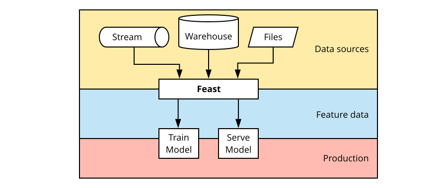

# What is Feast?

Feast \(**Fea**ture **St**ore\) is a tool for managing and serving machine learning features.

> Feast is the bridge between your models and your data

Feast aims to:

* Provide a unified means of managing feature data from a single person to large enterprises.
* Provide scalable and performant access to feature data when training and serving models.
* Provide consistent and point-in-time correct access to feature data.
* Enable discovery, documentation, and insights into your features.

**TL;DR:** Feast decouples feature engineering from feature usage. Features that are added to Feast become available immediately for training and serving. Models can retrieve the same features used in training from a low latency online store in production.

This means that new ML projects start with a process of feature selection from a catalog instead of having to do feature engineering from scratch.

