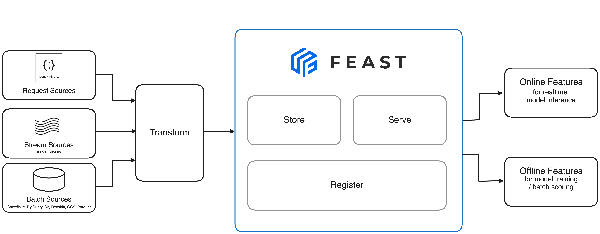

# Introduction

Feast (**Fea**ture **St**ore) is an [open-source](https://github.com/feast-dev/feast) feature store that helps teams operate production ML systems at scale by allowing them to define, manage, validate, and serve machine learning features both in batch and real-time environments. Whether you are training batch or real-time models, Feast reuses your existing data infrastructure to empower both training and inference workflows.

Feast is a configurable operational data system that re-uses existing infrastructure to manage and serve machine learning features to real-time models. For more details, please review our [architecture](getting-started/architecture/overview.md).

## Why Feast?
Feast helps ML platform teams improve productivity, reduce duplication, and ship models to production faster by providing:
- **Consistent features**: Manage an offline store (batch training) and an online store (real-time serving) under one feature server.
- **Avoid Data leakage**: Generate point-in-time correct feature sets to ensure no future data leaks into model training.
- **Decouple ML from data Infra**: Provide a single data access layer that abstracts storage from retrieval, ensuring portability across batch and real-time environments.
- **Serve features at low latency**: Feast is optimized for real-time feature delivery, enabling instant access during inference.
- **Empower collaboration**: Centralize feature definitions so that data scientists, ML engineers, and data engineers can work from a shared catalog.

## Core Components
- **[Offline Store](getting-started/components/offline-store.md)**: Manages historical feature extraction for large-scale batch scoring or model training.
- **[Online Store](getting-started/components/online-store.md)**: Powers low-latency feature serving for real-time production systems.
- **[Feature Server](reference/feature-servers/README.md)**: REST/gRPC interface for online feature retrieval.
- **[Batch Materialization Engine](getting-started/components/batch-materialization-engine.md)**: Loads features from offline to online stores.
- **[Provider](getting-started/components/provider.md)**: Acts as a bridge between Feast and infrastructure.
- **[Authorization Manager](getting-started/components/authorization-manager.md)**: Controls access to features and resources.
- **[OpenTelemetry Integration](getting-started/components/opentelemetry.md)**: Adds observability and tracing.

## User Interfaces
- **[CLI](reference/feast-cli-commands.md)**: Command-line interface for managing feature definitions.
- **[Web UI](reference/alpha-web-ui.md)**: Visual exploration of feature data and metadata.

## Getting Started
- **[Quickstart](getting-started/quickstart.md)**: Fastest way to try Feast with a sample project.
- **[Concepts](getting-started/concepts/)**: Learn key concepts such as entities, feature views, data sources, and transformations.
- **[Architecture](getting-started/architecture/)**: Understand how Feast components interact under the hood.
- **[Tutorials](tutorials/tutorials-overview/)**: Explore end-to-end examples using Feast in real machine learning applications.
- **[How to Guides](how-to-guides/feast-snowflake-gcp-aws/)**: Set up Feast on AWS, GCP, Snowflake, and more.
- **[FAQ](faq.md)**: Frequently asked questions about installation, usage, and limitations.

For contributing guidelines and more advanced usage, see **[Contributing](project/contributing.md)**.