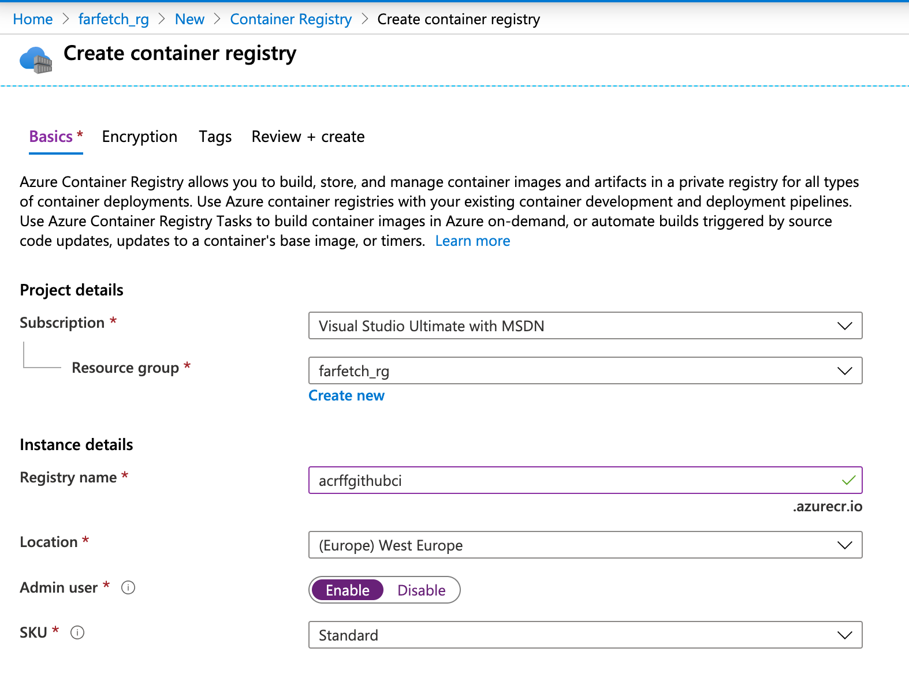
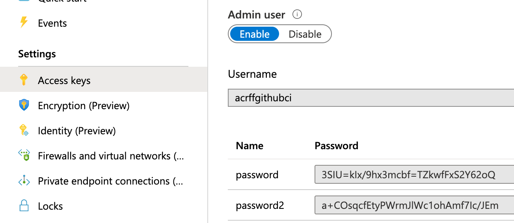
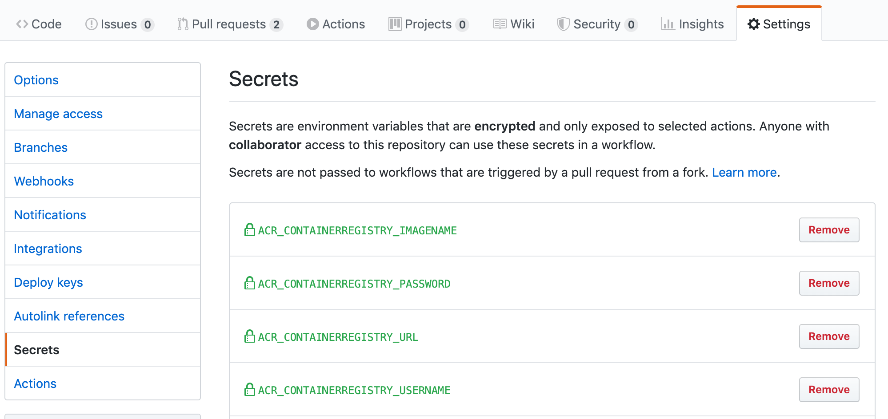
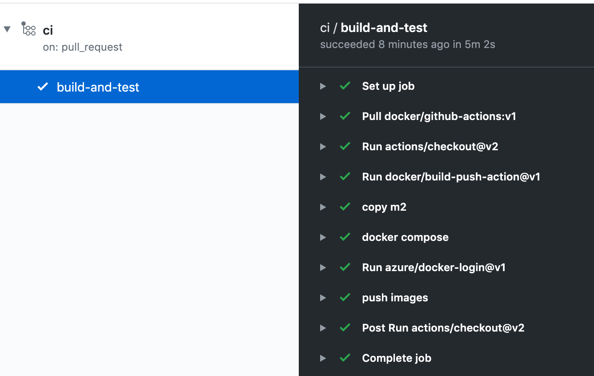

# FarFetch CI setup

The CI setup ensures that PRs on GitHub are automatically tested before being merging to *master*. The CI jobs defined under 

[.github/workflows]: ../../.github/workflows

run compilation, unit and end-to-end tests using GitHub Workflows.

 ## Agent configuration

1. Spin an Azure VM with Ubuntu 18.04. Choose e.g. a B4ms instance (burstable VM with 4 cores)
2. Install prerequisites:


```
sudo apt update
sudo apt install docker.io
sudo usermod -aG docker $USER

sudo curl -L "https://github.com/docker/compose/releases/download/1.25.4/docker-compose-$(uname -s)-$(uname -m)" -o /usr/local/bin/docker-compose
sudo chmod +x docker-compose
```

3. Follow the actions to [add a self-hosted runner to your repository](https://help.github.com/en/actions/hosting-your-own-runners/adding-self-hosted-runners)
4. Follow the actions to [configure the self-hosted runner as a service](https://help.github.com/en/actions/hosting-your-own-runners/configuring-the-self-hosted-runner-application-as-a-service)

 

 ## One-time CI configuration

Create an Azure Container Registry named *acrffgithubci*. Make sure to Enable Admin user.



Once the ACR instance is deployed, fetch the password from the Access keys section:



Populate the GitHub secrets settings with the ACR configuration:



- CONTAINERREGISTRY_IMAGENAMEBASE=farfetchfeast
- CONTAINERREGISTRY_PASSWORD=<ACR password>
- CONTAINERREGISTRY_URL=acrffgithubci.azurecr.io
- CONTAINERREGISTRY_USERNAME=acrffgithubci

 ## CI jobs

The integration test job deploys the application components using Docker-compose. Later on, it will be extended to run end-to-end test scenarios.




