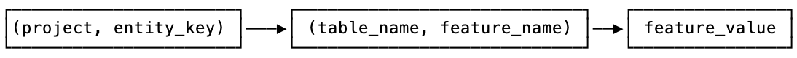
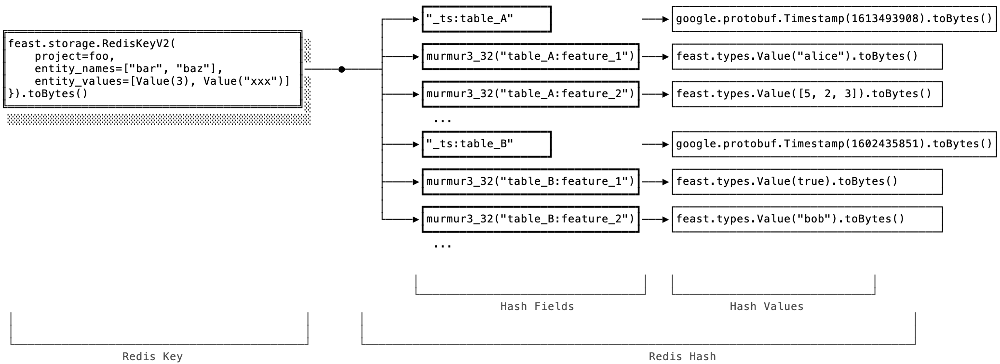
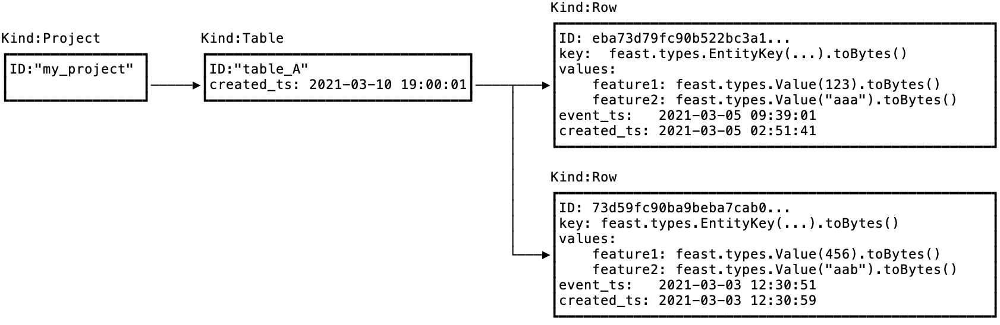

# Online Store Format Spec

## Feast Online Store Format v0.10

### Overview

This document describes the data format used by Feast for storing feature data for online serving.

This format is considered part of Feast public API contract; that allows other community developed software or "addons" to Feast to integrate with it. That way this software can directly and efficiently read and write data from Feast-compatible online stores, without having to go through Feast HTTP or gRPC API.

The format is not entirely technology or cloud agnostic. Since users may opt to use different key-value stores as an underlying engine to store feature data, and we don't want to aim for the lowest common denominator across them, we have to provide different "flavors" of this data format, specialized for every supported store.

This version of the Online Store Format supports Redis and DynamoDB as storage engine. We envision adding more storage engines to this document in the future.

### Overview

For definitions of the terms used here, please refer to [Feast glossary](https://github.com/feast-dev/feast/blob/master/docs/concepts/glossary.md).

Fundamentally, an Online Store is used to store a snapshot of feature data, that is a set of _entity rows_ indexed by _entity key_. There is only one _entity row_ per _entity key_ and _feature table_.

We use `feast.types.Value` protobuf as the main tagged union data type used to serialize arbitrary typed values in Feast. See Appendix A below for exact definition.

### Redis Online Store Format

#### Overview

When feature data is stored in Redis, we use it as a two-level map, by utilizing [Redis Hashes](https://redis.io/topics/data-types#hashes).

The first level of the map contains the Feast project name and entity key. The entity key is composed of entity names and values. The second level key \(in Redis terminology, this is the "field" in a Redis Hash\) contains the feature table name and the feature name, and the Redis Hash value contains the feature value.

Therefore, the high level hierarchy is:



#### Format

To compute Redis key, we convert entity values and names to a protobuf message of the following format:

```text
message RedisKeyV2 {
  string project = 1;
  // alphabetical order (using `String::compareTo`).
  repeated string entity_names = 2;
  // same length as entity_names
  repeated feast.types.Value entity_values = 3;
}
```

This message is then serialized to a byte array and used as a Redis key.

The value in Redis itself is a key-value map. It is a Redis Hash that stores feature names and corresponding feature values. To compute the Redis Hash field names used to look up feature values in the Hash, all feature references are hashed as `Murmur3_32(table_name + ":" + feature_name)`, using the little-endian byte representation of the hash value. We also store the timestamp for that entity row \(a set of features\) under a field named `"_ts:" + table_name` in the same Redis Hash.

The values in the Redis Hash are encoded as serialized `feast.types.Value` protos for feature values, and serialized `google.protobuf.Timestamp` protos for the entity row timestamp.

Here's an example of how the entire thing looks like:



#### Known Issues

[According to the protobuf spec](https://developers.google.com/protocol-buffers/docs/encoding), generally speaking, you can't use serialized representation to compare protos for equality. Therefore, using a proto serialized to a byte array as a Redis key is not guaranteed to work. In practice we haven't yet run into issues, at least as long as entitiy values are relatively simple types.

However, we'll address this issue in future versions of the protocol.

### Google Datastore Online Store Format

[Datastore data model](https://cloud.google.com/datastore/docs/concepts/entities) is a collection of documents called Entities \(not to be confused with Feast Entities\). Documents can be organized in a hierarchy using Kinds.

We use the following structure to store feature data in Datastore:

* There is a Datastore Entity for each Feast Project, with Kind `Project`.
* Under that Datastore Entity, there is a Datastore Entity for each Feast Feature Table or View, with Kind `Table`. That contains one additional field, `created_ts` that contains the timestamp when this Datastore Entity was created.
* Under that Datastore Entity, there is a Datastore Entity for each Feast Entity Key with Kind `Row`. That contains the following fields:
  * `key` contains entity key as serialized `feast.types.EntityKey` proto
  * `values` contains feature name to value map, values serialized as `feast.types.Value` proto
    * `event_ts` contains event timestamp \(in the datastore timestamp format\)
    * `created_ts` contains write timestamp \(in the datastore timestamp format\).

The id for the `Row` Datastore Entity is computed by hashing entity key using murmurhash3\_128 algorithm as follows:

1. Hash entity names, sorted in alphanumeric order, by serializing them to bytes using the Value Serialization steps below.
2. Hash the entity values in the same order as corresponding entity names, by serializing them to bytes using the Value Serialization steps below.

Value Serialization:

* Store the type of the value \(ValueType enum\) as little-endian uint32.
* Store the byte length of the serialized value as little-endian uint32.
* Store the serialized value as bytes:
  * binary values are serialized as is
  * string values serialized as utf8 string
  * int64 and int32 hashed as little-endian byte representation \(8 and 4 bytes respectively\)
  * bool hashed as 0 or 1 byte.

Other types of entity keys are not supported in this version of the specification, when using Cloud Firestore.

**Example:**



## Appendix

**Appendix A. Value proto format.**

```text
message ValueType {
  enum Enum {
    INVALID = 0;
    BYTES = 1;
    STRING = 2;
    INT32 = 3;
    INT64 = 4;
    DOUBLE = 5;
    FLOAT = 6;
    BOOL = 7;
    UNIX_TIMESTAMP = 8;
    BYTES_LIST = 11;
    STRING_LIST = 12;
    INT32_LIST = 13;
    INT64_LIST = 14;
    DOUBLE_LIST = 15;
    FLOAT_LIST = 16;
    BOOL_LIST = 17;
    UNIX_TIMESTAMP_LIST = 18;
  }
}

message Value {
  // ValueType is referenced by the metadata types, FeatureInfo and EntityInfo.
  // The enum values do not have to match the oneof val field ids, but they should.
  oneof val {
    bytes bytes_val = 1;
    string string_val = 2;
    int32 int32_val = 3;
    int64 int64_val = 4;
    double double_val = 5;
    float float_val = 6;
    bool bool_val = 7;
    int64 unix_timestamp_val = 8;
    BytesList bytes_list_val = 11;
    StringList string_list_val = 12;
    Int32List int32_list_val = 13;
    Int64List int64_list_val = 14;
    DoubleList double_list_val = 15;
    FloatList float_list_val = 16;
    BoolList bool_list_val = 17;
    Int64List unix_timestamp_list_val = 18;
  }
}

message BytesList {
  repeated bytes val = 1;
}

message StringList {
  repeated string val = 1;
}

message Int32List {
  repeated int32 val = 1;
}

message Int64List {
  repeated int64 val = 1;
}

message DoubleList {
  repeated double val = 1;
}

message FloatList {
  repeated float val = 1;
}

message BoolList {
  repeated bool val = 1;
}
```

