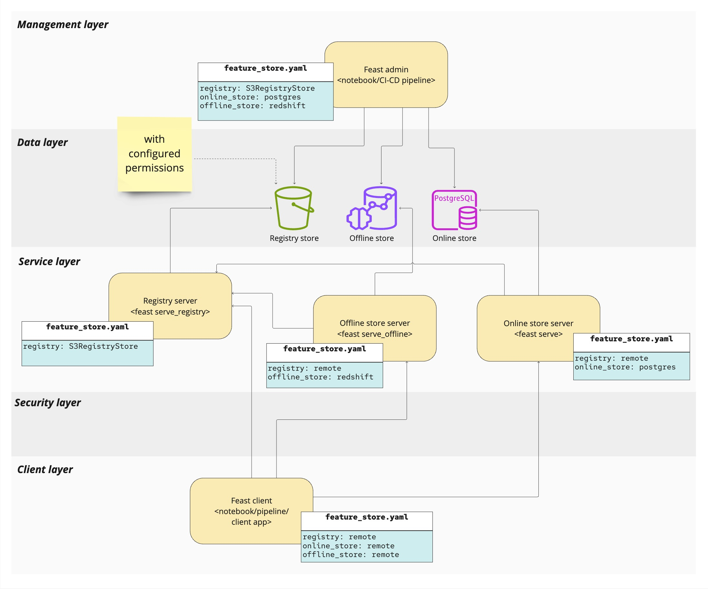

# Role-Based Access Control (RBAC) in Feast

## Introduction

Role-Based Access Control (RBAC) is a security mechanism that restricts access to resources based on the roles/groups/namespaces of individual users within an organization. In the context of the Feast, RBAC ensures that only authorized users or groups/namespaces can access or modify specific resources, thereby maintaining data security and operational integrity.

## Functional Requirements

The RBAC implementation in Feast is designed to:

- **Assign Permissions**: Allow administrators to assign permissions for various operations and resources to users or groups/namespaces.
- **Seamless Integration**: Integrate smoothly with existing business code without requiring significant modifications.
- **Backward Compatibility**: Maintain support for non-authorized models as the default to ensure backward compatibility.

## Business Goals

The primary business goals of implementing RBAC in the Feast are:

1. **Feature Sharing**: Enable multiple teams to share the feature store while ensuring controlled access. This allows for collaborative work without compromising data security.
2. **Access Control Management**: Prevent unauthorized access to team-specific resources and spaces, governing the operations that each user or group can perform.

## Reference Architecture

Feast operates as a collection of connected services, each enforcing authorization permissions. The architecture is designed as a distributed microservices system with the following key components:

- **Service Endpoints**: These enforce authorization permissions, ensuring that only authorized requests are processed.
- **Client Integration**: Clients authenticate with feature servers by attaching authorization token to each request.
- **Service-to-Service Communication**: This is always granted.

## Permission Model

The RBAC system in Feast uses a permission model that defines the following concepts:

- **Resource**: An object within Feast that needs to be secured against unauthorized access.
- **Action**: A logical operation performed on a resource, such as Create, Describe, Update, Delete, Read, or write operations.
- **Policy**: A set of rules that enforce authorization decisions on resources. The polices are based on user roles or groups or namespaces or combined.

## Authorization Architecture

The authorization architecture in Feast is built with the following components:

- **Token Extractor**: Extracts the authorization token from the request header.
- **Token Parser**: Parses the token to retrieve user details.
- **Policy Enforcer**: Validates the secured endpoint against the retrieved user details.
- **Token Injector**: Adds the authorization token to each secured request header.

