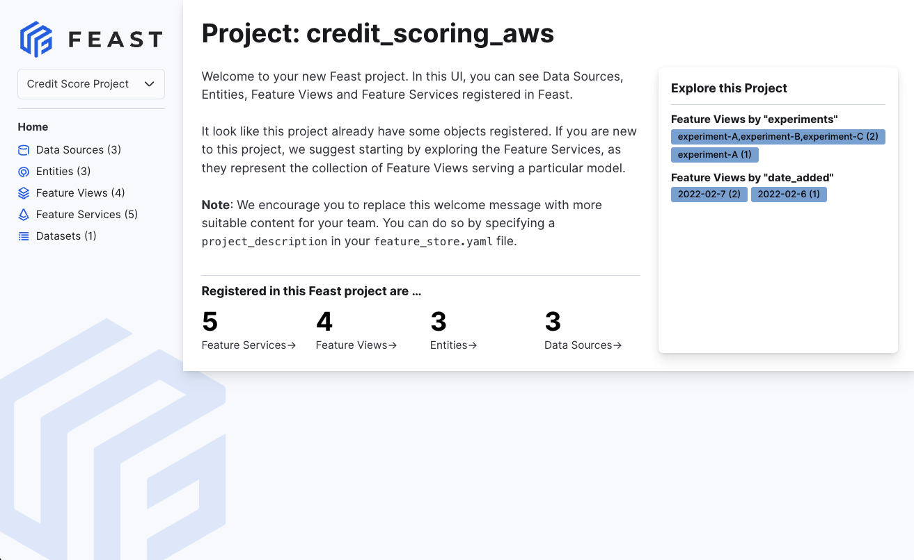

# Quickstart

In this tutorial we will

1. Deploy a local feature store with a **Parquet file offline store** and **Sqlite online store**.
2. Build a training dataset using our time series features from our **Parquet files**.
3. Ingest batch features ("materialization") and streaming features (via a Push API) into the online store.
4. Read the latest features from the offline store for batch scoring
5. Read the latest features from the online store for real-time inference.
6. Explore the (experimental) Feast UI

## Overview

In this tutorial, we'll use Feast to generate training data and power online model inference for a 
ride-sharing driver satisfaction prediction model. Feast solves several common issues in this flow:

1. **Training-serving skew and complex data joins:** Feature values often exist across multiple tables. Joining 
   these datasets can be complicated, slow, and error-prone.
   * Feast joins these tables with battle-tested logic that ensures _point-in-time_ correctness so future feature 
     values do not leak to models.
2. **Online feature availability:** At inference time, models often need access to features that aren't readily 
   available and need to be precomputed from other data sources.
   * Feast manages deployment to a variety of online stores (e.g. DynamoDB, Redis, Google Cloud Datastore) and 
     ensures necessary features are consistently _available_ and _freshly computed_ at inference time.
3. **Feature and model versioning:** Different teams within an organization are often unable to reuse 
   features across projects, resulting in duplicate feature creation logic. Models have data dependencies that need 
   to be versioned, for example when running A/B tests on model versions.
   * Feast enables discovery of and collaboration on previously used features and enables versioning of sets of 
     features (via _feature services_).
   * _(Experimental)_ Feast enables light-weight feature transformations so users can re-use transformation logic 
     across online / offline use cases and across models.

## Step 1: Install Feast

Install the Feast SDK and CLI using pip:

* In this tutorial, we focus on a local deployment. For a more in-depth guide on how to use Feast with Snowflake / 
  GCP / AWS deployments, see [Running Feast with Snowflake/GCP/AWS](../how-to-guides/feast-snowflake-gcp-aws/)



```bash
pip install feast
```



## Step 2: Create a feature repository

Bootstrap a new feature repository using `feast init` from the command line.



```bash
feast init my_project
cd my_project/feature_repo
```





```
Creating a new Feast repository in /home/Jovyan/my_project.
```



Let's take a look at the resulting demo repo itself. It breaks down into

* `data/` contains raw demo parquet data
* `example_repo.py` contains demo feature definitions
* `feature_store.yaml` contains a demo setup configuring where data sources are
* `test_workflow.py` showcases how to run all key Feast commands, including defining, retrieving, and pushing features.
  You can run this with `python test_workflow.py`.



```yaml
project: my_project
# By default, the registry is a file (but can be turned into a more scalable SQL-backed registry)
registry: data/registry.db
# The provider primarily specifies default offline / online stores & storing the registry in a given cloud
provider: local
online_store:
  type: sqlite
  path: data/online_store.db
entity_key_serialization_version: 2
```



```python
# This is an example feature definition file

from datetime import timedelta

import pandas as pd

from feast import (
    Entity,
    FeatureService,
    FeatureView,
    Field,
    FileSource,
    PushSource,
    RequestSource,
)
from feast.on_demand_feature_view import on_demand_feature_view
from feast.types import Float32, Float64, Int64

# Define an entity for the driver. You can think of entity as a primary key used to
# fetch features.
driver = Entity(name="driver", join_keys=["driver_id"])

# Read data from parquet files. Parquet is convenient for local development mode. For
# production, you can use your favorite DWH, such as BigQuery. See Feast documentation
# for more info.
driver_stats_source = FileSource(
    name="driver_hourly_stats_source",
    path="%PARQUET_PATH%",
    timestamp_field="event_timestamp",
    created_timestamp_column="created",
)

# Our parquet files contain sample data that includes a driver_id column, timestamps and
# three feature column. Here we define a Feature View that will allow us to serve this
# data to our model online.
driver_stats_fv = FeatureView(
    # The unique name of this feature view. Two feature views in a single
    # project cannot have the same name
    name="driver_hourly_stats",
    entities=[driver],
    ttl=timedelta(days=1),
    # The list of features defined below act as a schema to both define features
    # for both materialization of features into a store, and are used as references
    # during retrieval for building a training dataset or serving features
    schema=[
        Field(name="conv_rate", dtype=Float32),
        Field(name="acc_rate", dtype=Float32),
        Field(name="avg_daily_trips", dtype=Int64),
    ],
    online=True,
    source=driver_stats_source,
    # Tags are user defined key/value pairs that are attached to each
    # feature view
    tags={"team": "driver_performance"},
)

# Defines a way to push data (to be available offline, online or both) into Feast.
driver_stats_push_source = PushSource(
    name="driver_stats_push_source",
    batch_source=driver_stats_source,
)

# Define a request data source which encodes features / information only
# available at request time (e.g. part of the user initiated HTTP request)
input_request = RequestSource(
    name="vals_to_add",
    schema=[
        Field(name="val_to_add", dtype=Int64),
        Field(name="val_to_add_2", dtype=Int64),
    ],
)


# Define an on demand feature view which can generate new features based on
# existing feature views and RequestSource features
@on_demand_feature_view(
    sources=[driver_stats_fv, input_request],
    schema=[
        Field(name="conv_rate_plus_val1", dtype=Float64),
        Field(name="conv_rate_plus_val2", dtype=Float64),
    ],
)
def transformed_conv_rate(inputs: pd.DataFrame) -> pd.DataFrame:
    df = pd.DataFrame()
    df["conv_rate_plus_val1"] = inputs["conv_rate"] + inputs["val_to_add"]
    df["conv_rate_plus_val2"] = inputs["conv_rate"] + inputs["val_to_add_2"]
    return df


# This groups features into a model version
driver_activity_v1 = FeatureService(
    name="driver_activity_v1",
    features=[
        driver_stats_fv[["conv_rate"]],  # Sub-selects a feature from a feature view
        transformed_conv_rate,  # Selects all features from the feature view
    ],
)
driver_activity_v2 = FeatureService(
    name="driver_activity_v2", features=[driver_stats_fv, transformed_conv_rate]
)
```



The `feature_store.yaml` file configures the key overall architecture of the feature store. 

The provider value sets default offline and online stores. 
* The offline store provides the compute layer to process historical data (for generating training data & feature 
  values for serving). 
* The online store is a low latency store of the latest feature values (for powering real-time inference).

Valid values for `provider` in `feature_store.yaml` are:

* local: use a SQL registry or local file registry. By default, use a file / Dask based offline store + SQLite online store
* gcp: use a SQL registry or GCS file registry. By default, use BigQuery (offline store) + Google Cloud Datastore (online store)
* aws: use a SQL registry or S3 file registry. By default, use Redshift (offline store) + DynamoDB (online store)

Note that there are many other offline / online stores Feast works with, including Spark, Azure, Hive, Trino, and 
PostgreSQL via community plugins. See [Third party integrations](third-party-integrations.md) for all supported data sources.

A custom setup can also be made by following [Customizing Feast](../how-to-guides/customizing-feast/).

### Inspecting the raw data

The raw feature data we have in this demo is stored in a local parquet file. The dataset captures hourly stats of a driver in a ride-sharing app.

```python
import pandas as pd
pd.read_parquet("data/driver_stats.parquet")
```


## Step 3: Run sample workflow
There's an included `test_workflow.py` file which runs through a full sample workflow:
1. Register feature definitions through `feast apply`
2. Generate a training dataset (using `get_historical_features`)
3. Generate features for batch scoring (using `get_historical_features`)
4. Ingest batch features into an online store (using `materialize_incremental`)
5. Fetch online features to power real time inference (using `get_online_features`)
6. Ingest streaming features into offline / online stores (using `push`)
7. Verify online features are updated / fresher

We'll walk through some snippets of code below and explain
### Step 3a: Register feature definitions and deploy your feature store

The `apply` command scans python files in the current directory for feature view/entity definitions, registers the 
objects, and deploys infrastructure. In this example, it reads `example_repo.py` and sets up SQLite online store tables. Note that we had specified SQLite as the default online store by 
configuring `online_store` in `feature_store.yaml`.



```bash
feast apply
```





```
Created entity driver
Created feature view driver_hourly_stats
Created on demand feature view transformed_conv_rate
Created feature service driver_activity_v1
Created feature service driver_activity_v2

Created sqlite table my_project_driver_hourly_stats
```



### Step 3b: Generating training data or powering batch scoring models

To train a model, we need features and labels. Often, this label data is stored separately (e.g. you have one table storing user survey results and another set of tables with feature values). Feast can help generate the features that map to these labels.

Feast needs a list of **entities** (e.g. driver ids) and **timestamps**. Feast will intelligently join relevant 
tables to create the relevant feature vectors. There are two ways to generate this list:
1. The user can query that table of labels with timestamps and pass that into Feast as an _entity dataframe_ for 
training data generation. 
2. The user can also query that table with a *SQL query* which pulls entities. See the documentation on [feature retrieval](https://docs.feast.dev/getting-started/concepts/feature-retrieval) for details    

* Note that we include timestamps because we want the features for the same driver at various timestamps to be used in a model.

#### Generating training data



```python
from datetime import datetime
import pandas as pd

from feast import FeatureStore

# Note: see https://docs.feast.dev/getting-started/concepts/feature-retrieval for 
# more details on how to retrieve for all entities in the offline store instead
entity_df = pd.DataFrame.from_dict(
    {
        # entity's join key -> entity values
        "driver_id": [1001, 1002, 1003],
        # "event_timestamp" (reserved key) -> timestamps
        "event_timestamp": [
            datetime(2021, 4, 12, 10, 59, 42),
            datetime(2021, 4, 12, 8, 12, 10),
            datetime(2021, 4, 12, 16, 40, 26),
        ],
        # (optional) label name -> label values. Feast does not process these
        "label_driver_reported_satisfaction": [1, 5, 3],
        # values we're using for an on-demand transformation
        "val_to_add": [1, 2, 3],
        "val_to_add_2": [10, 20, 30],
    }
)

store = FeatureStore(repo_path=".")

training_df = store.get_historical_features(
    entity_df=entity_df,
    features=[
        "driver_hourly_stats:conv_rate",
        "driver_hourly_stats:acc_rate",
        "driver_hourly_stats:avg_daily_trips",
        "transformed_conv_rate:conv_rate_plus_val1",
        "transformed_conv_rate:conv_rate_plus_val2",
    ],
).to_df()

print("----- Feature schema -----\n")
print(training_df.info())

print()
print("----- Example features -----\n")
print(training_df.head())
```





```bash
----- Feature schema -----

<class 'pandas.core.frame.DataFrame'>
Int64Index: 3 entries, 0 to 2
Data columns (total 6 columns):
 #   Column                              Non-Null Count  Dtype
---  ------                              --------------  -----
 0   event_timestamp                     3 non-null      datetime64[ns, UTC]
 1   driver_id                           3 non-null      int64
 2   label_driver_reported_satisfaction  3 non-null      int64
 3   conv_rate                           3 non-null      float32
 4   acc_rate                            3 non-null      float32
 5   avg_daily_trips                     3 non-null      int32
dtypes: datetime64[ns, UTC](1), float32(2), int32(1), int64(2)
memory usage: 132.0 bytes
None

----- Example features -----

                   event_timestamp  driver_id  ...  acc_rate  avg_daily_trips
0 2021-08-23 15:12:55.489091+00:00       1003  ...  0.077863              741
1 2021-08-23 15:49:55.489089+00:00       1002  ...  0.074327              113
2 2021-08-23 16:14:55.489075+00:00       1001  ...  0.105046              347

[3 rows x 6 columns]
```



#### Run offline inference (batch scoring)
To power a batch model, we primarily need to generate features with the `get_historical_features` call, but using the current timestamp



```python
entity_df["event_timestamp"] = pd.to_datetime("now", utc=True)
training_df = store.get_historical_features(
    entity_df=entity_df,
    features=[
        "driver_hourly_stats:conv_rate",
        "driver_hourly_stats:acc_rate",
        "driver_hourly_stats:avg_daily_trips",
        "transformed_conv_rate:conv_rate_plus_val1",
        "transformed_conv_rate:conv_rate_plus_val2",
    ],
).to_df()

print("\n----- Example features -----\n")
print(training_df.head())
```





```
----- Example features -----

   driver_id                  event_timestamp  ... acc_rate  avg_daily_trips  conv_rate_plus_val1  
0       1001 2022-08-08 18:22:06.555018+00:00  ... 0.864639              359             1.663844
1       1002 2022-08-08 18:22:06.555018+00:00  ... 0.695982              311             2.151189 
2       1003 2022-08-08 18:22:06.555018+00:00  ... 0.949191              789             3.769165 
```


### Step 3c: Ingest batch features into your online store

We now serialize the latest values of features since the beginning of time to prepare for serving (note: 
`materialize-incremental` serializes all new features since the last `materialize` call).



```bash
CURRENT_TIME=$(date -u +"%Y-%m-%dT%H:%M:%S")
feast materialize-incremental $CURRENT_TIME
```





```bash
Materializing 1 feature views to 2021-08-23 16:25:46+00:00 into the sqlite online
store.

driver_hourly_stats from 2021-08-22 16:25:47+00:00 to 2021-08-23 16:25:46+00:00:
100%|████████████████████████████████████████████| 5/5 [00:00<00:00, 592.05it/s]
```



### Step 3d: Fetching feature vectors for inference

At inference time, we need to quickly read the latest feature values for different drivers (which otherwise might 
have existed only in batch sources) from the online feature store using `get_online_features()`. These feature 
vectors can then be fed to the model.



```python
from pprint import pprint
from feast import FeatureStore

store = FeatureStore(repo_path=".")

feature_vector = store.get_online_features(
    features=[
        "driver_hourly_stats:conv_rate",
        "driver_hourly_stats:acc_rate",
        "driver_hourly_stats:avg_daily_trips",
    ],
    entity_rows=[
        # {join_key: entity_value}
        {"driver_id": 1004},
        {"driver_id": 1005},
    ],
).to_dict()

pprint(feature_vector)
```





```bash
{
 'acc_rate': [0.5732735991477966, 0.7828438878059387],
 'avg_daily_trips': [33, 984],
 'conv_rate': [0.15498852729797363, 0.6263588070869446],
 'driver_id': [1004, 1005]
}
```



### Step 3e: Using a feature service to fetch online features instead.

You can also use feature services to manage multiple features, and decouple feature view definitions and the 
features needed by end applications. The feature store can also be used to fetch either online or historical 
features using the same API below. More information can be found 
[here](https://docs.feast.dev/getting-started/concepts/feature-retrieval).

The `driver_activity_v1` feature service pulls all features from the `driver_hourly_stats` feature view:

```python
from feast import FeatureService
driver_stats_fs = FeatureService(
    name="driver_activity_v1", features=[driver_hourly_stats_view]
)
```



```python
from pprint import pprint
from feast import FeatureStore
feature_store = FeatureStore('.')  # Initialize the feature store

feature_service = feature_store.get_feature_service("driver_activity_v1")
feature_vector = feature_store.get_online_features(
    features=feature_service,
    entity_rows=[
        # {join_key: entity_value}
        {"driver_id": 1004},
        {"driver_id": 1005},
    ],
).to_dict()
pprint(feature_vector)
```





```bash
{
 'acc_rate': [0.5732735991477966, 0.7828438878059387],
 'avg_daily_trips': [33, 984],
 'conv_rate': [0.15498852729797363, 0.6263588070869446],
 'driver_id': [1004, 1005]
}
```



## Step 4: Browse your features with the Web UI (experimental)

View all registered features, data sources, entities, and feature services with the Web UI.

One of the ways to view this is with the `feast ui` command.



```bash
feast ui
```





```bash
INFO:     Started server process [66664]
08/17/2022 01:25:49 PM uvicorn.error INFO: Started server process [66664]
INFO:     Waiting for application startup.
08/17/2022 01:25:49 PM uvicorn.error INFO: Waiting for application startup.
INFO:     Application startup complete.
08/17/2022 01:25:49 PM uvicorn.error INFO: Application startup complete.
INFO:     Uvicorn running on http://0.0.0.0:8888 (Press CTRL+C to quit)
08/17/2022 01:25:49 PM uvicorn.error INFO: Uvicorn running on http://0.0.0.0:8888 (Press CTRL+C to quit)
```






## Step 5: Re-examine `test_workflow.py`
Take a look at `test_workflow.py` again. It showcases many sample flows on how to interact with Feast. You'll see these 
show up in the upcoming concepts + architecture + tutorial pages as well. 

## Next steps

* Join the [email newsletter](https://feast.dev/) to get new updates on Feast / feature stores.
* Read the [Concepts](concepts/) page to understand the Feast data model.
* Read the [Architecture](architecture-and-components/) page.
* Check out our [Tutorials](../tutorials/tutorials-overview/) section for more examples on how to use Feast.
* Follow our [Running Feast with Snowflake/GCP/AWS](../how-to-guides/feast-snowflake-gcp-aws/) guide for a more in-depth tutorial on using Feast.
* Join other Feast users and contributors in [Slack](https://slack.feast.dev) and become part of the community!
