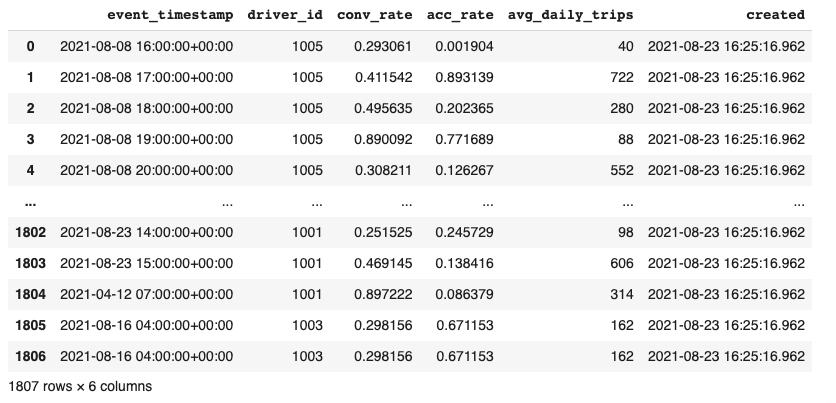

# Quickstart

In this tutorial we will

1. Deploy a local feature store with a **Parquet file offline store** and **Sqlite online store**.
2. Build a training dataset using our time series features from our **Parquet files**.
3. Materialize feature values from the offline store into the online store.
4. Read the latest features from the online store for inference.

You can run this tutorial in Google Colab or run it on your localhost, following the guided steps below.

[**Run in Google Colab**](https://colab.research.google.com/github/feast-dev/feast/blob/master/examples/quickstart/quickstart.ipynb)

## Overview

In this tutorial, we use feature stores to generate training data and power online model inference for a ride-sharing driver satisfaction prediction model. Feast solves several common issues in this flow:&#x20;

1. **Training-serving skew and complex data joins:** Feature values often exist across multiple tables. Joining these datasets can be complicated, slow, and error-prone.
   * Feast joins these tables with battle-tested logic that ensures _point-in-time_ correctness so future feature values do not leak to models.
   * Feast alerts users to offline / online skew with data quality monitoring
2. **Online feature availability:** At inference time, models often need access to features that aren't readily available and need to be precomputed from other datasources.&#x20;
   * Feast manages deployment to a variety of online stores (e.g. DynamoDB, Redis, Google Cloud Datastore) and ensures necessary features are consistently _available_ and _freshly computed_ at inference time.
3. **Feature reusability and model versioning:** Different teams within an organization are often unable to reuse features across projects, resulting in duplicate feature creation logic. Models have data dependencies that need to be versioned, for example when running A/B tests on model versions.
   * Feast enables discovery of and collaboration on previously used features and enables versioning of sets of features (via _feature services_).&#x20;
   * Feast enables feature transformation so users can re-use transformation logic across online / offline usecases and across models.

## Step 1: Install Feast

Install the Feast SDK and CLI using pip:

* In this tutorial, we focus on a local deployment. For a more in-depth guide on how to use Feast with Snowflake / GCP / AWS deployments, see [Running Feast with Snowflake/GCP/AWS](../how-to-guides/feast-snowflake-gcp-aws/)



```bash
pip install feast
```



## Step 2: Create a feature repository

Bootstrap a new feature repository using `feast init` from the command line.&#x20;



```bash
feast init feature_repo
cd feature_repo
```





```
Creating a new Feast repository in /home/Jovyan/feature_repo.
```



Let's take a look at the resulting demo repo itself. It breaks down into

* `data/` contains raw demo parquet data
* `example.py` contains demo feature definitions
* `feature_store.yaml` contains a demo setup configuring where data sources are



```yaml
project: my_project
registry: data/registry.db
provider: local
online_store:
    path: data/online_store.db
```



```python
# This is an example feature definition file

from google.protobuf.duration_pb2 import Duration

from feast import Entity, Feature, FeatureView, FileSource, ValueType

# Read data from parquet files. Parquet is convenient for local development mode. For
# production, you can use your favorite DWH, such as BigQuery. See Feast documentation
# for more info.
driver_hourly_stats = FileSource(
    path="/content/feature_repo/data/driver_stats.parquet",
    event_timestamp_column="event_timestamp",
    created_timestamp_column="created",
)

# Define an entity for the driver. You can think of entity as a primary key used to
# fetch features.
driver = Entity(name="driver_id", value_type=ValueType.INT64, description="driver id",)

# Our parquet files contain sample data that includes a driver_id column, timestamps and
# three feature column. Here we define a Feature View that will allow us to serve this
# data to our model online.
driver_hourly_stats_view = FeatureView(
    name="driver_hourly_stats",
    entities=["driver_id"],
    ttl=Duration(seconds=86400 * 1),
    features=[
        Feature(name="conv_rate", dtype=ValueType.FLOAT),
        Feature(name="acc_rate", dtype=ValueType.FLOAT),
        Feature(name="avg_daily_trips", dtype=ValueType.INT64),
    ],
    online=True,
    batch_source=driver_hourly_stats,
    tags={},
)
```





The key line defining the overall architecture of the feature store is the **provider**. This defines where the raw data exists (for generating training data & feature values for serving), and where to materialize feature values to in the online store (for serving).

Valid values for `provider` in `feature_store.yaml` are:

* local: use file source with SQLite/Redis
* gcp: use BigQuery/Snowflake with Google Cloud Datastore/Redis
* aws: use Redshift/Snowflake with DynamoDB/Redis

Note that there are many other sources Feast works with, including Azure, Hive, Trino, and PostgreSQL via community plugins. See [Third party integrations](../getting-started/third-party-integrations.md) for all supported datasources.

A custom setup can also be made by following [adding a custom provider](../how-to-guides/creating-a-custom-provider.md).


## Step 3: Register feature definitions and deploy your feature store

The `apply` command scans python files in the current directory for feature view/entity definitions, registers the objects, and deploys infrastructure. In this example, it reads `example.py` (shown again below for convenience) and sets up SQLite online store tables. Note that we had specified SQLite as the default online store by using the `local` provider in `feature_store.yaml`.



```bash
feast apply
```



```python
# This is an example feature definition file

from google.protobuf.duration_pb2 import Duration

from feast import Entity, Feature, FeatureView, FileSource, ValueType

# Read data from parquet files. Parquet is convenient for local development mode. For
# production, you can use your favorite DWH, such as BigQuery. See Feast documentation
# for more info.
driver_hourly_stats = FileSource(
    path="/content/feature_repo/data/driver_stats.parquet",
    event_timestamp_column="event_timestamp",
    created_timestamp_column="created",
)

# Define an entity for the driver. You can think of entity as a primary key used to
# fetch features.
driver = Entity(name="driver_id", value_type=ValueType.INT64, description="driver id",)

# Our parquet files contain sample data that includes a driver_id column, timestamps and
# three feature column. Here we define a Feature View that will allow us to serve this
# data to our model online.
driver_hourly_stats_view = FeatureView(
    name="driver_hourly_stats",
    entities=["driver_id"],
    ttl=Duration(seconds=86400 * 1),
    features=[
        Feature(name="conv_rate", dtype=ValueType.FLOAT),
        Feature(name="acc_rate", dtype=ValueType.FLOAT),
        Feature(name="avg_daily_trips", dtype=ValueType.INT64),
    ],
    online=True,
    batch_source=driver_hourly_stats,
    tags={},
)
```





```
Registered entity driver_id
Registered feature view driver_hourly_stats
Deploying infrastructure for driver_hourly_stats
```



## Step 4: Generating training data

To train a model, we need features and labels. Often, this label data is stored separately (e.g. you have one table storing user survey results and another set of tables with feature values).

The user can query that table of labels with timestamps and pass that into Feast as an _entity dataframe_ for training data generation. In many cases, Feast will also intelligently join relevant tables to create the relevant feature vectors.

* Note that we include timestamps because want the features for the same driver at various timestamps to be used in a model.



```python
from datetime import datetime, timedelta
import pandas as pd

from feast import FeatureStore

# The entity dataframe is the dataframe we want to enrich with feature values
entity_df = pd.DataFrame.from_dict(
    {
        "driver_id": [1001, 1002, 1003],
        "label_driver_reported_satisfaction": [1, 5, 3], 
        "event_timestamp": [
            datetime.now() - timedelta(minutes=11),
            datetime.now() - timedelta(minutes=36),
            datetime.now() - timedelta(minutes=73),
        ],
    }
)

store = FeatureStore(repo_path=".")

training_df = store.get_historical_features(
    entity_df=entity_df,
    features=[
        "driver_hourly_stats:conv_rate",
        "driver_hourly_stats:acc_rate",
        "driver_hourly_stats:avg_daily_trips",
    ],
).to_df()

print("----- Feature schema -----\n")
print(training_df.info())

print()
print("----- Example features -----\n")
print(training_df.head())
```





```bash
----- Feature schema -----

<class 'pandas.core.frame.DataFrame'>
Int64Index: 3 entries, 0 to 2
Data columns (total 6 columns):
 #   Column                              Non-Null Count  Dtype              
---  ------                              --------------  -----              
 0   event_timestamp                     3 non-null      datetime64[ns, UTC]
 1   driver_id                           3 non-null      int64              
 2   label_driver_reported_satisfaction  3 non-null      int64              
 3   conv_rate                           3 non-null      float32            
 4   acc_rate                            3 non-null      float32            
 5   avg_daily_trips                     3 non-null      int32              
dtypes: datetime64[ns, UTC](1), float32(2), int32(1), int64(2)
memory usage: 132.0 bytes
None

----- Example features -----

                   event_timestamp  driver_id  ...  acc_rate  avg_daily_trips
0 2021-08-23 15:12:55.489091+00:00       1003  ...  0.120588              938
1 2021-08-23 15:49:55.489089+00:00       1002  ...  0.504881              635
2 2021-08-23 16:14:55.489075+00:00       1001  ...  0.138416              606

[3 rows x 6 columns]
```



## Step 5: Load features into your online store

We now serialize the latest values of features since the beginning of time to prepare for serving (note: `materialize-incremental` serializes all new features since the last `materialize` call).



```bash
CURRENT_TIME=$(date -u +"%Y-%m-%dT%H:%M:%S")
feast materialize-incremental $CURRENT_TIME
```





```bash
Materializing 1 feature views to 2021-08-23 16:25:46+00:00 into the sqlite online 
store.

driver_hourly_stats from 2021-08-22 16:25:47+00:00 to 2021-08-23 16:25:46+00:00:
100%|████████████████████████████████████████████| 5/5 [00:00<00:00, 592.05it/s]
```



## Step 6: Fetching feature vectors for inference

At inference time, we need to quickly read the latest feature values for different drivers (which otherwise might have existed only in batch sources) from the online feature store using `get_online_features()`. These feature vectors can then be fed to the model.



```python
from pprint import pprint
from feast import FeatureStore

store = FeatureStore(repo_path=".")

feature_vector = store.get_online_features(
    features=[
        "driver_hourly_stats:conv_rate",
        "driver_hourly_stats:acc_rate",
        "driver_hourly_stats:avg_daily_trips",
    ],
    entity_rows=[
        {"driver_id": 1004},
        {"driver_id": 1005},
    ],
).to_dict()

pprint(feature_vector)
```





```bash
{
 'acc_rate': [0.5732735991477966, 0.7828438878059387],
 'avg_daily_trips': [33, 984],
 'conv_rate': [0.15498852729797363, 0.6263588070869446],
 'driver_id': [1004, 1005]
}
```



## Next steps

* Read the [Concepts](concepts/) page to understand the Feast data model.
* Read the [Architecture](architecture-and-components/) page.
* Check out our [Tutorials](../tutorials/tutorials-overview.md) section for more examples on how to use Feast.
* Follow our [Running Feast with Snowflake/GCP/AWS](../how-to-guides/feast-snowflake-gcp-aws/) guide for a more in-depth tutorial on using Feast.
* Join other Feast users and contributors in [Slack](https://slack.feast.dev) and become part of the community!
