# Feast Production Deployment Topologies

## Table of Contents

* [Overview](#overview)
* [1. Minimal Production](#1-minimal-production)
* [2. Standard Production (Recommended)](#2-standard-production-recommended)
* [3. Enterprise Production](#3-enterprise-production)
  * [Isolated Registries (per namespace)](#architecture--isolated-registries-per-namespace)
  * [Shared Registry (cross-namespace)](#architecture--shared-registry-cross-namespace)
  * [Reliability & Disaster Recovery](#reliability--disaster-recovery)
* [Feast Permissions and RBAC](#feast-permissions-and-rbac)
  * [Actions](#actions)
  * [Policy types](#policy-types)
  * [Examples](#example-role-based-permissions)
  * [Authorization configuration](#authorization-configuration)
* [Infrastructure-Specific Recommendations](#infrastructure-specific-recommendations)
  * [AWS / EKS / ROSA](#aws--eks--rosa)
  * [GCP / GKE](#gcp--gke)
  * [On-Premise / OpenShift](#on-premise--openshift--self-managed-kubernetes)
* [Air-Gapped / Disconnected Environments](#air-gapped--disconnected-environment-deployments)
* [Hybrid Store Configuration](#hybrid-store-configuration)
  * [Hybrid online store](#hybrid-online-store)
  * [Hybrid offline store](#hybrid-offline-store)
* [Performance Considerations](#performance-considerations)
  * [Server sizing](#online-feature-server-sizing)
  * [Store latency](#online-store-latency-guidelines)
  * [Connection pooling](#connection-pooling-for-remote-online-store)
  * [Registry cache tuning at scale](#registry-cache-tuning-at-scale)
  * [Materialization](#materialization-performance)
  * [Redis sizing](#redis-sizing-guidelines)
* [Design Principles](#design-principles)
  * [Control plane vs data plane](#control-plane-vs-data-plane)
  * [Stateless vs stateful](#stateless-vs-stateful-components)
  * [Scalability](#scalability-guidelines)
* [Topology Comparison](#topology-comparison)
* [Next Steps](#next-steps)

---

## Overview

This guide defines three production-ready deployment topologies for Feast on Kubernetes using the [Feast Operator](./feast-on-kubernetes.md). Each topology addresses a different stage of organizational maturity, from getting started safely to running large-scale multi-tenant deployments.

| Topology | Target audience | Key traits |
|---|---|---|
| [Minimal Production](#1-minimal-production) | Small teams, POCs moving to production | Single namespace, no HA, simple setup |
| [Standard Production](#2-standard-production-recommended) | Most production workloads | HA registry, autoscaling, TLS, RBAC |
| [Enterprise Production](#3-enterprise-production) | Large orgs, multi-tenant | Namespace isolation, managed stores, full observability |

Beyond the core topologies, this guide also covers:

* [Feast Permissions and RBAC](#feast-permissions-and-rbac) — securing resources with policies
* [Infrastructure-Specific Recommendations](#infrastructure-specific-recommendations) — store choices for AWS, GCP, and on-premise
* [Hybrid Store Configuration](#hybrid-store-configuration) — routing to multiple backends from a single deployment
* [Performance Considerations](#performance-considerations) — tuning for production workloads


**Prerequisites:** All topologies assume a running Kubernetes cluster with the [Feast Operator installed](./feast-on-kubernetes.md#deploy-feast-feature-servers-on-kubernetes). Familiarity with Feast [concepts](../getting-started/concepts/overview.md) and [components](../getting-started/components/overview.md) is recommended.


---

## 1. Minimal Production

### When to use

* Small teams with a single ML use case
* POCs graduating to production
* Low-traffic, non-critical workloads where simplicity is more important than availability

### Architecture

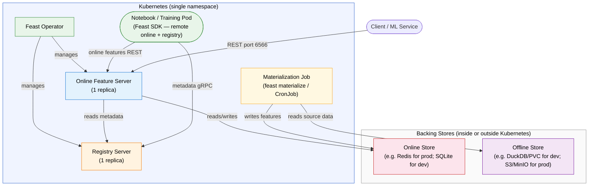

### Components

| Component | Configuration | Notes |
|---|---|---|
| **Feast Operator** | Default install | Manages all Feast CRDs |
| **Registry** | REST, 1 replica | Single point of metadata |
| **Online Feature Server** | 1 replica, no autoscaling | Serves online features |
| **Online Store** | Redis standalone (example) | SQLite is simplest for development; Redis for production. See [supported online stores](../reference/online-stores/README.md) for all options |
| **Offline Store** | File-based or MinIO | DuckDB or file-based for development; MinIO/S3 for production. See [supported offline stores](../reference/offline-stores/README.md) for all options |
| **Compute Engine** | In-process (default) | Suitable for small datasets and development; use Spark, Ray, or Snowflake Engine for larger workloads |

### Sample FeatureStore CR

```yaml
apiVersion: feast.dev/v1
kind: FeatureStore
metadata:
  name: minimal-production
spec:
  feastProject: my_project
  services:
    onlineStore:
      persistence:
        store:
          type: redis
          secretRef:
            name: feast-online-store
      server:
        resources:
          requests:
            cpu: 500m
            memory: 512Mi
          limits:
            cpu: "1"
            memory: 1Gi
    offlineStore:
      persistence:
        file:
          type: duckdb  # Use type: file for generic file-based; swap for S3/MinIO in production
          pvc:
            create:
              storageClassName: standard
              resources:
                requests:
                  storage: 10Gi
            mountPath: /data/offline
    registry:
      local:
        server:
          restAPI: true
          resources:
            requests:
              cpu: 250m
              memory: 256Mi
            limits:
              cpu: 500m
              memory: 512Mi
```

### Limitations


* **No high availability** — a single replica failure causes downtime
* **No automatic failover** — manual intervention required on failure
* **Manual scaling** — no HPA configured
* **Limited security** — no TLS, no ingress, no RBAC by default


---

## 2. Standard Production (Recommended)

### When to use

* Most production ML workloads
* Teams with moderate traffic that need reliability
* Environments that require TLS, RBAC, and automated scaling

### Architecture

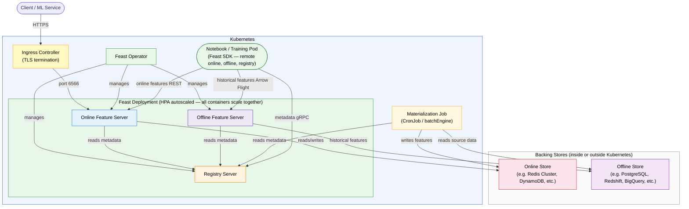

### Components

**Core**

| Component | Configuration | Notes |
|---|---|---|
| **Feast Operator** | Default install | Manages all Feast CRDs |
| **Registry** | SQL-backed (PostgreSQL) | Database-backed for consistency and concurrent access |
| **Online Feature Server** | HPA (min 2 replicas, max based on peak load) | Separate container — serves online features from the online store |
| **Offline Feature Server** | Scales with the same Deployment | Separate container — serves historical features and materialization source reads from the offline store |

**Storage**

| Component | Configuration | Notes |
|---|---|---|
| **Online Store** | Redis Cluster (example) | Multi-node for availability and low latency; other production stores are also supported — see [supported online stores](../reference/online-stores/README.md) |
| **Offline Store** | PostgreSQL (example) | Platform-agnostic DB-backed store; use Redshift/Athena for AWS, BigQuery for GCP, Spark for S3/MinIO pipelines — see [supported offline stores](../reference/offline-stores/README.md) for all options |
| **Compute Engine** | Spark, Ray (KubeRay), or Snowflake Engine | Distributed compute for materialization and historical retrieval at scale |

**Networking & Security**

| Component | Configuration | Notes |
|---|---|---|
| **Ingress** | TLS-terminated | Secure external access |
| **RBAC** | Kubernetes RBAC | Namespace-scoped permissions |
| **Secrets** | Kubernetes Secrets + `${ENV_VAR}` substitution | Store credentials via `secretRef` / `envFrom` in the FeatureStore CR; inject into `feature_store.yaml` with [environment variable syntax](./running-feast-in-production.md#5-using-environment-variables-in-your-yaml-configuration) |

### Sample FeatureStore CR

```yaml
apiVersion: feast.dev/v1
kind: FeatureStore
metadata:
  name: standard-production
spec:
  feastProject: my_project
  authz:
    kubernetes:
      roles:
        - feast-admin-role
        - feast-user-role
  batchEngine:
    configMapRef:
      name: feast-batch-engine
  services:
    scaling:
      autoscaling:
        minReplicas: 2
        maxReplicas: 10  # Set based on your peak load
        metrics:
        - type: Resource
          resource:
            name: cpu
            target:
              type: Utilization
              averageUtilization: 70
    podDisruptionBudgets:
      maxUnavailable: 1
    onlineStore:
      persistence:
        store:
          type: redis
          secretRef:
            name: feast-online-store
      server:
        resources:
          requests:
            cpu: "1"
            memory: 1Gi
          limits:
            cpu: "2"
            memory: 2Gi
    offlineStore:
      persistence:
        store:
          type: postgres
          secretRef:
            name: feast-offline-store
      server:
        resources:
          requests:
            cpu: 500m
            memory: 512Mi
          limits:
            cpu: "1"
            memory: 1Gi
    registry:
      local:
        persistence:
          store:
            type: sql
            secretRef:
              name: feast-registry-store
        server:
          restAPI: true
          resources:
            requests:
              cpu: 500m
              memory: 512Mi
            limits:
              cpu: "1"
              memory: 1Gi
---
apiVersion: v1
kind: ConfigMap
metadata:
  name: feast-batch-engine
data:
  config: |
    type: ray
    address: auto  # KubeRay cluster address; replace with explicit URL if not using auto-discovery
```


**Key features:**

* **High availability** — multi-replica deployment with auto-injected pod anti-affinity and topology spread constraints
* **Scalable serving** — HPA adjusts the shared deployment replicas (all services scale together) based on demand
* **Secure external access** — TLS-terminated ingress with RBAC
* **Persistent storage** — Online Store (Redis Cluster shown as example; see [supported online stores](../reference/online-stores/README.md) for all options) + Offline Store (PostgreSQL shown as example; see [supported offline stores](../reference/offline-stores/README.md) for all options) for durability

See [Horizontal Scaling with the Feast Operator](./scaling-feast.md#horizontal-scaling-with-the-feast-operator) for full scaling configuration details.


---

## 3. Enterprise Production

### When to use

* Large organizations with multiple ML teams
* Multi-tenant environments requiring strict isolation
* High-scale deployments with governance, compliance, and SLA requirements

### Architecture — Isolated Registries (per namespace)

Each team gets its own registry and online feature server in a dedicated namespace. This provides the strongest isolation but has notable trade-offs: feature discovery is siloed per team (no cross-project visibility), and each registry requires its own [Feast UI](../reference/alpha-web-ui.md) deployment — you cannot view multiple projects in a single UI instance.

```mermaid
graph TD
    Client(["Clients / ML Services"]) -->|HTTPS| Gateway

    subgraph Kubernetes["Kubernetes"]
        Gateway["API Gateway / Ingress<br/>(TLS + rate limiting)"]
        Operator["Feast Operator<br/>(cluster-scoped)"]

        subgraph NamespaceA["Namespace A — Team A"]
            subgraph DeployA["Feast Deployment (HPA autoscaled)"]
                RegistryA["Registry Server"]
                OnlineServerA["Online Feature Server"]
                OfflineServerA["Offline Feature Server"]
            end
            NotebookPodA(["Notebook — Team A<br/>(Feast SDK)"])
            MaterializationJobA["Materialization Job"]
        end

        subgraph NamespaceB["Namespace B — Team B"]
            subgraph DeployB["Feast Deployment (HPA autoscaled)"]
                RegistryB["Registry Server"]
                OnlineServerB["Online Feature Server"]
                OfflineServerB["Offline Feature Server"]
            end
            NotebookPodB(["Notebook — Team B<br/>(Feast SDK)"])
            MaterializationJobB["Materialization Job"]
        end

        Gateway -->|port 6566| OnlineServerA
        Gateway -->|port 6566| OnlineServerB
        Operator -->|manages| RegistryA
        Operator -->|manages| OnlineServerA
        Operator -->|manages| OfflineServerA
        Operator -->|manages| RegistryB
        Operator -->|manages| OnlineServerB
        Operator -->|manages| OfflineServerB
        OnlineServerA -->|metadata| RegistryA
        OnlineServerB -->|metadata| RegistryB
        OfflineServerA -->|metadata| RegistryA
        OfflineServerB -->|metadata| RegistryB
        NotebookPodA -.->|online REST| OnlineServerA
        NotebookPodA -.->|Arrow Flight| OfflineServerA
        NotebookPodA -.->|metadata| RegistryA
        NotebookPodB -.->|online REST| OnlineServerB
        NotebookPodB -.->|Arrow Flight| OfflineServerB
        NotebookPodB -.->|metadata| RegistryB
        MaterializationJobA -->|metadata| RegistryA
        MaterializationJobB -->|metadata| RegistryB
    end

    subgraph BackingStores["Backing Stores (inside or outside Kubernetes)"]
        RedisA["Online Store — Team A<br/>(e.g. Redis, DynamoDB, etc.)"]
        RedisB["Online Store — Team B<br/>(e.g. Redis, DynamoDB, etc.)"]
        OfflineStore["Offline Store — shared instance<br/>(e.g. BigQuery, Redshift, etc.)<br/>isolated via per-team datasets / schemas"]
    end

    subgraph Observability["Observability Stack"]
        OTel["OpenTelemetry<br/>(traces + metrics)"]
        Prometheus["Prometheus"]
        Grafana["Grafana"]
        Jaeger["Jaeger"]
    end

    OnlineServerA -->|reads/writes| RedisA
    OnlineServerB -->|reads/writes| RedisB
    OfflineServerA -->|Team A dataset| OfflineStore
    OfflineServerB -->|Team B dataset| OfflineStore
    MaterializationJobA -->|Team A data| OfflineStore
    MaterializationJobA -->|writes| RedisA
    MaterializationJobB -->|Team B data| OfflineStore
    MaterializationJobB -->|writes| RedisB

    style Kubernetes fill:#f0f4ff,stroke:#3366cc,color:#000
    style NamespaceA fill:#e8f5e9,stroke:#388e3c,color:#000
    style NamespaceB fill:#e3f2fd,stroke:#1976d2,color:#000
    style DeployA fill:#c8e6c9,stroke:#2e7d32,color:#000
    style DeployB fill:#bbdefb,stroke:#1565c0,color:#000
    style BackingStores fill:#fafafa,stroke:#999,color:#000
    style Observability fill:#fff3e0,stroke:#f57c00,color:#000
    style Gateway fill:#fff9c4,stroke:#f9a825,color:#000
    style Operator fill:#e8f5e9,stroke:#388e3c,color:#000
```

### Architecture — Shared Registry (cross-namespace)

Alternatively, a single centralized registry server can serve multiple tenant namespaces. Tenant online feature servers connect to the shared registry via the [Remote Registry](../reference/registries/remote.md) gRPC client. This reduces operational overhead, enables cross-team feature discovery, and allows a single [Feast UI](../reference/alpha-web-ui.md) deployment to browse all projects — while Feast [permissions](#feast-permissions-and-rbac) enforce tenant isolation at the data level.

```mermaid
graph TD
    Client(["Clients / ML Services"]) -->|HTTPS| Gateway

    subgraph Kubernetes["Kubernetes"]
        Gateway["API Gateway / Ingress<br/>(TLS + rate limiting)"]

        subgraph SharedInfra["Shared Infrastructure Namespace"]
            Operator["Feast Operator<br/>(cluster-scoped)"]
            subgraph SharedDeploy["Feast Deployment (3 replicas)"]
                SharedRegistry["Registry Server<br/>(gRPC + REST)"]
            end
            SharedDB[("SQL Database<br/>(PostgreSQL)")]
            SharedRegistry -->|persists| SharedDB
        end

        subgraph NamespaceA["Namespace A — Team A"]
            subgraph DeployA2["Feast Deployment (HPA autoscaled)"]
                OnlineServerA["Online Feature Server"]
                OfflineServerA["Offline Feature Server"]
            end
            NotebookPodA(["Notebook — Team A<br/>(Feast SDK)"])
            MaterializationJobA["Materialization Job"]
            ConfigA["registry_type: remote<br/>path: shared-registry:6570"]
        end

        subgraph NamespaceB["Namespace B — Team B"]
            subgraph DeployB2["Feast Deployment (HPA autoscaled)"]
                OnlineServerB["Online Feature Server"]
                OfflineServerB["Offline Feature Server"]
            end
            NotebookPodB(["Notebook — Team B<br/>(Feast SDK)"])
            MaterializationJobB["Materialization Job"]
            ConfigB["registry_type: remote<br/>path: shared-registry:6570"]
        end

        Gateway -->|port 6566| OnlineServerA
        Gateway -->|port 6566| OnlineServerB
        OnlineServerA -->|gRPC port 6570| SharedRegistry
        OnlineServerB -->|gRPC port 6570| SharedRegistry
        OfflineServerA -->|gRPC port 6570| SharedRegistry
        OfflineServerB -->|gRPC port 6570| SharedRegistry
        Operator -->|manages| SharedRegistry
        Operator -->|manages| OnlineServerA
        Operator -->|manages| OfflineServerA
        Operator -->|manages| OnlineServerB
        Operator -->|manages| OfflineServerB
        NotebookPodA -.->|online REST| OnlineServerA
        NotebookPodA -.->|Arrow Flight| OfflineServerA
        NotebookPodA -.->|metadata| SharedRegistry
        NotebookPodB -.->|online REST| OnlineServerB
        NotebookPodB -.->|Arrow Flight| OfflineServerB
        NotebookPodB -.->|metadata| SharedRegistry
        MaterializationJobA -->|gRPC port 6570| SharedRegistry
        MaterializationJobB -->|gRPC port 6570| SharedRegistry
    end

    subgraph BackingStores["Backing Stores (inside or outside Kubernetes)"]
        RedisA["Online Store — Team A<br/>(e.g. Redis, DynamoDB, etc.)"]
        RedisB["Online Store — Team B<br/>(e.g. Redis, DynamoDB, etc.)"]
        OfflineStore["Offline Store — shared instance<br/>(e.g. BigQuery, Redshift, etc.)<br/>isolated via per-team datasets / schemas"]
    end

    OnlineServerA -->|reads/writes| RedisA
    OnlineServerB -->|reads/writes| RedisB
    OfflineServerA -->|Team A dataset| OfflineStore
    OfflineServerB -->|Team B dataset| OfflineStore
    MaterializationJobA -->|Team A data| OfflineStore
    MaterializationJobA -->|writes| RedisA
    MaterializationJobB -->|Team B data| OfflineStore
    MaterializationJobB -->|writes| RedisB

    style Kubernetes fill:#f0f4ff,stroke:#3366cc,color:#000
    style SharedInfra fill:#fff3e0,stroke:#f57c00,color:#000
    style SharedDeploy fill:#ffe0b2,stroke:#e65100,color:#000
    style NamespaceA fill:#e8f5e9,stroke:#388e3c,color:#000
    style NamespaceB fill:#e3f2fd,stroke:#1976d2,color:#000
    style DeployA2 fill:#c8e6c9,stroke:#2e7d32,color:#000
    style DeployB2 fill:#bbdefb,stroke:#1565c0,color:#000
    style BackingStores fill:#fafafa,stroke:#999,color:#000
    style Gateway fill:#fff9c4,stroke:#f9a825,color:#000
    style Operator fill:#e8f5e9,stroke:#388e3c,color:#000
    style OfflineStore fill:#f3e5f5,stroke:#7b1fa2,color:#000
```

**Shared registry client configuration** — each tenant's `feature_store.yaml` points to the centralized registry:

```yaml
registry:
  registry_type: remote
  path: shared-registry.feast-system.svc.cluster.local:6570
```


**Shared vs isolated registries:**

| | Shared Registry | Isolated Registries |
|---|---|---|
| **Feature discovery** | Cross-team — all projects visible | Siloed — each team sees only its own |
| **Feast UI** | Single deployment serves all projects | Separate UI deployment per registry |
| **Isolation** | Logical (Feast permissions + tags) | Physical (separate metadata stores) |
| **Operational cost** | Lower — one registry to manage | Higher — N registries to maintain |
| **Best for** | Feature reuse, shared ML platform | Regulatory/compliance separation |

Use a shared registry when teams need to discover and reuse features across projects, and rely on Feast permissions for access control. Use isolated registries when regulatory or compliance requirements demand physical separation of metadata.


### Components

**Multi-tenancy**

| Aspect | Configuration | Notes |
|---|---|---|
| **Isolation model** | Namespace-per-team | Physical isolation via Kubernetes namespaces |
| **Registry strategy** | Shared (remote) or isolated (per-namespace) | See architecture variants above |
| **Network boundaries** | NetworkPolicy enforced | Cross-namespace traffic denied by default (allow-listed for shared registry) |

**Storage**

| Component | Configuration | Notes |
|---|---|---|
| **Online Store** | Managed Redis / DynamoDB / Elasticsearch | Cloud-managed, per-tenant instances; see [supported online stores](../reference/online-stores/README.md) for all options |
| **Offline Store** | External data warehouse (Snowflake, BigQuery) | Shared or per-tenant access controls; see [supported offline stores](../reference/offline-stores/README.md) for all options |

**Scaling**

| Component | Configuration | Notes |
|---|---|---|
| **FeatureStore Deployment** | HPA + Cluster Autoscaler | All services (Online Feature Server, Registry, Offline Feature Server) scale together per tenant; set `maxReplicas` based on your peak load. Independent scaling across tenants. |
| **Cluster** | Multi-zone node pools | Zone-aware scheduling with auto-injected topology spread constraints |

**Security**

| Component | Configuration | Notes |
|---|---|---|
| **Authentication** | OIDC via Keycloak | Centralized identity provider |
| **Authorization** | Feast permissions + Kubernetes RBAC | See [Permissions and RBAC](#feast-permissions-and-rbac) below |
| **Network** | NetworkPolicies per namespace | Microsegmentation |
| **Secrets** | Kubernetes Secrets (`secretRef` / `envFrom`) | Credentials injected via FeatureStore CR; use Kubernetes-native tooling (e.g. External Secrets Operator) to sync from external vaults if needed |

**Observability**

| Component | Purpose | Notes |
|---|---|---|
| **[OpenTelemetry](../getting-started/components/open-telemetry.md)** | Traces + metrics export | Built-in Feast integration; emits spans for feature retrieval, materialization, and registry operations |
| **Prometheus** | Metrics collection | Collects OpenTelemetry metrics from Online Feature Server + Online Store |
| **Grafana** | Dashboards + traces | Per-tenant and aggregate views; can display OpenTelemetry traces via Tempo or Jaeger data source |
| **Jaeger** | Distributed tracing | Visualize OpenTelemetry traces for request latency analysis and debugging |

**Reliability & Disaster Recovery**

| Aspect | Configuration | Notes |
|---|---|---|
| **PodDisruptionBudgets** | Configured per deployment | Protects against voluntary disruptions |
| **Multi-zone** | Topology spread constraints | Auto-injected by operator when scaling; survives single zone failures |
| **Backup / Restore** | See recovery priority below | Strategy depends on component criticality |

**Recovery priority guidance**

Not all Feast components carry the same recovery urgency. The table below ranks components by restoration priority and provides guidance for **RPO** (Recovery Point Objective — maximum acceptable data loss) and **RTO** (Recovery Time Objective — maximum acceptable downtime). Specific targets depend on your backing store SLAs and organizational requirements.

| Priority | Component | RPO guidance | RTO guidance | Rationale |
|---|---|---|---|---|
| 1 — Critical | **Registry DB** (PostgreSQL / MySQL) | Minutes (continuous replication or frequent backups) | Minutes (failover to standby) | Contains all feature definitions and metadata; without it, no service can resolve features |
| 2 — High | **Online Store** (Redis / DynamoDB) | Reconstructible via materialization | Minutes to hours (depends on data volume) | Can be fully rebuilt by re-running materialization from the offline store; no unique data to lose |
| 3 — Medium | **Offline Store** (Redshift / BigQuery) | Per data warehouse SLA | Per data warehouse SLA | Source of truth for historical data; typically managed by the cloud provider with built-in replication |
| 4 — Low | **Feast Operator + CRDs** | N/A (declarative, stored in Git) | Minutes (re-apply manifests) | Stateless; redeployable from version-controlled manifests |


**Key insight:** The online store is *reconstructible* — it can always be rebuilt from the offline store by re-running materialization. This means its RPO is effectively zero (no unique data to lose), but RTO depends on how long full materialization takes for your dataset volume. For large datasets, consider maintaining Redis persistence (RDB snapshots or AOF) to reduce recovery time.


**Backup recommendations by topology**

| Topology | Registry | Online Store | Offline Store |
|---|---|---|---|
| **Minimal** | Manual file backups; accept downtime on failure | Not backed up (re-materialize) | N/A (file-based) |
| **Standard** | Automated PostgreSQL backups (daily + WAL archiving) | Redis RDB snapshots or AOF persistence | Per cloud provider SLA |
| **Enterprise** | Managed DB replication (multi-AZ); cross-region replicas for DR | Managed Redis with automatic failover (ElastiCache Multi-AZ, Memorystore HA) | Managed warehouse replication (Redshift cross-region, BigQuery cross-region) |

### Sample FeatureStore CR (per tenant)

```yaml
apiVersion: feast.dev/v1
kind: FeatureStore
metadata:
  name: team-a-production
  namespace: team-a
spec:
  feastProject: team_a
  authz:
    oidc:
      secretRef:
        name: feast-oidc-secret  # Secret keys: client_id, client_secret, auth_discovery_url
  batchEngine:
    configMapRef:
      name: feast-batch-engine
  services:
    scaling:
      autoscaling:
        minReplicas: 3
        maxReplicas: 20  # Set based on your peak load
        metrics:
        - type: Resource
          resource:
            name: cpu
            target:
              type: Utilization
              averageUtilization: 65
    podDisruptionBudgets:
      minAvailable: 2
    onlineStore:
      persistence:
        store:
          type: redis
          secretRef:
            name: feast-online-store
      server:
        resources:
          requests:
            cpu: "2"
            memory: 2Gi
          limits:
            cpu: "4"
            memory: 4Gi
    offlineStore:
      persistence:
        store:
          type: bigquery  # Use snowflake.offline, redshift, etc. as alternatives — see supported offline stores
          secretRef:
            name: feast-offline-store
      server:
        resources:
          requests:
            cpu: "1"
            memory: 1Gi
          limits:
            cpu: "2"
            memory: 2Gi
    registry:
      local:
        persistence:
          store:
            type: sql
            secretRef:
              name: feast-registry-store
        server:
          restAPI: true
          resources:
            requests:
              cpu: "1"
              memory: 1Gi
            limits:
              cpu: "2"
              memory: 2Gi
---
apiVersion: v1
kind: ConfigMap
metadata:
  name: feast-batch-engine
  namespace: team-a
data:
  config: |
    type: spark
    spark_master: k8s://https://kubernetes.default.svc:443
    spark_app_name: feast-materialization
```

---

## Feast Permissions and RBAC

Feast provides a built-in permissions framework that secures resources at the application level, independently of Kubernetes RBAC. Permissions are defined as Python objects in your feature repository and registered via `feast apply`.

For full details, see the [Permission concept](../getting-started/concepts/permission.md) and [RBAC architecture](../getting-started/architecture/rbac.md) docs.

### How it works

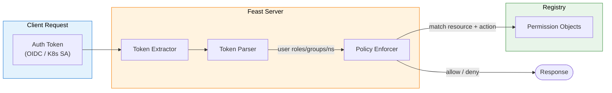

Permission enforcement happens on the server side (Online Feature Server, Offline Feature Server, Registry Server). There is no enforcement when using the Feast SDK with a local provider.

### Actions

Feast defines eight granular actions:

| Action | Description |
|---|---|
| `CREATE` | Create a new Feast object |
| `DESCRIBE` | Read object metadata/state |
| `UPDATE` | Modify an existing object |
| `DELETE` | Remove an object |
| `READ_ONLINE` | Read from the online store |
| `READ_OFFLINE` | Read from the offline store |
| `WRITE_ONLINE` | Write to the online store |
| `WRITE_OFFLINE` | Write to the offline store |

Convenience aliases are provided:

| Alias | Includes |
|---|---|
| `ALL_ACTIONS` | All eight actions |
| `READ` | `READ_ONLINE` + `READ_OFFLINE` |
| `WRITE` | `WRITE_ONLINE` + `WRITE_OFFLINE` |
| `CRUD` | `CREATE` + `DESCRIBE` + `UPDATE` + `DELETE` |

### Protected resource types

Permissions can be applied to any of these Feast object types:

`Project`, `Entity`, `FeatureView`, `OnDemandFeatureView`, `BatchFeatureView`, `StreamFeatureView`, `FeatureService`, `DataSource`, `ValidationReference`, `SavedDataset`, `Permission`

The constant `ALL_RESOURCE_TYPES` includes all of the above. `ALL_FEATURE_VIEW_TYPES` includes all feature view subtypes.

### Policy types

| Policy | Match criteria | Use case |
|---|---|---|
| `RoleBasedPolicy(roles=[...])` | User must have at least one of the listed roles | Kubernetes RBAC roles, OIDC roles |
| `GroupBasedPolicy(groups=[...])` | User must belong to at least one of the listed groups | LDAP/OIDC group membership |
| `NamespaceBasedPolicy(namespaces=[...])` | User's service account must be in one of the listed namespaces | Kubernetes namespace-level isolation |
| `CombinedGroupNamespacePolicy(groups=[...], namespaces=[...])` | User must match at least one group **or** one namespace | Flexible cross-cutting policies |
| `AllowAll` | Always grants access | Development / unsecured resources |

### Example: Role-based permissions

This is the most common pattern — separate admin and read-only roles:

```python
from feast.feast_object import ALL_RESOURCE_TYPES
from feast.permissions.action import READ, ALL_ACTIONS, AuthzedAction
from feast.permissions.permission import Permission
from feast.permissions.policy import RoleBasedPolicy

admin_perm = Permission(
    name="feast_admin_permission",
    types=ALL_RESOURCE_TYPES,
    policy=RoleBasedPolicy(roles=["feast-admin-role"]),
    actions=ALL_ACTIONS,
)

user_perm = Permission(
    name="feast_user_permission",
    types=ALL_RESOURCE_TYPES,
    policy=RoleBasedPolicy(roles=["feast-user-role"]),
    actions=[AuthzedAction.DESCRIBE] + READ,
)
```

### Example: Namespace-based isolation for multi-tenant deployments

Use `NamespaceBasedPolicy` to restrict access based on the Kubernetes namespace of the calling service account — ideal for the shared-registry enterprise topology.

Each team gets two permissions: full access to its own resources (matched by `team` tag), and read-only access to resources any team has explicitly published as shared (matched by `visibility: shared` tag). The two `required_tags` target **different** resources — a feature view tagged `team: team-b, visibility: shared` matches only the second permission for Team A, enabling cross-team discovery without granting write access:

```python
from feast.feast_object import ALL_RESOURCE_TYPES
from feast.permissions.action import ALL_ACTIONS, READ, AuthzedAction
from feast.permissions.permission import Permission
from feast.permissions.policy import NamespaceBasedPolicy

# Team A: full access to its own resources
team_a_own = Permission(
    name="team_a_full_access",
    types=ALL_RESOURCE_TYPES,
    required_tags={"team": "team-a"},          # matches only Team A's resources
    policy=NamespaceBasedPolicy(namespaces=["team-a"]),
    actions=ALL_ACTIONS,
)

# Team A: read-only access to shared resources published by ANY team
# e.g. a Team B feature view tagged {team: team-b, visibility: shared}
# satisfies required_tags here but NOT team_a_own above
team_a_read_shared = Permission(
    name="team_a_read_shared",
    types=ALL_RESOURCE_TYPES,
    required_tags={"visibility": "shared"},    # matches shared resources from any team
    policy=NamespaceBasedPolicy(namespaces=["team-a"]),
    actions=[AuthzedAction.DESCRIBE] + READ,
)

# Team B: mirror of the above — full access to its own, read-only to shared
team_b_own = Permission(
    name="team_b_full_access",
    types=ALL_RESOURCE_TYPES,
    required_tags={"team": "team-b"},
    policy=NamespaceBasedPolicy(namespaces=["team-b"]),
    actions=ALL_ACTIONS,
)

team_b_read_shared = Permission(
    name="team_b_read_shared",
    types=ALL_RESOURCE_TYPES,
    required_tags={"visibility": "shared"},
    policy=NamespaceBasedPolicy(namespaces=["team-b"]),
    actions=[AuthzedAction.DESCRIBE] + READ,
)
```

### Example: Combined group + namespace policy

For organizations that use both OIDC groups and Kubernetes namespaces for identity — ideal when platform engineers lack a dedicated namespace but need cross-team visibility, or when OIDC group membership and namespace ownership should independently grant access:

```python
from feast.feast_object import ALL_RESOURCE_TYPES
from feast.permissions.action import ALL_ACTIONS, READ, AuthzedAction
from feast.permissions.permission import Permission
from feast.permissions.policy import CombinedGroupNamespacePolicy

# Platform engineers (OIDC group) OR any team namespace can read shared features.
# This covers platform engineers who have no dedicated K8s namespace of their own
# but need cross-team feature discovery.
platform_read_shared = Permission(
    name="platform_read_shared",
    types=ALL_RESOURCE_TYPES,
    required_tags={"visibility": "shared"},
    policy=CombinedGroupNamespacePolicy(
        groups=["ml-platform"],           # OIDC group for platform/infra engineers
        namespaces=["team-a", "team-b"],  # team namespaces from enterprise topology
    ),
    actions=[AuthzedAction.DESCRIBE] + READ,
)

# ML engineers (OIDC) OR team namespace owners have full write access.
# Either identity alone is sufficient — useful during namespace migration or
# when the same person holds both the OIDC role and the team namespace.
ml_engineer_write = Permission(
    name="ml_engineer_full_access",
    types=ALL_RESOURCE_TYPES,
    policy=CombinedGroupNamespacePolicy(
        groups=["ml-engineers"],
        namespaces=["team-a", "team-b"],
    ),
    actions=ALL_ACTIONS,
)
```

### Example: Fine-grained resource filtering

Permissions support `name_patterns` (regex) and `required_tags` for targeting specific resources:

```python
from feast.feature_view import FeatureView
from feast.data_source import DataSource
from feast.permissions.action import AuthzedAction, READ
from feast.permissions.permission import Permission
from feast.permissions.policy import RoleBasedPolicy

sensitive_fv_perm = Permission(
    name="sensitive_feature_reader",
    types=[FeatureView],
    name_patterns=[".*sensitive.*", ".*pii.*"],
    policy=RoleBasedPolicy(roles=["trusted-reader"]),
    actions=[AuthzedAction.READ_OFFLINE],
)

high_risk_ds_writer = Permission(
    name="high_risk_ds_writer",
    types=[DataSource],
    required_tags={"risk_level": "high"},
    policy=RoleBasedPolicy(roles=["admin", "data_team"]),
    actions=[AuthzedAction.WRITE_ONLINE, AuthzedAction.WRITE_OFFLINE],
)
```

### Authorization configuration

Enable auth enforcement in `feature_store.yaml`:

```yaml
auth:
  type: kubernetes    # or: oidc
```

For OIDC:

```yaml
auth:
  type: oidc
  client_id: feast-client
  auth_server_url: https://keycloak.example.com/realms/feast
  auth_discovery_url: https://keycloak.example.com/realms/feast/.well-known/openid-configuration
```


**Permission granting order:** Feast uses an *affirmative* decision strategy — if **any** matching permission grants access, the request is allowed. Access is denied only when **all** matching permissions deny the user. If no permission matches a resource + action combination, access is **denied**. Resources that do not match any configured permission are unsecured. Always define explicit coverage for all critical resources.


### Recommended RBAC by topology

| Topology | Auth type | Policy type | Guidance |
|---|---|---|---|
| **Minimal** | `no_auth` or `kubernetes` | `RoleBasedPolicy` | Basic admin/reader roles |
| **Standard** | `kubernetes` | `RoleBasedPolicy` | K8s service account roles |
| **Enterprise (isolated)** | `oidc` or `kubernetes` | `RoleBasedPolicy` + `GroupBasedPolicy` | Per-team OIDC groups |
| **Enterprise (shared registry)** | `kubernetes` | `NamespaceBasedPolicy` or `CombinedGroupNamespacePolicy` | Namespace isolation with tag-based resource scoping |

---

## Infrastructure-Specific Recommendations

Choosing the right online store, offline store, and registry backend depends on your cloud environment and existing infrastructure. The table below maps common deployment environments to recommended Feast components.

### Recommendation matrix

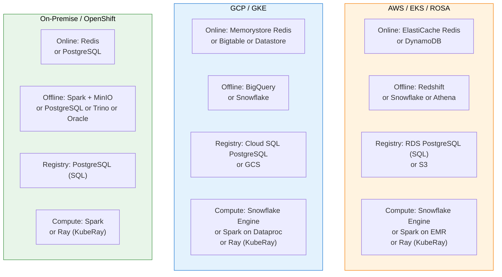

### AWS / EKS / ROSA

| Component | Recommended | Alternative | Notes |
|---|---|---|---|
| **Online Store** | **Redis** (ElastiCache) | DynamoDB | Redis offers TTL at retrieval, concurrent writes, Java/Go SDK support. DynamoDB is fully managed with zero ops. |
| **Offline Store** | **Redshift** | Snowflake, Athena (contrib), Spark | Redshift is the core AWS offline store. Use Snowflake if it's already your warehouse. Athena for S3-native query patterns. |
| **Registry** | **SQL** (RDS PostgreSQL) | S3 | SQL registry required for concurrent materialization writers. S3 registry is simpler but limited to single-writer. |
| **Compute Engine** | **Snowflake Engine** | Spark on EMR, [Ray (KubeRay)](../reference/compute-engine/ray.md) | Snowflake engine when your offline/online stores are Snowflake. Spark for S3-based pipelines. Ray with KubeRay for Kubernetes-native distributed processing. |


**ROSA (Red Hat OpenShift on AWS):** Same store recommendations as EKS. Use OpenShift Routes instead of Ingress for TLS termination. Leverage OpenShift's built-in OAuth for `auth.type: kubernetes` integration.


### GCP / GKE

| Component | Recommended | Alternative | Notes |
|---|---|---|---|
| **Online Store** | **Redis** (Memorystore) | Bigtable, Datastore | Redis for latency-sensitive workloads. Bigtable for very large-scale feature storage. Datastore is GCP-native and zero-ops. |
| **Offline Store** | **BigQuery** | Snowflake, Spark (Dataproc) | BigQuery is the core GCP offline store with full feature support. |
| **Registry** | **SQL** (Cloud SQL PostgreSQL) | GCS | SQL for multi-writer. GCS for simple single-writer setups. |
| **Compute Engine** | **Snowflake Engine** | Spark on Dataproc, [Ray (KubeRay)](../reference/compute-engine/ray.md) | Use Snowflake engine if your offline store is Snowflake. Spark for BigQuery + GCS pipelines. Ray with KubeRay for Kubernetes-native distributed processing. |

### On-Premise / OpenShift / Self-Managed Kubernetes

| Component | Recommended | Alternative | Notes |
|---|---|---|---|
| **Online Store** | **Redis** (self-managed or operator) | PostgreSQL (contrib) | Redis for best performance. PostgreSQL if you want to minimize infrastructure components. |
| **Offline Store** | **Spark** + MinIO (contrib) | PostgreSQL (contrib), Trino (contrib), Oracle (contrib), DuckDB | Spark for scale. PostgreSQL for simpler setups. Oracle for enterprise customers with existing Oracle infrastructure. DuckDB for development only. |
| **Registry** | **SQL** (PostgreSQL) | — | Always use SQL registry in production on-prem. File-based registries do not support concurrent writers. |
| **Compute Engine** | **Spark** | [Ray (KubeRay)](../reference/compute-engine/ray.md) | Run Spark on Kubernetes or standalone. Ray with KubeRay for Kubernetes-native distributed DAG execution. |


**Multi-replica constraint:** When scaling any Feast service to multiple replicas (via the Feast Operator), you **must** use database-backed persistence for all enabled services. File-based stores (SQLite, DuckDB, `registry.db`) are incompatible with multi-replica deployments. See [Scaling Feast](./scaling-feast.md#horizontal-scaling-with-the-feast-operator) for details.


---

## Air-Gapped / Disconnected Environment Deployments

Production environments in regulated industries (finance, government, defense) often have no outbound internet access from the Kubernetes cluster. The Feast Operator supports air-gapped deployments through custom container images, init container controls, and standard Kubernetes image-pull mechanisms.

### Default init container behavior

When `feastProjectDir` is set on the FeatureStore CR, the operator creates up to two init containers:

1. **`feast-init`** — bootstraps the feature repository by running either `git clone` (if `feastProjectDir.git` is set) or `feast init` (if `feastProjectDir.init` is set), then writes the generated `feature_store.yaml` into the repo directory.
2. **`feast-apply`** — runs `feast apply` to register feature definitions in the registry. Controlled by `runFeastApplyOnInit` (defaults to `true`). Skipped when `disableInitContainers` is `true`.

In air-gapped environments, `git clone` will fail because the cluster cannot reach external Git repositories. The solution is to **pre-bake** the feature repository into a custom container image and disable the init containers entirely.

### Air-gapped deployment workflow

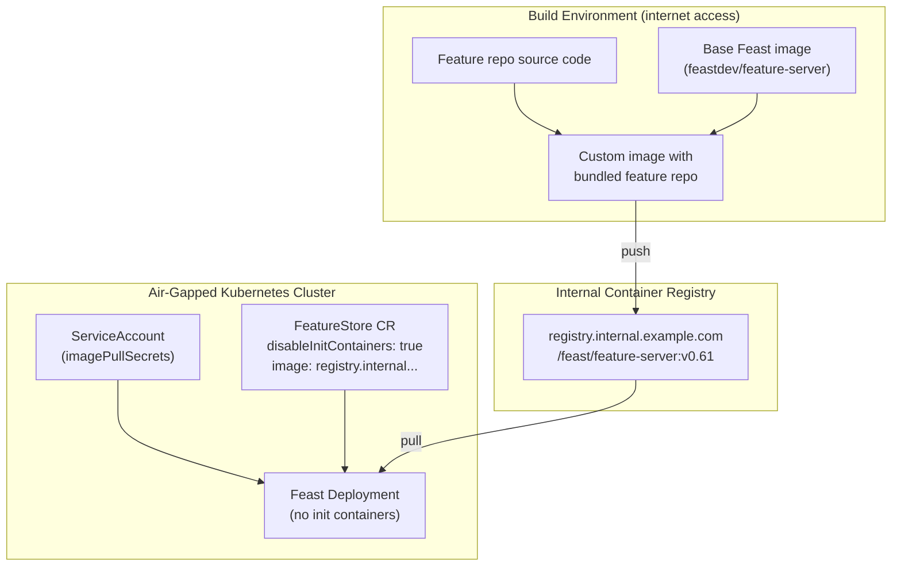

**Steps:**

1. **Build a custom container image** that bundles the feature repository and all Python dependencies into the Feast base image.
2. **Push** the image to your internal container registry.
3. **Set `services.disableInitContainers: true`** on the FeatureStore CR to skip `git clone` / `feast init` and `feast apply`.
4. **Override the image** on each service using the per-service `image` field.
5. **Set `imagePullPolicy: IfNotPresent`** (or `Never` if images are pre-loaded on nodes).
6. **Configure `imagePullSecrets`** on the namespace's ServiceAccount — the FeatureStore CRD does not expose an `imagePullSecrets` field, so use the standard Kubernetes approach of attaching secrets to the ServiceAccount that the pods run under.

### Sample FeatureStore CR (air-gapped)

```yaml
apiVersion: feast.dev/v1
kind: FeatureStore
metadata:
  name: airgap-production
spec:
  feastProject: my_project
  services:
    disableInitContainers: true
    onlineStore:
      persistence:
        store:
          type: redis
          secretRef:
            name: feast-online-store
      server:
        image: registry.internal.example.com/feast/feature-server:v0.61
        imagePullPolicy: IfNotPresent
        resources:
          requests:
            cpu: "1"
            memory: 1Gi
          limits:
            cpu: "2"
            memory: 2Gi
    registry:
      local:
        persistence:
          store:
            type: sql
            secretRef:
              name: feast-registry-store
        server:
          image: registry.internal.example.com/feast/feature-server:v0.61
          imagePullPolicy: IfNotPresent
```


**Pre-populating the registry:** With init containers disabled, `feast apply` does not run on pod startup. You can populate the registry by:

1. **Running `feast apply` from your CI/CD pipeline** that has network access to the registry DB.
2. **Using the FeatureStore CR's built-in CronJob** (`spec.cronJob`) — the operator creates a Kubernetes CronJob that runs `feast apply` and `feast materialize-incremental` on a schedule. The CronJob runs inside the cluster (no external access needed) and can use a custom image just like the main deployment. This is the recommended approach for air-gapped environments.
3. **Running `feast apply` manually** from the build environment before deploying the CR.


### Air-gapped deployment checklist


**Pre-stage the following artifacts before deploying Feast in an air-gapped environment:**

* **Container images** — Feast feature server image (with bundled feature repo) pushed to internal registry
* **CRD manifests** — Feast Operator CRDs and operator deployment manifests available locally
* **Store credentials** — Kubernetes Secrets for online store, offline store, and registry DB connections created in the target namespace
* **Python packages** (if using custom on-demand transforms) — bundled into the custom image or available from an internal PyPI mirror
* **ServiceAccount configuration** — `imagePullSecrets` attached to the ServiceAccount used by the Feast deployment


---

## Hybrid Store Configuration

The hybrid store feature allows a single Feast deployment to route feature operations to multiple backends based on tags or data sources. This is useful when different feature views have different latency, cost, or compliance requirements.

### Hybrid online store

The `HybridOnlineStore` routes online operations to different backends based on a configurable tag on the `FeatureView`.

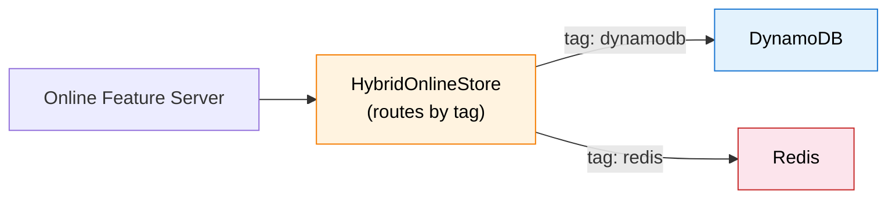

**`feature_store.yaml` configuration:**

```yaml
project: my_feature_repo
registry: data/registry.db
provider: local
online_store:
  type: hybrid
  routing_tag: team
  online_stores:
    - type: dynamodb
      conf:
        region: us-east-1
    - type: redis
      conf:
        connection_string: "redis-cluster:6379"
        redis_type: redis_cluster
```

**Feature view with routing tag:**

```python
from feast import FeatureView

user_features = FeatureView(
    name="user_features",
    entities=[user_entity],
    source=user_source,
    tags={"team": "dynamodb"},  # Routes to DynamoDB backend
)

transaction_features = FeatureView(
    name="transaction_features",
    entities=[txn_entity],
    source=txn_source,
    tags={"team": "redis"},  # Routes to Redis backend
)
```

The tag value must match the online store `type` name (e.g. `dynamodb`, `redis`, `bigtable`).

### Hybrid offline store

The `HybridOfflineStore` routes offline operations to different backends based on the `batch_source` type of each `FeatureView`.

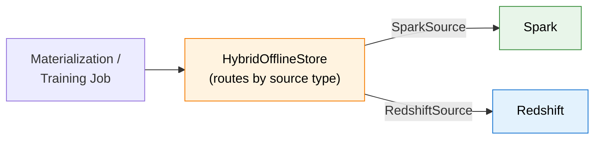

**`feature_store.yaml` configuration:**

```yaml
project: my_feature_repo
registry: data/registry.db
provider: local
offline_store:
  type: hybrid_offline_store.HybridOfflineStore
  offline_stores:
    - type: spark
      conf:
        spark_master: local[*]
        spark_app_name: feast_spark_app
    - type: redshift
      conf:
        cluster_id: my-redshift-cluster
        region: us-east-1
        database: feast_db
        user: feast_user
        s3_staging_location: s3://my-bucket/feast-staging
        iam_role: arn:aws:iam::123456789012:role/FeastRedshiftRole
```

**Feature views with different sources:**

```python
from feast import FeatureView, Entity, ValueType
from feast.infra.offline_stores.contrib.spark_offline_store.spark_source import SparkSource
from feast.infra.offline_stores.redshift_source import RedshiftSource

user_features = FeatureView(
    name="user_features",
    entities=[user_entity],
    source=SparkSource(path="s3://bucket/user_features"),  # Routes to Spark
)

activity_features = FeatureView(
    name="user_activity",
    entities=[user_entity],
    source=RedshiftSource(                                 # Routes to Redshift
        table="user_activity",
        event_timestamp_column="event_ts",
    ),
)
```


**Hybrid offline store constraint:** `get_historical_features` requires all requested feature views to share the same `batch_source` type within a single call. You cannot join features across different offline engines in one retrieval request.


---

## Performance Considerations

For detailed server-level tuning (worker counts, timeouts, keep-alive, etc.), see the [Online Server Performance Tuning](./online-server-performance-tuning.md) guide.

### Online feature server sizing

| Traffic tier | Replicas | CPU (per pod) | Memory (per pod) | Notes |
|---|---|---|---|---|
| Low (<100 RPS) | 1–2 | 500m–1 | 512Mi–1Gi | Minimal production |
| Medium (100–1000 RPS) | 2–5 (HPA) | 1–2 | 1–2Gi | Standard production |
| High (>1000 RPS) | 5–20 (HPA) | 2–4 | 2–4Gi | Enterprise, per-tenant |

### Online store latency guidelines

| Store | p50 latency | p99 latency | Best for |
|---|---|---|---|
| **Redis** (single) | <1ms | <5ms | Lowest latency, small-medium datasets |
| **Redis Cluster** | <2ms | <10ms | High availability + low latency |
| **DynamoDB** | <5ms | <20ms | Serverless, variable traffic |
| **PostgreSQL** | <5ms | <30ms | On-prem, simplicity |
| **Remote (HTTP)** | <10ms | <50ms | Client-server separation |

### Connection pooling for remote online store

When using the [Remote Online Store](../reference/online-stores/remote.md) (client-server architecture), connection pooling significantly reduces latency by reusing TCP/TLS connections:

```yaml
online_store:
  type: remote
  path: http://feast-feature-server:80
  connection_pool_size: 50        # Max connections in pool (default: 50)
  connection_idle_timeout: 300    # Idle timeout in seconds (default: 300)
  connection_retries: 3           # Retry count with exponential backoff
```

**Tuning by workload:**

| Workload | `connection_pool_size` | `connection_idle_timeout` | `connection_retries` |
|---|---|---|---|
| High-throughput inference | 100 | 600 | 5 |
| Long-running batch service | 50 | 0 (never close) | 3 |
| Resource-constrained edge | 10 | 60 | 2 |

### Registry performance

* **SQL registry** (PostgreSQL, MySQL) is required for concurrent materialization jobs writing to the registry simultaneously.
* **File-based registries** (S3, GCS, local) serialize the entire registry on each write — suitable only for single-writer scenarios.
* For read-heavy workloads, scale the Registry Server to multiple replicas (all connecting to the same database).

### Registry cache tuning at scale

Each Feast server pod maintains its own in-memory copy of the registry metadata. With multiple Gunicorn workers per pod, the total number of independent registry copies is **replicas x workers**. For example, 5 replicas with 4 workers each means 20 copies of the registry in memory, each refreshing independently.

With the default `cache_mode: sync`, the refresh is **synchronous** — when the TTL expires, the next request blocks until the full registry is re-downloaded. At scale, this causes periodic latency spikes across multiple pods simultaneously.

**Recommendation:** Use `cache_mode: thread` with a higher TTL in production to avoid refresh storms:

```yaml
# In the Operator secret for SQL/DB-backed registries:
registry:
  registry_type: sql
  path: postgresql://<user>:<password>@<host>:5432/feast
  cache_mode: thread
  cache_ttl_seconds: 300
```

For the server-side refresh interval, set `registryTTLSeconds` on the CR:

```yaml
spec:
  services:
    onlineStore:
      server:
        workerConfigs:
          registryTTLSeconds: 300
```

| Scenario | `cache_mode` | `cache_ttl_seconds` | `registryTTLSeconds` |
|---|---|---|---|
| Development / iteration | `sync` (default) | 5–10 | 5 |
| Production (low-latency) | `thread` | 300 | 300 |
| Production (frequent schema changes) | `thread` | 60 | 60 |


`registryTTLSeconds` on the CR controls the **server-side** refresh interval. `cache_ttl_seconds` in the registry secret controls the **SDK client** refresh. In Operator deployments, the CR field is what matters for serving performance. For a deep dive into sync vs thread mode trade-offs, memory impact, and freshness considerations, see the [Registry Cache Tuning](./online-server-performance-tuning.md#registry-cache-tuning) section in the performance tuning guide.


### Materialization performance

| Data volume | Recommended engine | Notes |
|---|---|---|
| <1M rows | In-process (default) | Simple, no external dependencies |
| 1M–100M rows | Snowflake Engine, Spark, or Ray | Distributed processing |
| >100M rows | Spark on Kubernetes / EMR / Dataproc, or Ray via KubeRay | Full cluster-scale materialization with distributed DAG execution |

For detailed engine configuration, see [Scaling Materialization](./scaling-feast.md#scaling-materialization).

### Redis sizing guidelines

| Metric | Guideline |
|---|---|
| **Memory** | ~100 bytes per feature value (varies by data type). For 1M entities x 50 features = ~5GB. |
| **Connections** | Each online feature server replica opens a connection pool. Plan for `replicas x pool_size`. |
| **TTL** | Set `key_ttl_seconds` in `feature_store.yaml` to auto-expire stale data and bound memory usage. |
| **Cluster mode** | Use Redis Cluster for >25GB datasets or >10K connections. |

---

## Design Principles

Understanding the following principles helps you choose and customize the right topology.

### Control plane vs data plane

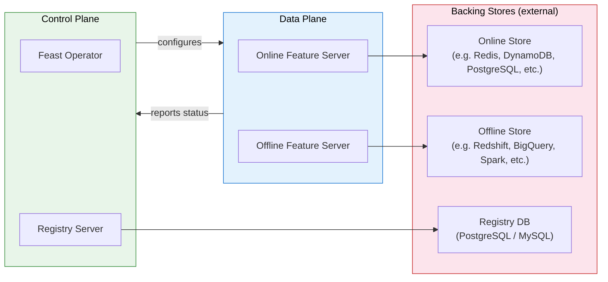

* **Control plane** (Operator + Registry Server) manages feature definitions, metadata, and lifecycle. It changes infrequently and should be highly available.
* **Data plane** (Online Feature Server + Offline Feature Server) handles the actual feature reads/writes at request time. It must scale with traffic.
* **Backing stores** (databases, object storage) hold the actual data. These are stateful and managed independently.

### Stateless vs stateful components

The Feast Operator deploys all Feast services (Online Feature Server, Offline Feature Server, Registry Server) in a **single shared Deployment**. When scaling (`spec.replicas > 1` or HPA autoscaling), all services scale together.


**Scaling requires DB-backed persistence for all enabled services.** The operator enforces this via CRD validation:

* **Online Store** — must use DB persistence (e.g. `type: redis`, `type: dynamodb`, `type: postgres`)
* **Offline Store** — if enabled, must use DB persistence (e.g. `type: redshift`, `type: bigquery`, `type: spark`, `type: postgres`)
* **Registry** — must use SQL persistence (`type: sql`), a remote registry, or S3/GCS file-backed registry

File-based stores (SQLite, DuckDB, `registry.db`) are **rejected** when `replicas > 1` or autoscaling is configured.


| Component | Type | Scaling | DB-backed requirement |
|---|---|---|---|
| Online Feature Server | **Stateless** (server) | Scales with the shared Deployment (HPA or `spec.replicas`) | Online store must use DB persistence (e.g. Redis, DynamoDB, PostgreSQL) |
| Offline Feature Server | **Stateless** (server) | Scales with the shared Deployment (HPA or `spec.replicas`) | Offline store must use DB persistence (e.g. Redshift, BigQuery, Spark, PostgreSQL) |
| Registry Server | **Stateless** (server) | Scales with the shared Deployment (HPA or `spec.replicas`) | Registry must use SQL, remote, or S3/GCS persistence |
| Online Store (Redis, DynamoDB, etc.) | **Stateful** (backing store) | Scale via managed service or clustering | Managed independently of Feast services |
| Offline Store (Redshift, BigQuery, etc.) | **Stateful** (backing store) | Scale via cloud-managed infrastructure | Managed independently of Feast services |
| Registry DB (PostgreSQL, MySQL) | **Stateful** (backing store) | Scale via managed database service | Managed independently of Feast services |

### Scalability guidelines

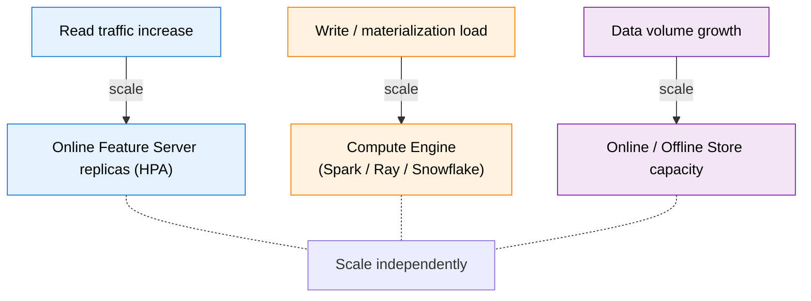

* **Read scaling** — increase Online Feature Server replicas; they are stateless and scale linearly.
* **Write scaling** — use a distributed compute engine ([Spark](../reference/compute-engine/spark.md), [Ray/KubeRay](../reference/compute-engine/ray.md), or [Snowflake](../reference/compute-engine/snowflake.md)) for materialization.
* **Storage scaling** — scale online and offline stores independently based on data volume and query patterns.

For detailed scaling configuration, see [Scaling Feast](./scaling-feast.md).

---

## Topology Comparison

| Capability | Minimal | Standard | Enterprise |
|---|:---:|:---:|:---:|
| **High availability** | No | Yes | Yes |
| **Autoscaling** | No | HPA | HPA + Cluster Autoscaler |
| **TLS / Ingress** | No | Yes | Yes + API Gateway |
| **RBAC** | No | Kubernetes RBAC | OIDC + fine-grained RBAC |
| **Multi-tenancy** | No | No | Namespace-per-team |
| **Shared registry** | N/A | N/A | Optional (remote registry) |
| **Hybrid stores** | No | Optional | Recommended for mixed backends |
| **Observability** | Logs only | Basic metrics | OpenTelemetry + Prometheus + Grafana + Jaeger |
| **Disaster recovery** | No | Partial | Full backup/restore |
| **Network policies** | No | Optional | Enforced |
| **Recommended team size** | 1–3 | 3–15 | 15+ |

---

## Next Steps

* [Feast on Kubernetes](./feast-on-kubernetes.md) — install the Feast Operator and deploy your first FeatureStore CR
* [Scaling Feast](./scaling-feast.md) — detailed HPA, registry scaling, and materialization engine configuration
* [Online Server Performance Tuning](./online-server-performance-tuning.md) — worker counts, timeouts, keep-alive, and server-level tuning
* [Starting Feast Servers in TLS Mode](./starting-feast-servers-tls-mode.md) — enable TLS for secure communication
* [Running Feast in Production](./running-feast-in-production.md) — CI/CD, materialization scheduling, and model serving patterns
* [Multi-Team Feature Store Setup](./federated-feature-store.md) — federated feature store for multi-team environments
* [Permission Concepts](../getting-started/concepts/permission.md) — full permission model reference
* [RBAC Architecture](../getting-started/architecture/rbac.md) — authorization architecture details
* [OpenTelemetry Integration](../getting-started/components/open-telemetry.md) — traces and metrics for Feast servers
* [Hybrid Online Store](../reference/online-stores/hybrid.md) — hybrid online store configuration reference
* [Hybrid Offline Store](../reference/offline-stores/hybrid.md) — hybrid offline store configuration reference
