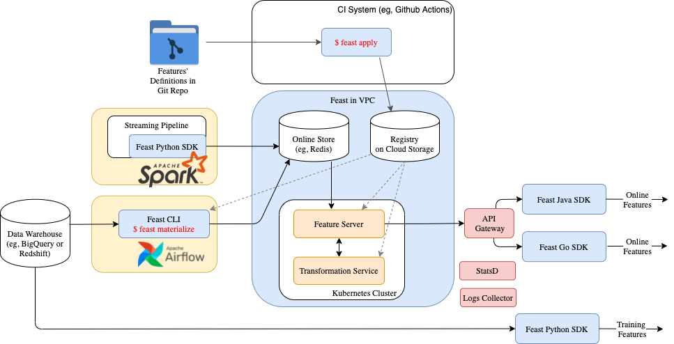
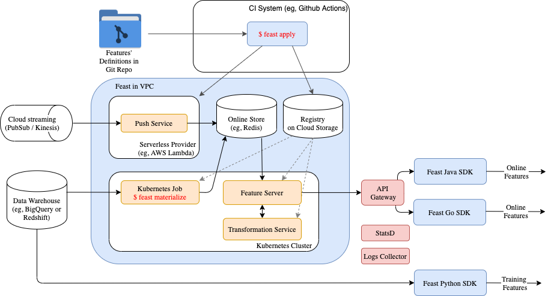
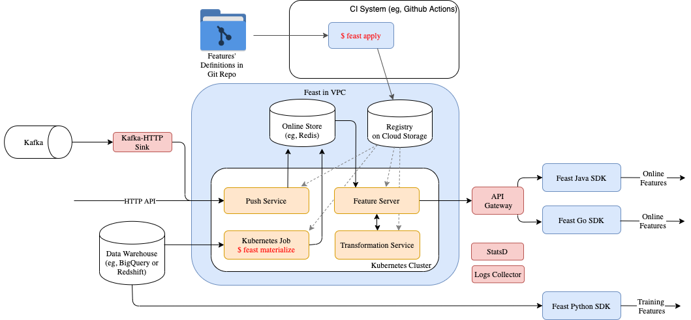

# Running Feast in production

## Overview

After learning about Feast concepts and playing with Feast locally, you're now ready to use Feast in production.
This guide aims to help with the transition from a sandbox project to production-grade deployment in the cloud or on-premise. 

Overview of typical production configuration is given below:



**Important note:** We're trying to keep Feast modular. With the exception of the core, most of the Feast blocks are loosely connected and can be used independently. Hence, you are free to build your own production configuration. 
For example, you might not have a stream source and, thus, no need to write features in real-time to an online store. 
Or you might not need to retrieve online features.

Furthermore, there's no single "true" approach. As you will see in this guide, Feast usually provides several options for each problem.
It's totally up to you to pick a path that's better suited to your needs.


In this guide we will show you how to:

1. Deploy your feature store and keep your infrastructure in sync with your feature repository
2. Keep the data in your online store up to date
3. Use Feast for model training and serving
4. Ingest features from a stream source
5. Monitor your production deployment

## 1. Automatically deploying changes to your feature definitions

The first step to setting up a deployment of Feast is to create a Git repository that contains your feature definitions. The recommended way to version and track your feature definitions is by committing them to a repository and tracking changes through commits.

Most teams will need to have a feature store deployed to more than one environment. We have created an example repository \([Feast Repository Example](https://github.com/feast-dev/feast-ci-repo-example)\) which contains two Feast projects, one per environment.

The contents of this repository are shown below:

```bash
├── .github
│   └── workflows
│       ├── production.yml
│       └── staging.yml
│
├── staging
│   ├── driver_repo.py
│   └── feature_store.yaml
│
└── production
    ├── driver_repo.py
    └── feature_store.yaml
```

The repository contains three sub-folders:

* `staging/`: This folder contains the staging `feature_store.yaml` and Feast objects. Users that want to make changes to the Feast deployment in the staging environment will commit changes to this directory.
* `production/`: This folder contains the production `feature_store.yaml` and Feast objects. Typically users would first test changes in staging before copying the feature definitions into the production folder, before committing the changes.
* `.github`: This folder is an example of a CI system that applies the changes in either the `staging` or `production` repositories using `feast apply`. This operation saves your feature definitions to a shared registry \(for example, on GCS\) and configures your infrastructure for serving features.

The `feature_store.yaml` contains the following:

```text
project: staging
registry: gs://feast-ci-demo-registry/staging/registry.db
provider: gcp
```

Notice how the registry has been configured to use a Google Cloud Storage bucket. All changes made to infrastructure using `feast apply` are tracked in the `registry.db`. This registry will be accessed later by the Feast SDK in your training pipelines or model serving services in order to read features.


It is important to note that the CI system above must have access to create, modify, or remove infrastructure in your production environment. This is unlike clients of the feature store, who will only have read access.


If your organization consists of many independent data science teams or a single group is working on several projects
that could benefit from sharing features, entities, sources, and transformations, then we encourage you to utilize Python packages inside each environment:

```
└── production
    ├── common
    │    ├── __init__.py
    │    ├── sources.py
    │    └── entities.py
    ├── ranking
    │    ├── __init__.py
    │    ├── views.py
    │    └── transformations.py
    ├── segmentation
    │    ├── __init__.py
    │    ├── views.py
    │    └── transformations.py
    └── feature_store.yaml
```

In summary, once you have set up a Git based repository with CI that runs `feast apply` on changes, your infrastructure \(offline store, online store, and cloud environment\) will automatically be updated to support the loading of data into the feature store or retrieval of data.

## 2. How to load data into your online store and keep it up to date

To keep your online store up to date, you need to run a job that loads feature data from your feature view sources into your online store. In Feast, this loading operation is called materialization.

### 2.1. Manual materializations 
The simplest way to schedule materialization is to run an **incremental** materialization using the Feast CLI:

```text
feast materialize-incremental 2022-01-01T00:00:00
```

The above command will load all feature values from all feature view sources into the online store up to the time `2022-01-01T00:00:00`.

A timestamp is required to set the end date for materialization. If your source is fully up to date then the end date would be the current time. However, if you are querying a source where data is not yet available, then you do not want to set the timestamp to the current time. You would want to use a timestamp that ends at a date for which data is available. The next time `materialize-incremental` is run, Feast will load data that starts from the previous end date, so it is important to ensure that the materialization interval does not overlap with time periods for which data has not been made available. This is commonly the case when your source is an ETL pipeline that is scheduled on a daily basis.

An alternative approach to incremental materialization \(where Feast tracks the intervals of data that need to be ingested\), is to call Feast directly from your scheduler like Airflow. In this case, Airflow is the system that tracks the intervals that have been ingested.

```text
feast materialize -v driver_hourly_stats 2020-01-01T00:00:00 2020-01-02T00:00:00
```

In the above example we are materializing the source data from the `driver_hourly_stats` feature view over a day. This command can be scheduled as the final operation in your Airflow ETL, which runs after you have computed your features and stored them in the source location. Feast will then load your feature data into your online store.

The timestamps above should match the interval of data that has been computed by the data transformation system.

### 2.2. Automate periodic materializations 

It is up to you which orchestration/scheduler to use to periodically run `$ feast materialize`.
Feast keeps the history of materialization in its registry so that the choice could be as simple as a [unix cron util](https://en.wikipedia.org/wiki/Cron).
Cron util should be sufficient when you have just a few materialization jobs (it's usually one materialization job per feature view) triggered infrequently.
However, the amount of work can quickly outgrow the resources of a single machine. That happens because the materialization job needs to repackage all rows before writing them to an online store. That leads to high utilization of CPU and memory.
In this case, you might want to use a job orchestrator to run multiple jobs in parallel using several workers.
Kubernetes Jobs or Airflow are good choices for more comprehensive job orchestration.

If you are using Airflow as a scheduler, Feast can be invoked through the [BashOperator](https://airflow.apache.org/docs/apache-airflow/stable/howto/operator/bash.html) after the [Python SDK](https://pypi.org/project/feast/) has been installed into a virtual environment and your feature repo has been synced:
```python
materialize = BashOperator(
    task_id='materialize',
    bash_command=f'feast materialize-incremental {datetime.datetime.now().replace(microsecond=0).isoformat()}',
)
```


Important note: Airflow worker must have read and write permissions to the registry file on GS / S3
since it pulls configuration and updates materialization history.


## 3. How to use Feast for model training

After we've defined our features and data sources in the repository, we can generate training datasets.

The first thing we need to do in our training code is to create a `FeatureStore` object with a path to the registry.

One way to ensure your production clients have access to the feature store is to provide a copy of the `feature_store.yaml` to those pipelines. This `feature_store.yaml` file will have a reference to the feature store registry, which allows clients to retrieve features from offline or online stores.

```python
fs = FeatureStore(repo_path="production/")
```

Then, training data can be retrieved as follows:

```python
feature_refs = [
    'driver_hourly_stats:conv_rate',
    'driver_hourly_stats:acc_rate',
    'driver_hourly_stats:avg_daily_trips'
]

training_df = fs.get_historical_features(
    entity_df=entity_df, 
    features=feature_refs,
).to_df()

model = ml.fit(training_df)
```

The most common way to productionize ML models is by storing and versioning models in a "model store", and then deploying these models into production. When using Feast, it is recommended that the list of feature references also be saved alongside the model. This ensures that models and the features they are trained on are paired together when being shipped into production:

```python
# Save model
model.save('my_model.bin')

# Save features
open('feature_refs.json', 'w') as f:
    json.dump(feature_refs, f)
```

To test your model locally, you can simply create a `FeatureStore` object, fetch online features, and then make a prediction:

```python
# Load model
model = ml.load('my_model.bin')

# Load feature references
with open('feature_refs.json', 'r') as f:
    feature_refs = json.load(f)

# Create feature store object
fs = FeatureStore(repo_path="production/")

# Read online features
feature_vector = fs.get_online_features(
    features=feature_refs,
    entity_rows=[{"driver_id": 1001}]
).to_dict()

# Make a prediction
prediction = model.predict(feature_vector)
```


It is important to note that both the training pipeline and model serving service need only read access to the feature registry and associated infrastructure. This prevents clients from accidentally making changes to the feature store.


## 4. Retrieving online features for prediction

Once you have successfully loaded (or in Feast terminology materialized) your data from batch sources into the online store, you can start consuming features for model inference.
There are three approaches for that purpose sorted from the most simple one (in an operational sense) to the most performant (benchmarks to be published soon):

### 4.1. Use the Python SDK within an existing Python service

This approach is the most convenient to keep your infrastructure as minimalistic as possible and avoid deploying extra services.
The Feast Python SDK will connect directly to the online store (Redis, Datastore, etc), pull the feature data, and run transformations locally (if required).
The obvious drawback is that your service must be written in Python to use the Feast Python SDK. 
A benefit of using a Python stack is that you can enjoy production-grade services with integrations with many existing data science tools.

To integrate online retrieval into your service use the following code:
```python
from feast import FeatureStore

with open('feature_refs.json', 'r') as f:
    feature_refs = json.loads(f)

fs = FeatureStore(repo_path="production/")

# Read online features
feature_vector = fs.get_online_features(
    features=feature_refs,
    entity_rows=[{"driver_id": 1001}]
).to_dict()
```

### 4.2. Consume features via HTTP API from Serverless Feature Server

If you don't want to add the Feast Python SDK as a dependency, or your feature retrieval service is written in a non-Python language,
Feast can deploy a simple feature server
on serverless infrastructure (eg, AWS Lambda, Google Cloud Run) for you.
This service will provide an HTTP API with JSON I/O, which can be easily used with any programming language.

[Read more about this feature](../reference/alpha-aws-lambda-feature-server.md)

### 4.3. Java based Feature Server deployed on Kubernetes

For users with very latency-sensitive and high QPS use-cases, Feast offers a high-performance Java feature server.
Besides the benefits of running on JVM, this implementation also provides a gRPC API, which guarantees good connection utilization and 
small request / response body size (compared to JSON). 
You will need the Feast Java SDK to retrieve features from this service. This SDK wraps all the gRPC logic for you and provides more convenient APIs. 

The Java based feature server can be deployed to Kubernetes cluster via Helm charts in a few simple steps:

1. Install [kubectl](https://kubernetes.io/docs/tasks/tools/install-kubectl/) and [helm 3](https://helm.sh/)
2. Add the Feast Helm repository and download the latest charts:
```
helm repo add feast-charts https://feast-helm-charts.storage.googleapis.com
helm repo update
```
3. Run Helm Install
```
helm install feast-release feast-charts/feast \
    --set global.registry.path=s3://feast/registries/prod \
    --set global.project=<project name>
```

This chart will deploy two services: `feature-server` and `transformation-service`.
Both must have read access to the registry file on cloud storage. Both will keep a copy of the registry in their memory and periodically refresh it, so expect some delays in update propagation in exchange for better performance.

#### Load balancing

The next step would be to install an L7 Load Balancer (eg, [Envoy](https://www.envoyproxy.io/)) in front of the Java feature server.
For seamless integration with Kubernetes (including services created by Feast Helm chart) we recommend using [Istio](https://istio.io/) as Envoy's orchestrator.

## 5. Ingesting features from a stream source

Recently Feast added functionality for [stream ingestion](../reference/alpha-stream-ingestion.md).
Please note that this is still in an early phase and new incompatible changes may be introduced.

### 5.1. Using Python SDK in your Apache Spark / Beam pipeline

The default option to write features from a stream is to add the Python SDK into your existing PySpark / Beam pipeline.
Feast SDK provides writer implementation that can be called from `foreachBatch` stream writer in PySpark like this:

```python
store = FeatureStore(...)

def feast_writer(spark_df):
    pandas_df = spark_df.to_pandas()
    store.write_to_online_store("driver_hourly_stats", pandas_df)

streamingDF.writeStream.foreachBatch(feast_writer).start()
```

### 5.2. Push service *(still under development)*

Alternatively, if you want to ingest features directly from a broker (eg, Kafka or Kinesis), you can use the "push service", which will write to an online store.
This service will expose an HTTP API or when deployed on Serverless platforms like AWS Lambda or Google Cloud Run,
this service can be directly connected to Kinesis or PubSub.

If you are using Kafka, [HTTP Sink](https://docs.confluent.io/kafka-connect-http/current/overview.html) could be utilized as a middleware.
In this case, the "push service" can be deployed on Kubernetes or as a Serverless function.

## 6. Monitoring

Feast services can report their metrics to a StatsD-compatible collector. To activate this function, you'll need to provide a StatsD IP address and a port when deploying the helm chart (in future, this will be added to `feature_store.yaml`).

We use an [InfluxDB-style extension](https://github.com/prometheus/statsd_exporter#tagging-extensions) for StatsD format to be able to send tags along with metrics. Keep that in mind while selecting the collector ([telegraph](https://www.influxdata.com/blog/getting-started-with-sending-statsd-metrics-to-telegraf-influxdb/#introducing-influx-statsd) will work for sure).

We chose StatsD since it's a de-facto standard with various implementations (eg, [1](https://github.com/prometheus/statsd_exporter), [2](https://github.com/influxdata/telegraf/blob/master/plugins/inputs/statsd/README.md))
and metrics can be easily exported to Prometheus, InfluxDB, AWS CloudWatch, etc.

---
## Summary

Summarizing it all together we want to show several options of architecture that will be most frequently used in production:

### Option #1 (currently preferred)

* Feast SDK is being triggered by CI (eg, Github Actions). It applies the latest changes from the feature repo to the Feast registry
* Airflow manages materialization jobs to ingest data from DWH to the online store periodically
* For the stream ingestion Feast Python SDK is used in the existing Spark / Beam pipeline
* Online features are served via either a Python feature server or a high performance Java feature server
  * Both the Java feature server and the transformation server are deployed on Kubernetes cluster (via Helm charts)
* Feast Python SDK is called locally to generate a training dataset




### Option #2 *(still in development)*

Same as Option #1, except:
* Push service is deployed as AWS Lambda / Google Cloud Run and is configured as a sink for Kinesis or PubSub to ingest features directly from a stream broker.
Lambda / Cloud Run is being managed by Feast SDK (from CI environment)
* Materialization jobs are managed inside Kubernetes via Kubernetes Job (currently not managed by Helm)




### Option #3 *(still in development)*

Same as Option #2, except:
* Push service is deployed on Kubernetes cluster and exposes an HTTP API that can be used as a sink for Kafka (via kafka-http connector) or accessed directly.



