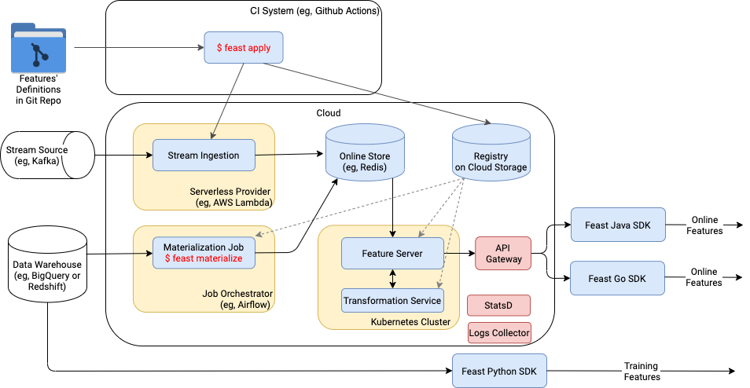

# Running Feast in production

## Overview

In this guide we will show you how to:

1. Deploy your feature store and keep your infrastructure in sync with your feature repository
2. Keep the data in your online store up to date
3. Use Feast for model training and serving
4. Monitor your production deployment

## 1. Automatically deploying changes to your feature definitions

The first step to setting up a deployment of Feast is to create a Git repository that contains your feature definitions. The recommended way to version and track your feature definitions is by committing them to a repository and tracking changes through commits.

Most teams will need to have a feature store deployed to more than one environment. We have created an example repository \([Feast Repository Example](https://github.com/feast-dev/feast-ci-repo-example)\) which contains two Feast projects, one per environment.

The contents of this repository are shown below:

```bash
├── .github
│   └── workflows
│       ├── production.yml
│       └── staging.yml
│
├── staging
│   ├── driver_repo.py
│   └── feature_store.yaml
│
└── production
    ├── driver_repo.py
    └── feature_store.yaml
```

The repository contains three sub-folders:

* `staging/`: This folder contains the staging `feature_store.yaml` and Feast objects. Users that want to make changes to the Feast deployment in the staging environment will commit changes to this directory.
* `production/`: This folder contains the production `feature_store.yaml` and Feast objects. Typically users would first test changes in staging before copying the feature definitions into the production folder, before committing the changes.
* `.github`: This folder is an example of a CI system that applies the changes in either the `staging` or `production` repositories using `feast apply`. This operation saves your feature definitions to a shared registry \(for example, on GCS\) and configures your infrastructure for serving features.

The `feature_store.yaml` contains the following?

```text
project: staging
registry: gs://feast-ci-demo-registry/staging/registry.db
provider: gcp
```

Notice how the registry has been configured to use a Google Cloud Storage bucket. All changes made to infrastructure using `feast apply` are tracked in the `registry.db`. This registry will be accessed later by the Feast SDK in your training pipelines or model serving services in order to read features.


It is important to note that the CI system above must have access to create, modify, or remove infrastructure in your production environment. This is unlike clients of the feature store, who will only have read access.


If your organization consists of many independent Data Science teams or single team is working on several projects
that could benefit from sharing features / entities / sources / transformations we encourage you to utilize Python packages inside each environment:

```
└── production
    ├── common
    │    ├── __init__.py
    │    ├── sources.py
    │    └── entities.py
    ├── ranking
    │    ├── __init__.py
    │    ├── views.py
    │    └── transformations.py
    ├── segmentation
    │    ├── __init__.py
    │    ├── views.py
    │    └── transformations.py
    └── feature_store.yaml
```

In summary, once you have set up a Git based repository with CI that runs `feast apply` on changes, your infrastructure \(offline store, online store, and cloud environment\) will automatically be updated to support loading of data into the feature store or retrieval of data.

## 2. How to load data into your online store and keep it up to date

In order to keep your online store up to date, you need to run a job that loads feature data from your feature view sources into your online store. In Feast, this loading operation is called materialization.

The simplest way to schedule materialization is to run an **incremental** materialization using the Feast CLI:

```text
feast materialize-incremental 2022-01-01T00:00:00
```

The above command will load all feature values from all feature view sources into the online store up to the time `2022-01-01T00:00:00`.

A timestamp is required to set the end date for materialization. If your source is fully up to date then the end date would be the current time. However, if you are querying a source where data is not yet available, then you do not want to set the timestamp to the current time. You would want to use a timestamp that ends at a date for which data is available. The next time `materialize-incremental` is run, Feast will load data that starts from the previous end date, so it is important to ensure that the materialization interval does not overlap with time periods for which data has not been made available. This is commonly the case when your source is an ETL pipeline that is scheduled on a daily basis.

An alternative approach to incremental materialization \(where Feast tracks the intervals of data that need to be ingested\), is to call Feast directly from your scheduler like Airflow. In this case Airflow is the system that tracks the intervals that have been ingested.

```text
feast materialize -v driver_hourly_stats 2020-01-01T00:00:00 2020-01-02T00:00:00
```

In the above example we are materializing the source data from the `driver_hourly_stats` feature view over a day. This command can be scheduled as the final operation in your Airflow ETL, which runs after you have computed your features and stored them in the source location. Feast will then load your feature data into your online store.

The timestamps above should match the interval of data that has been computed by the data transformation system.

### 2.1. Automate periodic materializations 

It is up to you which orchestration / scheduler to use to periodically run `$ feast materialize`.
However, since Feast keeps history of materialization in its registry the choice could be as simple as unix cron util
(if you have just one machine for this job). More complicated cases can be handled with Kubernetes Jobs or Airflow.
In case of Airflow feast can be invoked with [BashOperator](https://airflow.apache.org/docs/apache-airflow/stable/howto/operator/bash.html):
```python
materialize = BashOperator(
    task_id='materialize',
    bash_command='feast materialize-incremental',
)
```
Important note: Airflow worker must have read and write access to registry file on GS / S3
since it pulls configuration and updates materialization history.


## 3. How to prepare data for model training

Now that you have deployed a registry, provisioned your feature store your clients can start to consume features for training.

First think we need to do in our training code is to create a `FeatureStore` object with path to the registry.

One way to ensure your production clients have access to the feature store is to provide a copy of the `feature_store.yaml` to those pipelines. This `feature_store.yaml` file will have a reference to the feature store registry, which allows clients to retrieve features from offline or online stores.

```python
fs = FeatureStore(repo_path="production/feature_store.yaml")
```

Then, training data can be retrieved as follows:

```python
feature_refs = [
    'driver_hourly_stats:conv_rate',
    'driver_hourly_stats:acc_rate',
    'driver_hourly_stats:avg_daily_trips'
]

training_df = fs.get_historical_features(
    entity_df=entity_df, 
    feature_refs=feature_refs,
).to_df()

model = ml.fit(training_df)
```

The most common way to productionize ML models is by storing and versioning models in a "model store", and then deploying these models into production. When using Feast, it is recommended that the list of feature references also be saved alongside the model. This ensures that models and the features they are trained on are paired together when being shipped into production:

```python
# Save model
model.save('my_model.bin')

# Save features
open('feature_refs.json', 'w') as f:
    json.dump(feature_refs, f)
```

To test your model locally you can simply create a `FeatureStore` object (or use already existing one), fetch the features, and then make a prediction:

```python
# Load model
model = ml.load('my_model.bin')

# Load feature references
with open('feature_refs.json', 'r') as f:
    feature_refs = json.load(f)

# Create feature store object
fs = FeatureStore(repo_path="production/feature_store.yaml")

# Read online features
feature_vector = fs.get_online_features(
    feature_refs=feature_refs,
    entity_rows=[{"driver_id": 1001}]
).to_dict()

# Make a prediction
prediction = model.predict(feature_vector)
```


It is important to note that both the training pipeline and model serving service only needs read access to the feature registry and associated infrastructure. This prevents clients from accidentally making changes to the feature store.


## 4. Retrieving online features for prediction

One you successfully loaded (or in Feast terminology materialized) your data from Batch Source into Online Store you can start consuming features for inference phase.
There are three approaches sorted from the most simple one (in operational sense) to the most performant:

### 4.1. Python SDK reads directly from Online Store

This approach is the most convenient if you want to keep your infrastructure as minimalistic as possible and avoid deploying extra services.
Python SDK will connect directly to the Online Store (Redis, Datastore, etc), pull the raw data and run transformations locally (if required).
The obvious drawback is that your service (running the prediction) must be written on Python to use Feast Python SDK. 
But since a lot of Data Science tools are already using Python, and there's a great chance your service will be using it as well, this approach is still pretty valid for production.

Retrieving code will be exactly the same as in model testing provided above:
```
from feast import FeatureStore

with open('feature_refs.json', 'r') as f:
    feature_refs = json.loads(f)

fs = FeatureStore(repo_path="production/feature_store.yaml")

# Read online features
feature_vector = fs.get_online_features(
    feature_refs=feature_refs,
    entity_rows=[{"driver_id": 1001}]
).to_dict()
```


### 4.2. Consume features via HTTP API from Serverless Feature Server

In case if you don't want to add Feast Python SDK as your dependency, or it is written not on Python,
but in the meantime you don't want to support complex infrastructure, Feast can deploy simple Feature Server
on serverless infrastructure (eg, AWS Lambda, Google Cloud Function) for you.
This service will provide HTTP API with JSON I/O, which can be easily used with any programming language.

[Read more about this feature](../reference/alpha-aws-lambda-feature-server.md)

### 4.3. Java based Feature Server deployed to Kubernetes

For customers looking for the lowest latency on high QPS Feast offers
high performant Java implementation of Feature Server. Besides benefits of running on JVM, this implementation also provides gRPC API, which guarantees good connection utilization and 
small request / response body size (in comparison to JSON). 
You will probably need Feast Java SDK or Feast Go SDK to retrieve features from this service. Those SDKs will wrap all gRPC logic for you and instead will provide more convenient APIs. 

Java based Feature Server can be deployed to Kubernetes cluster via Helm charts in few simple steps:

1. Install [kubectl](https://kubernetes.io/docs/tasks/tools/install-kubectl/) and [helm 3](https://helm.sh/)
2. Add the Feast Helm repository and download the latest charts:
```
helm repo add feast-charts https://feast-helm-charts.storage.googleapis.com
helm repo update
```
3. Run Helm Install
```
helm install feast-release feast-charts/feast \
    --values registry=s3://feast/registries/prod
```

This chart will create `feature-server` kubernetes deployment consisting of Java Feature Server container and Transformation Service container as its side-car.
Both must have read access to registry file on cloud storage. Both will keep copy of registry in their memory and periodically refresh it.
So expect some delays in updates propagation in trade of better performance.

#### Load Balancing

Next step would be to install L7 Load Balancer (eg, [Envoy](https://www.envoyproxy.io/)) in front of Java Feature Server.
For seamless integration with Kubernetes (including services created by Feast Helm chart) we recommend using [Istio](https://istio.io/) as Envoy's orchestrator.

---

Complete architecture of Feast production infrastructure with Java Feature Server is presented below:




## Monitoring

Feast Services can report their metrics to StatsD-compatible collector. In order to activate this function provide StatsD IP address and port when deploying helm chart.
We prefer push-based model for metric collection, when service reports metric to statistic aggregator itself (eg, StatsD protocol), over pull-based model (eg, Prometheus protocol),
when service is being periodically examined by statistic collector, due to different life-cycle of various feast components.
Some components have short-lifetime (eg, Materialization job) and periodically run pulling can miss some significant chunk of data.


Also StatsD is very popular model with various implementations ([1](https://github.com/prometheus/statsd_exporter), [2](https://github.com/influxdata/telegraf/blob/master/plugins/inputs/statsd/README.md))
and data from StatsD collector could be easily exported to Prometheus, InfluxDB, AWS CloudWatch, etc.


