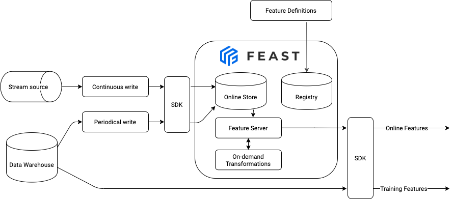

# Running Feast in production (e.g. on Kubernetes)

## Overview

After learning about Feast concepts and playing with Feast locally, you're now ready to use Feast in production. This guide aims to help with the transition from a sandbox project to production-grade deployment in the cloud or on-premise (e.g. on Kubernetes).

A typical production architecture looks like:




**Important note:** Feast is highly customizable and modular.

Most Feast blocks are loosely connected and can be used independently. Hence, you are free to build your own production configuration.

For example, you might not have a stream source and, thus, no need to write features in real-time to an online store. Or you might not need to retrieve online features. Feast also often provides multiple options to achieve the same goal. We discuss tradeoffs below.

Additionally, please check the how-to guide for some specific recommendations on [how to scale Feast](./scaling-feast.md).


In this guide we will show you how to:

1. Deploy your feature store and keep your infrastructure in sync with your feature repository
2. Keep the data in your online store up to date (from batch and stream sources)
3. Use Feast for model training and serving

## 1. Automatically deploying changes to your feature definitions

### 1.1 Setting up a feature repository

The first step to setting up a deployment of Feast is to create a Git repository that contains your feature definitions. The recommended way to version and track your feature definitions is by committing them to a repository and tracking changes through commits. If you recall, running `feast apply` commits feature definitions to a **registry**, which users can then read elsewhere.

### 1.2 Setting up a database-backed registry

Out of the box, Feast serializes all of its state into a file-based registry. When running Feast in production, we recommend using the more scalable SQL-based registry that is backed by a database. Details are available [here](./scaling-feast.md#scaling-feast-registry).

> **Note:** A SQL-based registry primarily works with a Python feature server. The Java feature server does not understand this registry type yet.

### 1.3 Setting up CI/CD to automatically update the registry

We recommend typically setting up CI/CD to automatically run `feast plan` and `feast apply` when pull requests are opened / merged.

### 1.4 Setting up multiple environments

A common scenario when using Feast in production is to want to test changes to Feast object definitions. For this, we recommend setting up a _staging_ environment for your offline and online stores, which mirrors _production_ (with potentially a smaller data set).

Having this separate environment allows users to test changes by first applying them to staging, and then promoting the changes to production after verifying the changes on staging.

Different options are presented in the [how-to guide](structuring-repos.md).

## 2. How to load data into your online store and keep it up to date

To keep your online store up to date, you need to run a job that loads feature data from your feature view sources into your online store. In Feast, this loading operation is called materialization.

### 2.1 Scalable Materialization

Out of the box, Feast's materialization process uses an in-process materialization engine. This engine loads all the data being materialized into memory from the offline store, and writes it into the online store. 

This approach may not scale to large amounts of data, which users of Feast may be dealing with in production.
In this case, we recommend using one of the more [scalable compute engines](./scaling-feast.md#scaling-materialization), such as [Snowflake Compute Engine](../reference/compute-engine/snowflake.md).
Users may also need to [write a custom compute engine](../how-to-guides/customizing-feast/creating-a-custom-compute-engine.md) to work on their existing infrastructure.  


### 2.2 Scheduled materialization with Airflow

> See also [data ingestion](../getting-started/concepts/data-ingestion.md#batch-data-ingestion) for code snippets

It is up to you to orchestrate and schedule runs of materialization. 

Feast keeps the history of materialization in its registry so that the choice could be as simple as a [unix cron util](https://en.wikipedia.org/wiki/Cron). Cron util should be sufficient when you have just a few materialization jobs (it's usually one materialization job per feature view) triggered infrequently. 

However, the amount of work can quickly outgrow the resources of a single machine. That happens because the materialization job needs to repackage all rows before writing them to an online store. That leads to high utilization of CPU and memory. In this case, you might want to use a job orchestrator to run multiple jobs in parallel using several workers. Kubernetes Jobs or Airflow are good choices for more comprehensive job orchestration.

If you are using Airflow as a scheduler, Feast can be invoked through a  [PythonOperator](https://airflow.apache.org/docs/apache-airflow/stable/howto/operator/python.html) after the [Python SDK](https://pypi.org/project/feast/) has been installed into a virtual environment and your feature repo has been synced:

```python
from airflow.decorators import task
from feast import RepoConfig, FeatureStore
from feast.infra.online_stores.dynamodb import DynamoDBOnlineStoreConfig
from feast.repo_config import RegistryConfig

# Define Python callable
@task()
def materialize(data_interval_start=None, data_interval_end=None):
  repo_config = RepoConfig(
    registry=RegistryConfig(path="s3://[YOUR BUCKET]/registry.pb"),
    project="feast_demo_aws",
    provider="aws",
    offline_store="file",
    online_store=DynamoDBOnlineStoreConfig(region="us-west-2"),
    entity_key_serialization_version=3
  )
  store = FeatureStore(config=repo_config)
  # Option 1: materialize just one feature view
  # store.materialize_incremental(datetime.datetime.now(), feature_views=["my_fv_name"])
  # Option 2: materialize all feature views incrementally
  # store.materialize_incremental(datetime.datetime.now())
  # Option 3: Let Airflow manage materialization state
  # Add 1 hr overlap to account for late data
  store.materialize(data_interval_start.subtract(hours=1), data_interval_end)
```

You can see more in an example at [Feast Workshop - Module 1](https://github.com/feast-dev/feast-workshop/blob/main/module_1/README.md#step-7-scaling-up-and-scheduling-materialization).


Important note: Airflow worker must have read and write permissions to the registry file on GCS / S3 since it pulls configuration and updates materialization history.


### 2.3 Stream feature ingestion
See more details at [data ingestion](../getting-started/concepts/data-ingestion.md), which shows how to ingest streaming features or 3rd party feature data via a push API.

This supports pushing feature values into Feast to both online or offline stores.

### 2.4 Scheduled batch transformations with Airflow + dbt
Feast does not orchestrate batch transformation DAGs. For this, you can rely on tools like Airflow + dbt. See [Feast Workshop - Module 3](https://github.com/feast-dev/feast-workshop/blob/main/module_3/) for an example and some tips.

## 3. How to use Feast for model training

### 3.1. Generating training data
> For more details, see [feature retrieval](../getting-started/concepts/feature-retrieval.md#retrieving-historical-features-for-training-data-or-batch-scoring)

After we've defined our features and data sources in the repository, we can generate training datasets. We highly recommend you use a `FeatureService` to version the features that go into a specific model version.

1. The first thing we need to do in our training code is to create a `FeatureStore` object with a path to the registry.
   - One way to ensure your production clients have access to the feature store is to provide a copy of the `feature_store.yaml` to those pipelines. This `feature_store.yaml` file will have a reference to the feature store registry, which allows clients to retrieve features from offline or online stores.

      ```python
      from feast import FeatureStore

      fs = FeatureStore(repo_path="production/")
      ```
2. Then, you need to generate an **entity dataframe**. You have two options
   - Create an entity dataframe manually and pass it in
   - Use a SQL query to dynamically generate lists of entities (e.g. all entities within a time range) and timestamps to pass into Feast
3. Then, training data can be retrieved as follows:

    ```python
    training_retrieval_job = fs.get_historical_features(
        entity_df=entity_df_or_sql_string,
        features=fs.get_feature_service("driver_activity_v1"),
    )

    # Option 1: In memory model training
    model = ml.fit(training_retrieval_job.to_df())

    # Option 2: Unloading to blob storage. Further post-processing can occur before kicking off distributed training.
    training_retrieval_job.to_remote_storage()
    ```

### 3.2 Versioning features that power ML models
The most common way to productionize ML models is by storing and versioning models in a "model store", and then deploying these models into production. When using Feast, it is recommended that the feature service name and the model versions have some established convention.

For example, in MLflow:

```python
import mlflow.pyfunc

# Load model from MLflow
model_name = "my-model"
model_version = 1
model = mlflow.pyfunc.load_model(
    model_uri=f"models:/{model_name}/{model_version}"
)

fs = FeatureStore(repo_path="production/")

# Read online features using the same model name and model version
feature_vector = fs.get_online_features(
    features=fs.get_feature_service(f"{model_name}_v{model_version}"),
    entity_rows=[{"driver_id": 1001}]
).to_dict()

# Make a prediction
prediction = model.predict(feature_vector)
```


It is important to note that both the training pipeline and model serving service need only read access to the feature registry and associated infrastructure. This prevents clients from accidentally making changes to the feature store.


## 4. Retrieving online features for prediction

Once you have successfully loaded data from batch / streaming sources into the online store, you can start consuming features for model inference. 

### 4.1. Use the Python SDK within an existing Python service

This approach is the most convenient to keep your infrastructure as minimalistic as possible and avoid deploying extra services. The Feast Python SDK will connect directly to the online store (Redis, Datastore, etc), pull the feature data, and run transformations locally (if required). The obvious drawback is that your service must be written in Python to use the Feast Python SDK. A benefit of using a Python stack is that you can enjoy production-grade services with integrations with many existing data science tools.

To integrate online retrieval into your service use the following code:

```python
from feast import FeatureStore

with open('feature_refs.json', 'r') as f:
    feature_refs = json.loads(f)

fs = FeatureStore(repo_path="production/")

# Read online features
feature_vector = fs.get_online_features(
    features=feature_refs,
    entity_rows=[{"driver_id": 1001}]
).to_dict()
```

### 4.2. Deploy Feast feature servers on Kubernetes
See [Feast on Kubernetes](./feast-on-kubernetes.md).

## 5. Using environment variables in your yaml configuration

You might want to dynamically set parts of your configuration from your environment. For instance to deploy Feast to production and development with the same configuration, but a different server. Or to inject secrets without exposing them in your git repo. To do this, it is possible to use the `${ENV_VAR}` syntax in your `feature_store.yaml` file. For instance:

```yaml
project: my_project
registry: data/registry.db
provider: local
online_store:
    type: redis
    connection_string: ${REDIS_CONNECTION_STRING}
```

***

## Summary

In summary, the overall architecture in production may look like:

* Feast SDK is being triggered by CI (eg, Github Actions). It applies the latest changes from the feature repo to the Feast database-backed registry 
* Data ingestion
  * **Batch data**: Airflow manages batch transformation jobs + materialization jobs to ingest batch data from DWH to the online store periodically. When working with large datasets to materialize, we recommend using a batch materialization engine 
    * If your offline and online workloads are in Snowflake, the Snowflake materialization engine is likely the best option.
    * If your offline and online workloads are not using Snowflake, but using Kubernetes is an option, the Bytewax materialization engine is likely the best option.
    * If none of these engines suite your needs, you may continue using the in-process engine, or write a custom engine (e.g with Spark or Ray).
  * **Stream data**: The Feast Push API is used within existing Spark / Beam pipelines to push feature values to offline / online stores

* Online features are served via the Python feature server over HTTP, or consumed using the Feast Python SDK.
* Feast Python SDK is called locally to generate a training dataset


