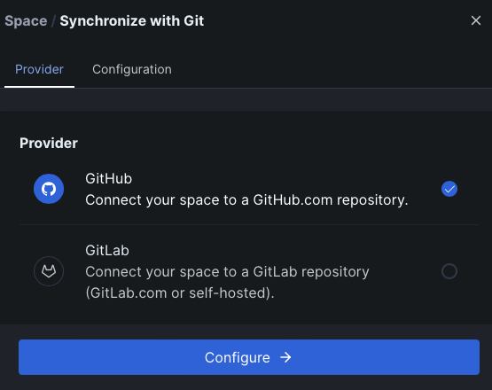
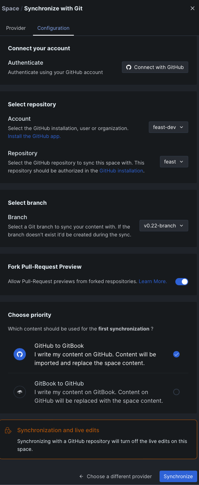
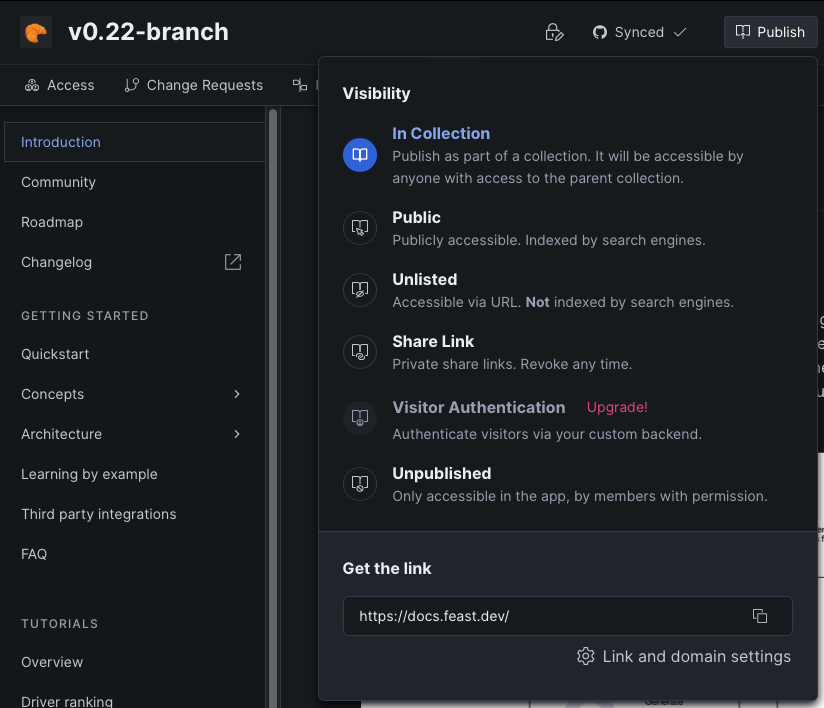
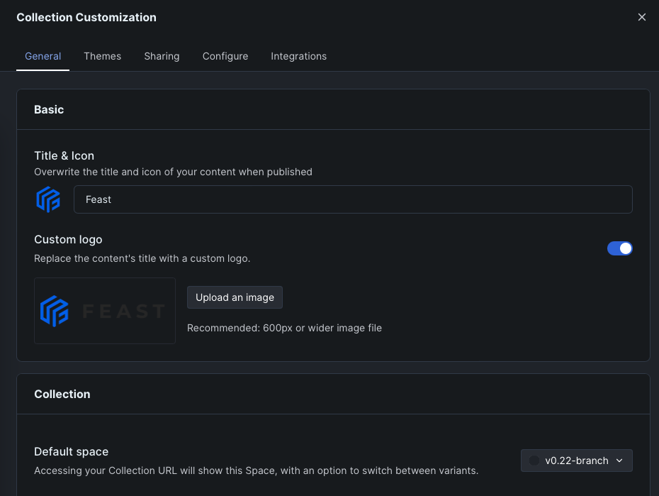

# Release process

## Release process

For Feast maintainers, these are the concrete steps for making a new release.

### 1. (for patch releases) Cherry-pick changes into the branch from master
If you were cutting Feast 0.22.3, for example, you might do:
1. `git checkout v0.22-branch` (or `git pull upstream v0.22-branch --rebase` if you've cut a release before)
2. `git cherry-pick [COMMIT FROM MASTER]`
3. `git push upstream v0.22-branch` to commit changes to the release branch

> Note: if you're handling a maintenance release (i.e. an older version), semantic release may complain at you. See 
> [Sample PR](https://github.com/feast-dev/feast/commit/40f2a6e13dd7d2a5ca5bff1af378e8712621d4f2) to enable an older 
> branch to cut releases.

After this step, you will have all the changes you need in the branch.

### 2. Pre-release verification
A lot of things can go wrong. One of the most common is getting the wheels to build correctly (and not accidentally 
building dev wheels from improper tagging or local code changes during the release process).
Another possible failure is that the Docker images might not build correctly.

We verify the building the wheels and Docker images in **your fork** of Feast, not the main feast-dev/feast repo.

#### For minor releases (e.g. v0.22.0)
1. Merge upstream master changes into your **fork**. Make sure you are running the workflow off of your fork!
2. Create a tag manually for the release on your fork. For example, if you are doing a release for version 0.22.0, create a tag by doing the following.
   - Checkout master branch and run `git tag v0.22.0`.
   - Run `git push --tags` to push the tag to your forks master branch.
   > This is important. If you don't have a tag, then the wheels you build will be **dev wheels**, which we can't 
   > push. The release process will automatically produce a tag for you via Semantic Release.
3. Access the `Actions` tab on your GitHub UI on your fork and click the `build_wheels` action. This workflow will 
   build the python sdk wheels for Python 3.8-3.10 on MacOS 10.15 and Linux and verify that these wheels are correct. It will also build the Docker images.
   The publish workflow uses this action to publish the python wheels for a new release to PyPI.
4. Look for the header `This workflow has a workflow_dispatch event trigger` and click `Run Workflow` on the right.
5. Run the workflow off of the tag you just created(`v0.22.0` in this case, **not** the master branch) and verify that 
   the workflow worked (i.e ensure that all jobs are green).

#### For patch releases (e.g. v0.22.3)
You should already have checked out the existing minor release branch from step 1 (e.g. `v0.22-branch`). 
1. Push the minor release branch to your fork (`git push -u origin <branch>`).
2. Add a patch release tag (e.g `v0.22.1`) by running `git tag <tag>`.
   > This is important. If you don't have a tag, then the wheels you build will be **dev wheels**, which we can't
   > push. The release process will automatically produce a tag for you via Semantic Release.
3. Push tags to your **origin branch** (not the upstream feast-dev/feast branch) with `git push origin <tag>`.
4. Kick off `build_wheels` workflow in your fork in the same way as is detailed in the last section, running the 
   workflow from this tag you just pushed up.

### 3. Release for Python and Java SDK
1. Generate a [Personal Access Token](https://docs.github.com/en/authentication/keeping-your-account-and-data-secure/creating-a-personal-access-token) or retrieve your saved personal access token.
   * The personal access token should have all of the permissions under the `repo` checkbox.
2. Access the `Actions` tab on the main `feast-dev/feast` repo and find the `release` action.
3. Look for the header `This workflow has a workflow_dispatch event trigger` again and click `Run Workflow` on the right.
   * If you are making a minor or major release, you should run it off of the master branch.
   * If you are making a patch release, run it off of the corresponding minor release branch.
4. Try the dry run first with your personal access token. If this succeeds, uncheck `Dry Run` and run the release workflow.
5. Then try running normally (without dry run). 
   - First, the `release` workflow will kick off. This publishes an NPM package for the Web UI ([NPM package](http://npmjs.com/package/@feast-dev/feast-ui)), 
     bumps files versions (e.g. helm chart, UI, Java pom.xml files), and generate a changelog using Semantic Release.
     All jobs should succeed. 
   - Second, the `publish` workflow will kick off. This builds all the Python wheels ([PyPI link](https://pypi.org/project/feast/), 
     publishes helm charts, publishes the Python and Java feature servers to Docker ([DockerHub images](https://hub.docker.com/u/feastdev)), 
     publishes the Java Serving Client + Datatypes libraries to Maven ([Maven repo](https://mvnrepository.com/artifact/dev.feast))
6. Try to install the Feast Python release in your local environment and test out the `feast init` -> `feast apply` 
   workflow to verify as a sanity check that the release worked correctly.
7. Verify the releases all show the new version:
   - [NPM package](http://npmjs.com/package/@feast-dev/feast-ui)
   - [PyPI link](https://pypi.org/project/feast/)
   - [DockerHub images (Java + Python feature servers, feature transformation server)](https://hub.docker.com/u/feastdev)
   - [Maven repo (feast-datatypes, feast-serving-client)](https://mvnrepository.com/artifact/dev.feast)

### 4. (for minor releases) Post-release steps
#### 4a: Creating a new branch
Create a new branch based on master (i.e. v0.22-branch) and push to the main Feast repo. This will be where 
cherry-picks go for future patch releases and where documentation will point.

#### 4b: Adding a high level summary in the GitHub release notes
By default, Semantic Release will pull in messages from commits (features vs fixes, etc). But this is hard to digest,
so it helps to have a high level overview. See https://github.com/feast-dev/feast/releases for the releases.

#### 4c: Update documentation

In the Feast Gitbook (ask [Danny Chiao](https://tectonfeast.slack.com/team/U029405HFEU) in Slack for access):
1. Create a new space within the Feast collection
2. Go to the overflow menu on the top -> Synchronize with Git
   1. Specify GitHub as the provider

      
   2. Configure to point to the new release branch

      
3. Publish the new page for this branch as part of the collection

   
4. Go back to the main Feast collection and go to the overflow menu -> "Customize collection"

   
5. Configure the default space to be your new branch and save

   
6. Verify on [docs.feast.dev](http://docs.feast.dev) that this new space is the default (this may take a few minutes to 
   propagate, and your browser cache may be caching the old branch as the default)