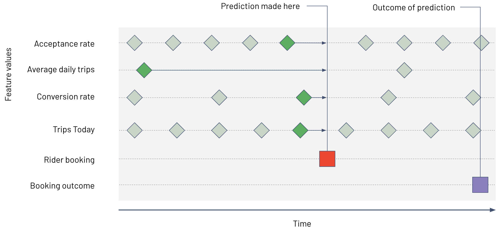
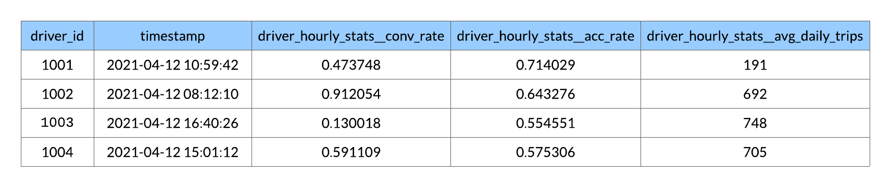

# Quickstart

Welcome to the Feast quickstart! This quickstart is intended to get you up and running with Feast in your local environment. It covers the following workflows:

1. Setting up Feast
2. Registering features
3. Constructing training datasets from offline data
4. Materializing feature data to the online feature store
5. Fetching feature vectors for real-time inference

This quickstart uses some example data about a ride-hailing app to walk through Feast. Let's get into it!

## 1. Setting up Feast

A Feast installation includes a Python SDK and a CLI. Both can be installed from `pip`:

```bash
pip install feast
```

You can test your installation by running`feast version` from your command line:

```bash
$ feast version

# 0.10
```

## 2. Registering features to Feast

We can bootstrap a feature repository using the `feast init` command:

```bash
feast init feature_repo

# Creating a new Feast repository in <cwd>/feature_repo.
```

This command generates an example repository containing the following files.


```bash
tree

# .
# └── feature_repo
#     ├── data
#     │   └── driver_stats.parquet
#     ├── example.py
#     └── feature_store.yaml
```


Now, let's take a look at these files. First, `cd` into the feature repository:


```text
cd feature_repo
```


Next, take a look at the `feature_store.yaml` file, which configures how the feature store runs:


```yaml
project: feature_repo
registry: data/registry.db
provider: local
online_store:
    path: data/online_store.db
```


An important field to be aware of is `provider`, which specifies the environment that Feast will run in. We've initialized `provider=local`, indicating that Feast will run the feature store on our local machine. See [Repository Config](reference/feature-store-yaml.md) for more details.

Next, take a look at `example.py`, which defines some example features:


```python
# This is an example feature definition file

from google.protobuf.duration_pb2 import Duration

from feast import Entity, Feature, FeatureView, ValueType
from feast.data_source import FileSource

# Read data from parquet files. Parquet is convenient for local development mode. For
# production, you can use your favorite DWH, such as BigQuery. See Feast documentation
# for more info.
driver_hourly_stats = FileSource(
    path="/<cwd>/feature_repo/data/driver_stats.parquet",
    event_timestamp_column="datetime",
    created_timestamp_column="created",
)

# Define an entity for the driver. You can think of entity as a primary key used to
# fetch features.
driver = Entity(name="driver_id", value_type=ValueType.INT64, description="driver id",)

# Our parquet files contain sample data that includes a driver_id column, timestamps and
# three feature column. Here we define a Feature View that will allow us to serve this
# data to our model online.
driver_hourly_stats_view = FeatureView(
    name="driver_hourly_stats",
    entities=["driver_id"],
    ttl=Duration(seconds=86400 * 1),
    features=[
        Feature(name="conv_rate", dtype=ValueType.FLOAT),
        Feature(name="acc_rate", dtype=ValueType.FLOAT),
        Feature(name="avg_daily_trips", dtype=ValueType.INT64),
    ],
    online=True,
    input=driver_hourly_stats,
    tags={},
)
```


There are three objects defined in this file:

* A `DataSource`, which is a pointer to persistent feature data. In this example, we're using a `FileSource`, which points to a set of parquet files on our local machine.
* An `Entity`, which is a metadata object that is used to organize and join features.  In this example, our entity is `driver_id`, indicating that our features are modeling attributes of drivers.
* A `FeatureView`, which defines a group of features. In this example, our features are statistics about drivers, like their conversion rate and average daily trips.

Feature definitions in Feast work similarly to Terraform: local definitions don't actually affect what's running in production until we explicitly register them with Feast. At this point, we have a set of feature definitions, but we haven't registered them with Feast yet.

We can register our features by running `feast apply` from the CLI:


```bash
feast apply
```


```text
Registered entity driver_id
Registered feature view driver_hourly_stats
Deploying infrastructure for driver_hourly_stats
```

This command has registered our features to Feast. They're now ready for offline retrieval and materialization.

## 3. Generating training data

Feast generates point-in-time accurate training data. In our ride-hailing example, we are using statistics about drivers to predict the likelihood of a booking completion. When we generate training data, we want to know what the features of the drivers were _at the time of prediction_ \(in the past.\)



Generating training datasets is a workflow best done from an interactive computing environment, like a Jupyter notebook. You can start a Jupyter notebook by running `jupyter notebook` from the command line. Then, run the following code to generate an _entity DataFrame_:


```python
import pandas as pd
from datetime import datetime

# entity_df generally comes from upstream systems
entity_df = pd.DataFrame.from_dict({
    "driver_id": [1001, 1002, 1003, 1004],
    "event_timestamp": [
        datetime(2021, 4, 12, 10, 59, 42),
        datetime(2021, 4, 12, 8,  12, 10),
        datetime(2021, 4, 12, 16, 40, 26),
        datetime(2021, 4, 12, 15, 1 , 12)
    ]
})

entity_df.head()
```



This DataFrame represents the entity keys and timestamps that we want feature values for. We can pass this Entity DataFrame into Feast, and Feast will fetch point-in-time correct features for each row:


```python
from feast import FeatureStore

store = FeatureStore(repo_path=".")

training_df = store.get_historical_features(
    entity_df=entity_df, 
    feature_refs = [
        'driver_hourly_stats:conv_rate',
        'driver_hourly_stats:acc_rate',
        'driver_hourly_stats:avg_daily_trips'
    ],
).to_df()

training_df.head()
```




Feast has joined on the correct feature values for the drivers that specified, as of the timestamp we specified.

This DataFrame contains all the necessary signals needed to train a model, excluding labels, which are typically managed outside of Feast. Before you can train a model, you'll need to join on labels from external systems.

## 4. Materializing features to the online store

We have just seen how we can use Feast in the model training workflow. Now, we'll see how Feast fits into the model inferencing workflow.

When running inference on Feast features, the first step is to populate the online store to make our features available for real-time inference. When using the `local` provider, the online store is a SQLite database.

To materialize features, run the following command from the CLI:


```bash
CURRENT_TIME=$(date -u +"%Y-%m-%dT%H:%M:%S")
feast materialize-incremental $CURRENT_TIME

# Materializing feature view driver_hourly_stats from 2021-04-13 23:50:05.754655-04:00 
# to 2021-04-14 23:50:04-04:00 done!
```


We've just populated the online store with the most recent features from the offline store. Our feature values are now ready for real-time retrieval.

## 5. Fetching feature vectors for inference

After we materialize our features, we can use the `store.get_online_features` to fetch the latest feature values for real-time inference:


```python
from pprint import pprint
from feast import FeatureStore

store = FeatureStore(repo_path=".")

feature_vector = store.get_online_features(
    feature_refs=[
        'driver_hourly_stats:conv_rate',
        'driver_hourly_stats:acc_rate',
        'driver_hourly_stats:avg_daily_trips'
    ],
    entity_rows=[{"driver_id": 1001}],
    full_feature_names=True
).to_dict()

pprint(feature_vector)
```


```text
{
    'driver_id': [1001],
    'driver_hourly_stats__conv_rate': [0.49274],
    'driver_hourly_stats__acc_rate': [0.92743],
    'driver_hourly_stats__avg_daily_trips': [72],
}
```

This feature vector can be used for real-time inference, for example, in a model serving microservice.

## Next steps

This quickstart covered the essential workflows of using Feast in your local environment. The next step is to `pip install "feast[gcp]"` and set `provider="gcp"` in your `feature_store.yaml` file and push your work to production deployment. You can also use the `feast init -t gcp` command in the CLI to initialize a feature repository with example features in the GCP environment.

* See [Create a feature repository](getting-started/create-a-feature-repository.md) for more information on the workflows we covered.
* Join our [Slack group](https://slack.feast.dev) to talk to other Feast users and the maintainers!

