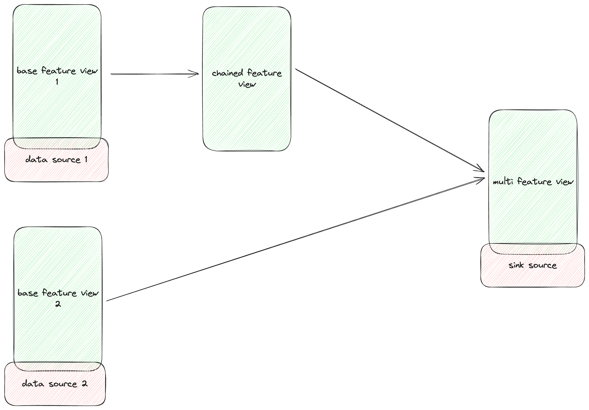

# 🧠 ComputeEngine (WIP)

The `ComputeEngine` is Feast’s pluggable abstraction for executing feature pipelines — including transformations, aggregations, joins, and materializations/get_historical_features — on a backend of your choice (e.g., Spark, PyArrow, Pandas, Ray).

It powers both:

- `materialize()` – for batch and stream generation of features to offline/online stores
- `get_historical_features()` – for point-in-time correct training dataset retrieval

This system builds and executes DAGs (Directed Acyclic Graphs) of typed operations, enabling modular and scalable workflows.

---

## 🧠 Core Concepts

| Component          | Description                                                          | API                                                                                                                         |
|--------------------|----------------------------------------------------------------------|-----------------------------------------------------------------------------------------------------------------------------|
| `ComputeEngine`    | Interface for executing materialization and retrieval tasks          | [link](https://github.com/feast-dev/feast/blob/master/sdk/python/feast/infra/compute_engines/base.py)                       |
| `FeatureBuilder`   | Constructs a DAG from Feature View definition for a specific backend | [link](https://github.com/feast-dev/feast/blob/master/sdk/python/feast/infra/compute_engines/feature_builder.py)            |
| `FeatureResolver`  | Resolves feature DAG by topological order for execution              | [link](https://github.com/feast-dev/feast/blob/master/sdk/python/feast/infra/compute_engines/feature_resolver.py)           |
| `DAG`              | Represents a logical DAG operation (read, aggregate, join, etc.)     | [link](https://github.com/feast-dev/feast/blob/master/sdk/python/feast/infra/compute_engines/dag/README.md)                 |
| `ExecutionPlan`    | Executes nodes in dependency order and stores intermediate outputs   | [link]([link](https://github.com/feast-dev/feast/blob/master/sdk/python/feast/infra/compute_engines/dag/README.md))         |
| `ExecutionContext` | Holds config, registry, stores, entity data, and node outputs        | [link]([link](https://github.com/feast-dev/feast/blob/master/sdk/python/feast/infra/compute_engines/dag/README.md))         |

---

## Feature resolver and builder
The `FeatureBuilder` initialize a `FeatureResolver` that extracts a DAG from the `FeatureView` definitions, resolving dependencies and ensuring correct execution order. \
The FeatureView represents a logical data source, while DataSource represents the physical data source (e.g., BigQuery, Spark, etc.). \
When defines the FeatureView, the source can be a physical DataSource, a derived FeatureView, or a list of FeatureViews.
The FeatureResolver walks through the FeatureView sources, and topologically sorts the DAG nodes based on dependencies, and return a head node that represents the final output of the DAG. \
Then the `FeatureBuilder` builds the DAG nodes from the resolved head node, creating a `DAGNode` for each operation (read, join, filter, aggregate, etc.).

## Diagram



## ✨ Available Engines

### 🔥 SparkComputeEngine

- Distributed DAG execution via Apache Spark
- Supports point-in-time joins and large-scale materialization
- Integrates with `SparkOfflineStore` and `SparkMaterializationJob`

### 🧪 LocalComputeEngine

- Runs on Arrow + Specified backend (e.g., Pandas, Polars)
- Designed for local dev, testing, or lightweight feature generation
- Supports `LocalMaterializationJob` and `LocalHistoricalRetrievalJob`

---

## 🛠️ Feature Builder Flow 
```markdown
SourceReadNode
      |
      v
TransformationNode (If feature_transformation is defined) | JoinNode (default behavior for multiple sources)
      |
      v
FilterNode (Always included; applies TTL or user-defined filters)
      |
      v
AggregationNode (If aggregations are defined in FeatureView)
      |
      v
DeduplicationNode (If no aggregation is defined for get_historical_features) 
      |
      v
ValidationNode (If enable_validation = True)
      |
      v
Output
  ├──> RetrievalOutput (For get_historical_features)
  └──> OnlineStoreWrite / OfflineStoreWrite (For materialize)
```

Each step is implemented as a `DAGNode`. An `ExecutionPlan` executes these nodes in topological order, caching `DAGValue` outputs.

---

## 🧩 Implementing a Custom Compute Engine

To create your own compute engine:

1. **Implement the interface**

```python
from feast.infra.compute_engines.base import ComputeEngine
from typing import Sequence, Union
from feast.batch_feature_view import BatchFeatureView
from feast.entity import Entity
from feast.feature_view import FeatureView
from feast.infra.common.materialization_job import (
    MaterializationJob,
    MaterializationTask,
)
from feast.infra.common.retrieval_task import HistoricalRetrievalTask
from feast.infra.offline_stores.offline_store import RetrievalJob
from feast.infra.registry.base_registry import BaseRegistry
from feast.on_demand_feature_view import OnDemandFeatureView
from feast.stream_feature_view import StreamFeatureView


class MyComputeEngine(ComputeEngine):
    def update(
        self,
        project: str,
        views_to_delete: Sequence[
            Union[BatchFeatureView, StreamFeatureView, FeatureView]
        ],
        views_to_keep: Sequence[
            Union[BatchFeatureView, StreamFeatureView, FeatureView, OnDemandFeatureView]
        ],
        entities_to_delete: Sequence[Entity],
        entities_to_keep: Sequence[Entity],
    ):
        ...
   
    def _materialize_one(
        self,
        registry: BaseRegistry,
        task: MaterializationTask,
        **kwargs,
    ) -> MaterializationJob:
        ...

    def get_historical_features(self, task: HistoricalRetrievalTask) -> RetrievalJob:
        ...

```

2. Create a FeatureBuilder
```python
from feast.infra.compute_engines.feature_builder import FeatureBuilder


class CustomFeatureBuilder(FeatureBuilder):
    def build_source_node(self): ...
    def build_aggregation_node(self, input_node): ...
    def build_join_node(self, input_node): ...
    def build_filter_node(self, input_node):
    def build_dedup_node(self, input_node):
    def build_transformation_node(self, input_node): ...
    def build_output_nodes(self, input_node): ...
    def build_validation_node(self, input_node): ...
```

3. Define DAGNode subclasses
    * ReadNode, AggregationNode, JoinNode, WriteNode, etc.
    * Each DAGNode.execute(context) -> DAGValue

4. Return an ExecutionPlan
   * ExecutionPlan stores DAG nodes in topological order
   * Automatically handles intermediate value caching 

## 🚧 Roadmap
- [x] Modular, backend-agnostic DAG execution framework
- [x] Spark engine with native support for materialization + PIT joins
- [x] PyArrow + Pandas engine for local compute
- [x] Native multi-feature-view DAG optimization
- [ ] DAG validation, metrics, and debug output
- [ ] Scalable distributed backend via Ray or Polars
