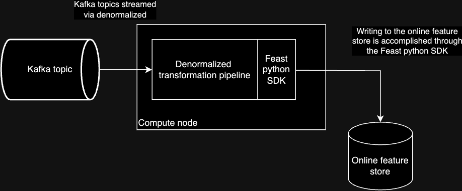

# Streaming feature computation with Denormalized

Denormalized makes it easy to compute real-time features and write them directly to your Feast online store. This guide will walk you through setting up a streaming pipeline that computes feature aggregations and pushes them to Feast in real-time.



## Prerequisites

- Python 3.8+
- Kafka cluster (local or remote)

For a full working demo, check out the [feast-example](https://github.com/probably-nothing-labs/feast-example) repo.

## Quick Start

1. First, create a new Python project or use our template:
```bash
mkdir my-feature-project
cd my-feature-project
python -m venv .venv
source .venv/bin/activate  # or `.venv\Scripts\activate` on Windows
pip install denormalized[feast] feast
```

2. Set up your Feast feature repository:
```bash
feast init feature_repo
```

## Project Structure

Your project should look something like this:
```
my-feature-project/
├── feature_repo/
│   ├── feature_store.yaml
│   └── sensor_data.py        # Feature definitions
├── stream_job.py             # Denormalized pipeline
└── main.py                   # Pipeline runner
```

## Define Your Features

In `feature_repo/sensor_data.py`, define your feature view and entity:

```python
from feast import Entity, FeatureView, PushSource, Field
from feast.types import Float64, String

# Define your entity
sensor = Entity(
    name="sensor",
    join_keys=["sensor_name"],
)

# Create a push source for real-time features
source = PushSource(
    name="push_sensor_statistics",
    batch_source=your_batch_source  # Define your batch source
)

# Define your feature view
stats_view = FeatureView(
    name="sensor_statistics",
    entities=[sensor],
    schema=ds.get_feast_schema(),  # Denormalized handles this for you!
    source=source,
    online=True,
)
```

## Create Your Streaming Pipeline

In `stream_job.py`, define your streaming computations:

```python
from denormalized import Context, FeastDataStream
from denormalized.datafusion import col, functions as f
from feast import FeatureStore

sample_event = {
    "occurred_at_ms": 100,
    "sensor_name": "foo",
    "reading": 0.0,
}

# Create a stream from your Kafka topic
ds = FeastDataStream(Context().from_topic("temperature", json.dumps(sample_event), "localhost:9092"))

# Define your feature computations
ds = ds.window(
    [col("sensor_name")],  # Group by sensor
    [
        f.count(col("reading")).alias("count"),
        f.min(col("reading")).alias("min"),
        f.max(col("reading")).alias("max"),
        f.avg(col("reading")).alias("average"),
    ],
    1000,  # Window size in ms
    None   # Slide interval (None = tumbling window)
)

feature_store = FeatureStore(repo_path="feature_repo/")

# This single line connects Denormalized to Feast!
ds.write_feast_feature(feature_store, "push_sensor_statistics")
```

## Need Help?

- Email us at hello@denormalized.io
- Check out more examples on our [GitHub](https://github.com/probably-nothing-labs/denormalized)
