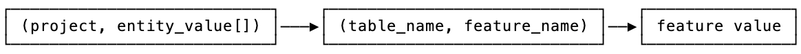
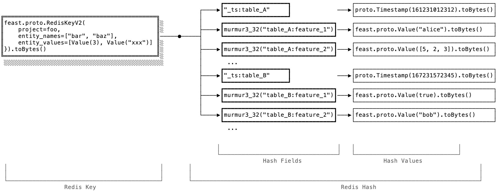
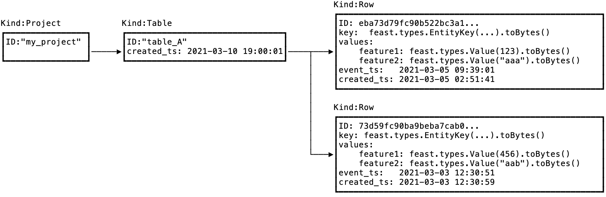

# Feast Online Store Format v0.10

## Overview
This document describes the data format used by Feast for storing feature data for online serving.

This format is considered part of Feast public API contract; that allows other community developed software or "addons" to Feast to integrate with it. That way this software can directly and efficiently read and write data from Feast-compatible online stores, without having to go through Feast HTTP or gRPC API.

The format is not entirely technology or cloud agnostic. Since users may opt to use different key-value stores as an underlying engine to store feature data, and we don't want to aim for the lowest common denominator across them, we have to provide different "flavors" of this data format, specialized for every supported store.

This version of the Online Store Format supports Redis and DynamoDB as storage engine. We envision adding more storage engines to this document in the future.


## Overview
For definitions of the terms used here, please refer to [Feast glossary](https://github.com/feast-dev/feast/blob/master/docs/concepts/glossary.md).

Fundamentally, an Online Store is used to store a snapshot of feature data, that is a set of _entity rows_ indexed by _entity key_. There is only one _entity row_ per _entity key_ and _feature table_.

We use `feast.types.Value` protobuf as the main tagged union data type used to serialize arbitrary typed values in Feast. See Appendix A below for exact definition.

## Redis Online Store Format

### Overview
When feature data is stored in Redis, we use it as a two-level map, by utilizing [Redis Hashes](https://redis.io/topics/data-types#hashes).

The first level of the map contains the Feast project name and entity key. The entity key is composed of entity names and values. The second level key (in Redis terminology, this is the "field" in a Redis Hash) contains the feature table name and the feature name, and the Redis Hash value contains the feature value.

Therefore, the high level hierarchy is:



### Format

To compute Redis key, we convert entity values and names to a protobuf message of the following format:

```protobuf
message RedisKeyV2 {
  string project = 1;
  // alphabetical order (using `String::compareTo`).
  repeated string entity_names = 2;
  // same length as entity_names
  repeated feast.types.Value entity_values = 3;
}
```

This message is then serialized to a byte array and used as a Redis key.

The value in Redis itself is a key-value map. It is a Redis Hash that stores feature names and corresponding feature values. To compute the Redis Hash field names used to look up feature values in the Hash, all feature references are hashed as `Murmur3_32(table_name + ":" + feature_name)`, using the little-endian byte representation of the hash value. We also store the timestamp for that entity row (a set of features) under a field named  `"_ts:" + table_name` in the same Redis Hash.

The values in the Redis Hash are encoded as serialized `feast.types.Value` protos for feature values, and serialized `google.protobuf.Timestamp` protos for the entity row timestamp.

Here's an example of how the entire thing looks like:




### Known Issues

[According to the protobuf spec](https://developers.google.com/protocol-buffers/docs/encoding), generally speaking, you can't use serialized representation to compare protos for equality. Therefore, using a proto serialized to a byte array as a Redis key is not guaranteed to work. In practice we haven't yet run into issues, at least as long as entitiy values are relatively simple types.

However, we'll address this issue in future versions of the protocol.

## Google Datastore Online Store Format

[Datastore data model](https://cloud.google.com/datastore/docs/concepts/entities) is a collection of documents called Entities (not to be confused with Feast Entities). Documents can be organized in a hierarchy using Kinds.

We use the following structure to store feature data in Datastore:
* There is a Datastore Entity for each Feast Project, with Kind `Project`.
* Under that Datastore Entity, there is a Datastore Entity for each Feast Feature Table or View, with Kind `Table`. That contains one additional field, `created_ts` that contains the timestamp when this Datastore Entity was created.
* Under that Datastore Entity, there is a Datastore Entity for each Feast Entity Key with Kind `Row`. That contains the following fields:
	 * `key` contains entity key as serialized `feast.types.EntityKey` proto
	 * `values` contains feature name to value map, values serialized as `feast.types.Value` proto
   * `event_ts` contains event timestamp (in the datastore timestamp format)
   * `created_ts` contains write timestamp (in the datastore timestamp format).

The id for the `Row` Datastore Entity is computed by hashing entity key using murmurhash3_128 algorithm as follows:

1. Hash entity names, sorted in alphanumeric order, by serializing them to bytes using the Value Serialization steps below.
2. Hash the entity values in the same order as corresponding entity names, by serializing them to bytes using the Value Serialization steps below.

Value Serialization:
* Store the type of the value (ValueType enum) as little-endian uint32.
* Store the byte length of the serialized value as little-endian uint32.
* Store the serialized value as bytes:
  - binary values are serialized as is
  - string values serialized as utf8 string
  - int64 and int32 hashed as little-endian byte representation (8 and 4 bytes respectively)
  - bool hashed as 0 or 1 byte.

Other types of entity keys are not supported in this version of the specification, when using Cloud Firestore.

**Example:**



## Google Bigtable Online Store Format

[Bigtable storage model](https://cloud.google.com/bigtable/docs/overview#storage-model)
consists of massively scalable tables, with each row keyed by a "row key". The rows in a
table are stored lexicographically sorted by this row key.

We use the following structure to store feature data in Bigtable:

* All feature data for an entity or a specific group of entities is stored in the same
  table. The table name is derived by concatenating the lexicographically sorted names
  of entities.
* This implementation only uses one column family per table, named `features`.
* Each row key is created by concatenating a hash derived from the specific entity keys
  and the name of the feature view. Each row only stores feature values for a specific
  feature view. This arrangement also means that feature values for a given group of
  entities are colocated.
* The columns used in each row are named after the features in the feature view.
  Bigtable is perfectly content being sparsely populated.
* By default, we store 1 historical value of each feature value. This can be configured
  using the `max_versions` setting in `BigtableOnlineStoreConfig`. This implementation
  of the online store does not have the ability to revert any given value to its old
  self. To use the historical version, you'll have to use custom code.

## Cassandra/Astra DB Online Store Format

### Overview

Apache Cassandra™ is a table-oriented NoSQL distributed database. Astra DB is a managed database-as-a-service
built on Cassandra, and will be assimilated to the former in what follows.

In Cassandra, tables are grouped in _keyspaces_ (groups of related tables). Each table is comprised of
_rows_, each containing data for a given set of _columns_. Moreover, rows are grouped in _partitions_ according
to a _partition key_ (a portion of the uniqueness-defining _primary key_ set of columns), so that all rows
with the same values for the partition key are guaranteed to be stored on the same Cassandra nodes, next to each other,
which guarantees fast retrieval times.

This architecture makes Cassandra a good fit for an online feature store in Feast.

### Cassandra Online Store Format

Each project (denoted by its name, called "feature store name" elsewhere) may contain an
arbitrary number of `FeatureView`s: these correspond each to a specific table, and
all tables for a project are to be contained in a single keyspace. The keyspace should
have been created by the Feast user preliminarly and is to be specified in the feature store
configuration `yaml`.

The table for a project `project` and feature view `FeatureView` will have name
`project_FeatureView` (e.g. `feature_repo_driver_hourly_stats`).

All tables have the same structure. Cassandra is schemaful and the columns are strongly typed.
In the following table schema (which also serves as Chebotko diagram) the Python
and Cassandra data types are both specified:

|Table:         |`<project>`_`<FeatureView>`  |  | _(Python type)_      |
|---------------|-----------------------------|--|----------------------|
|`entity_key`   |`TEXT`                       |K | `str`                |
|`feature_name` |`TEXT`                       |C↑| `str`                |
|`value`        |`BLOB`                       |  | `bytes`              |
|`event_ts`     |`TIMESTAMP`                  |  | `datetime.datetime`  |
|`created_ts`   |`TIMESTAMP`                  |  | `datetime.datetime`  |

Each row in the table represents a single value for a feature in a feature view,
thus associated to a specific entity. The choice of partitioning ensures that,
within a given feature view (i.e. a single table), for a given entity any number
of features can be retrieved with a single, best-practice-respecting query
(which is what happens in the `online_read` method implementation).


The `entity_key` column is computed as `serialize_entity_key(entityKey).hex()`,
where `entityKey` is of type `feast.protos.feast.types.EntityKey_pb2.EntityKey`.

The value of `feature_name` is the plain-text name of the feature as defined
in the corresponding `FeatureView`.

For `value`, the bytes from `[protoValue].SerializeToString()`
are used, where `protoValue` is of type `feast.protos.feast.types.Value_pb2.Value`.

Column `event_ts` stores the timestamp the feature value refers to, as passed
to the store method. Conversely, column `created_ts`, meant to store the write
time for the entry, is now being deprecated and will be never written by this
online-store implementation. Thanks to the internal storage mechanism of Cassandra,
this does not incur a noticeable performance penalty (hence, for the time being,
the column can be maintained in the schema).

### Example entry

For a project `feature_repo` and feature view named `driver_hourly_stats`,
a typical row in table `feature_repo_driver_hourly_stats` might look like:

|Column         |content                                              | notes                                                             |
|---------------|-----------------------------------------------------|-------------------------------------------------------------------|
|`entity_key`   |`020000006472697665725f69640400000004000000ea030000` | from `"driver_id = 1002"`                                         |
|`feature_name` |`conv_rate`                                          |                                                                   |
|`value`        |`0x35f5696d3f`                                       | from `float_val: 0.9273980259895325`, i.e. `(b'5\xf5im?').hex()`  |
|`event_ts`     |`2022-07-07 09:00:00.000000+0000`                    | from `datetime.datetime(2022, 7, 7, 9, 0)`                        |
|`created_ts`   |`null`                                               | not explicitly written to avoid unnecessary tombstones            |

### Known Issues

If a `FeatureView` ever gets _re-defined_ in a schema-breaking way, the implementation is not able to rearrange the
schema of the underlying table accordingly (neither dropping all data nor, even less so, keeping it somehow).
This should never occur, lest one encounters all sorts of data-retrieval issues anywhere in Feast usage.

# Appendix

##### Appendix A. Value proto format.

```protobuf
message ValueType {
  enum Enum {
    INVALID = 0;
    BYTES = 1;
    STRING = 2;
    INT32 = 3;
    INT64 = 4;
    DOUBLE = 5;
    FLOAT = 6;
    BOOL = 7;
    UNIX_TIMESTAMP = 8;
    BYTES_LIST = 11;
    STRING_LIST = 12;
    INT32_LIST = 13;
    INT64_LIST = 14;
    DOUBLE_LIST = 15;
    FLOAT_LIST = 16;
    BOOL_LIST = 17;
    UNIX_TIMESTAMP_LIST = 18;
  }
}

message Value {
  // ValueType is referenced by the metadata types, FeatureInfo and EntityInfo.
  // The enum values do not have to match the oneof val field ids, but they should.
  oneof val {
    bytes bytes_val = 1;
    string string_val = 2;
    int32 int32_val = 3;
    int64 int64_val = 4;
    double double_val = 5;
    float float_val = 6;
    bool bool_val = 7;
    int64 unix_timestamp_val = 8;
    BytesList bytes_list_val = 11;
    StringList string_list_val = 12;
    Int32List int32_list_val = 13;
    Int64List int64_list_val = 14;
    DoubleList double_list_val = 15;
    FloatList float_list_val = 16;
    BoolList bool_list_val = 17;
    Int64List unix_timestamp_list_val = 18;
  }
}

message BytesList {
  repeated bytes val = 1;
}

message StringList {
  repeated string val = 1;
}

message Int32List {
  repeated int32 val = 1;
}

message Int64List {
  repeated int64 val = 1;
}

message DoubleList {
  repeated double val = 1;
}

message FloatList {
  repeated float val = 1;
}

message BoolList {
  repeated bool val = 1;
}

```
