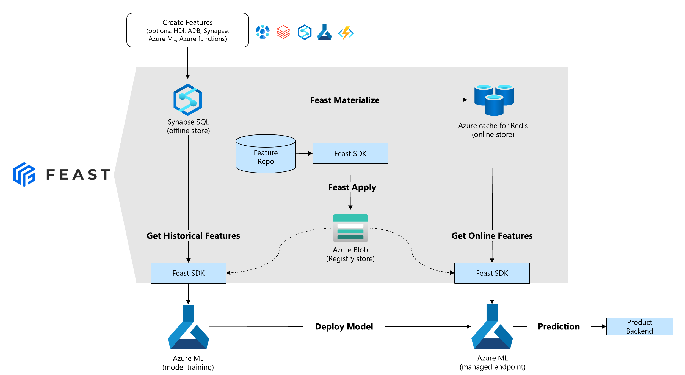
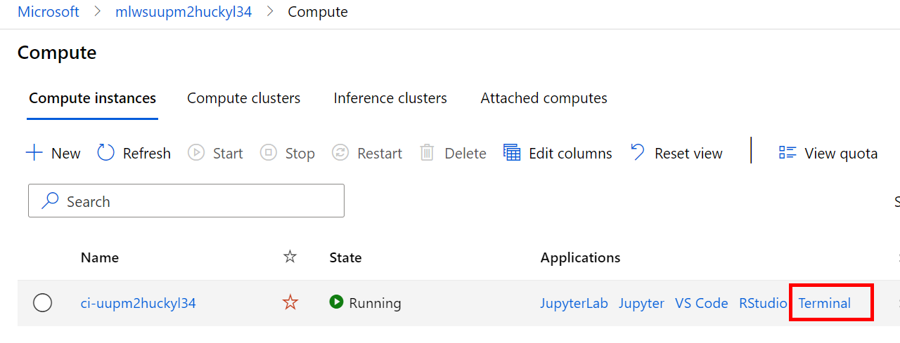

# Getting started with Feast on Azure

The objective of this tutorial is to build a model that predicts if a driver will complete a trip based on a number of features ingested into Feast. During this tutorial you will:

1. Deploy the infrastructure for a feature store (using an ARM template)
2. Register features into a central feature registry hosted on Blob Storage
3. Consume features from the feature store for training and inference

## Prerequisites

For this tutorial you will require:

1. An Azure subscription.
2. Working knowledge of Python and ML concepts.
3. Basic understanding of Azure Machine Learning - using notebooks, etc.

## 1. Deploy Infrastructure

We have created an ARM template that deploys and configures all the infrastructure required to run feast in Azure. This makes the set-up very simple - select the **Deploy to Azure** button below.

The only 2 required parameters during the set-up are:

- **Admin Password** for the the Dedicated SQL Pool being deployed.
- **Principal ID** this is to set the storage permissions for the feast registry store. You can find the value for this by opening **Cloud Shell** and run the following command:

```bash
# If you are using Azure portal CLI or Azure CLI 2.37.0 or above
az ad signed-in-user show --query id -o tsv

# If you are using Azure CLI below 2.37.0
az ad signed-in-user show --query objectId -o tsv
```

> You may want to first make sure your subscription has registered `Microsoft.Synapse`, `Microsoft.SQL`, `Microsoft.Network` and `Microsoft.Compute` providers before running the template below, as some of them may require explicit registration. If you are on a Free Subscription, you will not be able to deploy the workspace part of this tutorial.

[](https://portal.azure.com/#create/Microsoft.Template/uri/https%3A%2F%2Fraw.githubusercontent.com%2Ffeast-dev%2Ffeast%2Fmaster%2Fdocs%2Ftutorials%2Fazure%2Fdeployment%2Ffs_synapse_azuredeploy.json)



The ARM template will not only deploy the infrastructure but it will also:

- install feast with the azure provider on the compute instance
- set the Registry Blob path, Dedicated SQL Pool and Redis cache connection strings in the Azure ML default Keyvault.

> **☕ It can take up to 20 minutes for the Redis cache to be provisioned.**

## 2. Git clone this repo to your compute instance

In the [Azure Machine Learning Studio](https://ml.azure.com), navigate to the left-hand menu and select **Compute**. You should see your compute instance running, select **Terminal**



In the terminal you need to clone this GitHub repo:

```bash
git clone https://github.com/feast-dev/feast
```

### 3. Load feature values into Feature Store

In the Azure ML Studio, select *Notebooks* from the left-hand menu and then open the [Loading feature values into feature store notebook](./notebooks/part1-load-data.ipynb).Work through this notebook.

> __💁Ensure the Jupyter kernel is set to Python 3.8 - AzureML__


## 4. Register features in Feature store

In the Azure ML Studio, select *Notebooks* from the left-hand menu and then open the [register features into your feature registry notebook](notebooks/part2-register-features.ipynb). Work through this notebook.

> __💁Ensure the Jupyter kernel is set to Python 3.8 - AzureML__

## 5.Train and Deploy a model using the Feature Store

In the Azure ML Studio, select *Notebooks* from the left-hand menu and then open the [train and deploy a model using feast notebook](notebooks/part3-train-and-deploy-with-feast.ipynb). Work through this notebook.

> __💁Ensure the Jupyter kernel is set to Python 3.8 - AzureML__
>
> If problems are encountered during model training stage, create a new cell and rexecute `!pip install scikit-learn==0.22.1`. Upon completion, restart the Kernel and start over.

## 6. Running Feast Azure Tutorials locally without Azure workspace

* If you are on a free tier instance, you will not be able to deploy the azure deployment because the azure workspace requires VCPUs and the free trial subscription does not have a quota.
* The workaround is to remove the `Microsoft.MachineLearningServices/workspaces/computes` resource from `fs_synapse_azure_deploy.json` and setting up the environment locally.
    1. After deployment, find your `Azure SQL Pool` secrets by going to `Subscriptions-><Your Subscription>->Resource Group->Key Vault` and giving your account admin permissions to the keyvault. Retrieve the `FEAST-REGISTRY-PATH`, `FEAST-OFFLINE-STORE-CONN`, and `FEAST-ONLINE-STORE-CONN` secrets to use in your local environment.
    2. In your local environment, you will need to install the azure cli and login to the cli using `az login`.
    3. After everything is setup, you should be able to work through the first 2 tutorial notebooks without any errors (The 3rd notebook requires Azure workspace resources).