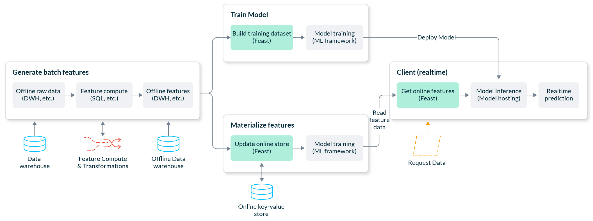

# Fraud detection on GCP

Throughout this tutorial, we’ll walk through the creation of a production-ready fraud prediction system. A prediction is made in real-time as the user makes the transaction, so we need to be able to generate a prediction at low latency.

## [Fraud Detection Example](https://github.com/feast-dev/feast-fraud-tutorial)

Our end-to-end example will perform the following workflows:

* Computing and backfilling feature data from raw data
* Building point-in-time correct training datasets from feature data and training a model
* Making online predictions from feature data

Here's a high-level picture of our system architecture on Google Cloud Platform (GCP):

|  [Run in Google Colab](https://colab.research.google.com/github/feast-dev/feast-fraud-tutorial/blob/master/notebooks/Fraud\_Detection\_Tutorial.ipynb) | [ View Source on Github](https://github.com/feast-dev/feast-fraud-tutorial/blob/main/notebooks/Fraud\_Detection\_Tutorial.ipynb) |
| ------------------------------------------------------------------------------------------------------------------------------------------------------------------------------------------------------ | ------------------------------------------------------------------------------------------------------------------------------------------------------------------------------- |
