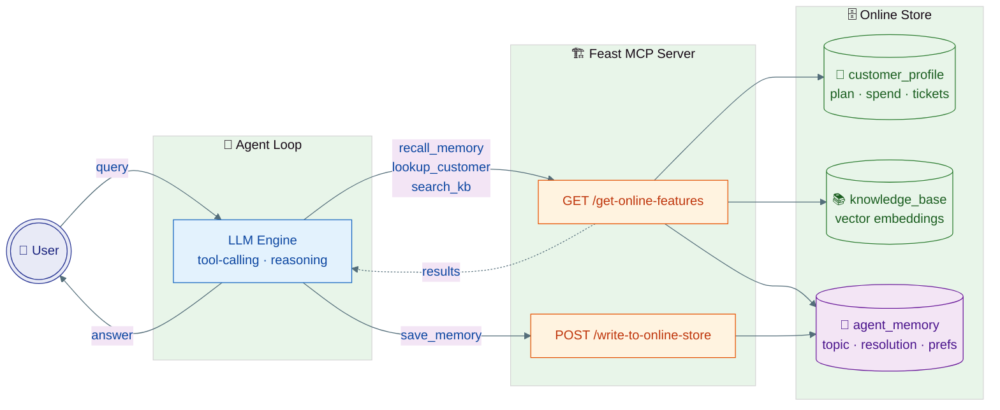
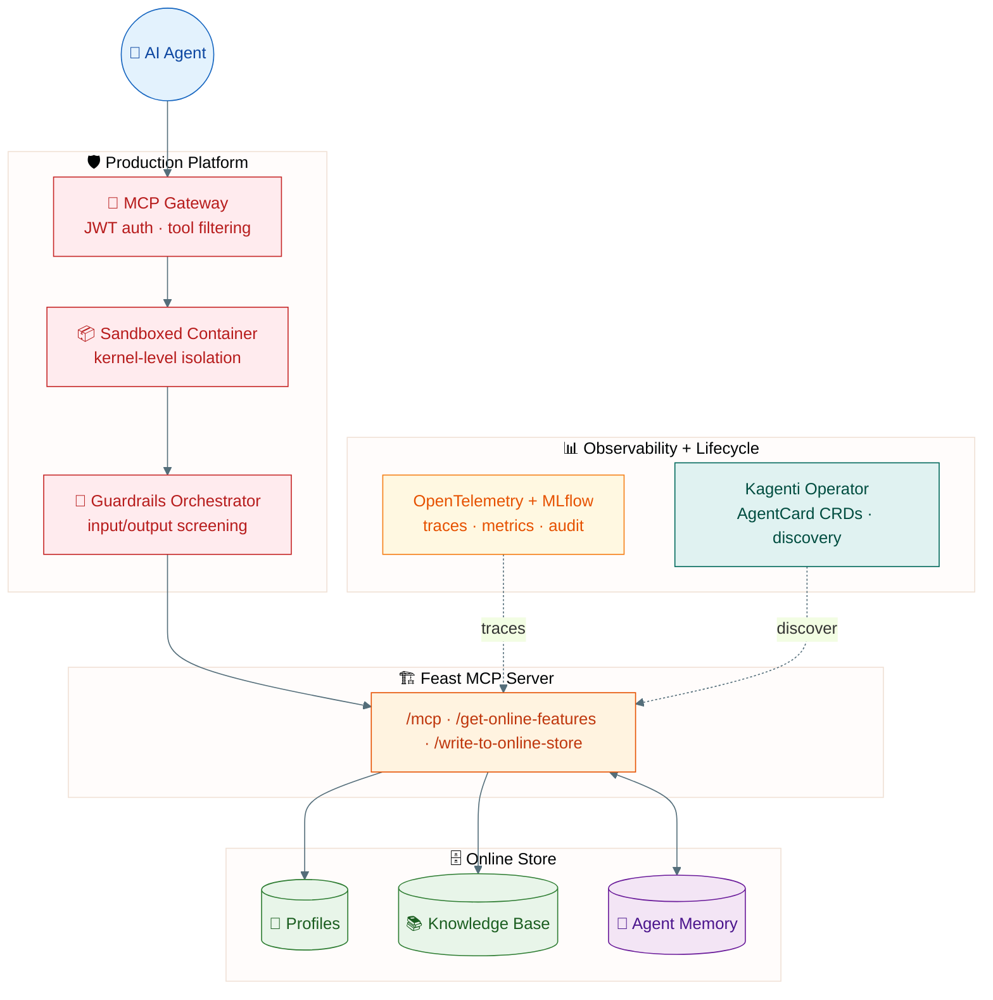

# Feast-Powered AI Agent Example

This example demonstrates an **AI agent with persistent memory** that uses **Feast as both a feature store and a context memory layer** through the **Model Context Protocol (MCP)**. This demo uses **Milvus** as the vector-capable online store, but Feast supports multiple vector backends -- including **Milvus, Elasticsearch, Qdrant, PGVector, and FAISS** -- swappable via configuration.

## Why Feast for Agents?

Agents need more than just access to data -- they need to **remember** what happened in prior interactions. Feast's online store is entity-keyed, low-latency, governed, and supports both reads and writes, making it a natural fit for agent context and memory.

| Capability | How Feast Provides It |
|---|---|
| **Structured context** | Entity-keyed feature retrieval (customer profiles, account data) |
| **Document search** | Vector similarity search via pluggable backends (Milvus, Elasticsearch, Qdrant, PGVector, FAISS) |
| **Persistent memory** | Agent writes interaction notes back via `write_to_online_store` |
| **Governance** | RBAC, audit trails, and feature-level permissions |
| **TTL management** | Declarative expiration on feature views (memory auto-expires) |
| **Offline analysis** | Memory is queryable offline like any other feature |

## Architecture



## Tools (backed by Feast)

The agent has four tools. Feast is both the **read path** (context) and the **write path** (memory):

| Tool | Direction | What it does | When the LLM calls it |
|---|---|---|---|
| `lookup_customer` | READ | Fetches customer profile features (plan, spend, tickets) | Questions about the customer's account |
| `search_knowledge_base` | READ | Retrieves support articles from the vector store | Questions needing product docs |
| `recall_memory` | READ | Reads past interaction context (last topic, open issues, preferences) | Start of every conversation |
| `save_memory` | WRITE | Persists notes about this interaction back to Feast | After resolving the question |

### Feast as Context Memory

The `agent_memory` feature view stores per-customer interaction state:

```python
agent_memory = FeatureView(
    name="agent_memory",
    entities=[customer],
    schema=[
        Field(name="last_topic", dtype=String),
        Field(name="last_resolution", dtype=String),
        Field(name="interaction_count", dtype=Int64),
        Field(name="preferences", dtype=String),
        Field(name="open_issue", dtype=String),
    ],
    ttl=timedelta(days=30),
)
```

This gives agents **persistent, governed, entity-keyed memory** that survives across sessions, is versioned, and lives under the same RBAC as every other feature -- unlike an ad-hoc Redis cache or an in-process dict.

## Prerequisites

- Python 3.10+
- Feast with MCP and Milvus support
- OpenAI API key (for live tool-calling; demo mode works without it)

## Quickstart

### One command

```bash
cd examples/agent_feature_store
./run_demo.sh

# Or with live LLM tool-calling:
OPENAI_API_KEY=sk-... ./run_demo.sh
```

The script installs dependencies, generates sample data, starts the Feast server, runs the agent, and cleans up on exit.

### Step by step

### 1. Install dependencies

```bash
pip install "feast[mcp,milvus]"
```

### 2. Generate sample data and apply the registry

```bash
cd examples/agent_feature_store
python setup_data.py
```

This creates:
- **3 customer profiles** with attributes like plan tier, spend, and satisfaction score
- **6 knowledge-base articles** with 384-dimensional vector embeddings
- **Empty agent memory scaffold** (populated as the agent runs)

### 3. Start the Feast MCP Feature Server

```bash
cd feature_repo
feast serve --host 0.0.0.0 --port 6566 --workers 1
```

### 4. Run the agent

In a new terminal:

```bash
# Without API key: runs in demo mode (simulated tool selection)
python agent.py
```

To run with a real LLM, set the API key and (optionally) the base URL:

```bash
# OpenAI
export OPENAI_API_KEY="sk-..."  #pragma: allowlist secret
python agent.py

# Ollama (free, local -- no API key needed)
ollama pull llama3.1:8b
export OPENAI_API_KEY="ollama"  #pragma: allowlist secret
export OPENAI_BASE_URL="http://localhost:11434/v1"
export LLM_MODEL="llama3.1:8b"
python agent.py

# Any OpenAI-compatible provider (Azure, vLLM, LiteLLM, etc.)
export OPENAI_API_KEY="your-key"  #pragma: allowlist secret
export OPENAI_BASE_URL="https://your-endpoint/v1"
export LLM_MODEL="your-model"
python agent.py
```

### Demo mode output

Without an API key, the agent simulates the decision-making process with memory:

```
=================================================================
  Scene 1: Enterprise customer (C1001) asks about SSO
  Customer: C1001  |  Query: "How do I set up SSO for my team?"
=================================================================
  [Demo mode] Simulating agent reasoning

  Round 1 | recall_memory(customer_id=C1001)
          -> No prior interactions found

  Round 1 | lookup_customer(customer_id=C1001)
          -> Alice Johnson | enterprise plan | $24,500 spend | 1 open tickets

  Round 1 | search_knowledge_base(query="How do I set up SSO for my team?...")
          -> Best match: "Configuring single sign-on (SSO)"

  Round 2 | Generating personalised response...

  Round 2 | save_memory(customer_id=C1001, topic="SSO setup")
          -> Memory saved for future conversations

  ─────────────────────────────────────────────────────────────
  Agent Response:
  ─────────────────────────────────────────────────────────────
  Hi Alice!
  Since you're on our Enterprise plan, SSO is available for your
  team. Go to Settings > Security > SSO and enter your Identity
  Provider metadata URL. We support SAML 2.0 and OIDC...

=================================================================
  Scene 4: C1001 returns -- does the agent remember Scene 1?
  Customer: C1001  |  Query: "I'm back about my SSO question from earlier."
=================================================================
  [Demo mode] Simulating agent reasoning

  Round 1 | recall_memory(customer_id=C1001)
          -> Previous topic: SSO setup
          -> Open issue: none
          -> Interaction count: 1

  Round 1 | lookup_customer(customer_id=C1001)
          -> Alice Johnson | enterprise plan | $24,500 spend | 1 open tickets

  Round 2 | Generating personalised response...

  Round 2 | save_memory(customer_id=C1001, topic="SSO setup")
          -> Memory saved for future conversations

  ─────────────────────────────────────────────────────────────
  Agent Response:
  ─────────────────────────────────────────────────────────────
  Welcome back, Alice! I can see from our records that we last
  discussed "SSO setup". How can I help you today?
```

Scene 4 demonstrates memory continuity -- the agent recalls the SSO conversation from Scene 1 without the customer re-explaining.

### Live mode output (with API key)

With an API key, the LLM autonomously decides which tools to use:

```
=================================================================
  Scene 1: Enterprise customer (C1001) asks about SSO
  Customer: C1001  |  Query: "How do I set up SSO for my team?"
=================================================================
  [Round 1] Tool call: recall_memory({'customer_id': 'C1001'})
  [Round 1] Tool call: lookup_customer({'customer_id': 'C1001'})
  [Round 1] Tool call: search_knowledge_base({'query': 'SSO setup'})
  [Round 2] Tool call: save_memory({'customer_id': 'C1001', 'topic': 'SSO setup', ...})
  Agent finished after 3 round(s)

  ─────────────────────────────────────────────────────────────
  Agent Response:
  ─────────────────────────────────────────────────────────────
  Hi Alice! Since you're on our Enterprise plan, SSO is available
  for your team. Go to Settings > Security > SSO and enter your
  Identity Provider metadata URL. We support SAML 2.0 and OIDC...
```

## How It Works

> **Why a raw loop?** This example builds the agent from scratch using the OpenAI tool-calling API to keep dependencies minimal and make every Feast call visible. In production, you would use a framework like LangChain/LangGraph, CrewAI, or AutoGen -- Feast's MCP endpoint lets any of them auto-discover the tools with zero custom wiring (see [MCP Integration](#mcp-integration) below).

### The Agent Loop (`agent.py`)

```python
for round in range(MAX_ROUNDS):
    # 1. Send messages + tools to LLM
    response = call_llm(messages, tools=[
        lookup_customer, search_knowledge_base,
        recall_memory, save_memory,
    ])

    # 2. If LLM says "stop" -> return the answer
    if response.finish_reason == "stop":
        return response.content

    # 3. Otherwise, execute the tool calls the LLM requested
    for tool_call in response.tool_calls:
        result = execute_tool(tool_call)  # reads/writes Feast
        messages.append(tool_result(result))

    # 4. Loop back — LLM sees tool results and decides next action
```

The LLM sees the tool definitions (JSON Schema) and decides:
- **Which tools to call** (can call zero, one, or multiple per round)
- **What arguments to pass** (e.g., which customer ID to look up)
- **When to write memory** (after resolving, record topic + resolution)
- **When to stop** (once it has enough information to answer)

### Feature Definitions (`feature_repo/features.py`)

- **`customer_profile`**: Structured data (name, plan, spend, tickets, satisfaction)
- **`knowledge_base`**: Support articles with 384-dim vector embeddings (Milvus in this demo; swappable to Elasticsearch, Qdrant, PGVector, or FAISS)
- **`agent_memory`**: Per-customer interaction history (last topic, resolution, preferences, open issues)

### MCP Integration

The Feast Feature Server exposes all endpoints as MCP tools at `http://localhost:6566/mcp`.
Any MCP-compatible framework can connect:

```python
# LangChain
from langchain_mcp_adapters.client import MultiServerMCPClient
async with MultiServerMCPClient(
    {"feast": {"url": "http://localhost:6566/mcp", "transport": "streamable_http"}}
) as client:
    tools = client.get_tools()
```

```json
// Claude Desktop / Cursor
{
  "mcpServers": {
    "feast": {
      "url": "http://localhost:6566/mcp",
      "transport": "streamable_http"
    }
  }
}
```

## Production Deployment

For production, Feast fits into a layered platform architecture:



This demo uses Milvus Lite (embedded). For production, swap to any supported vector-capable backend by updating `feature_store.yaml`:

- **Milvus cluster**: Deploy via the [Milvus Operator](https://milvus.io/docs/install_cluster-milvusoperator.md) and set `host`/`port` instead of `path`.
- **Elasticsearch**: Set `online_store: type: elasticsearch` with your cluster URL.
- **Qdrant**: Set `online_store: type: qdrant` with your Qdrant endpoint.
- **PGVector**: Set `online_store: type: postgres` with `pgvector_enabled: true`.
- **FAISS**: Set `online_store: type: faiss` for in-process vector search.
