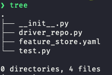

# Running Feast Java Server with Redis & calling with python (with registry in GCP)

For this tutorial, we setup Feast with Redis, using the Feast CLI to register and materialize features, and then retrieving via a Feast Java server deployed in Kubernetes via a gRPC call.


## First, let's setup a Redis cluster
1.  Start minikube (`minikube start`)
2.  Use helm to install a default Redis cluster
    ```bash
    helm repo add bitnami https://charts.bitnami.com/bitnami 
    helm repo update 
    helm install my-redis bitnami/redis
    ```
    
3. Port forward Redis so we can materialize features to it
    
    ```bash
    kubectl port-forward --namespace default svc/my-redis-master 6379:6379
    
    ```
4. Get your Redis password using the command (pasted below for convenience). We'll need this to tell Feast how to communicate with the cluster.

```bash
```

## Next, we setup a local Feast repo
1. Install Feast with Redis dependencies `pip install ‘feast[redis]’`    
2. Use a default Feast template to generate some dummy data. 
   ```bash
    feast init -t gcp
   ```
   Result:
   ```bash
   Creating a new Feast repository in /Users/dannychiao/definite_elf.
   ```
3. Now we need to modify this feature repo to communicate with a bucket in GCS and the Redis cluster we spun up. Inspecting this directory, we see:

    

    We need to modify the `feature_store.yaml`. Replace it with something like

     ```yaml
    project: feast_demo
    provider: gcp
    registry: gs://[YOUR BUCKET]/demo-repo/registry.db 
    online_store:
      type: "redis"
      connection_string: "localhost:6379,password=[INSERT REDIS_PASSWORD]"
    offline_store:
      type: file
    
    ```

## Now let's setup the k8s cluster
1.  Add the gcp-auth addon to mount GCP credentials:
    `minikube addons enable gcp-auth`
2.  Make a bucket in GCS (below we use `gs://feast-demo-staging`)
7.  Get the generated password from redis:
    
    ```bash
    export REDIS_PASSWORD=$(kubectl get secret --namespace default my-redis -o jsonpath="{.data.redis-password}" | base64 --decode)
    echo $REDIS_PASSWORD
    
    ```
    
8.  feast apply a repo (e.g. feast-demo repo) that is wired for Redis with a remote registry (e.g. gcs..)
    
    ```yaml
    project: feast_demo
    provider: gcp
    registry: gs://[YOUR BUCKET]/demo-repo/registry.db 
    online_store:
      type: "redis"
      connection_string: "localhost:6379,password=[INSERT REDIS_PASSWORD]"
    offline_store:
      type: file
    
    ```
9.  Materialize data to Redis:
    ```bash
    CURRENT_TIME=$(date -u +"%Y-%m-%dT%H:%M:%S")                                    
    feast materialize-incremental $CURRENT_TIME
    ```    
10.  Add Feast's Java feature server chart repo
    

```bash
helm repo add feast-charts https://feast-helm-charts.storage.googleapis.com
helm repo update

```

11.  Make application-override.yaml file (note: this is already made in the directory):

```yaml
feature-server:
    application-override.yaml:
        enabled: true
        feast:
            activeStore: online
            stores:
            - name: online
              type: REDIS
              config:
                host: my-redis-master
                port: 6379
                password: [INSERT REDIS_PASSWORD]
global:
  registry:
    path: gs://[YOUR BUCKET]/demo-repo/registry.db
  project: [INSERT PROJECT NAME]

```

1.  Install chart with override:`helm install feast-release feast-charts/feast --values application-override.yaml`
2.  (Optional): check logs of the server to make sure it’s working
    1.  `kubectl logs svc/feast-release-feature-server`
3.  Port forward to expose the grpc endpoint:
    1.  `kubectl port-forward svc/feast-release-feature-server 6566:6566`
4.  Make a gRPC call (via gRPC cli or python, or java / go client sdks):
    -   gRPC cli:
        
        ```bash
        grpc_cli call localhost:6566 GetOnlineFeatures '
        features {
          val: "driver_hourly_stats:conv_rate"
          val: "driver_hourly_stats:acc_rate"
        }
        entities {
          key: "driver_id"
          value {
            val {
              int64_val: 1001
            }
            val {
              int64_val: 1002
            }
          }
        }
        
        ```
        
        -   Response:
        
        ```bash
        connecting to localhost:6566
        metadata {
          feature_names {
            val: "driver_hourly_stats:conv_rate"
            val: "driver_hourly_stats:acc_rate"
          }
        }
        results {
          values {
            float_val: 0.812357187
          }
          values {
            float_val: 0.379484832
          }
          statuses: PRESENT
          statuses: PRESENT
          event_timestamps {
            seconds: 1631725200
          }
          event_timestamps {
            seconds: 1631725200
          }
        }
        results {
          values {
            float_val: 0.840873241
          }
          values {
            float_val: 0.151376978
          }
          statuses: PRESENT
          statuses: PRESENT
          event_timestamps {
            seconds: 1631725200
          }
          event_timestamps {
            seconds: 1631725200
          }
        }
        Rpc succeeded with OK status
        
        ```
        
    -   Python library to do grpc call: