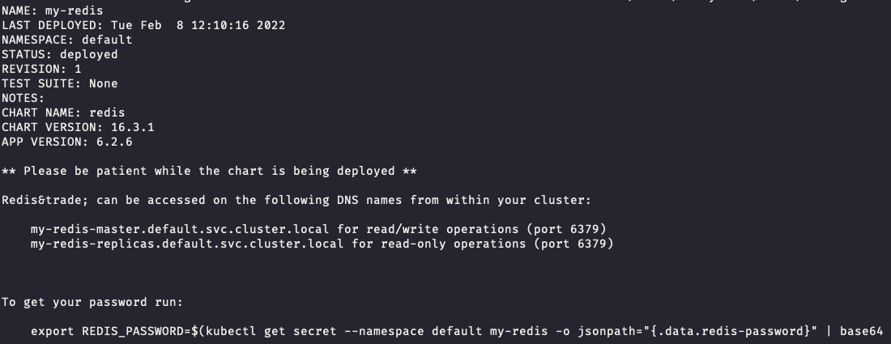

# Running Feast Java Server with Redis & calling with python (with registry in GCP)

For this tutorial, we setup Feast with Redis, using the Feast CLI to register and materialize features, and then retrieving via a Feast Java server deployed in Kubernetes via a gRPC call.
> :point_right: for tips on how to run and debug this locally without using Kubernetes, see [java/serving/README.md](https://github.com/feast-dev/feast/blob/master/java/serving/README.md)

## First, let's setup a Redis cluster
1.  Start minikube (`minikube start`)
2.  Use helm to install a default Redis cluster
    ```bash
    helm repo add bitnami https://charts.bitnami.com/bitnami 
    helm repo update 
    helm install my-redis bitnami/redis
    ```
    
3. Port forward Redis so we can materialize features to it
    
    ```bash
    kubectl port-forward --namespace default svc/my-redis-master 6379:6379
    ```
4. Get your Redis password using the command (pasted below for convenience). We'll need this to tell Feast how to communicate with the cluster.

   ```bash
    export REDIS_PASSWORD=$(kubectl get secret --namespace default my-redis -o jsonpath="{.data.redis-password}" | base64 --decode)
    echo $REDIS_PASSWORD
    ```

## Next, we setup a local Feast repo
1. Install Feast with Redis dependencies `pip install "feast[redis]"`
2. Make a bucket in GCS (or S3)
3. The feature repo is already setup here, so you just need to swap in your GCS bucket and Redis credentials.
    We need to modify the `feature_store.yaml`, which has two fields for you to replace:
     ```yaml
    registry: gs://[YOUR BUCKET]/demo-repo/registry.db
    project: feast_java_demo
    provider: gcp
    online_store:
      type: redis
      connection_string: localhost:6379,password=[YOUR PASSWORD]
    offline_store:
      type: file
    flags:
      alpha_features: true
      on_demand_transforms: true
    ```
4. Run `feast apply` to apply your local features to the remote registry
5. Materialize features to the online store:
    ```bash
    CURRENT_TIME=$(date -u +"%Y-%m-%dT%H:%M:%S")                                    
    feast materialize-incremental $CURRENT_TIME
    ``` 

## Now let's setup the Feast Server
1. Add the gcp-auth addon to mount GCP credentials:
    ```bash
   minikube addons enable gcp-auth
   ```
3. Add Feast's Java feature server chart repo
    ```bash
    helm repo add feast-charts https://feast-helm-charts.storage.googleapis.com
    helm repo update
    ```
4. Modify the application-override.yaml file to have your credentials + bucket location:
    ```yaml
    feature-server:
      application-override.yaml:
        enabled: true
        feast:
          activeStore: online
          stores:
            - name: online
              type: REDIS
              config:
                host: my-redis-master
                port: 6379
                password: [YOUR PASSWORD]
    global:
      registry:
        path: gs://[YOUR BUCKET]/demo-repo/registry.db
        cache_ttl_seconds: 60
      project: feast_java_demo
    ```
5. Install the Feast helm chart: `helm install feast-release feast-charts/feast --values application-override.yaml`
6. (Optional): check logs of the server to make sure it’s working
   ```bash
   kubectl logs svc/feast-release-feature-server
   ```
7. Port forward to expose the grpc endpoint:
   ```bash
   kubectl port-forward svc/feast-release-feature-server 6566:6566
   ```
8. Make a gRPC call:
    - Python example
      ```bash
        python test.py
      ```
    - gRPC cli:
        
        ```bash
        grpc_cli call localhost:6566 GetOnlineFeatures '
        features {
          val: "driver_hourly_stats:conv_rate"
          val: "driver_hourly_stats:acc_rate"
        }
        entities {
          key: "driver_id"
          value {
            val {
              int64_val: 1001
            }
            val {
              int64_val: 1002
            }
          }
        }'
        ```
        
        -   Response:
        
        ```bash
        connecting to localhost:6566
        metadata {
          feature_names {
            val: "driver_hourly_stats:conv_rate"
            val: "driver_hourly_stats:acc_rate"
          }
        }
        results {
          values {
            float_val: 0.812357187
          }
          values {
            float_val: 0.379484832
          }
          statuses: PRESENT
          statuses: PRESENT
          event_timestamps {
            seconds: 1631725200
          }
          event_timestamps {
            seconds: 1631725200
          }
        }
        results {
          values {
            float_val: 0.840873241
          }
          values {
            float_val: 0.151376978
          }
          statuses: PRESENT
          statuses: PRESENT
          event_timestamps {
            seconds: 1631725200
          }
          event_timestamps {
            seconds: 1631725200
          }
        }
        Rpc succeeded with OK status
        
        ```