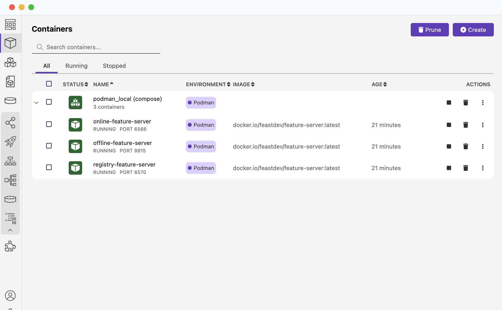

# Feast example using Podman and Podman Compose

This guide explains how to deploy Feast remote server components using Podman Compose locally and run an example using the client.

## Prerequisites

1. **Podman**: [Podman installation guide](https://podman.io/).
2. **Podman Compose**: [Podman Compose Installation guide](https://github.com/containers/podman-compose/tree/main?tab=readme-ov-file#installation]).
3. **Correct Python version environment**
4. **Feast CLI** 

## Setup

### 1. **Feast Project Setup**

- The project [feature_repo](feature_repo) already created using `feast init` command

### 2. **Run the Podman Compose File**

- Use the [docker-compose.yml](docker-compose.yml) file to install and run the Feast feature servers (online, offline, and registry) on podman. The docker-compose file uses the `quay.io/feastdev/feature-server:latest` image. Each respective service has specific port mappings and maps the volume from the  `./feature_repo` configuration.
- To start the feature servers, run the following command:

  ```bash
  podman-compose up -d
  ```

- This will launch the necessary containers for online, offline, and registry feature servers.

### 3. **Verify the Installation**

- Use the `podman ps` command to verify that the containers are running:

  ```bash
  podman ps
  ```

  Example output:

  ```
  CONTAINER ID  IMAGE                                     COMMAND               CREATED        STATUS        PORTS                   NAMES
  61442d6d6ef3  quay.io/feastdev/feature-server:latest  feast -c /feature...  2 minutes ago  Up 2 minutes  0.0.0.0:6566->6566/tcp  online-feature-server
  1274c21716a6  quay.io/feastdev/feature-server:latest  feast -c /feature...  2 minutes ago  Up 2 minutes  0.0.0.0:8815->8815/tcp  offline-feature-server
  4e38ca8c39db  quay.io/feastdev/feature-server:latest  feast -c /feature...  2 minutes ago  Up 2 minutes  0.0.0.0:6570->6570/tcp  registry-feature-server
  ```

- Alternatively, you can verify the running containers through **Podman Desktop**:
  

### 4. **Run Feast Apply**

- To apply the feature store definitions to the remote registry, run the following command:

  ```bash
  podman exec registry-feature-server feast -c /feature_repo apply
  ```

### 5. **Run Client Examples**

- The [client](client) folder contains example client-side configurations and code:
   - [feature_store.yaml](client/feature_repo/feature_store.yaml): Configuration for the feature store.
   - [test.py](client/feature_repo/test.py): Example Python script to interact with the Feast server.

### 6. **Cleanup**

- To stop and remove the running containers, run the following command:

  ```bash
  podman-compose down
  ```

- This will stop all the feature server containers and clean up the environment.
