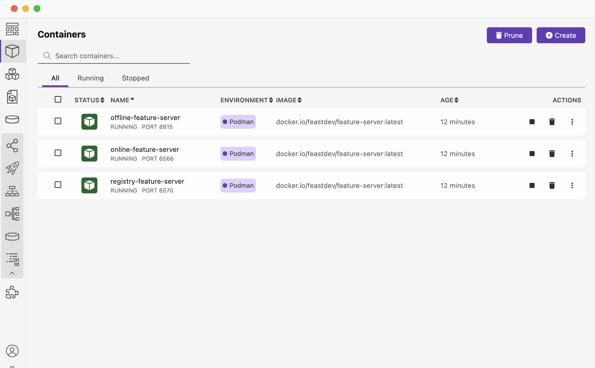

# Feast Installation with Podman
This example explains how to deploy Feast remote server components using Podman locally and run an example using the client.

## Prerequisites

1. Podman: [Podman installation guide](https://podman.io/)
2. Python 3.9+ environment
3. Feast CLI (latest version)

## Setup

1. **Step 1: Feast Project**
   - Feast [Project]() Created using the [quick start guide](https://docs.feast.dev/getting-started/quickstart).

2. **Run the installation script**
   - Created this [feast_podman.sh](feast_podman.sh) script, which provides a simple way to install and run Feast feature servers (online, offline, and registry) using Podman. It handles container creation, startup, and execution of Feast commands inside the containers.
   - Run the script to start the feature servers:
   ```bash
   ./feast_podman.sh
   ```
   The script will ask for confirmation with `Do you want to start feature-servers? (y/n):`. Enter `y`, and you will see the success message:
   ```yaml
   All feature-servers started.
   ```

3. **Verify the installation**
   - Use the `podman ps` command to verify:
   ```bash
   podman ps
   CONTAINER ID  IMAGE                                     COMMAND               CREATED        STATUS        PORTS                   NAMES
   61442d6d6ef3  docker.io/feastdev/feature-server:latest  feast -c /feature...  2 minutes ago  Up 2 minutes  0.0.0.0:6566->6566/tcp  online-feature-server
   1274c21716a6  docker.io/feastdev/feature-server:latest  feast -c /feature...  2 minutes ago  Up 2 minutes  0.0.0.0:8815->8815/tcp  offline-feature-server
   4e38ca8c39db  docker.io/feastdev/feature-server:latest  feast -c /feature...  2 minutes ago  Up 2 minutes  0.0.0.0:6570->6570/tcp  registry-feature-server
   ```
   - Or you can check using Podman Desktop:
     

4. **Run the Feast apply**
   - You need to perform Feast apply from the container. The same script will prompt `Apply 'feast apply' in the remote registry? (y/n)`. After you confirm, you will see the success message `'feast apply' command executed successfully in the remote registry.`

5. **Run the client examples**
   - The [client](client) folder contains the client-side [feature_store.yaml](client/feature_repo/feature_store.yaml) and [test.py](client/feature_repo/test.py).

6. **Cleanup**
   - You can clean up the created servers. The same script will prompt `Do you want to delete all the created feature-servers? (y/n):`. Enter `y` to clean up.
