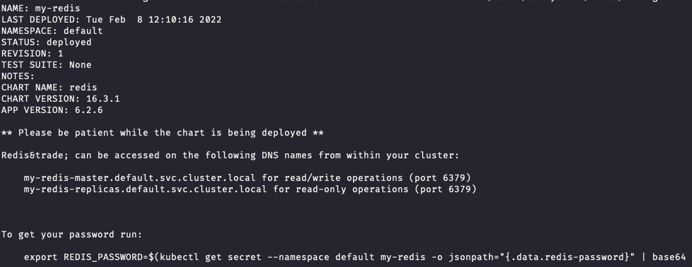

# Running Feast Python / Go Feature Server with Redis on Kubernetes 

For this tutorial, we set up Feast with Redis. 

We use the Feast CLI to register and materialize features from the current machine, and then retrieving via a 
Feast Python feature server deployed in Kubernetes

## First, let's set up a Redis cluster
1.  Start minikube (`minikube start`)
1.  Use helm to install a default Redis cluster
    ```bash
    helm repo add bitnami https://charts.bitnami.com/bitnami 
    helm repo update 
    helm install my-redis bitnami/redis
    ```
    
1. Port forward Redis so we can materialize features to it
    
    ```bash
    kubectl port-forward --namespace default svc/my-redis-master 6379:6379
    ```
1. Get your Redis password using the command (pasted below for convenience). We'll need this to tell Feast how to communicate with the cluster.

   ```bash
    export REDIS_PASSWORD=$(kubectl get secret --namespace default my-redis -o jsonpath="{.data.redis-password}" | base64 --decode)
    echo $REDIS_PASSWORD
    ```

## Then, let's set up a MinIO S3 store
Manifests have been taken from [Deploy Minio in your project](https://ai-on-openshift.io/tools-and-applications/minio/minio/#deploy-minio-in-your-project).

1. Deploy MinIO instance:
    ```
    kubectl apply -f minio-dev.yaml
    ```

1. Forward the UI port:
    ```console
    kubectl port-forward svc/minio-service 9090:9090
    ```
1. Login to (localhost:9090)[http://localhost:9090] as `minio`/`minio123` and create bucket called `feast-demo`.
1. Stop previous port forwarding and forward the API port instead:
    ```console
    kubectl port-forward svc/minio-service 9000:9000
    ```

## Next, we setup a local Feast repo
1. Install Feast with Redis dependencies `pip install "feast[redis,aws]"`
1. The feature repo is already setup here, so you just need to swap in your Redis credentials.
    We need to modify the `feature_store.yaml`, which has one field for you to replace:
    ```console
    sed "s/_REDIS_PASSWORD_/${REDIS_PASSWORD}/" feature_repo/feature_store.yaml.template > feature_repo/feature_store.yaml
    cat feature_repo/feature_store.yaml
    ```

    Example repo:
    ```yaml
    registry: s3://localhost:9000/feast-demo/registry.db
    project: feast_python_demo
    provider: local
    online_store:
      type: redis
      connection_string: localhost:6379,password=****
    offline_store:
      type: file
    entity_key_serialization_version: 3
    ```
1. To run `feast apply` from the current machine we need to define the AWS credentials to connect the MinIO S3 store, which
are defined in [minio.env](./minio.env):
    ```console
    source minio.env
    cd  feature_repo
    feast apply
    ```
1. Let's validate the setup by running some queries
    ```console
    feast entities list
    feast feature-views list
    ```
1. Materialize features to the online store:
    ```bash
    cd  feature_repo
    CURRENT_TIME=$(date -u +"%Y-%m-%dT%H:%M:%S")                                    
    feast materialize-incremental $CURRENT_TIME
    ``` 

## Now let's setup the Feast Server
1. Add Feast's Python feature server chart repo
    ```bash
    helm repo add feast-charts https://feast-helm-charts.storage.googleapis.com
    helm repo update
    ```
1. For this tutorial, we'll use a predefined configuration where we just needs to inject the Redis service password: 
    ```console
    sed "s/_REDIS_PASSWORD_/$REDIS_PASSWORD/" online_feature_store.yaml.template > online_feature_store.yaml
    cat online_feature_store.yaml
    ```
    As you see, the connection points to `my-redis-master:6379` instead of `localhost:6379`.

1. Install the Feast helm chart: 
    ```console
    helm upgrade --install feast-online feast-charts/feast-feature-server \
    --set fullnameOverride=online-server --set feast_mode=online \
    --set feature_store_yaml_base64=$(base64 -i 'online_feature_store.yaml')
    ```
1. Patch the deployment to include MinIO settings:
    ```console
    kubectl patch deployment online-server --type='json' -p='[
      {
        "op": "add",
        "path": "/spec/template/spec/containers/0/env/-",
        "value": {
          "name": "AWS_ACCESS_KEY_ID",
          "value": "minio"
        }
      },
      {
        "op": "add",
        "path": "/spec/template/spec/containers/0/env/-",
        "value": {
          "name": "AWS_SECRET_ACCESS_KEY",
          "value": "minio123"
        }
      },
      {
        "op": "add",
        "path": "/spec/template/spec/containers/0/env/-",
        "value": {
          "name": "AWS_DEFAULT_REGION",
          "value": "default"
        }
      },
      {
        "op": "add",
        "path": "/spec/template/spec/containers/0/env/-",
        "value": {
          "name": "FEAST_S3_ENDPOINT_URL",
          "value": "http://minio-service:9000"
        }
      }
    ]'
    kubectl wait --for=condition=available deployment/online-server --timeout=2m
    ```
1. (Optional): check logs of the server to make sure it's working
   ```bash
   kubectl logs svc/online-server
   ```
1. Port forward to expose the grpc endpoint:
   ```bash
   kubectl port-forward svc/online-server 6566:80
   ```
1. Run test fetches for online features:8. 
      ```bash
      source minio.env
      cd test
      python test_python_fetch.py
      ```

      Output example:
      ```console
      --- Online features with SDK ---
      WARNING:root:_list_feature_views will make breaking changes. Please use _list_batch_feature_views instead. _list_feature_views will behave like _list_all_feature_views in the future.
      conv_rate  :  [0.6799587607383728, 0.9761165976524353]
      driver_id  :  [1001, 1002]

      --- Online features with HTTP endpoint ---
      conv_rate  :  [0.67995876 0.9761166 ]
      driver_id  :  [1001 1002]      
      ```