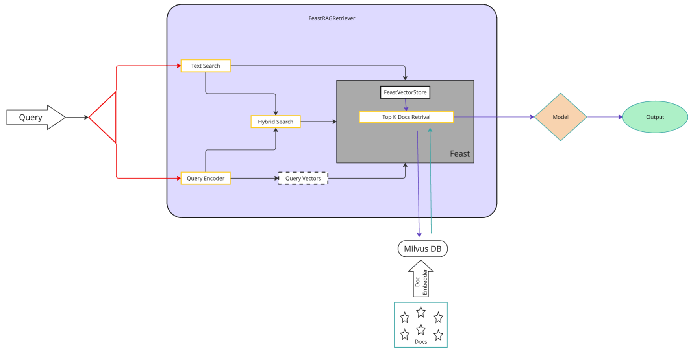

# End-to-end RAG Fine Tuning example using Feast and Milvus.

## Introduction
This example notebook provides a step-by-step demonstration of building and using a RAG system with Feast and the custom FeastRagRetriever. The notebook walks through:

1. Data Preparation
   - Loads a subset of the [Wikipedia DPR dataset](https://huggingface.co/datasets/facebook/wiki_dpr) (1% of training data)
   - Implements text chunking with configurable chunk size and overlap
   - Processes text into manageable passages with unique IDs

2. Embedding Generation
   - Uses `all-MiniLM-L6-v2` sentence transformer model
   - Generates 384-dimensional embeddings for text passages
   - Demonstrates batch processing with GPU support

3. Feature Store Setup
   - Creates a Parquet file as the historical data source
   - Configures Feast with the feature repository
   - Demonstrates writing embeddings from data source to Milvus online store which can be used for model training later

4. RAG System Implementation
   - **Embedding Model**: `all-MiniLM-L6-v2` (configurable)
   - **Generator Model**: `granite-3.2-2b-instruct` (configurable)
   - **Vector Store**: Custom implementation with Feast integration
   - **Retriever**: Custom implementation extending HuggingFace's RagRetriever

5. Query Demonstration
   - Perform inference with retrieved context

## Requirements
 - A Kubernetes cluster with:
   - GPU nodes available (for model inference)
   - At least 200GB of storage
   - A standalone Milvus deployment. See example [here](https://github.com/milvus-io/milvus-helm/tree/master/charts/milvus).

## Running the example
Clone this repository: https://github.com/feast-dev/feast.git
Navigate to the examples/rag-retriever directory. Here you will find the following files: 

* **feature_repo/feature_store.yaml**
  This is the core configuration file for the RAG project's feature store, configuring a Milvus online store on a local provider. 
  * In order to configure Milvus you should:
     - Update `feature_store.yaml` with your Milvus connection details:
       - host
       - port (default: 19530)
       - credentials (if required)

* **__feature_repo/ragproject_repo.py__**
  This is the Feast feature repository configuration that defines the schema and data source for Wikipedia passage embeddings. 

* **__rag_feast.ipynb__**
  This is a notebook demonstrating the implementation of a RAG system using Feast. The notebook provides:

  - A complete end-to-end example of building a RAG system with:
    - Data preparation using the Wiki DPR dataset
    - Text chunking and preprocessing
    - Vector embedding generation using sentence-transformers
    - Integration with Milvus vector store
    - Inference utilising a custom RagRetriever: FeastRagRetriever
  - Uses `all-MiniLM-L6-v2` for generating embeddings
  - Implements `granite-3.2-2b-instruct` as the generator model

Open `rag_feast.ipynb` and follow the steps in the notebook to run the example.

## FeastRagRetriver Low Level Design

## Helpful Information
- Ensure your Milvus instance is properly configured and running
- Vector dimensions and similarity metrics can be adjusted in the feature store configuration
- The example uses Wikipedia data, but the system can be adapted for other datasets
