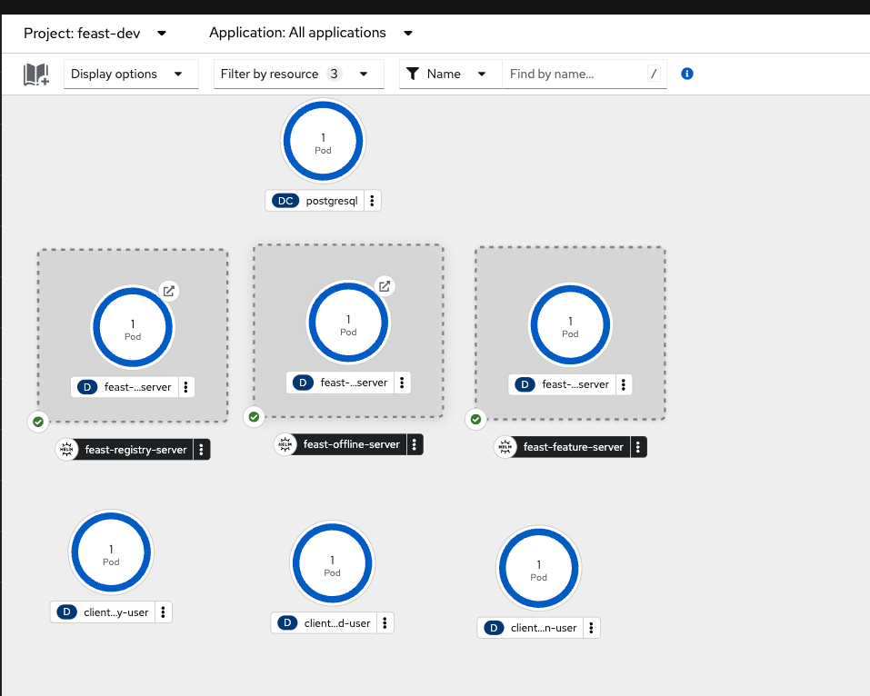

# Feast Deployment with RBAC

## Demo Summary
This demo showcases how to enable Role-Based Access Control (RBAC) for Feast using Kubernetes or [OIDC](https://openid.net/developers/how-connect-works/) Authentication type. 
The demo steps involve deploying server components (registry, offline, online) and client examples within a Kubernetes environment. 
The goal is to ensure secure access control based on user roles and permissions. For understanding the Feast RBAC framework 
Please read these reference documents.
- [RBAC Architecture](https://docs.feast.dev/v/master/getting-started/architecture/rbac) 
- [RBAC Permission](https://docs.feast.dev/v/master/getting-started/concepts/permission).
- [RBAC Authorization Manager](https://docs.feast.dev/v/master/getting-started/components/authz_manager)

## Tools and Projects
- Kubernetes
- Feast
- PostgreSQL Database
- [Keycloak](https://www.keycloak.org) (if OIDC)

## Application Environment

This demo contains the following components:

1. Feast Remote Server components (online, offline, registry).
2. Feast Remote Client RBAC example.
3. Yaml Configuration and installation related scripts files.
 


## Setup Instructions

The application works with Kubernetes or OpenShift and the instructions assume that you are using a Kubernetes or OpenShift cluster.

### Prerequisites

1. Kubernetes Cluster and Kubernetes CLI (kubectl).
2. Helm: Ensure you have Helm installed for deploying the Feast components. 
3. Python environment.
4. Feast CLI latest version.

## 1. Prerequisites Step

 - **Step 1 : Create the Feast project with PostgreSQL.**

    * Install the PostgreSQL on a Kubernetes cluster if you are using OpenShift you can install using [OpenShift Template](https://github.com/RHEcosystemAppEng/feast-workshop-team-share/tree/main/feast_postgres#1-install-postgresql-on-openshift-using-openshift-template)
    * Port Forward the PostgreSQL Database to your local machine. Since we are setting up the Feast project locally using the Feast CLI, we need to port forward PostgreSQL:
       ``` kubectl port-forward svc/postgresql 5432:5432```
    *  Create a feature repository/project using the cli with PostgreSQL. Please see the instructions for more details [here](https://docs.feast.dev/reference/offline-stores/postgres#getting-started).
       For this (local) example setup, we create a project with name server using these settings for  the [feature_store.yaml](server/feature_repo/feature_store.yaml).
    
## 2. Authorization Setup

### A. Kubernetes Authorization
- **Step 1: Create Remote configuration Files**
    -  Set the auth type to `kubernetes` in the respective `feature_store` files

         ```yaml
                auth:
                   type: kubernetes
          ``` 
    - For each server, feature store YAML files can be created for example like below:

        **Registry Server:**  [feature_store_registry.yaml](server/k8s/feature_store_registry.yaml)
        
        **Offline Server :** [feature_store_offline.yaml](server/k8s/feature_store_offline.yaml)
        
        **Online Server :** [feature_store_online.yaml](server/k8s/feature_store_online.yaml)

- **Step 2: Deploy the Server Components**
  - Run the installation script. The setup script will deploy the server components based on the user's confirmation, enter `k8s` for kubernetes authentication deployment. The script will deploy all the components with the namespace `feast-dev`.

    ```sh
    ./install_feast.sh
    ```

### B. OIDC Authorization
- **Step 1: Setup Keycloak** 
    - See the documentation [here](https://www.keycloak.org/getting-started/getting-started-kube) and install Keycloak.
    - Create a new realm with the name `feast-rbac` from the admin console.
    - Under the `feast-rbac` realm, create a new client with the name `feast-client`
    - Generate the secret for the `feast-client`.
- **Step 2: Create the Server Feature Store Files**
    -  Set the auth type to `oidc` in the respective `feature_store` files

         ```yaml
          auth:
            type: oidc
            client_id: _CLIENT_ID__
            auth_discovery_url: _OIDC_SERVER_URL_/realms/feast-rbac/.well-known/openid-configuration
        ``` 
    - For each server the feature store YAML files can be created for example like below:

      **Registry Server:**  [feature_store_registry.yaml](server/oidc/feature_store_registry.yaml)

      **Offline Server :** [feature_store_offline.yaml](server/oidc/feature_store_offline.yaml)

      **Online Server :** [feature_store_online.yaml](server/oidc/feature_store_online.yaml)

- **Step 3: Deploy the Server Components**
  - Run the installation script. Enter `oidc` for the Keycloak authentication deployment. The script will deploy all of the components with the namespace `feast-dev`.

     ```sh
     ./install_feast.sh
     ```

## 3. Client Setup

### A. Kubernetes Authorization
- **Step 1: Create the Client Feature Store YAML**
    - Set up the client feature store with remote connection details for the registry, online, and offline store with auth type `kuberentes` . See the client remote setting example here: [feature_store.yaml](client/k8s/feature_repo/feature_store.yaml) 
- **Step 2: Deploy the Client Examples**
    - As an example, we created 3 different users: 1. [admin_user](client/k8s/admin_user_resources.yaml), 2. [readonly_user](client/k8s/readonly_user_resources.yaml) and 3. [unauthorized_user](client/k8s/unauthorized_user_resources.yaml) .
    - Each user is assigned their own service account and roles, as shown in the table below.
     #####  Roles and Permissions for Examples (Admin and User)
    | **User**        | **Service Account**        | **Roles**        | **Permission**           | **Feast Resources**                                                                                                                                                           | **Actions**                                                                               |
    |-----------------|----------------------------|------------------|--------------------------|-------------------------------------------------------------------------------------------------------------------------------------------------------------------------------|-------------------------------------------------------------------------------------------|
    | admin           | feast-admin-sa             | feast-admin-role | feast_admin_permission   | FeatureView, OnDemandFeatureView, BatchFeatureView, StreamFeatureView, , SortedFeatureView, Entity, FeatureService, DataSource, ValidationReference, SavedDataset, Permission | CREATE, DESCRIBE, UPDATE, DELETE, READ_ONLINE, READY_OFFLINE, WRITE_ONLINE, WRITE_OFFLINE |
    | user            | feast-user-sa              | feast-user-role  | feast_user_permission    | FeatureView, OnDemandFeatureView, BatchFeatureView, StreamFeatureView, , SortedFeatureView, Entity, FeatureService, DataSource, ValidationReference, SavedDataset, Permission | READ, READ_OFFLINE, READ_ONLINE                                                           |
    |unauthorized-user| feast-unauthorized-user-sa |                  |
    - To deploy the client confirm `Apply client creation examples` `Y`
    - The Deployment of the overall setup looks like :

    
  
### B. OIDC Authorization
- **Step 1: Create the Client Feature Store YAML**
    - Set up the client feature store with the remote connection details for the registry, online, and offline store.
    - Set the `Auth type` to `oidc`
    - update the client secret in client side `feature_store.yaml` or if required any other settings as show below. 
     ```
      auth_discovery_url: https://keycloak-feast-dev.apps.com/realms/feast-rbac/.well-known/openid-configuration
      client_id: feast-client
      client_secret: update-this-value
      username: ${FEAST_USERNAME}
      password: ${FEAST_PASSWORD}
     ```
    - See the client remote setting example here: [feature_store.yaml](client/oidc/feature_repo/feature_store.yaml)
- **Step 2: Create the Roles and Users**
     - Under the `feast-client` create the two roles `feast-admin-role` and `feast-user-role`
     - Under the `feast-rbac` realm, create 3 different users: `admin-user`, `readonly-user`, and `unauthorized-user`. Assign the password `feast` to each user.
     - Map the roles to users: select the `admin-user`, go to `Role mapping`, and assign the `feast-admin-role`. Select the `readonly-user` and assign the `feast-user-role`. For the `unauthorized-user`, do not assign any roles.
- **Step 3: Deploy the Client Examples**
    - For OIDC, similar to the k8s examples, create different deployments and add the username and password as environment variables: 1. [admin_user](client/oidc/admin_user_resources.yaml), 2. [readonly_user](client/oidc/readonly_user_resources.yaml) and 3. [unauthorized_user](client/oidc/unauthorized_user_resources.yaml) .
    - To deploy the client confirm `Apply client creation examples` `Y`
 
## 4. Permissions Management
- **Step 1: Apply the Permissions**
    - See the code example in [permissions_apply.py](server/feature_repo/permissions_apply.py) for applying the permissions for both Kubernetes and OIDC setup.
    - The `install_feast.sh` has the option to apply permission from the pod with the user's confirmation `Do you want to copy files and execute 'feast apply in the pod? (y/n)`.
- **Step 2: Validate the Permissions**
    - use the Feast cli to validate the permissions with the command `feast permissions list` for more details use `feast permissions list -v`. Additionally, there are other commands such as:
      `feast permissions check / describe / list-roles`
## 5. Validating the Permissions/RBAC results
- **Run the Examples**
    - As outlined in the [test.py](client/k8s/feature_repo/test.py) script, the example attempts to fetch Historical Features, perform Materialization, fetch Online Features, and push to the online/offline store based on user roles.
      - The `admin-user` can perform all actions on all objects.
      - The `readonly-user` can only read or query all objects.
      - `unauthorized user` should not able to read or write any resources as no role is defined for this user.
   - From each user's pod run the example `python feature_repo/test.py`

## 6. Local Testing and Cleanup
- **Local Testing**
    - For local testing, port forward the services PostgreSQL Service and Feast Servers with the commands below:
      ```
      kubectl port-forward svc/postgresql 5432:5432
      kubectl port-forward svc/feast-offline-server-feast-feature-server 8815:80
      kubectl port-forward svc/feast-registry-server-feast-feature-server 6570:80
      kubectl port-forward svc/feast-feature-server 6566:80 
      ```
    - When testing in Kubernetes, users can set the environment variable `LOCAL_K8S_TOKEN` in each example. The token can be obtained from the service account.
- **Cleanup**
    - Run the command 
    - ```./cleanup_feast.sh```