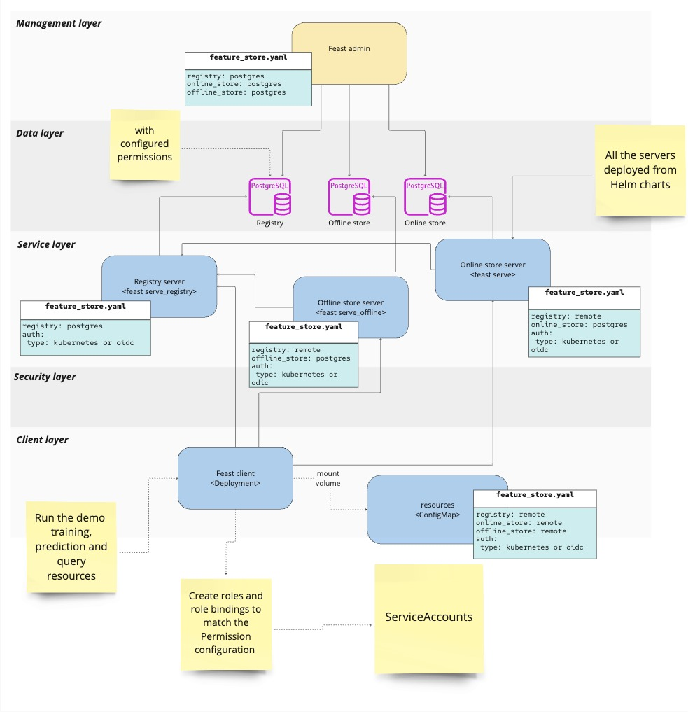

# Feast Deployment with RBAC

## Demo Summary
This demo showcases how to enable Role-Based Access Control (RBAC) for Feast using Kubernetes or OIDC Authentication type. 
The demo steps involve deploying server components (registry, offline, online) and client examples within a Kubernetes environment. 
The goal is to ensure secure access control based on user roles and permissions. For understanding the Feast RBAC framework 
Please read these reference documents.
- [RBAC Architecture](https://docs.feast.dev/v/master/getting-started/architecture/rbac) 
- [RBAC Permission](https://docs.feast.dev/v/master/getting-started/concepts/permission).
- [RBAC Authorization Manager](https://docs.feast.dev/v/master/getting-started/components/authz_manager)

## Tools and Projects
- Kubernetes
- Feast
- PostgreSQL Database
- Keycloak(if oidc)

## Application Environment

This demo contains the following components:

1. Feast Remote Server components (online, offline, registry).
2. Feast Remote Client RBAC example.
3. Yaml Configuration and installation related scripts files.
 


## Setup Instructions

The application works under OpenShift or Kubernetes with the following instructions assume that you are using a OpenShift or Kubernetes cluster.

### Prerequisites

1. Kubernetes Cluster and Kubernetes CLI (kubectl).
2. Helm: Ensure you have Helm installed for deploying the Feast components. 
3. Python environment.
4. Feast CLI latest version.

## 1. Prerequisites Step

 - **Step 1 : Create the Feast project with PostgreSQL.**

    * Install the PostgreSQL on a Kubernetes cluster if you are using OpenShift you can install using [OpenShift Template](https://github.com/RHEcosystemAppEng/feast-workshop-team-share/tree/main/feast_postgres#1-install-postgresql-on-openshift-using-openshift-template)
    * Port Forward PostgreSQL Database to your local machine. Since we are setting up the Feast project locally using the Feast CLI, so for local connection required port forward PostgreSQL:
       ``` kubectl port-forward svc/postgresql 5432:5432```
    *  Create a feature repository/project using cli with PostgreSQL. Please see the instruction for more details [here](https://docs.feast.dev/reference/offline-stores/postgres#getting-started).
       For this example (local) setup, we create project with name [server](server) using these settings for [feature_store.yaml](server/feature_repo/feature_store.yaml).
    
## 2. Authorization Setup

### A. Kubernetes Authorization
- **Step 1: Create Remote configuration Files**
    -  Set auth type `kubernetes` in the respective `feature_store` files

         ```yaml
                auth:
                   type: kubernetes
          ``` 
    - Feature store YAML files for each server, can be created for example like below server.

        **Registry Server:**  [feature_store_registry.yaml](server/k8s/feature_store_registry.yaml)
        
        **Offline Server :** [feature_store_offline.yaml](server/k8s/feature_store_offline.yaml)
        
        **Online Server :** [feature_store_online.yaml](server/k8s/feature_store_online.yaml)

- **Step 2: Deploy Server Components**
  - Run the installation script. The setup script will deploy the server components based on user confirmation, type `k8s` for kubernetes authentication deployment. The script will deploy all the components with the namespace name `feast-dev`.

    ```sh
    ./install_feast.sh
    ```

### B. OIDC Authorization
- **Step 1: Setup the keycloak see the documentation [here](https://www.keycloak.org/getting-started/getting-started-kube)**
- **Step 2: Create Server Feature Store Files**
    -  Set auth type `oidc` in the respective `feature_store` files

         ```yaml
            auth:
            type: oidc
            client_id: _CLIENT_ID__
            client_secret: _CLIENT_SECRET__
            realm: _REALM__  
            auth_discovery_url: _OIDC_SERVER_URL_/realms/master/.well-known/openid-configuration
        ``` 
    - Feature store YAML files for each server, can be created for example like below server.

      **Registry Server:**  [feature_store_registry.yaml](server/oidc/feature_store_registry.yaml)

      **Offline Server :** [feature_store_offline.yaml](server/oidc/feature_store_offline.yaml)

      **Online Server :** [feature_store_online.yaml](server/oidc/feature_store_online.yaml)

- **Step 3: Deploy Server Components**
  - Run the installation script. Type `oidc` for keycloak authentication deployment. The script will deploy all the components with the namespace name `feast-dev`.

     ```sh
     ./install_feast.sh
     ```

## 3. Client Setup

### A. Kubernetes Authorization
- **Step 1: Create Client Feature Store YAML**
    - Set up the client feature store with remote connection details for the registry, online, and offline store with auth type `kuberentes` .See the client remote setting example here: [feature_store.yaml](client/k8s/feature_repo/feature_store.yaml) 
- **Step 2: Deploy Client Examples**
    - As an examples, we created different users: 1. [admin_user](client/k8s/admin_user_resources.yaml), 2. [readonly_user](client/k8s/readonly_user_resources.yaml) and 3. [unauthorized_user](client/k8s/unauthorized_user_resources.yaml) .
    - Each user assinged own service account, roles, for example as shown in below table.
     #####  Roles and Permissions for Examples (Admin and User)
    | **User**        | **Service Account**        | **Roles**        | **Permission**           | **Feast Resources**                                                                                                                                      | **Actions**                                                                            |
    |-----------------|----------------------------|------------------|--------------------------|----------------------------------------------------------------------------------------------------------------------------------------------------------|----------------------------------------------------------------------------------------|
    | admin           | feast-admin-sa             | feast-admin-role | feast_admin_permission   | FeatureView, OnDemandFeatureView, BatchFeatureView, StreamFeatureView, Entity, FeatureService, DataSource, ValidationReference, SavedDataset, Permission | CREATE, READ, UPDATE, DELETE, QUERY_ONLINE, QUERY_OFFLINE, WRITE_ONLINE, WRITE_OFFLINE |
    | user            | feast-user-sa              | feast-user-role  | feast_user_permission    | FeatureView, OnDemandFeatureView, BatchFeatureView, StreamFeatureView, Entity, FeatureService, DataSource, ValidationReference, SavedDataset, Permission | READ, QUERY_OFFLINE, QUERY_ONLINE                                                      |
    |unauthorized-user| feast-unauthorized-user-sa |                  |
    - To deploy the client confirm `Apply client creation examples` `Y`
    - The Deployment of the overall setup looks like :

    
  
### B. OIDC Authorization
- **Step 1: Create Client Feature Store YAML**
    - Set up the client feature store with remote connection details for the registry, online, and offline store.
    - set the `Auth type` to `oidc`  
    - See the client remote setting example here: [feature_store.yaml](client/oidc/feature_repo/feature_store.yaml)
- **Step 2: Deploy Client Examples**
    - For OIDC same like k8s examples created different users: 1. [admin_user](client/oidc/admin_user_resources.yaml), 2. [readonly_user](client/oidc/readonly_user_resources.yaml) and 3. [unauthorized_user](client/oidc/unauthorized_user_resources.yaml) .
    - Create users, roles, and client in keycloak role for example `feast-admin-role` for user `admin-user` and `feast-user-role` for `readonly-user`
 
## 4. Permissions Management
- **Step 1: Apply Permissions**
    - See the code example in [permissions_apply.py](server/feature_repo/permissions_apply.py) for applying permissions for both Kubernetes and OIDC setups.
    - The `install_feast.sh` have option to apply permission from the pod with user confirmation `Do you want to copy files and execute 'feast apply in the pod? (y/n)`.
- **Step 2: Validate Permissions**
    - use feast cli to validate the permissions as command `feast permissions list` for more details use `feast permissions list -v` also other command like 
      `feast permissions check / describe / list-roles`
## 5. Validating permissions/rbac results.
- **Run the Examples**
    - As in the [test.py](client/k8s/feature_repo/test.py), the try example attempts to fetch Historical Features, perform Materialize Incremental, fetch Online Features, and push to online/offline storage based on user roles.
      - The `admin-user` can perform all actions on all objects.
      - The `readonly-user` can only read or query on all objects.
      - `unauthorized user` should not able to read or write any resources as there no role define for this user.
   - From each user's pod run the example `python feature_repo/test.py`

## 6. Local Testing and Cleanup
- **Local Testing**
    - For local testing, port forward the services PostgreSQL Service and Feast Servers with the commands below:
      ```
      kubectl port-forward svc/postgresql 5432:5432
      kubectl port-forward svc/feast-offline-server-feast-feature-server 8815:80
      kubectl port-forward svc/feast-registry-server-feast-feature-server 6570:80
      kubectl port-forward svc/feast-feature-server 6566:80 
      ```
    - For in testing for Kubernetes user can set the environment variable LOCAL_K8S_TOKEN in each example. The token can be obtained from the service account.
- **Cleanup**
    - Run the command 
    - ```./cleanup_feast.sh```