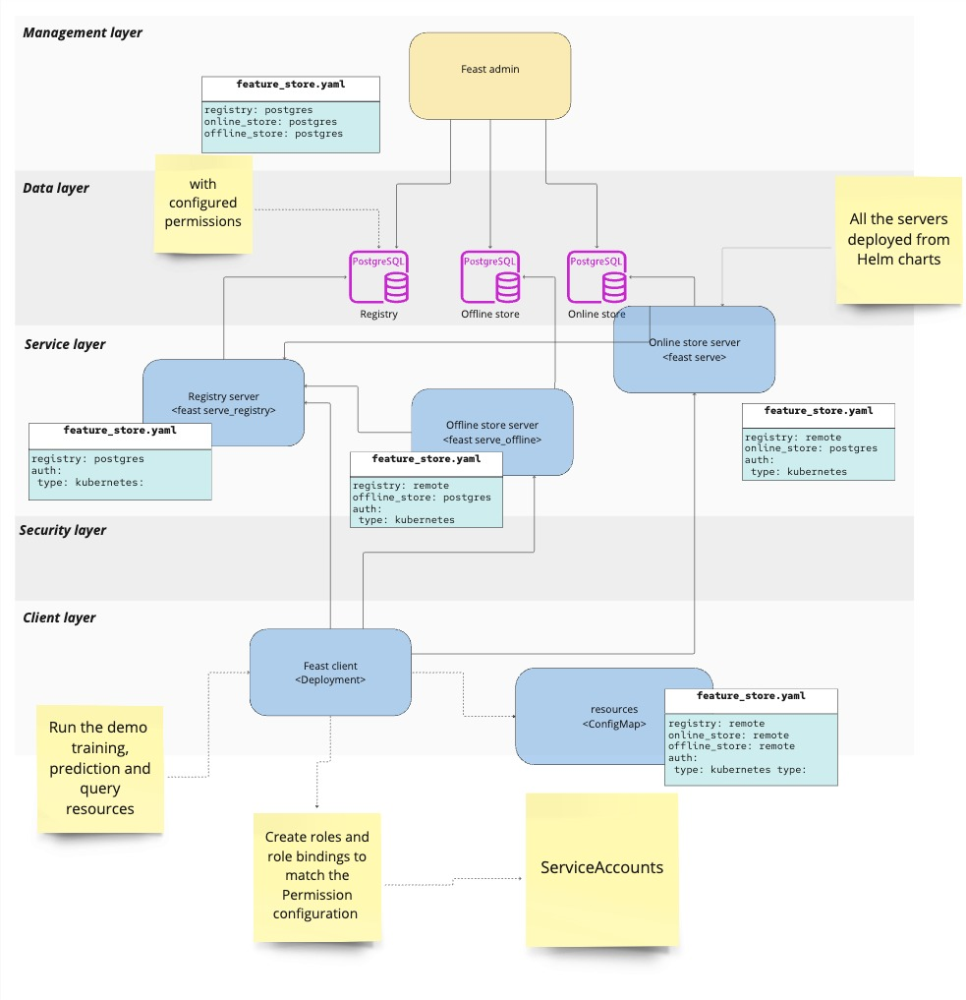
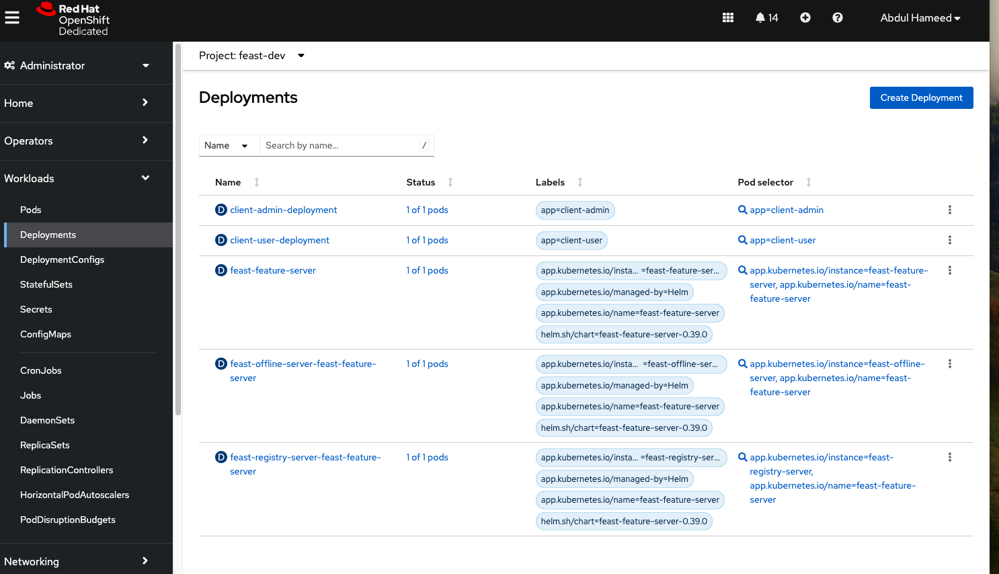
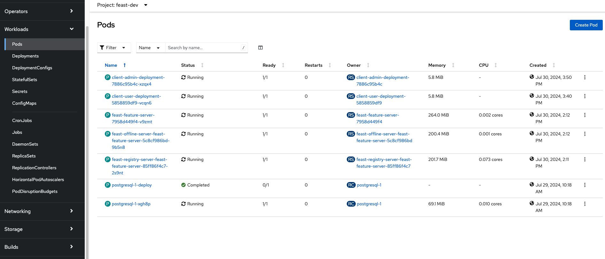
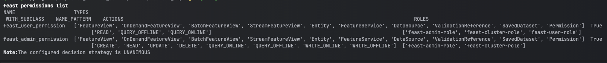
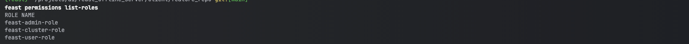
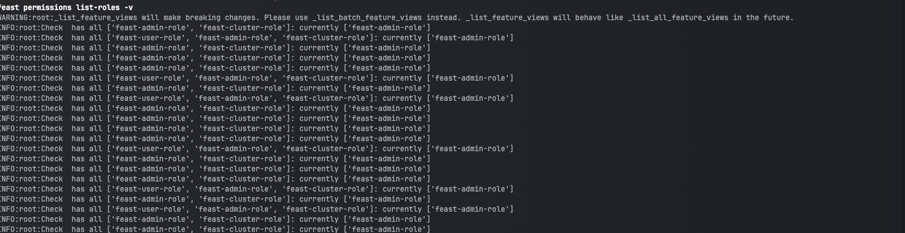
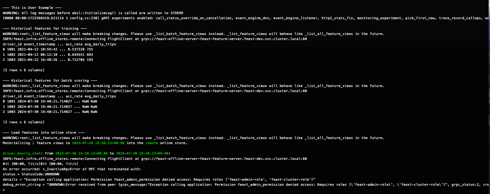

# Feast Feature Store Deployment with RBAC

## Demo Summary
This demo showcases how to enable Role-Based Access Control (RBAC) for a Feast Feature Store application using Kubernetes Authentication type. 
The demo steps involve deploying server components (registry, offline, online) and client examples with resources (deployment, roles, role bindings, and service accounts) within a Kubernetes environment. 
The goal is to ensure secure access control based on user roles and permissions. For understanding the Feast RBAC framework read the reference document [permission.md](../../docs/getting-started/concepts/permission.md).

## Tools and Projects
- Kubernetes
- Feast
- PostgreSQL Database

## Application Environment

This demo contains the following components:

1. Feast Remote Server components (online, offline, registry) for the Feast Feature Store.
2. Feast Remote Client RBAC example (admin and user ).
3. Configuration and test scripts.
 


### Setup Instructions

The application works under OpenShift or Kubernetes with the following instructions assume that you are using a OpenShift or Kubernetes cluster.

### Prerequisites

1. Kubernetes Cluster and Kubernetes CLI (kubectl).
2. Helm: Ensure you have Helm installed for deploying the Feast components. 
3. Python environment.
4. Feast CLI latest version.

### Steps

#### Local Project Setup

#### 1. **Create the Feast feature store project with PostgreSQL.**

* Install the PostgreSQL on a Kubernetes cluster if you are using OpenShift you can install using [OpenShift Template](https://github.com/RHEcosystemAppEng/feast-workshop-team-share/tree/main/feast_postgres#1-install-postgresql-on-openshift-using-openshift-template)
* Port Forward PostgreSQL Database to your local machine. Since we are setting up the Feast project locally using the Feast CLI, so for local connection required port forward PostgreSQL:
   ``` kubectl port-forward svc/postgresql 5432:5432```
*  Create a feature repository/project using cli with PostgreSQL. Please see the instruction for more details [here](https://docs.feast.dev/reference/offline-stores/postgres#getting-started).
   For this example (local) setup, we create project with name [server](server) using these settings for [feature_store.yaml](server/feature_repo/feature_store.yaml).
*  From `Server` create Feast objects to the registry with command  `feast apply` from `feature_repo` directory.
* Verify the application is working locally 

#### Remote Server Deployment 

#### 1.  **Create the Server Feature Store Files and Add Auth Section.**

* For remote deployment on the cluster, create feature store YAML files for each server, as shown in this example.

**Registry Server:**  [feature_store_registry.yaml](server/feature_store_registry.yaml)

**Offline Server with Remote Registry:** [feature_store_offline.yaml](server/feature_store_offline.yaml)

**Online Server with Remote Registry and Remote Offline Store:** [feature_store_online.yaml](server/feature_store_online.yaml)

* Enable the auth in each Server feature store by setting the auth type to Kubernetes. You can read more about RBAC/permissions in [permission.md](../../docs/getting-started/concepts/permission.md)

```yaml
auth:
    type: kubernetes
```

#### 2. **Deploy server components with RBAC.**

* Run the installation script. The setup script will deploy the server components based on user confirmation. The script will deploy all the components with the namespace name `feast-dev`.

   ```sh
   ./install_feast.sh
   ```
   Note: You can apply permission to run the script like this:
   ```sh
   chmod +x install_feast.sh
   ```
* Verify that all server pods are healthy and running. The install script will create a deployment for each server. 

#### Client Setup

#### 1.  **Create Client-Side Feature Store YAML with Kubernetes Auth Type.**

* In this example, we created the [client](client) folder which contains client-related resources.

* Set up the client feature store with remote connection details for the registry, online, and offline store.

* See the client remote setting example here: [feature_store.yaml](client/feature_repo/feature_store.yaml)

#### 2. **Deploy the Client Examples**

* As an examples, we created two users: 1. admin and 2. user, and assigned the following roles and actions on the Feast object as shown in the table below.

#####  Roles and Permissions for Examples (Admin and User)
| **User**        | **Service Account** | **Roles**        | **Permission**          | **Feast Resources**                                                                                                                                      | **Actions**                                                                                                           |
|-----------------|---------------------|------------------|-------------------------|----------------------------------------------------------------------------------------------------------------------------------------------------------|----------------------------------------------------------------------------------------------------------------------|
| admin           | feast-admin-sa      | feast-admin-role | feast_admin_permission  | FeatureView, OnDemandFeatureView, BatchFeatureView, StreamFeatureView, Entity, FeatureService, DataSource, ValidationReference, SavedDataset, Permission | CREATE, READ, UPDATE, DELETE, QUERY_ONLINE, QUERY_OFFLINE, WRITE_ONLINE, WRITE_OFFLINE                                |
| user            | feast-user-sa       | feast-user-role  | feast_user_permission   | FeatureView, OnDemandFeatureView, BatchFeatureView, StreamFeatureView, Entity, FeatureService, DataSource, ValidationReference, SavedDataset, Permission | READ, QUERY_OFFLINE, QUERY_ONLINE                                                                                     |

* For deploying client examples, the script will create a Deployment, roles, role bindings, and service accounts for each user. See roles configuration for admin [admin_resources.yaml](client/admin_resources.yaml) and user [user_resources.yaml](client/user_resources.yaml)
* It will also create a ConfigMap on the client side that contains the test script and client-side feature store configuration.

* To run the script below, if the server is already deployed, type 'no' for server deployment and 'yes' for client creation.

   ```sh
   ./install_feast.sh
   ```

* We defined two examples under the client folder: `test_admin.py` and `test_user.py`. Both examples aim to perform actions related to Historical Features, Materialize Incremental, and Online Features.
  
* The applications should work without permissions setting at this point. Verify the client applications of user and admin and able to do Historical Features, Materialize Incremental, and Online Features 

The Deployment of the overall setup looks like :





#### Apply Permissions

* Feast admin needs to create permissions with the server-side feature store configuration by adding Python code. See the code example in [permissions_apply.py](server/feature_repo/permissions_apply.py) 
* From `Server` create Permissions with command  `feast apply` from `feature_repo` directory. At this point it can done from local project setup as step1. 
* verify the permission by using `feast permissions list` or `feast list-roles `








#### **Validating Permissions examples.**

As we created two examples under the client folder: `test_admin.py` and `test_user.py`. Both examples aim to perform actions related to Historical Features, Materialize Incremental, and Online Features.
According to the roles:

- The admin can perform all actions on all objects.
- The user can only read or query on all objects.

The below screenshots show that the admin can perform all actions, including Materialize. However, the user can only read offline and encounters an permissions error when attempting the Materialization step because the user does not have the required role.

**Admin Example**


**User Example**



For local testing, port forward the services PostgreSQL Service and Feast Servers with the commands below:
   ```sh
   kubectl port-forward svc/postgresql 5432:5432
   kubectl port-forward svc/feast-offline-server-feast-feature-server 8815:80
   kubectl port-forward svc/feast-registry-server-feast-feature-server 6570:80
   kubectl port-forward svc/feast-feature-server 6566:80
   ```

Also, set the environment variable LOCAL_K8S_TOKEN in each example if you want to test locally. The token can be obtained from the service account i.e. feast-admin-sa and feast-user-sa.


**Clean up:**

The cleanup script will remove the deployed resources.

   ```sh
   ./cleanup_feast.sh
   ```
