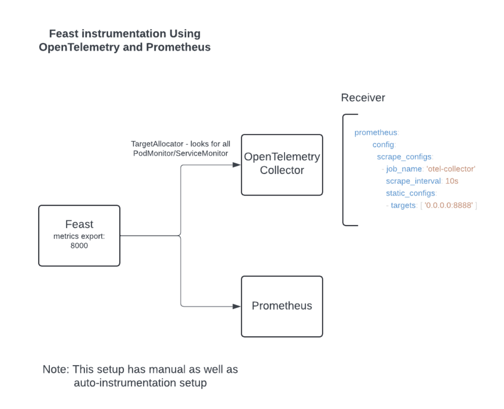

## Adding Monitoring
To add monitoring to the Feast Feature Server, follow these steps:

### Workflow

Feast instrumentation Using OpenTelemetry and Prometheus - 


### Deploy Prometheus Operator
Navigate to OperatorHub and install the stable version of the Prometheus Operator

### Deploy OpenTelemetry Operator
Before installing OTEL Operator, install `cert-manager` and validate the `pods` should spin up --
```
kubectl apply -f https://github.com/open-telemetry/opentelemetry-operator/releases/latest/download/opentelemetry-operator.yaml
```

Then navigate to OperatorHub and install the stable version of the community OpenTelemetry Operator


### Configure OpenTelemetry Collector
Add the OpenTelemetry Collector configuration under the metrics section in your values.yaml file.

Example values.yaml:

```
metrics:
  enabled: true
  otelCollector:
    endpoint: "otel-collector.default.svc.cluster.local:4317" #sample
    headers:
      api-key: "your-api-key"
```

### Add instrumentation annotation and environment variables in the deployment.yaml 

```
template:
    metadata:
    {{- with .Values.podAnnotations }}
      annotations:
        {{- toYaml . | nindent 8 }}
        instrumentation.opentelemetry.io/inject-python: "true"
```

```
- name: OTEL_EXPORTER_OTLP_ENDPOINT
    value: http://{{ .Values.service.name }}-collector.{{ .Release.namespace }}.svc.cluster.local:{{ .Values.metrics.endpoint.port}}
- name: OTEL_EXPORTER_OTLP_INSECURE
              value: "true"     
```

### Add checks
Add metric checks to all manifests and deployment file -

```
{{ if .Values.metrics.enabled }}
apiVersion: opentelemetry.io/v1alpha1
kind: Instrumentation
metadata:
  name: feast-instrumentation
spec:
  exporter:
    endpoint: http://{{ .Values.service.name }}-collector.{{ .Release.Namespace }}.svc.cluster.local:4318 # This is the default port for the OpenTelemetry Collector
  env:
  propagators:
    - tracecontext
    - baggage
  python:
    env:
      - name: OTEL_METRICS_EXPORTER
        value: console,otlp_proto_http
      - name: OTEL_LOGS_EXPORTER
        value: otlp_proto_http
      - name: OTEL_PYTHON_LOGGING_AUTO_INSTRUMENTATION_ENABLED
        value: "true"
{{end}}
```

### Add manifests to the chart 
Add Instrumentation, OpenTelemetryCollector, ServiceMonitors, Prometheus Instance and RBAC rules as provided in the [samples/](https://github.com/feast-dev/feast/tree/91540703c483f1cd03b534a1a45bc4ccdcf79f81/infra/charts/feast-feature-server/samples) directory.

For latest updates please refer the official repository - https://github.com/open-telemetry/opentelemetry-operator

### Deploy Feast 
Deploy Feast and set `metrics` value to `true`.

Example - 
```
helm install feast-release infra/charts/feast-feature-server --set metric=true --set feature_store_yaml_base64=""
```

## See logs 
Once the opentelemetry is deployed, you can search the logs to see the required metrics - 

```
oc logs otelcol-collector-0 | grep "Name: feast_feature_server_memory_usage\|Value: 0.*"
oc logs otelcol-collector-0 | grep "Name: feast_feature_server_cpu_usage\|Value: 0.*"
```
```
 -> Name: feast_feature_server_memory_usage
Value: 0.579426
```
```
-> Name: feast_feature_server_cpu_usage
Value: 0.000000
```
