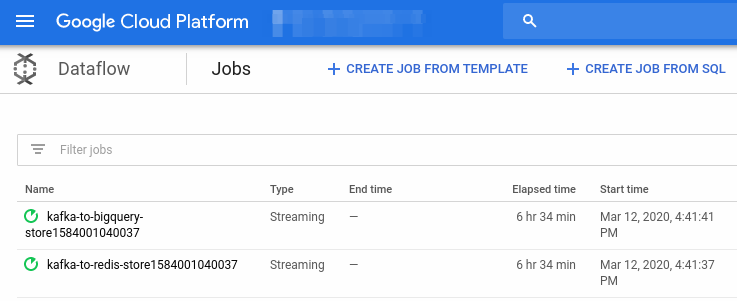

feast
===== 

Feature store for machine learning. Current chart version is `0.4.6`

## TL;DR;

```bash
# Install Feast with Online Serving and Beam DirectRunner
helm repo add feast-charts https://feast-charts.storage.googleapis.com
helm repo update
helm install --name myrelease feast-charts/feast
```

## Introduction
This chart install Feast deployment on a Kubernetes cluster using the [Helm](https://v2.helm.sh/docs/using_helm/#installing-helm) package manager. 

## Prerequisites
- Kubernetes 1.12+
- Helm 2.15+ (not tested with Helm 3)
- Persistent Volume support on the underlying infrastructure

## Chart requirements

The chart dependencies are bundled in this chart so Feast users can use them directly. 
It also allows Feast chart maintainers to set reasonable defaults values for the 
dependencies so end users are not overwhelmed with the available configuration. 

| Name | Version |
|------|---------|
| [Feast Core](./charts/feast-core/README.md) | 0.4.6 |
| [Feast Serving](./charts/feast-serving/README.md) | 0.4.6 |
| [Postgresql](./charts/postgresql/README.md) | 8.6.1 |
| [Kafka](./charts/kafka/README.md) | 0.20.8 |
| [Redis](./charts/redis/README.md) | 10.5.6 |
| [Prometheus Statsd Exporter](./charts/prometheus-statsd-exporter/README.md) | 0.1.2 |
| [Prometheus](./charts/prometheus/README.md) | 11.0.2 |
| [Grafana](./charts/grafana/README.md) | 5.0.5 |

## Chart Values

| Key | Type | Default | Description |
|-----|------|---------|-------------|
| feast-batch-serving.enabled | bool | `false` | Flag to install Feast Batch Serving |
| feast-core.enabled | bool | `true` | Flag to install Feast Core |
| feast-online-serving.enabled | bool | `true` | Flag to install Feast Online Serving |
| grafana.enabled | bool | `true` | Flag to install Grafana |
| kafka.enabled | bool | `true` | Flag to install Kafka |
| postgresql.enabled | bool | `true` | Flag to install Postgresql |
| prometheus-statsd-exporter.enabled | bool | `true` | Flag to install StatsD to Prometheus Exporter |
| prometheus.enabled | bool | `true` | Flag to install Prometheus |
| redis.enabled | bool | `true` | Flag to install Redis |

## Configuration and installation details

The default configuration will install Feast with Online Serving. Ingestion
of features uses Beam [DirectRunner](https://beam.apache.org/documentation/runners/direct/) 
that runs on the same container where Feast Core is running. To test the installation:
```bash
helm test myrelease

# If the installation is successful, the following should be printed
RUNNING: myrelease-feast-online-serving-test
PASSED: myrelease-feast-online-serving-test
RUNNING: myrelease-grafana-test
PASSED: myrelease-grafana-test
RUNNING: myrelease-test-topic-create-consume-produce
PASSED: myrelease-test-topic-create-consume-produce

# In order to check the logs from the test
kubectl logs myrelease-feast-online-serving-test
```

> The test pods can be safely deleted after the test finishes.  
> Check the yaml files in `templates/tests/` folder to see the processes
> the test pods execute.

### Feast metrics 

Feast default installation includes Grafana, StatsD exporter and Prometheus. Request
metrics from Feast Core and Feast Serving, as well as ingestion statistic from
Feast Ingestion are accessible from Prometheus and Grafana dashboard. The following
show a quick example how to access the metrics.

```
# Forwards local port 9090 to the Prometheus server pod
kubectl port-forward svc/myrelease-prometheus-server 9090:80
```

Visit http://localhost:9090 to access the Prometheus server:


### Enable Batch Serving

To install Feast Batch Serving for retrieval of historical features in offline
training, access to BigQuery is required. First, create a [service account](https://cloud.google.com/iam/docs/creating-managing-service-account-keys) key that
will provide the credentials to access BigQuery. Grant the service account `editor` 
role so it has write permissions to BigQuery and Cloud Storage.

> In production, it is advised to give only the required [permissions](foo-feast-batch-serving-test) for the 
> the service account, versus `editor` role which is very permissive.

Create a Kubernetes secret for the service account JSON file:
```bash
# By default Feast expects the secret to be named "feast-gcp-service-account"
# and the JSON file to be named "credentials.json"
kubectl create secret generic feast-gcp-service-account --from-file=credentials.json
```

Create a new Cloud Storage bucket (if not exists) and make sure the service
account has write access to the bucket:
```bash
gsutil mb <bucket_name>
```

Use the following Helm values to enable Batch Serving:
```yaml
# values-batch-serving.yaml
feast-core:
  gcpServiceAccount:
    enabled: true

feast-batch-serving:
  enabled: true
  store.yaml:
    name: bigquery-store
    type: BIGQUERY 
    bigquery_config:
      project_id: <google_project_id>
      dataset_id: <bigquery_dataset_id>
    subscriptions:
    - project: "*"
      name: "*"
      version: "*"
  application-override.yaml:
    feast:
      jobs:
        staging-location: gs://<bucket_name>/staging-location
  gcpServiceAccount:
    enabled: true 
```

> To delete the previous release, run `helm delete --purge myrelease`  
> Note this will not delete the persistent volume that has been claimed (PVC).  
> In a test cluster, run `kubectl delete pvc --all` to delete all claimed PVCs.

```bash
# Install a new release
helm install --name myrelease -f values-batch-serving.yaml feast-charts/feast

# Wait until all pods are created and running/completed (can take about 5m)
kubectl get pods 

# Batch Serving is installed so `helm test` will also test for batch retrieval
helm test myrelease
```

### Use DataflowRunner for ingestion

Apache Beam [DirectRunner](https://beam.apache.org/documentation/runners/direct/)
is not suitable for production use case because it is not easy to scale the
number of workers and there is no convenient API to monitor and manage the
workers. Feast supports [DataflowRunner](https://beam.apache.org/documentation/runners/dataflow/) which is a managed service on Google Cloud. 

> Make sure `feast-gcp-service-account` Kubernetes secret containing the
> service account has been created and the service account has permissions
> to manage Dataflow jobs.

Since Dataflow workers run outside the Kube cluster and they will need to interact
with Kafka brokers, Redis stores and StatsD server installed in the cluster,
these services need to be exposed for access outside the cluster by setting
`service.type: LoadBalancer`. 

In a typical use case, 5 `LoadBalancer` (internal) IP addresses are required by
Feast when running with `DataflowRunner`. In Google Cloud, these (internal) IP 
addresses should be reserved first:
```bash
# Check with your network configuration which IP addresses are available for use
gcloud compute addresses create \
  feast-kafka-1 feast-kafka-2 feast-kafka-3 feast-redis feast-statsd \
  --region <region> --subnet <subnet> \
  --addresses 10.128.0.11,10.128.0.12,10.128.0.13,10.128.0.14,10.128.0.15
```

Use the following Helm values to enable DataflowRuner (and Batch Serving), 
replacing the `<*load_balancer_ip*>` tags with the ones reserved above:

```yaml
# values-dataflow-runner.yaml
feast-core:
  gcpServiceAccount:
    enabled: true
  application-override.yaml:
    feast:
      stream:
        options:
          bootstrapServers: <kafka_sevice_load_balancer_ip_address_1:31090>
      jobs:
        runner: DataflowRunner
        options:
          project: <google_project_id>
          region: <dataflow_regional_endpoint e.g. asia-east1>
          zone: <google_zone e.g. asia-east1-a>
          tempLocation: <gcs_path_for_temp_files e.g. gs://bucket/tempLocation>
          network: <google_cloud_network_name>
          subnetwork: <google_cloud_subnetwork_path e.g. regions/asia-east1/subnetworks/mysubnetwork>
          maxNumWorkers: 1
          autoscalingAlgorithm: THROUGHPUT_BASED
          usePublicIps: false
          workerMachineType: n1-standard-1
          deadLetterTableSpec: <bigquery_table_spec_for_deadletter e.g. project_id:dataset_id.table_id>
        metrics:
          host: <prometheus_statsd_exporter_load_balancer_ip_address>

feast-online-serving:
  store.yaml:
    name: redis-store
    type: REDIS
    redis_config:
      host: <redis_service_load_balancer_ip_addresss>
      port: 6379
    subscriptions:
    - project: "*"
      name: "*"
      version: "*"

feast-batch-serving:
  enabled: true
  store.yaml:
    name: bigquery-store
    type: BIGQUERY 
    bigquery_config:
      project_id: <google_project_id>
      dataset_id: <bigquery_dataset_id>
    subscriptions:
    - project: "*"
      name: "*"
      version: "*"
  application-override.yaml:
    feast:
      jobs:
        staging-location: <gcs_path_for_temp_files e.g. gs://bucket/stagingLocation>
  gcpServiceAccount:
    enabled: true 

kafka:
  external:
    enabled: true
    type: LoadBalancer
    annotations:
      cloud.google.com/load-balancer-type: Internal
    loadBalancerSourceRanges:
    - 10.0.0.0/8
    - 172.16.0.0/12
    - 192.168.0.0/16
    firstListenerPort: 31090
    loadBalancerIP:
    - <kafka_sevice_load_balancer_ip_address_1>
    - <kafka_sevice_load_balancer_ip_address_2>
    - <kafka_sevice_load_balancer_ip_address_3>
  configurationOverrides:
    "advertised.listeners": |-
      EXTERNAL://${LOAD_BALANCER_IP}:31090
    "listener.security.protocol.map": |-
      PLAINTEXT:PLAINTEXT,EXTERNAL:PLAINTEXT
    "log.retention.hours": 1

redis:
  master:
    service:
      type: LoadBalancer
      loadBalancerIP: <redis_service_load_balancer_ip_addresss>
      annotations:
        cloud.google.com/load-balancer-type: Internal
      loadBalancerSourceRanges:
      - 10.0.0.0/8
      - 172.16.0.0/12
      - 192.168.0.0/16

prometheus-statsd-exporter:
  service:
    type: LoadBalancer
    annotations:
      cloud.google.com/load-balancer-type: Internal
    loadBalancerSourceRanges:
    - 10.0.0.0/8
    - 172.16.0.0/12
    - 192.168.0.0/16
    loadBalancerIP: <prometheus_statsd_exporter_load_balancer_ip_address>
``` 

```bash
# Install a new release
helm install --name myrelease -f values-dataflow-runner.yaml feast-charts/feast

# Wait until all pods are created and running/completed (can take about 5m)
kubectl get pods 

# Test the installation
helm test myrelease
```

If the tests are successful, Dataflow jobs should appear in Google Cloud console
running features ingestion: https://console.cloud.google.com/dataflow



### Production configuration

#### Secrets management

The installation examples above automatically create secrets for Postgresql and
Grafana with randomly generated values. However, these secrets are not stable
i.e. running `helm upgrade` will update the secret unintentionally. For
production, the secrets are usually generated first before deployment. In summary,
these are the 3 secrets that Feast requires:

```bash
kubectl create secret generic feast-postgresql \
    --from-literal=postgresql-password=<your_password>

kubectl create secret generic feast-gcp-service-account \
    --from-file=credentials.json

kubectl create secret generic feast-grafana \
    --from-literal=admin-user=admin \
    --from-literal=admin-password=<your_password> \
```

With these secrets in place, they can be used like so:
```yaml
# values-existing-secret.yaml
feast-core:
  postgresql:
    existingSecret: feast-postgresql

postgresql:
  existingSecret: feast-postgresql

grafana:
  admin:
    existingSecret: feast-grafana
```

#### Resources requests

The `resources` field in the deployment spec is left empty in the examples. In
production these should be set according to the load each services are expected
to handle and the service level objectives (SLO). Also Feast Core and Serving
is Java application and it is [good practice](https://stackoverflow.com/a/6916718/3949303) 
to set the minimum and maximum heap. This is an example reasonable value to set for Feast Serving:

```yaml
feast-online-serving:
  javaOpts: "-Xms2048m -Xmx2048m"
  resources:
    limits:
      memory: "4096Mi"
    requests:
      memory: "2048Mi"
      cpu: "2"
```

#### High availability

Default Feast installation only configures a single instance of Redis
server. If due to network failures or out of memory error Redis is down,
Feast serving will fail to respond to requests. Soon, Feast will support
highly available Redis via [Redis cluster](https://redis.io/topics/cluster-tutorial), 
sentinel or additional proxies.

### Documentation development

This `README.md` is generated using [helm-docs](https://github.com/norwoodj/helm-docs/).
Run `helm-docs` after changing directory to this folder to regenerate a new `README.md`
when Feast charts or values are modified.