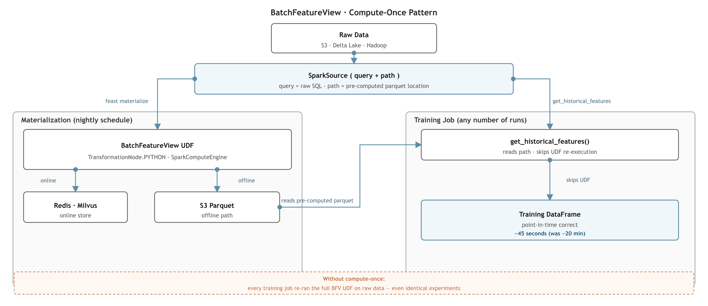
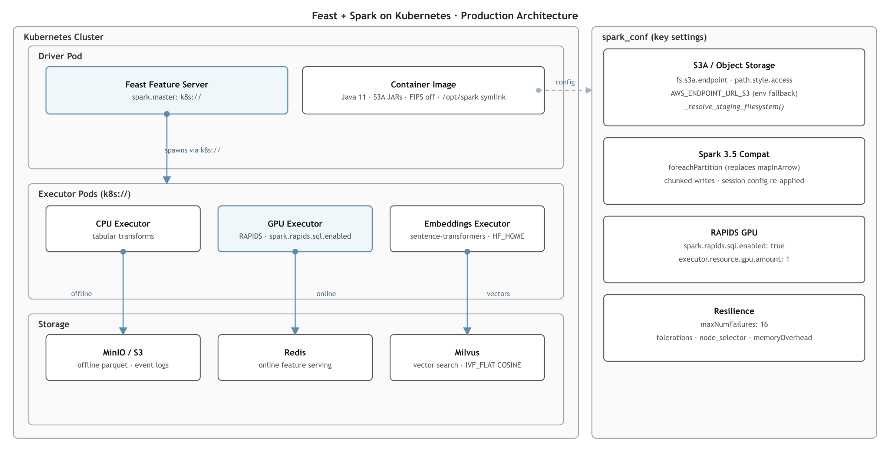

# From Local to Production: BatchFeatureView + Spark on Kubernetes

Two problems, same pipeline.

The first: a data scientist runs three training experiments and waits 22 minutes for each one — not to train the model, but to re-run the same Spark window aggregations over the same 26M rows. The features from the morning's `feast materialize` are sitting in S3. Feast just doesn't know it's allowed to read them there.

The second: you fix the first problem, your pipeline works perfectly on the dev cluster, and then you move it to Kubernetes. `feast materialize` exits 0. Nothing wrote to Redis. No error. The features are null. You spend the next three days finding out why.

This post covers both: the `query+path` pattern that makes features compute once, and the ordered checklist of what breaks when you deploy Feast + Spark to Kubernetes — with a complete production reference config at the end.

---

## Part 1: Compute Features Once

<div class="hero-image">
  
</div>

### Why `get_historical_features()` Re-Runs Your UDF

When you define a `BatchFeatureView` with a `SparkSource`, the source tells Feast where the raw data is. During `feast materialize`, Feast runs your UDF on that raw data and writes features to your online store. During `get_historical_features()`, Feast goes back to the same `SparkSource`, reads the same raw data, and runs your UDF again — because from Feast's perspective, the source is raw data and features are always derived on demand.

There was no way to say: *"for materialization, use the query. For training, read the pre-computed output."* That distinction didn't exist.

### The `query + path` Pattern

> **Data Scientist** — *"I run `feast materialize` overnight. By morning, every training job reads pre-computed features in seconds — not minutes of Spark compute."*

`SparkSource` now accepts both `query` and `path` together. `query` drives materialization. `path` drives training reads. Define both once; Feast routes automatically:

```python
from feast.infra.offline_stores.contrib.spark_offline_store.spark_source import SparkSource

user_features_source = SparkSource(
    name="user_features_source",
    # Materialization: reads raw data, runs UDF, writes to online store + path
    query=(
        "SELECT *, CAST(timestamp / 1000 AS TIMESTAMP) AS event_timestamp "
        "FROM parquet.`s3a://data-lake/raw/reviews/*/`"
    ),
    # Training: reads pre-computed parquet — no UDF, no raw data scan
    path="s3a://feast-features/offline/user_features/",
    file_format="parquet",
    timestamp_field="event_timestamp",
)
```

| Operation | Field used | What happens |
|-----------|------------|--------------|
| `feast materialize` | `query` | Runs UDF on raw data → writes features to online store + `path` |
| `get_historical_features()` | `path` | Reads pre-computed parquet directly |

**Graceful fallback:** if `path` doesn't exist yet (before the first `materialize` completes), Feast falls back to the live `query` automatically. The pipeline works on day one without pre-computed data.

### Defining a BatchFeatureView with TransformationMode.PYTHON

> **Data Scientist** — *"I want to write a PySpark transformation once — window aggregations, joins, derived features — and have Feast handle when it runs and where the output goes."*

```python
from feast import Entity, Field
from feast.batch_feature_view import batch_feature_view
from feast.transformation.mode import TransformationMode
from feast.types import Float32, Int64, String
from pyspark.sql import DataFrame
from pyspark.sql import functions as F
from pyspark.sql.window import Window
from datetime import timedelta

user = Entity(name="user_id", join_keys=["user_id"])

@batch_feature_view(
    source=user_features_source,
    entities=[user],
    mode=TransformationMode.PYTHON,
    online=True,   # Written to Redis for real-time serving
    offline=True,  # Written to S3 for point-in-time correct training data
    schema=[
        Field(name="user_avg_rating", dtype=Float32),
        Field(name="user_review_count", dtype=Int64),
        Field(name="user_primary_category", dtype=String),
    ],
    ttl=timedelta(days=7),
)
def user_features(df: DataFrame) -> DataFrame:
    # Runs once per materialize cycle — not per training experiment
    w = Window.partitionBy("user_id").orderBy(F.desc("cat_count"))
    user_cat_counts = (
        df.groupBy("user_id", "category")
        .agg(F.count("*").alias("cat_count"), F.avg("rating").alias("avg_rating"))
    )
    return (
        user_cat_counts
        .withColumn("rn", F.row_number().over(w))
        .filter(F.col("rn") == 1)
        .groupBy("user_id")
        .agg(
            F.avg("avg_rating").alias("user_avg_rating"),
            F.sum("cat_count").alias("user_review_count"),
            F.first("category").alias("user_primary_category"),
        )
        .withColumn("event_timestamp", F.current_timestamp())
    )
```

### How Materialization and Training Fit Together

> **MLOps Engineer** — *"I want materialization on a schedule and training jobs fully decoupled — data scientists iterate at experiment speed, not Spark job speed."*

```bash
# Runs on a schedule: nightly cron, Argo Workflow, Airflow DAG
feast materialize-incremental $(date -u +"%Y-%m-%dT%H:%M:%S")
```

During materialization, Feast runs `user_features_source.query` → `user_features()` UDF → writes to:
- Redis (for `get_online_features()` at serving time)
- `s3a://feast-features/offline/user_features/` as parquet (for training)

At training time — regardless of how many experiments run that day:

```python
store = FeatureStore(repo_path=".")

training_df = store.get_historical_features(
    entity_df=entity_df,
    features=[
        "user_features:user_avg_rating",
        "user_features:user_review_count",
        "user_features:user_primary_category",
        "item_features:item_avg_rating",
        "interactions:label",
    ],
).to_df()
```

This reads pre-computed parquet. No Spark job triggered. No raw data scan. Point-in-time correctness is preserved — each materialized parquet partition carries its `event_timestamp`.

### Offline-Only Feature Views for Training Labels

> **Data Scientist** — *"My interaction table is 500GB and training-only — it will never live in Redis. I still want it versioned, retrievable, and point-in-time correct like any other feature."*

`online=False, offline=True` is now a first-class `BatchFeatureView` configuration:

```python
@batch_feature_view(
    source=SparkSource(
        name="interactions_source",
        query="SELECT * FROM parquet.`s3a://data-lake/raw/interactions/*/`",
        path="s3a://feast-features/offline/interactions/",
        file_format="parquet",
        timestamp_field="event_timestamp",
    ),
    entities=[user, item],
    mode=TransformationMode.PYTHON,
    online=False,   # Never written to Redis
    offline=True,   # Written to S3 — retrievable via get_historical_features()
    schema=[
        Field(name="label", dtype=Int32),
        Field(name="interaction_type", dtype=String),
        Field(name="dwell_time_seconds", dtype=Int64),
    ],
    ttl=timedelta(days=90),
)
def interactions(df: DataFrame) -> DataFrame:
    return df.select(
        "user_id", "item_id", "label",
        "interaction_type", "dwell_time_seconds", "event_timestamp",
    )
```

Training labels, interaction histories, and large join tables are now first-class Feast objects — with consistent lineage, versioning, and retrieval APIs alongside your serving features.

---

## Part 2: Deploying to Kubernetes

<div class="hero-image">
  
</div>

Getting Feast + Spark working locally takes an afternoon. Getting it working on Kubernetes takes a week — not because Kubernetes is hard, but because the failures are environmental, sequential, and each one looks unrelated to the last.

Here's the ordered checklist: what breaks, in roughly the order you encounter it, why, and exactly how to fix it.

### Step 1: Build the Right Container Images

> **MLOps Engineer** — *"I need driver and executor images that agree on Feast version, Spark version, and JARs — and don't break on UBI9 with FIPS enabled."*

Two images are needed: a **driver image** (runs the Feast server and SparkComputeEngine) and an **executor image** (spawned by Kubernetes for each Spark worker).

**Java 11 + FIPS disable**

PySpark 3.5.x requires Java 11. On UBI9/RHEL environments (OpenShift AI, RHEL nodes), the JVM runs in FIPS mode by default. FIPS blocks HMAC-SHA256 key operations used by AWS SDK v1 — every `s3a://` read/write silently fails:

```dockerfile
RUN microdnf install -y java-11-openjdk-headless git && microdnf clean all
ENV JAVA_HOME=/usr/lib/jvm/jre-11
ENV PATH="${JAVA_HOME}/bin:${PATH}"
# Disables FIPS JVM mode — required for AWS SDK v1 HMAC signing on UBI9/RHEL
ENV JAVA_TOOL_OPTIONS="-Dcom.redhat.fips=false"
```

**S3A JARs — version pinning matters**

PySpark 3.5.x bundles Hadoop 3.3.4, which uses AWS SDK v1. The JARs must exactly match:

```dockerfile
RUN SPARK_JARS=$(python3 -c 'import pyspark, os; print(os.path.join(os.path.dirname(pyspark.__file__), "jars"))') && \
    curl -fsSL -o "${SPARK_JARS}/hadoop-aws-3.3.4.jar" \
      https://repo1.maven.org/maven2/org/apache/hadoop/hadoop-aws/3.3.4/hadoop-aws-3.3.4.jar && \
    curl -fsSL -o "${SPARK_JARS}/aws-java-sdk-bundle-1.12.367.jar" \
      https://repo1.maven.org/maven2/com/amazonaws/aws-java-sdk-bundle/1.12.367/aws-java-sdk-bundle-1.12.367.jar
```

> ⚠️ **Do not upgrade to PySpark 4.0 yet.** PySpark 4.0 bundles Hadoop 3.4.0, which requires AWS SDK v2 but does not bundle it. Every `s3a://` access fails with `NoClassDefFoundError`.

**Executor `/opt/spark` symlinks**

When using `spark.master: "k8s://..."`, the driver launches executor pods by calling `/opt/spark/bin/spark-class`. A pip-installed PySpark puts its binaries inside site-packages — not `/opt/spark`:

```dockerfile
RUN PYSPARK_HOME=$(python3 -c 'import pyspark, os; print(os.path.dirname(pyspark.__file__))') && \
    mkdir -p /opt/spark && \
    ln -sf "${PYSPARK_HOME}/bin"    /opt/spark/bin    && \
    ln -sf "${PYSPARK_HOME}/jars"   /opt/spark/jars   && \
    ln -sf "${PYSPARK_HOME}/python" /opt/spark/python
ENV SPARK_HOME=/opt/spark
```

Add an entrypoint shim — the Spark k8s executor contract expects `/opt/entrypoint.sh`:

```bash
#!/bin/bash
# /opt/entrypoint.sh
if [ "$1" = "executor" ]; then
  exec /opt/spark/bin/spark-class org.apache.spark.executor.CoarseGrainedExecutorBackend "$@"
fi
exec "$@"
```

---

### Step 2: S3 Event Logging Without Killing SparkContext

> **MLOps Engineer** — *"I enabled Spark event logging to S3. Now `feast materialize` exits 0 and writes nothing."*

On a fresh bucket, `SparkContext` initialization verifies the event log directory exists. S3 has no real directories — a missing prefix returns 404, the pre-flight check raises, and Feast catches it silently. The job exits 0. Nothing was written.

**The fix:** Feast now automatically writes a zero-byte `.keep` placeholder to the event log prefix before `SparkSession` initialization:

```yaml
offline_store:
  type: spark
  spark_conf:
    spark.eventLog.enabled: "true"
    spark.eventLog.dir: "s3a://feast-logs/spark-events/"
    spark.hadoop.fs.s3a.endpoint: "http://minio.feast-system.svc.cluster.local:9000"
    spark.hadoop.fs.s3a.path.style.access: "true"
```

No bucket setup required. With event logging working, Spark History Server gives you stage timelines and executor utilization for every `feast materialize` job.

---

### Step 3: Window Operations on Spark 3.5+

> **Data Scientist** — *"My BFV uses `Window.partitionBy`. It worked on Spark 3.4. On Spark 3.5 (Databricks 14+, EMR 7+) it crashes with a serializer error."*

Spark 3.5 introduced `WindowGroupLimitExec` — a new physical plan node that inserts itself upstream of Arrow-based UDF execution when `Window` operations are present. The fix replaces the Arrow UDF bridge with `foreachPartition`:

```python
# Works correctly on all Spark versions including 3.5+
@batch_feature_view(
    sources=[user_reviews_source],
    entities=[user],
    mode=TransformationMode.PYTHON,
    schema=[Field(name="user_primary_category", dtype=String)],
)
def user_features(df: DataFrame) -> DataFrame:
    w = Window.partitionBy("user_id").orderBy(F.desc("cnt"))
    counts = df.groupBy("user_id", "category").agg(F.count("*").alias("cnt"))
    return (
        counts.withColumn("rn", F.row_number().over(w))
        .filter(F.col("rn") == 1)
        .select("user_id", F.col("category").alias("user_primary_category"))
        .withColumn("event_timestamp", F.current_timestamp())
    )
```

No version pinning, no workarounds. The same BFV code runs on Databricks Runtime 14+, EMR 7+, or self-hosted Spark 3.5.

---

### Step 4: Staging Reads Fail on MinIO and Custom S3 Endpoints

> **MLOps Engineer** — *"Materialization succeeds. Features land in Redis. But `get_historical_features()` raises `FileNotFoundError` on the staging path — the same bucket that just received the write."*

Without an explicit filesystem client, PyArrow resolves `s3://` URIs using the default credential chain and connects to `s3.amazonaws.com`. On MinIO or any private endpoint, PyArrow is connecting to the wrong host.

Feast now builds the correct `pyarrow.fs.S3FileSystem` from your environment. Set `AWS_ENDPOINT_URL_S3`:

```bash
# Pod environment — mount from Kubernetes Secret
AWS_ENDPOINT_URL_S3=http://minio.feast-system.svc.cluster.local:9000
AWS_ACCESS_KEY_ID=<from-secret>
AWS_SECRET_ACCESS_KEY=<from-secret>  # pragma: allowlist secret
```

GCS (`gs://`) and local paths are handled the same way — Feast selects `GcsFileSystem` or `LocalFileSystem` based on URI scheme.

---

### Step 5: Executor Pods Getting OOMKilled on Large Feature Views

> **MLOps Engineer** — *"Materialization of the 10M-key user feature view keeps OOMKilling executor pods. Raising memory doesn't help beyond a point."*

The original write path accumulated an entire Spark partition in memory before flushing to the online store. Feast now writes in fixed-size chunks, bounding peak memory per executor regardless of partition size:

```yaml
batch_engine:
  type: spark.engine
  partitions: 200
  spark_conf:
    spark.executor.memory: "6g"
    spark.executor.memoryOverhead: "14g"  # GPU UVM counted against overhead for RAPIDS
    spark.executor.instances: "2"
    spark.executor.cores: "4"
```

---

## The Full Production Configuration

With all five steps addressed, here is a production-ready `feature_store.yaml` for a Kubernetes deployment with MinIO, RAPIDS GPU executors, and a stable driver service:

```yaml
project: my-ml-project
registry:
  registry_type: file
  path: /feast-registry/registry.db

# offline_store: used by training pods (get_historical_features) with local[*] SparkSession
offline_store:
  type: spark
  spark_conf:
    spark.master: "local[*]"
    spark.driver.memory: "8g"
    spark.sql.shuffle.partitions: "200"
    spark.default.parallelism: "200"
    spark.sql.session.timeZone: "UTC"
    spark.sql.runSQLOnFiles: "true"
    spark.sql.execution.arrow.pyspark.enabled: "true"
    spark.sql.execution.arrow.fallback.enabled: "true"
    spark.sql.execution.arrow.maxRecordsPerBatch: "50000"
    spark.driver.extraJavaOptions: "-Dcom.redhat.fips=false"
    spark.hadoop.fs.s3a.endpoint: "http://minio.feast-system.svc.cluster.local:9000"
    spark.hadoop.fs.s3a.path.style.access: "true"
    spark.hadoop.fs.s3a.impl: "org.apache.hadoop.fs.s3a.S3AFileSystem"
    spark.hadoop.fs.s3a.aws.credentials.provider: "com.amazonaws.auth.EnvironmentVariableCredentialsProvider"
    spark.hadoop.fs.s3a.connection.ssl.enabled: "false"
    spark.hadoop.fs.s3a.connection.maximum: "100"
    spark.hadoop.fs.s3a.threads.max: "64"
  staging_location: "s3://feast-features/feast-staging/"

# batch_engine: used by the feast-spark server pod for feast materialize
# spark.master k8s:// spawns GPU executor pods on demand
batch_engine:
  type: spark.engine
  partitions: 200
  spark_conf:
    spark.master: "k8s://https://kubernetes.default.svc:443"
    spark.submit.deployMode: "client"
    spark.driver.host: "feast-spark-driver.feast-system.svc.cluster.local"
    spark.driver.bindAddress: "0.0.0.0"
    spark.driver.port: "7078"
    spark.blockManager.port: "7079"
    spark.driver.memory: "8g"
    spark.driver.maxResultSize: "4g"
    spark.driver.extraJavaOptions: "-Dcom.redhat.fips=false"
    spark.kubernetes.namespace: "feast-system"
    spark.kubernetes.container.image: "your-registry/feast-spark-executor-rapids:latest"
    spark.kubernetes.container.image.pullPolicy: "Always"
    spark.kubernetes.authenticate.driver.serviceAccountName: "feast-sa"
    spark.kubernetes.executor.deleteOnTermination: "true"
    spark.kubernetes.executor.secretKeyRef.AWS_ACCESS_KEY_ID: "feast-s3-credentials:AWS_ACCESS_KEY_ID"
    spark.kubernetes.executor.secretKeyRef.AWS_SECRET_ACCESS_KEY: "feast-s3-credentials:AWS_SECRET_ACCESS_KEY"  # pragma: allowlist secret
    spark.executor.instances: "2"
    spark.executor.cores: "4"
    spark.kubernetes.executor.request.cores: "3"
    spark.executor.memory: "6g"
    spark.executor.memoryOverhead: "14g"
    spark.executor.extraJavaOptions: "-Duser.dir=/tmp -Dcom.redhat.fips=false"
    # RAPIDS GPU plugin
    spark.rapids.sql.enabled: "true"
    spark.plugins: "com.nvidia.spark.SQLPlugin"
    spark.rapids.sql.concurrentGpuTasks: "2"
    spark.rapids.memory.pinnedPool.size: "1g"
    spark.task.resource.gpu.amount: "0.25"
    spark.executor.resource.gpu.amount: "1"
    spark.executor.resource.gpu.vendor: "nvidia.com"
    spark.executor.resource.gpu.discoveryScript: "/opt/spark/getGpusResources.sh"
    spark.kubernetes.executor.limit.nvidia.com/gpu: "1"
    # Resilience
    spark.executor.maxNumFailures: "16"
    spark.task.maxFailures: "8"
    spark.network.timeout: "600s"
    spark.executor.heartbeatInterval: "60s"
    spark.kubernetes.executor.missingPodDetectDelta: "120s"
    spark.sql.runSQLOnFiles: "true"
    spark.sql.session.timeZone: "UTC"
    spark.sql.shuffle.partitions: "200"
    spark.sql.execution.arrow.pyspark.enabled: "true"
    spark.sql.execution.arrow.maxRecordsPerBatch: "10000"
    spark.hadoop.fs.s3a.endpoint: "http://minio.feast-system.svc.cluster.local:9000"
    spark.hadoop.fs.s3a.path.style.access: "true"
    spark.hadoop.fs.s3a.impl: "org.apache.hadoop.fs.s3a.S3AFileSystem"
    spark.hadoop.fs.s3a.aws.credentials.provider: "com.amazonaws.auth.EnvironmentVariableCredentialsProvider"
    spark.hadoop.fs.s3a.connection.ssl.enabled: "false"
    spark.hadoop.fs.s3a.connection.maximum: "100"
    spark.hadoop.fs.s3a.threads.max: "64"

online_store:
  type: redis
  connection_string: "${REDIS_HOST}:${REDIS_PORT},password=${REDIS_PASSWORD}"

entity_key_serialization_version: 3
```

```bash
# Pod environment — mount from Kubernetes Secrets
AWS_ENDPOINT_URL_S3=http://minio.feast-system.svc.cluster.local:9000
AWS_ACCESS_KEY_ID=<minio-access-key>
AWS_SECRET_ACCESS_KEY=<minio-secret-key>  # pragma: allowlist secret
REDIS_HOST=redis.feast-system.svc
REDIS_PORT=6379
REDIS_PASSWORD=<redis-password>
JAVA_TOOL_OPTIONS=-Dcom.redhat.fips=false
```

Key notes:
- `offline_store.spark_conf` uses `local[*]` — training pods run a local SparkSession, no k8s executor spawning needed
- `batch_engine.spark_conf` uses `k8s://` — the materialization server spawns GPU executor pods on demand
- `spark.executor.memoryOverhead: "14g"` is intentionally large: RAPIDS GPU UVM is allocated from the overhead budget, not the JVM heap

## GPU vs CPU RAPIDS Benchmark

> 📊 **Coming soon:** end-to-end materialization benchmarks comparing CPU-only vs RAPIDS GPU-accelerated executors across tabular aggregation BFVs and embedding BFVs. Results will be added to this post.

---

## What You Get When It All Works

**The Spark cluster stops being the experiment bottleneck.** Materialization runs once on a schedule. Every training job after that reads pre-computed parquet. The cluster's compute budget goes to feature refresh, not feature re-derivation.

**Training-serving consistency becomes structural.** `get_historical_features()` reads the same parquet that `feast materialize` wrote. There is no re-implementation of transformation logic. Training-serving skew cannot emerge because there is only one code path.

**A complete feature catalog.** Serving features, training features, and training labels — all in the same Feast repository, with the same APIs for discovery, lineage, and retrieval.

**Platform freedom.** Works on OpenShift AI, self-hosted Kubernetes, Kubeflow, and any K8s-based ML platform with MinIO or GCS. No AWS dependency.

**Operational visibility.** Spark event logging to S3 gives you stage timelines and executor utilization for every materialization job — the primitives needed for feature freshness SLAs.

---

## Share Your Feedback

We want to hear from you! Try the compute-once pattern and the deployment guide and tell us:

- Which Kubernetes platform and object storage backend you're running on
- How the `query + path` routing fits your existing materialization schedules
- Which step in the K8s guide unblocked your deployment — or what's still blocking it

Join the conversation on [GitHub](https://github.com/feast-dev/feast) or in the [Feast Slack community](https://slack.feast.dev). Your feedback directly shapes what we build next.
