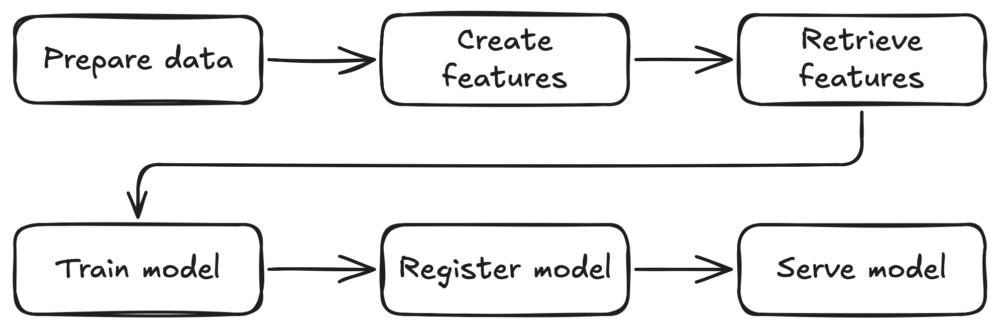

<div class="hero-image">
  
</div>

Are you looking for a practical, reproducible way to take a machine learning project from raw data all the way to a deployed, production-ready model? This post is your blueprint for the AI/ML lifecycle: you'll learn how to use [Kubeflow](https://www.kubeflow.org), Feast, and other open source tools to build a workflow you can run on your laptop and adapt to your own projects.

We'll walk through the entire ML lifecycle—from data preparation to live inference—leveraging the Kubeflow platform to create a cohesive, production-grade MLOps workflow.

## Project Overview

The project implements a complete MLOps workflow for a fraud detection use case. Fraud detection is a critical application in financial services, where organizations need to identify potentially fraudulent transactions in real-time while minimizing false positives that could disrupt legitimate customer activity.

Our fraud detection system leverages machine learning to analyze large volumes of transaction data, learn patterns from historical behavior, and flag suspicious transactions that deviate from normal patterns. The model considers various features such as transaction amounts, location data, merchant information, and user behavior patterns to make predictions. This makes fraud detection an ideal use case for demonstrating MLOps concepts because it requires:

- **Real-time inference**: Fraud detection decisions must be made instantly as transactions occur
- **Feature consistency**: The same features used in training must be available during inference to ensure model accuracy
- **Scalability**: The system must handle high transaction volumes
- **Continuous learning**: Models need regular retraining as fraud patterns evolve
- **Compliance and auditability**: Financial services require comprehensive model tracking and governance

The workflow ingests raw transaction data, proceeds through data preparation and feature engineering, then model training and registration, and finally deploys the model as a production-ready inference service that can evaluate transactions in real-time.

The entire workflow is orchestrated as a Kubeflow Pipeline, which provides a powerful framework for defining, deploying, and managing complex machine learning pipelines on Kubernetes.

Here is a high-level overview of the pipeline:



## A Note on the Data

The pipeline assumes that the initial datasets (`train.csv`, `test.csv`, etc.) are already available. For readers who wish to follow along or generate their own sample data, a script is provided in the `synthetic_data_generation` directory. This script was used to create the initial data for this project but is not part of the automated Kubeflow pipeline itself.

## Why Kubeflow?

This project demonstrates the power of using Kubeflow to abstract away the complexity of Kubernetes infrastructure, allowing AI Engineers, Data Scientists, and ML engineers to focus on what matters most: the data and model performance.

### Key Benefits

**Infrastructure Abstraction**: Instead of manually managing Kubernetes deployments, service accounts, networking, and storage configurations, the pipeline handles all the infrastructure complexity behind the scenes. You define your ML workflow as code, and Kubeflow takes care of orchestrating the execution across your Kubernetes cluster.

**Focus on AI, Not DevOps**: With the infrastructure automated, you can spend your time on the activities that directly impact model performance:

- Experimenting with different feature engineering approaches
- Tuning hyperparameters and model architectures  
- Analyzing prediction results and model behavior
- Iterating on data preparation and validation strategies

**Reproducible and Scalable**: The pipeline ensures that every run follows the same steps with the same environment configurations, making your experiments reproducible. When you're ready to scale up, the same pipeline can run on larger Kubernetes clusters without code changes.

**Production-Ready from Day One**: By using production-grade tools like KServe for model serving, Feast for feature management, and the Model Registry for governance, your development pipeline is already structured for production deployment.

**Portable and Cloud-Agnostic**: The entire workflow runs on standard Kubernetes, making it portable across different cloud providers or on-premises environments. What works on your laptop will work in production.

This approach shifts the cognitive load from infrastructure management to data science innovation, enabling faster experimentation and more reliable production deployments.

---

## Getting Started: Prerequisites and Cluster Setup

Before diving into the pipeline, you need to set up your local environment. This project is designed to run on a local Kubernetes cluster using `kind`.

### Prerequisites

* A container engine, like [Podman](https://podman.io/) or [Docker](https://www.docker.com/get-started).
* [Python](https://www.python.org/downloads/) (3.11 or newer).
* [uv](https://github.com/astral-sh/uv): A fast Python package installer.
* [kubectl](https://kubernetes.io/docs/tasks/tools/install-kubectl/)
* [kind](https://kind.sigs.k8s.io/docs/user/quick-start/#installation)
* [mc (MinIO Client)](https://min.io/docs/minio/linux/reference/minio-mc.html)

> **Note:** This setup was tested on a VM with 12GB RAM, 8 CPUs, and 150GB of disk space.

### 1. Create a Local Kubernetes Cluster

First, create a `kind` cluster. The following command will set up a new cluster with a specific node image compatible with the required components:

```shell
kind create cluster -n fraud-detection-e2e-demo --image kindest/node:v1.31.6
```

### 2. Deploy Kubeflow Pipelines

With your cluster running, the next step is to deploy Kubeflow Pipelines. For this project, the [standalone installation](https://www.kubeflow.org/docs/components/pipelines/operator-guides/installation/#deploying-kubeflow-pipelines) is recommended, as it's lighter and faster to set up than a full Kubeflow deployment.

Follow the official [Kubeflow Pipelines standalone installation guide](https://www.kubeflow.org/docs/components/pipelines/operator-guides/installation/#deploying-kubeflow-pipelines) for the latest instructions.

### 3. Upload the Raw Data to MinIO

[MinIO](https://min.io/) is an open source, S3-compatible object storage system. In this project, MinIO is used to store raw datasets, intermediate artifacts, and model files, making them accessible to all pipeline components running in Kubernetes.

Before uploading, you need to port-forward the MinIO service so it's accessible locally. **Run the following command in a separate terminal window:**

```sh
kubectl port-forward --namespace kubeflow svc/minio-service 9000:9000
```

Next, generate the synthetic data and copy it to `feature_engineering/feature_repo/data/input/` if you haven't done yet. The synthetic data generation script creates the `raw_transaction_datasource.csv` file that serves as the primary input for the pipeline.

```sh
cd synthetic_data_generation
uv sync
source .venv/bin/activate
python synthetic_data_generation.py
cp raw_transaction_datasource.csv ../feature_engineering/feature_repo/data/input
cd ..
```

You should see an output similar to the following. The generation may take a few minutes depending on your hardware.

```sh
Using CPython 3.11.11
Creating virtual environment at: .venv
Resolved 7 packages in 14ms
Installed 6 packages in 84ms
 + numpy==2.3.0
 + pandas==2.3.0
 + python-dateutil==2.9.0.post0
 + pytz==2025.2
 + six==1.17.0
 + tzdata==2025.2
loading data...
generating transaction level data...
        0 of 1,000,000 (0%) complete
  100,000 of 1,000,000 (10%) complete
  200,000 of 1,000,000 (20%) complete
  300,000 of 1,000,000 (30%) complete
  400,000 of 1,000,000 (40%) complete
  500,000 of 1,000,000 (50%) complete
  600,000 of 1,000,000 (60%) complete
  700,000 of 1,000,000 (70%) complete
  800,000 of 1,000,000 (80%) complete
  900,000 of 1,000,000 (90%) complete
```

Next, install and configure the [MinIO Client (`mc`)](https://min.io/docs/minio/linux/reference/minio-mc.html) if you haven't already. Then, set up the alias and upload the datasets:

```sh
mc alias set minio-local http://localhost:9000 minio minio123
mc mb minio-local/mlpipeline
mc cp -r feature_engineering/feature_repo/data/input/ minio-local/mlpipeline/artifacts/feature_repo/data/
mc cp feature_engineering/feature_repo/feature_store.yaml minio-local/mlpipeline/artifacts/feature_repo/
```

This will create the required bucket and directory structure in MinIO and upload your raw datasets, making them available for the pipeline.

> Once the upload is complete, you can stop the port-forward process.

### 4. Install Model Registry, KServe, Spark Operator, and Set Policies

While the datasets are uploading to MinIO, you can proceed to install the remaining Kubeflow components and set up the required Kubernetes policies. The following steps summarize what's in `setup.sh`:

#### Install Model Registry

```sh
kubectl apply -k "https://github.com/kubeflow/model-registry/manifests/kustomize/overlays/db?ref=v0.2.16"
```

#### Install KServe

```sh
kubectl create namespace kserve
kubectl config set-context --current --namespace=kserve
curl -s "https://raw.githubusercontent.com/kserve/kserve/release-0.15/hack/quick_install.sh" | bash
kubectl config set-context --current --namespace=kubeflow
```

#### Install Kubeflow Spark Operator

```sh
helm repo add --force-update spark-operator https://kubeflow.github.io/spark-operator
helm install spark-operator spark-operator/spark-operator \
    --namespace spark-operator \
    --create-namespace

# Make sure the Spark Operator is watching all namespaces:
helm upgrade spark-operator spark-operator/spark-operator --set spark.jobNamespaces={} --namespace spark-operator
```

#### Apply Service Accounts, Roles, Secrets, and Serving Runtime

The `manifests/` directory contains several YAML files that set up the necessary service accounts, permissions, secrets, and runtime configuration for both KServe and Spark jobs. Here's what each file does:

* `kserve-sa.yaml`: Creates a service account for KServe, referencing the MinIO secret.

* `kserve-minio-secret.yaml`: Creates a secret with MinIO credentials and endpoint info, so KServe can access models and artifacts in MinIO.

* `kserve-role.yaml`: Defines a ClusterRole allowing management of KServe InferenceService resources.

* `kserve-role-binding.yaml`: Binds the above ClusterRole to the `pipeline-runner` service account in the `kubeflow` namespace, so pipeline steps can create/manage inference services.

* `serving-runtime.yaml`: Registers a custom ServingRuntime for ONNX models, specifying the container image and runtime configuration for model serving.

* `spark-sa.yaml`: Creates a service account for Spark jobs in the `kubeflow` namespace.

* `spark-role.yaml`: Defines a Role granting Spark jobs permissions to manage pods, configmaps, services, secrets, PVCs, and SparkApplication resources in the namespace.

* `spark-role-binding.yaml`: Binds the above Role to both the `spark` and `pipeline-runner` service accounts in the `kubeflow` namespace.

* `kustomization.yaml`: A Kustomize manifest that groups all the above resources for easy application.

Apply all of these with:

```sh
kubectl apply -k ./manifests -n kubeflow
```

> These resources ensure that KServe and Spark jobs have the right permissions and configuration to run in your Kubeflow environment.

## Building and Understanding the Pipeline Images

In Kubeflow Pipelines, each step of a pipeline runs inside a container. This containerized approach provides several key benefits: isolation between steps, reproducible environments, and the ability to use different runtime requirements for different stages of your pipeline.

While Kubeflow Pipelines provides default images for common tasks, most real-world ML projects require custom images tailored to their specific needs. Each pipeline component in this project uses a specialized container image that includes the necessary dependencies, libraries, and code to execute that particular step of the ML workflow.

This section covers how to build these custom images. For detailed information about what each image does and how the code inside each container works, refer to the individual pipeline step sections that follow.

> **Note:** You only need to build and push these images if you want to modify the code for any of the pipeline components. If you're using the project as-is, you can use the prebuilt images referenced in the pipeline.

The pipeline uses custom container images for the following components:

### Image Locations

* `data_preparation/Containerfile`

* `feature_engineering/Containerfile`

* `pipeline/Containerfile`

* `rest_predictor/Containerfile`

* `train/Containerfile`

### How to Build

You can build each image using Podman or Docker. For example, to build the data preparation image:

```sh
cd data_preparation
podman build -t fraud-detection-e2e-demo-data-preparation:latest .
# or
# docker build -t fraud-detection-e2e-demo-data-preparation:latest .
```

You can also refer to the `build_images.sh` script in the project root to see how to build all images in sequence.

Repeat this process for each component, adjusting the tag and directory as needed.

### Entry points

* **data_preparation:** `python main.py`
* **feature_engineering:** `python feast_feature_engineering.py`
* **pipeline:** Used for orchestrating the pipeline steps (see `fraud-detection-e2e.py`)
* **rest_predictor:** `python predictor.py`
* **train:** `python train.py`

### Pushing Images

After building, push the images to a container registry accessible by your Kubernetes cluster. Update the image references in your pipeline as needed.

## The Kubeflow Pipeline

The main pipeline definition is in `pipeline/fraud-detection-e2e.py`. This file is the entrypoint for the Kubeflow pipeline and orchestrates all the steps described below.

With your environment and permissions set up, you're ready to run the end-to-end pipeline. Let's walk through each stage of the workflow and see how Kubeflow orchestrates the entire machine learning lifecycle—from data preparation to real-time inference.

### 1. Data Preparation with Spark

[Apache Spark](https://spark.apache.org/) is a powerful open source engine for large-scale data processing and analytics. In this project, we use Spark to efficiently process and transform raw transaction data before it enters the ML pipeline.

To run Spark jobs on Kubernetes, we use the [Kubeflow Spark Operator](https://www.kubeflow.org/docs/components/spark-operator/). The Spark Operator makes it easy to submit and manage Spark applications as native Kubernetes resources, enabling scalable, distributed data processing as part of your MLOps workflow.

#### Container Image for Data Preparation

This pipeline step uses a custom container image built from `data_preparation/Containerfile`. The image includes:

* **PySpark and dependencies:** Required libraries for distributed data processing
* **MinIO client libraries:** For reading from and writing to object storage
* **Custom data processing code:** The `main.py` script that implements the data transformation logic

The container runs with the entry point `python main.py`, which orchestrates all the data preparation tasks within the Spark job.

The pipeline begins by launching a Spark job that performs several key data preparation steps, implemented in `data_preparation/main.py`:

#### Combining Datasets

The job reads the raw `train.csv`, `test.csv`, and `validate.csv` datasets, adds a `set` column to each, and combines them:

```python
train_set = spark.read.csv(INPUT_DIR + "train.csv", header=True, inferSchema=True)
test_set = spark.read.csv(INPUT_DIR + "test.csv", header=True, inferSchema=True)
validate_set = spark.read.csv(INPUT_DIR + "validate.csv", header=True, inferSchema=True)
train_set = train_set.withColumn("set", lit("train"))
test_set = test_set.withColumn("set", lit("test"))
validate_set = validate_set.withColumn("set", lit("valid"))

all_sets = train_set.unionByName(test_set).unionByName(validate_set)
```

#### Type Conversion and Feature Engineering

It converts certain columns to boolean types and generates unique IDs:

```python
all_sets = all_sets.withColumn("fraud", col("fraud") == 1.0)
all_sets = all_sets.withColumn("repeat_retailer", col("repeat_retailer") == 1.0)
all_sets = all_sets.withColumn("used_chip", col("used_chip") == 1.0)
all_sets = all_sets.withColumn("used_pin_number", col("used_pin_number") == 1.0)
all_sets = all_sets.withColumn("online_order", col("online_order") == 1.0)

w = Window.orderBy(lit(1))
all_sets = (
    all_sets
    .withColumn("idx", row_number().over(w))
    .withColumn("user_id", concat(lit("user_"), col("idx") - lit(1)))
    .withColumn("transaction_id", concat(lit("txn_"), col("idx") - lit(1)))
    .drop("idx")
)
```

#### Timestamping

The job adds `created` and `updated` timestamp columns:

```python
for date_col in ["created", "updated"]:
    all_sets = all_sets.withColumn(date_col, current_timestamp())
```

#### Point-in-Time Feature Calculation

Using the raw transaction history, the Spark job calculates features such as the number of previous transactions, average/max/stddev of previous transaction amounts, and days since the last/first transaction:

```python
def calculate_point_in_time_features(label_dataset: DataFrame, transactions_df: DataFrame) -> DataFrame:
    # ... (see full code in data_preparation/main.py)
    # Aggregates and joins features for each user at each point in time
```

#### Output

The final processed data is saved as both a CSV (for entity definitions) and a Parquet file (for feature storage) in MinIO:

```python
entity_df.write.option("header", True).mode("overwrite").csv(entity_file_name)
df.write.mode("overwrite").parquet(parquet_file_name)
```

All of this logic is orchestrated by the `prepare_data` component in the pipeline, which launches the Spark job on Kubernetes.

### 2. Feature Engineering with Feast

[Feast](https://feast.dev/) is an open source feature store that lets you manage and serve features for both training and inference, ensuring consistency and reducing the risk of training/serving skew. In machine learning, a "feature" is an individual measurable property or characteristic of the data being analyzed—in our fraud detection case, features include transaction amounts, distances from previous transactions, merchant types, and user behavior patterns that help the model distinguish between legitimate and fraudulent activity.

#### Container Image for Feature Engineering

This pipeline step uses a custom container image built from `feature_engineering/Containerfile`. The image includes:

* **Feast feature store:** The complete Feast installation for feature management
* **Python dependencies:** Required libraries for feature processing and materialization
* **Feature repository definition:** The `repo_definition.py` file that defines the feature views and entities
* **MinIO client libraries:** For uploading the materialized features and online store to object storage

The container runs with the entry point `python feast_feature_engineering.py`, which handles the Feast operations including applying feature definitions, materializing features, and uploading the results to MinIO.

After data preparation, the pipeline uses Feast to register, materialize, and store features for downstream steps. This process starts with defining the features you want to use. For example, in `feature_repo/repo_definition.py`, you'll find a `FeatureView` that lists features like `distance_from_home` and `ratio_to_median_purchase_price`:

```python
transactions_fv = FeatureView(
    name="transactions",
    entities=[transaction],
    schema=[
        Field(name="user_id", dtype=feast.types.String),
        Field(name="distance_from_home", dtype=feast.types.Float32),
        Field(name="ratio_to_median_purchase_price", dtype=feast.types.Float32),
        # ... other features
    ],
    online=True,
    source=transaction_source,
)
```

Once the features are defined, the pipeline runs two key Feast commands. First, it applies the feature definitions to the store:

```python
subprocess.run(["feast", "apply"], cwd=feature_repo_path, check=True)
```

Then, it materializes the computed features from the Parquet file into Feast's online store, making them available for real-time inference:

```python
subprocess.run(["feast", "materialize", start_date, end_date], cwd=feature_repo_path, check=True)
```

Finally, the resulting feature data and the online store database are uploaded to MinIO, so they're accessible to the rest of the pipeline:

```python
client.fput_object(MINIO_BUCKET, object_path, local_file_path)
```

By using Feast in this way, you ensure that the same features are available for both model training and real-time predictions, making your ML workflow robust and reproducible.

### 3. Model Training

With the features materialized in Feast, the next step is to train the fraud detection model. The pipeline's `train_model` component retrieves the processed features and prepares them for training. The features used include behavioral and transaction-based signals such as `distance_from_last_transaction`, `ratio_to_median_purchase_price`, `used_chip`, `used_pin_number`, and `online_order`.

#### Container Image for Model Training

This pipeline step uses a custom container image built from `train/Containerfile`. The image includes:

* **Machine learning libraries:** TensorFlow/Keras for neural network training, scikit-learn for data preprocessing
* **ONNX Runtime:** For converting and exporting the trained model to ONNX format
* **PySpark:** For loading and processing the feature data from Parquet files
* **MinIO client libraries:** For downloading features and uploading the trained model artifacts

The container runs with the entry point `python train.py`.

The training script loads the features, splits the data into train, validation, and test sets, and scales the input features for better model performance:

```python
train_features = features.filter(features["set"] == "train")
validate_features = features.filter(features["set"] == "valid")
test_features = features.filter(features["set"] == "test")
# ... select and scale features ...
```

It then builds and trains a neural network model using Keras, handling class imbalance and exporting the trained model in ONNX format for portable, high-performance inference:

```python
model = build_model(feature_indexes)
model.fit(x_train, y_train, epochs=2, validation_data=(x_val, y_val), class_weight=class_weights)
save_model(x_train, model, model_path)  # Exports to ONNX
```

By structuring the training step this way, the pipeline ensures that the model is trained on the same features that will be available at inference time, supporting a robust and reproducible MLOps workflow.

### 4. Model Registration

Once the model is trained, it's important to track, version, and manage it before deploying to production. This is where the [Kubeflow Model Registry](https://www.kubeflow.org/docs/components/model-registry/) comes in. The Model Registry acts as a centralized service for managing machine learning models and their metadata, making it easier to manage deployments, rollbacks, and audits.

#### Container Image for Model Registration

This pipeline step uses a custom container image built from `pipeline/Containerfile`. The image includes:

* **Kubeflow Pipelines SDK:** For pipeline orchestration and component definitions
* **Model Registry client:** Python libraries for interacting with the Kubeflow Model Registry
* **Pipeline orchestration code:** The core pipeline definition and component functions

The container is used as the base image for the `register_model` component, which executes the model registration logic inline within the pipeline definition. This approach allows the registration step to run lightweight operations without requiring a separate, specialized container image.

In the pipeline, the `register_model` component takes the trained model artifact and registers it in the Model Registry. This process includes:

* **Assigning a unique name and version:** The model is registered with a name (e.g., `"fraud-detection"`) and a version, which is typically tied to the pipeline run ID for traceability.
* **Storing metadata:** Along with the model artifact, metadata such as the model format, storage location, and additional tags or descriptions can be stored for governance and reproducibility.
* **Making the model discoverable:** Registered models can be easily found and referenced for deployment, monitoring, or rollback.

Here's how the registration step is implemented in the pipeline:

```python
@dsl.component(base_image=PIPELINE_IMAGE)
def register_model(model: Input[Model]) -> NamedTuple('outputs', model_name=str, model_version=str):
    from model_registry import ModelRegistry

    registry = ModelRegistry(
        server_address="http://model-registry-service.kubeflow.svc.cluster.local",
        port=8080,
        author="fraud-detection-e2e-pipeline",
        user_token="non-used",
        is_secure=False
    )

    model_name = "fraud-detection"
    model_version = "{{workflow.uid}}"

    registry.register_model(
        name=model_name,
        uri=model.uri,
        version=model_version,
        model_format_name="onnx",
        model_source_class="pipelinerun",
        model_source_group="fraud-detection",
        model_source_id="{{workflow.uid}}",
        model_source_kind="kfp",
        model_source_name="fraud-detection-e2e-pipeline",
    )

    return (model_name, model_version)
```

By registering the model in this way, you ensure that every model deployed for inference is discoverable, reproducible, and governed—an essential part of any production-grade MLOps workflow.

### 5. Real-Time Inference with KServe

The final stage of the pipeline is deploying the registered model as a real-time inference service using KServe. [KServe](https://kserve.github.io/website/) is an open source model serving platform for Kubernetes that standardizes how you deploy, scale, and manage machine learning models in production.

#### Container Image for Real-Time Inference

This pipeline step uses a custom container image built from `rest_predictor/Containerfile`. The image includes:

* **KServe Python SDK:** For building custom model serving endpoints
* **ONNX Runtime:** For running the trained model in ONNX format
* **Feast feature store client:** For retrieving real-time features during inference
* **Model Registry client:** For downloading the registered model artifacts
* **Custom predictor code:** The `predictor.py` script that implements the inference logic

The container runs with the entry point `python predictor.py`.

The pipeline's `serve` component creates a KServe InferenceService using this custom Python predictor.

This is done by creating a Kubernetes custom resource (CR) of kind `InferenceService`, which tells KServe how to deploy and manage the model server. The resource specifies the container image, command, arguments, and service account to use for serving the model.

Here's how the InferenceService is defined and created in the pipeline:

```python
inference_service = kserve.V1beta1InferenceService(
    api_version=kserve.constants.KSERVE_GROUP + "/v1beta1",
    kind="InferenceService",
    metadata=client.V1ObjectMeta(
        name=model_name + "-" + job_id,
        namespace=kserve.utils.get_default_target_namespace(),
        labels={
            "modelregistry/registered-model-id": model.id,
            "modelregistry/model-version-id": model_version.id
        },
    ),
    spec=kserve.V1beta1InferenceServiceSpec(
        predictor=kserve.V1beta1PredictorSpec(
            service_account_name="kserve-sa",
            containers=[
                V1Container(
                    name="inference-container",
                    image=rest_predictor_image,
                    command=["python", "predictor.py"],
                    args=["--model-name", model_name, "--model-version", model_version_name]
                )
            ]
        )
    ),
)
ks_client = kserve.KServeClient()
ks_client.create(inference_service)
```

The custom predictor does more than just run the model: it also integrates directly with the Feast online feature store. When a prediction request arrives with a `user_id`, the predictor first fetches the user's latest features from Feast and then feeds them to the ONNX model for inference. Here's a simplified view of the predictor's logic:

```python
class ONNXModel(kserve.Model):
    def load(self):
        # ... download model and initialize Feast feature store ...
        self.feature_store = FeatureStore(repo_path=feature_repo_path)
        self.model = ort.InferenceSession("/app/model")
        self.ready = True

    async def predict(self, payload: Dict) -> Dict:
        user_id = payload.get("user_id")
        feature_dict = self.feature_store.get_online_features(
            entity_rows=[{"user_id": user_id}],
            features=features_to_request,
        ).to_dict()
        input_data = np.array([
            [
                feature_dict["distance_from_last_transaction"][0],
                feature_dict["ratio_to_median_purchase_price"][0],
                feature_dict["used_chip"][0],
                feature_dict["used_pin_number"][0],
                feature_dict["online_order"][0],
            ]
        ], dtype=np.float32)
        result = self.model.run(None, {self.model.get_inputs()[0].name: input_data})
        return {"user_id": user_id, "prediction": result[0].tolist()}
```

> **Note:**  
> By default, KServe supports several model serving runtimes, including [Triton Inference Server](https://github.com/triton-inference-server/server) (often used via the `kserve-tritonserver` runtime). However, the official Triton server does not support macOS/arm64, which is why this project uses a custom Python predictor for local development and demonstration.  
> If you are running on a supported platform (such as x86_64 Linux), you may want to use the `kserve-tritonserver` runtime for production workloads, as it offers high performance and native ONNX support.  
> If you want to use Feast for online feature retrieval at inference time, a custom Python predictor (like the one in this repo) is the most straightforward approach. If you use the standard `kserve-tritonserver` runtime, you would need to implement feature fetching as a [Triton Python backend](https://github.com/triton-inference-server/python_backend) or as a pre-processing step outside of Triton, since Triton itself does not natively integrate with Feast.

By structuring the inference step this way, the pipeline ensures that the deployed model always uses the freshest features for each prediction, supporting robust, real-time fraud detection.

## Importing and Running the Pipeline

Once your environment is set up and the data is uploaded, you're ready to run the pipeline.

### Import the Pipeline

1. Open the Kubeflow Pipelines UI (usually at [http://localhost:8080](http://localhost:8080) if you used the default port-forward).
2. Click **Pipelines** in the sidebar, then click **Upload pipeline**.
3. Upload the compiled pipeline YAML file (e.g., `pipeline/fraud-detection-e2e.yaml`).

### Run the Pipeline

1. After uploading, click on your pipeline in the list.
2. Click **Create run**.
3. Optionally customize the run name and description (the defaults work fine), then click **Start**.

You can monitor the progress and view logs for each step directly in the UI.

## Testing the Live Endpoint

With the inference service running, you can now interact with your deployed model in real time. Let's see how to send prediction requests and interpret the results.

Before sending requests, port-forward the inference pod so the service is accessible locally. **Run this command in a separate terminal window:**

```sh
kubectl -n kubeflow get pods -l component=predictor -o jsonpath="{.items[*].metadata.name}" | tr ' ' '\n' | grep '^fraud-detection' | head -n1 | xargs -I {} kubectl port-forward -n kubeflow pod/{} 8081:8080
```

With the port-forward active, you can now send a request to the model:

```sh
curl -X POST http://localhost:8081/v1/models/onnx-model:predict \
-H "Content-Type: application/json" \
-d '{"user_id": "user_0"}'
```

The service retrieves features for `user_0`, runs a prediction, and returns the fraud probability.

```json
{"user_id":"user_0","prediction":[[0.8173668384552002]]}
```

> Note: The result of the prediction may vary depending on the initial raw data you uploaded.  
> Try sending requests with a few different `user_id` values (e.g., `"user_1"`, `"user_2"`, etc.) to see how the predictions change.

## Conclusion

This post has walked you through a complete, reproducible AI/ML workflow—from raw data to a live model serving endpoint—using Kubeflow and open source tools. Along the way, you've seen how to prepare data with Spark, manage features with Feast, train and register models, and deploy real-time inference services with KServe, all orchestrated in a portable pipeline you can run on your own laptop.

By following this blueprint, you can adapt and extend the process for your own machine learning projects, whether you're working locally or scaling up to production. Kubeflow's modular platform and ecosystem make it possible to manage the entire ML lifecycle in a consistent, automated, and open way.

Ready to try it yourself? The complete source code for this project is available on [GitHub](https://github.com/hbelmiro/fraud_detection_e2e_demo/tree/kubeflow).
