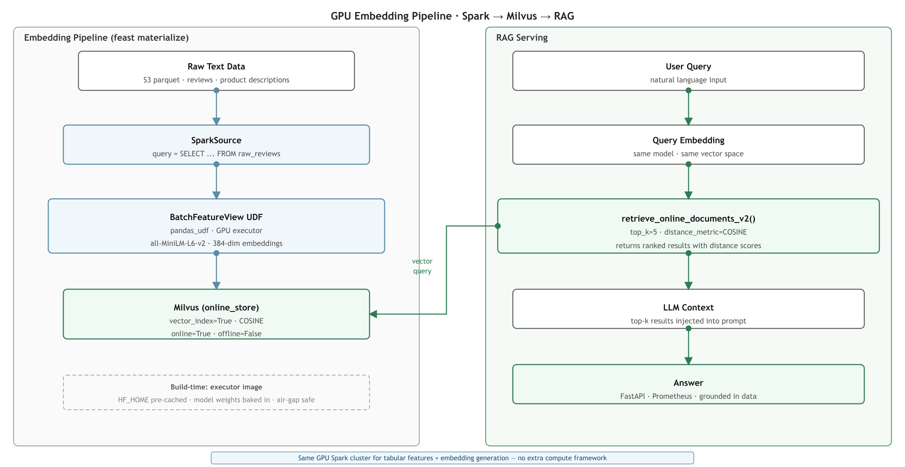

# GPU-Accelerated Embedding Pipelines with Feast, Spark & Milvus

Your ML infrastructure already runs Spark. You use it for tabular feature engineering: user aggregations, item statistics, interaction labels. `BatchFeatureView` with `SparkComputeEngine` handles all of it.

Now the product team wants semantic search. Users should be able to ask questions and get results ranked by meaning, not just keywords. The answer is embeddings — dense vector representations of text, stored in a vector database, retrieved by cosine similarity.

Your infrastructure team scopes it out: you need a model inference step (sentence-transformers), a vector store (Milvus), and something to orchestrate the pipeline at scale. Someone suggests adding Ray to the stack. But your Spark cluster already has GPU nodes. The A100s sitting idle between nightly materialization runs could be doing this work.

This post shows how to build the entire embedding pipeline — generation, materialization, and serving — as a first-class Feast `BatchFeatureView`, using the same Spark GPU cluster you already operate.

<div class="hero-image">
  
</div>

---
> **Ray or Spark?** If you're starting fresh without existing Spark infrastructure, Feast's [Ray integration](./feast-ray-distributed-processing) is an excellent entry point — it's purpose-built for distributed embedding generation with minimal setup. This post is specifically for teams already running `SparkComputeEngine` for tabular feature engineering who want to add semantic search without introducing a second compute framework.

---

## How It All Fits Together

```
Raw text data (S3 parquet)
        │
        ▼
@batch_feature_view (TransformationMode.PYTHON)
        │
  pandas_udf (_embed_udf)
  sentence-transformers on GPU executor pods
        │
        ▼
Milvus (online store, IVF_FLAT COSINE index)
        │
        ▼
retrieve_online_documents_v2()
```

One `feast materialize` call. No separate Ray cluster. No custom Airflow DAG for embedding generation. The same scheduling, registry, and serving primitives you already use for tabular features handle embeddings end-to-end.

---

## Step 1: Define the Embedding Source and Entity

> **Data Scientist** — *"I want to embed my text corpus once per refresh cycle and query results at serving time — without managing a separate embedding pipeline."*

The `SparkSource` query pre-processes raw text into the form the embedding model expects. In this case, concatenating review title and body, generating a stable hash ID per document:

```python
from feast.infra.offline_stores.contrib.spark_offline_store.spark_source import SparkSource
from feast import Entity
from feast.value_type import ValueType

review = Entity(
    name="review_id",
    value_type=ValueType.STRING,
    description="Unique document identifier for vector lookup",
)

reviews_source = SparkSource(
    name="reviews_source",
    query=(
        "SELECT *, "
        "CAST(timestamp / 1000 AS TIMESTAMP) AS event_timestamp, "
        "SHA2(CONCAT_WS('_', user_id, COALESCE(parent_asin, asin), CAST(timestamp AS STRING)), 256) AS review_id "
        "FROM parquet.`s3a://data-lake/raw/reviews/*/`"
    ),
    timestamp_field="event_timestamp",
)
```

The SHA2 hash produces a stable, deterministic `review_id` from user + item + timestamp — no UUID generation, reproducible across runs.

---

## Step 2: Define the Embedding BatchFeatureView

> **Data Scientist** — *"I want to write the embedding logic as a Python function and have Feast handle when it runs, how it scales, and where the vectors land."*

The embedding UDF is a `pandas_udf` — Spark serializes batches of text to the Python worker as a `pd.Series`, the model encodes them, and the results come back as a `pd.Series` of float lists:

```python
from feast.batch_feature_view import batch_feature_view
from feast.field import Field
from feast.transformation.mode import TransformationMode
from feast.types import Array, Float32, Float64, String
from datetime import timedelta

EMBEDDING_MODEL = "sentence-transformers/all-MiniLM-L6-v2"
EMBEDDING_DIM = 384

@batch_feature_view(
    name="review_embeddings",
    entities=[review],
    source=reviews_source,
    mode=TransformationMode.PYTHON,
    online=True,    # Written to Milvus for vector similarity search
    offline=False,  # Embeddings not needed for point-in-time training joins
    schema=[
        Field(name="item_id", dtype=String),
        Field(name="user_id", dtype=String),
        Field(name="rating", dtype=Float64),
        Field(name="review_title", dtype=String),
        Field(name="embed_text", dtype=String),
        Field(
            name="embedding",
            dtype=Array(Float32),
            vector_index=True,
            vector_search_metric="COSINE",
        ),
    ],
    ttl=timedelta(days=90),
)
def review_embeddings(df):
    import pandas as pd
    from pyspark.sql import functions as F
    from pyspark.sql.types import ArrayType, FloatType

    # Concatenate title + body into the text to embed
    df = df.withColumn(
        "embed_text",
        F.concat_ws(
            " ",
            F.coalesce(F.col("title"), F.lit("")),
            F.coalesce(F.col("text"), F.lit("")),
        ),
    ).filter(F.length("embed_text") >= 20)

    staging = df.select(
        F.col("review_id"),
        F.col("parent_asin").alias("item_id"),
        F.col("user_id"),
        F.col("rating").cast("double"),
        F.col("title").alias("review_title"),
        F.col("embed_text").substr(1, 511).alias("embed_text"),
        F.current_timestamp().alias("event_timestamp"),
    )

    @F.pandas_udf(ArrayType(FloatType()))
    def _embed_udf(texts: pd.Series) -> pd.Series:
        from sentence_transformers import SentenceTransformer
        # Cache on the function object — loaded once per Python worker process,
        # not once per Arrow batch. Avoids repeated 90MB weight loads.
        if not hasattr(_embed_udf, "_model"):
            _embed_udf._model = SentenceTransformer(EMBEDDING_MODEL)
        embeddings = _embed_udf._model.encode(
            texts.tolist(),
            normalize_embeddings=True,
            batch_size=64,
            show_progress_bar=False,
        )
        return pd.Series([e.tolist() for e in embeddings])

    return staging.withColumn("embedding", _embed_udf(F.col("embed_text")))
```

A few design decisions worth noting:

- **`online=True, offline=False`**: embeddings go to Milvus for serving. They're not needed for point-in-time training joins — that's what user/item tabular features are for.
- **`normalize_embeddings=True`**: produces unit vectors, making cosine similarity equivalent to dot product — faster at query time in most vector databases.
- **`batch_size=64`**: controls how many texts the model processes per GPU forward pass. Tune based on GPU memory; larger batches improve throughput until you hit VRAM limits.
- **`substr(1, 511)`**: truncates embed_text to 511 characters before encoding — `all-MiniLM-L6-v2` has a 512-token limit; truncation here avoids silent tokenizer truncation downstream.
- **Model caching via `hasattr`**: `pandas_udf` is called once per Arrow batch, not once per partition. Without caching, the 90MB model weights would be loaded from disk on every batch call. Storing the model on the function object (`_embed_udf._model`) means it's loaded once per Python worker process and reused across all batches that worker handles.

---

## Step 3: Configure Milvus as the Online Store

> **MLOps Engineer** — *"I want vector similarity search served by Milvus with the same Feast API I already use for tabular feature retrieval."*

```yaml
# feature_store.yaml — Milvus configuration
online_store:
  type: milvus
  host: milvus.feast-system.svc.cluster.local
  port: 19530
  vector_enabled: true
  embedding_dim: 384
  index_type: "IVF_FLAT"
  metric_type: "COSINE"
  index_params:
    nlist: 1024
  search_params:
    nprobe: 16
```

For IVF_FLAT with COSINE metric:
- `nlist: 1024` — number of Voronoi clusters. Roughly `sqrt(n_vectors)` is a good starting point for up to 1M vectors; scale up for larger collections.
- `nprobe: 16` — clusters searched per query. Higher values improve recall at the cost of latency. 16 gives >99% recall at reasonable latency for most collection sizes.

---

## Step 4: Build the Executor Image with Model Weights

> **MLOps Engineer** — *"Every executor pod downloading 90MB of model weights at startup creates a race condition under load. Bake the weights into the image."*

For GPU executor pods that run the embedding UDF, extend the RAPIDS executor image with `sentence-transformers` and pre-cached model weights:

```dockerfile
FROM your-registry/feast-spark-executor-rapids:latest

USER 0

RUN pip install --no-cache-dir sentence-transformers==3.4.1

# Cache model weights at build time — avoids cold-start downloads in air-gapped clusters
# or when many executor pods start simultaneously
ENV HF_HOME=/opt/hf-cache
ENV TRANSFORMERS_CACHE=/opt/hf-cache

RUN python3 -c "
from sentence_transformers import SentenceTransformer
model = SentenceTransformer('sentence-transformers/all-MiniLM-L6-v2')
emb = model.encode(['test'])
assert len(emb[0]) == 384
print('Model cached: dim=384')
" && chmod -R g+r /opt/hf-cache

USER 1001
```

This is critical for Kubernetes deployments: if 4 executor pods all start simultaneously and each tries to download 90MB from HuggingFace Hub (or your model registry), you get a race condition between download completion and the Spark task deadline.

---

## Step 5: Run Your First Materialization

> **MLOps Engineer** — *"I want a single command that generates and stores all embedding vectors — on a schedule, incrementally, without touching any custom pipeline code."*

```bash
feast apply

# Materialize embeddings for a date range
feast materialize 2024-01-01T00:00:00 2024-12-31T23:59:59 \
  --feature-views review_embeddings
```

`feast materialize` runs the `review_embeddings` BFV: the `reviews_source` query reads raw parquet from S3, the `review_embeddings()` function runs on each partition via `foreachPartition`, `_embed_udf` executes on GPU executor pods in batches of 64, and the resulting 384-dim vectors are written to Milvus.

For incremental updates (new reviews since last run):

```bash
feast materialize-incremental $(date -u +"%Y-%m-%dT%H:%M:%S") \
  --feature-views review_embeddings
```

---

## Step 6: Serve Semantic Search at Query Time

> **Data Scientist** — *"I want to retrieve the most semantically similar documents for a user's query — with the same Feast API I use for every other feature."*

At serving time, encode the query with the same model used for materialization, then call `retrieve_online_documents_v2()`:

```python
from feast import FeatureStore
from sentence_transformers import SentenceTransformer

store = FeatureStore(repo_path=".")
embed_model = SentenceTransformer("sentence-transformers/all-MiniLM-L6-v2")

def semantic_search(query: str, top_k: int = 5) -> list[dict]:
    query_embedding = embed_model.encode(query).tolist()

    result_df = store.retrieve_online_documents_v2(
        features=[
            "review_embeddings:embedding",
            "review_embeddings:embed_text",
            "review_embeddings:item_id",
            "review_embeddings:rating",
            "review_embeddings:review_title",
        ],
        query=query_embedding,
        top_k=top_k,
        distance_metric="COSINE",
    ).to_df()

    return result_df.to_dict(orient="records")
```

The `retrieve_online_documents_v2()` call routes to Milvus, performs an approximate nearest-neighbor search using the IVF_FLAT index, and returns the top-k results with their feature values. The same features available at materialization time — `item_id`, `rating`, `review_title`, `embed_text` — are returned alongside the similarity score.

For a FastAPI serving endpoint with Prometheus metrics:

```python
from contextlib import asynccontextmanager
from fastapi import FastAPI
from feast import FeatureStore
from prometheus_client import Histogram, make_asgi_app
from sentence_transformers import SentenceTransformer

RETRIEVAL_DURATION = Histogram(
    "rag_retrieval_duration_seconds",
    "Feast/Milvus vector search latency",
    buckets=[.01, .025, .05, .1, .25, .5, 1],
)

store: FeatureStore | None = None
embed_model: SentenceTransformer | None = None

@asynccontextmanager
async def lifespan(app: FastAPI):
    global store, embed_model
    store = FeatureStore(repo_path=".")
    embed_model = SentenceTransformer("sentence-transformers/all-MiniLM-L6-v2")
    yield

app = FastAPI(lifespan=lifespan)
app.mount("/metrics", make_asgi_app())

@app.post("/search")
def search(query: str, top_k: int = 5):
    with RETRIEVAL_DURATION.time():
        query_vec = embed_model.encode(query).tolist()
        return store.retrieve_online_documents_v2(
            features=[
                "review_embeddings:embedding",
                "review_embeddings:embed_text",
                "review_embeddings:item_id",
            ],
            query=query_vec,
            top_k=top_k,
            distance_metric="COSINE",
        ).to_df().to_dict(orient="records")
```

---

## GPU vs CPU: RAPIDS Acceleration Benchmark

> 📊 **Coming soon:** end-to-end materialization benchmarks for the embedding BFV comparing:
> - CPU-only Spark executors (`local[*]`, 8 cores)
> - k8s:// Spark executors, CPU only
> - k8s:// Spark executors with RAPIDS GPU plugin (A100, CUDA 13)
>
> Metrics: total materialization time, vectors/second throughput, cost per million embeddings. Results will be added to this post.

---

## What You Can Build With This

> **Data Scientist + MLOps Engineer** — *"Tabular features and semantic search from the same pipeline, the same registry, the same materialization schedule, the same serving API."*

**One cluster, two workloads.** Tabular BFVs (user aggregations, item statistics) and embedding BFVs (semantic search vectors) run on the same Spark GPU cluster, scheduled by the same `feast materialize` command. GPU nodes that sit idle between tabular feature runs generate embeddings during those windows.

**No training-serving skew for retrieval.** The embedding model used at materialization time is the same model used at query time — both are `sentence-transformers/all-MiniLM-L6-v2`. The Feast registry ensures the feature view definition, including the transformation logic, is versioned and consistent across runs.

**Scale to millions of vectors.** With memory-bounded, chunked writes, materializing 8M+ 384-dim embedding vectors to Milvus is practical on a 2-pod GPU Spark cluster without OOMKill.

**Incremental updates.** `feast materialize-incremental` only processes new documents since the last materialization. Embedding generation doesn't re-run on the full corpus every refresh cycle — only on newly ingested data.

**Extend to RAG.** The same pattern extends naturally to full RAG pipelines: retrieve similar documents via `retrieve_online_documents_v2()`, combine with user context features from Redis via `get_online_features()`, and pass the assembled context to an LLM. Feast manages both the vector retrieval and the entity-based feature retrieval through a unified API.

---

## Getting Started

```bash
pip install "feast[spark,milvus]"
```

Configure Milvus as your online store, define your embedding BFV with `vector_index=True` on the embedding field, and run:

```bash
feast apply
feast materialize-incremental $(date -u +"%Y-%m-%dT%H:%M:%S")
```

See also:
- [BatchFeatureView documentation](https://docs.feast.dev/reference/batch-feature-view)
- [Milvus online store reference](https://docs.feast.dev/reference/online-stores/milvus)
- [retrieve_online_documents_v2 API](https://docs.feast.dev/reference/feature-retrieval)
- [RAG with Feast overview](./rag-with-feast)

---

## Share Your Feedback

We want to hear from you! Try the GPU embedding pipeline and tell us:

- Which embedding models and vector stores you're using with Feast + Spark
- How `feast materialize-incremental` fits into your embedding refresh workflow
- What RAG patterns you're building on top of `retrieve_online_documents_v2()`

Join the conversation on [GitHub](https://github.com/feast-dev/feast) or in the [Feast Slack community](https://slack.feast.dev). Your feedback directly shapes what we build next.
