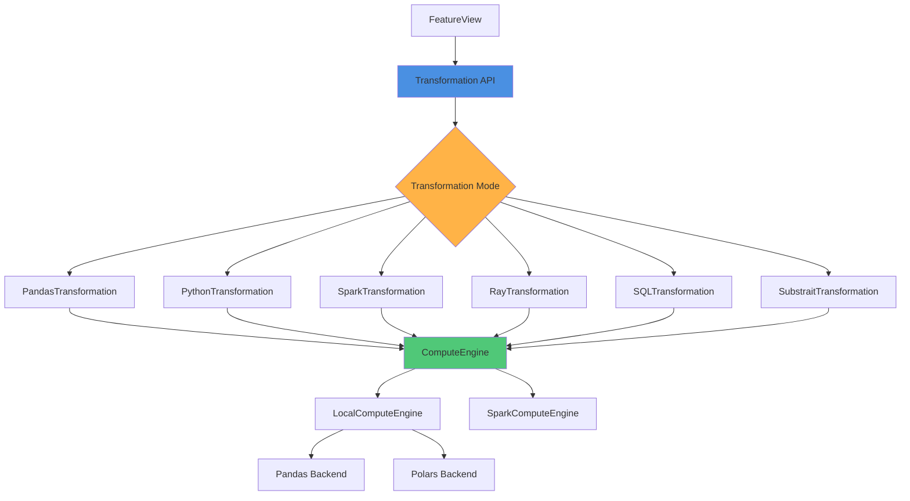
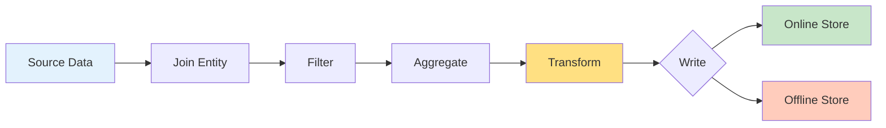

<div class="hero-image">
  
</div>

# Introducing Feast's Unified Transformation Framework 🚀

*Special thanks to Hao Xu (@HaoXuAI) for architecting and implementing the transformation framework, and to the Feast maintainers for their guidance and reviews.*

The Feast team is excited to announce a major architectural improvement: a **unified transformation framework** that revolutionizes how feature transformations are defined and executed in Feast. This framework provides a consistent API across multiple compute engines while maintaining flexibility for diverse use cases.

## The Challenge: Fragmented Transformation APIs

Before this enhancement, Feast users faced several challenges when implementing feature transformations:

- **Inconsistent APIs**: Different transformation modes required different code patterns
- **Limited Compute Options**: Transformations were tightly coupled to specific execution contexts
- **Scalability Concerns**: Moving from local development to production often required rewriting transformation logic
- **Complex Orchestration**: Managing transformations across offline stores, online stores, and feature servers was complex

## The Solution: A Unified Transformation Framework

The new transformation framework introduces a clean, extensible architecture that addresses these challenges head-on.

### Core Components



### 1. Transformation API

The `Transformation` class provides a unified interface for defining feature transformations with multiple execution modes:

```python
from feast.transformation.base import Transformation
from feast.transformation.mode import TransformationMode

# Define a transformation using Pandas
pandas_transformation = Transformation(
    mode=TransformationMode.PANDAS,
    udf=lambda df: df.assign(new_feature=df['feature1'] + df['feature2']),
    udf_string="lambda df: df.assign(new_feature=df['feature1'] + df['feature2'])"
)

# Or use the decorator for cleaner code
@transformation(mode=TransformationMode.SPARK)
def transform_features(df: DataFrame) -> DataFrame:
    df = df.withColumn("sum_conv_rate", df["sum_conv_rate"] * 2)
    df = df.withColumn("avg_acc_rate", df["avg_acc_rate"] * 2)
    return df

# Apply to a FeatureView
feature_view = FeatureView(
    name="driver_stats",
    entities=[driver],
    feature_transformation=transform_features,
    schema=[...],
    source=data_source,
)
```

### 2. Multiple Transformation Modes

The framework supports six transformation modes, each optimized for different use cases:

#### **Python Transformation**
Best for simple, row-level operations with minimal dependencies.

```python
from feast.transformation.mode import TransformationMode

python_transformation = Transformation(
    mode=TransformationMode.PYTHON,
    udf=lambda row: {"total": row["feature1"] + row["feature2"]},
    udf_string="lambda row: {'total': row['feature1'] + row['feature2']}"
)
```

#### **Pandas Transformation**
Ideal for local development and small to medium datasets.

```python
pandas_transformation = Transformation(
    mode=TransformationMode.PANDAS,
    udf=lambda df: df.assign(scaled_feature=df['feature'] * 1.5),
    udf_string="lambda df: df.assign(scaled_feature=df['feature'] * 1.5)"
)
```

#### **Spark Transformation**
Perfect for large-scale distributed processing with both DataFrame and SQL support.

```python
# Using Spark DataFrames
spark_transformation = Transformation(
    mode=TransformationMode.SPARK,
    udf=remove_extra_spaces,
    udf_string="remove extra spaces"
)

# Using Spark SQL
spark_sql_transformation = Transformation(
    mode=TransformationMode.SPARK_SQL,
    udf=remove_extra_spaces_sql,
    udf_string="remove extra spaces sql"
)
```

#### **Ray Transformation**
For distributed computing with Python-native APIs.

```python
ray_transformation = Transformation(
    mode=TransformationMode.RAY,
    udf=process_features,
    udf_string="process_features"
)
```

#### **SQL Transformation**
Direct SQL queries for database-native processing.

```python
sql_transformation = Transformation(
    mode=TransformationMode.SQL,
    udf=sql_query_function,
    udf_string="SELECT * FROM features WHERE value > 0"
)
```

#### **Substrait Transformation**
Cross-platform query execution using Substrait protocol.

```python
substrait_transformation = Transformation(
    mode=TransformationMode.SUBSTRAIT,
    udf=substrait_plan,
    udf_string="substrait plan"
)
```

### 3. Compute Engine Architecture

The **Compute Engine** is the execution layer that handles feature generation workflows. It builds execution plans as Directed Acyclic Graphs (DAGs) called `FeatureBuilder`, which orchestrate:

1. **Transformations**: Custom user-defined functions
2. **Aggregations**: Built-in aggregation operations
3. **Joins**: Entity joins and feature view combinations
4. **Filters**: Point-in-time correctness, TTL filtering, and custom expressions

```python
from feast.infra.materialization.compute_engine import SparkComputeEngine

# Create a materialization task
task = MaterializationTask(
    project=environment.project,
    feature_view=driver_stats_fv,
    start_time=now - timedelta(days=1),
    end_time=now,
)

# Execute using Spark Compute Engine
engine = SparkComputeEngine(
    repo_config=environment.config,
    offline_store=SparkOfflineStore(),
    online_store=online_store,
    registry=registry,
)

job = engine.materialize(task)
```

#### LocalComputeEngine

The `LocalComputeEngine` supports both Pandas and Polars backends, making it perfect for:
- Local development and testing
- Small to medium datasets
- Rapid prototyping

#### SparkComputeEngine

The `SparkComputeEngine` leverages Apache Spark's distributed processing capabilities for:
- Large-scale production workloads
- Processing terabytes of data
- Integration with existing Spark infrastructure

### 4. Feature View Integration

Feature transformations integrate seamlessly with Feast's feature views:

```python
from feast import FeatureView, Field, Aggregation
from feast.types import Float32, Int64
from datetime import timedelta

driver_stats_fv = FeatureView(
    name="driver_hourly_stats",
    entities=[driver],
    
    # Define aggregations
    aggregations=[
        Aggregation(column="conv_rate", function="sum"),
        Aggregation(column="acc_rate", function="avg"),
    ],
    
    # Apply transformation
    feature_transformation=transform_features,
    
    # Configure TTL for time-based filtering
    ttl=timedelta(days=3),
    
    # Schema definition
    schema=[
        Field(name="conv_rate", dtype=Float32),
        Field(name="acc_rate", dtype=Float32),
        Field(name="avg_daily_trips", dtype=Int64),
    ],
    
    # Write to online and/or offline stores
    online=True,
    offline=True,
    
    source=data_source,
)
```

## Feature Build Flow

The compute engine executes feature generation in a well-defined sequence:

1. **Join with Entity**: Join source data with entity information
2. **Filter Data**: Apply point-in-time correctness, TTL filters, and custom expressions
3. **Aggregate Features**: Compute aggregations over time windows
4. **Transform Features**: Execute user-defined transformations
5. **Write Results**: Persist to online and/or offline stores



## Key Benefits

### 🎯 **Unified API**
Write transformation logic once and run it across different compute engines without code changes.

### ⚡ **Performance Optimization**
Choose the right compute engine for your workload:
- Local development: Pandas/Polars
- Production scale: Spark
- Distributed Python: Ray

### 🔧 **Flexibility**
Mix and match transformation modes within the same project based on your needs.

### 📦 **Serialization Support**
Transformations are serializable using `dill`, enabling:
- Version control of transformation logic
- Deployment across distributed systems
- Transformation lifecycle management

### 🔄 **Backward Compatibility**
Existing On Demand Feature Views continue to work while benefiting from the new infrastructure.

## Migration Guide

### From Legacy On Demand Feature Views

If you're currently using On Demand Feature Views with the `udf` parameter:

```python
# Legacy approach
@on_demand_feature_view(
    sources=[source],
    schema=[Field(name="output", dtype=Float64)],
    mode="pandas"
)
def my_odfv(features_df: pd.DataFrame) -> pd.DataFrame:
    return features_df.assign(output=features_df["input"] * 2)
```

The new framework automatically converts this to use the `Transformation` class internally, so no immediate changes are required. However, you can explicitly use the new API:

```python
# New approach (recommended)
@transformation(mode=TransformationMode.PANDAS)
def my_transformation(features_df: pd.DataFrame) -> pd.DataFrame:
    return features_df.assign(output=features_df["input"] * 2)

my_fv = FeatureView(
    name="my_feature_view",
    feature_transformation=my_transformation,
    schema=[Field(name="output", dtype=Float64)],
    source=source,
)
```

### Adopting Compute Engines

To leverage the new compute engines for materialization:

```python
from feast.infra.materialization.compute_engine import get_compute_engine

# Get the appropriate engine based on config
engine = get_compute_engine(
    repo_config=config,
    offline_store=offline_store,
    online_store=online_store,
    registry=registry,
)

# Use for materialization
job = engine.materialize(materialization_task)
```

## Real-World Use Cases

### Use Case 1: Multi-Scale Feature Engineering

A fintech company uses the transformation framework to:
- Develop features locally using Pandas transformations
- Test at scale using Spark transformations
- Deploy to production with the same transformation definitions

```python
# Development
dev_transformation = Transformation(
    mode=TransformationMode.PANDAS,
    udf=calculate_risk_score,
    udf_string="calculate_risk_score"
)

# Production (same logic, different engine)
prod_transformation = Transformation(
    mode=TransformationMode.SPARK,
    udf=calculate_risk_score,  # Same function!
    udf_string="calculate_risk_score"
)
```

### Use Case 2: Hybrid Processing Pipeline

An e-commerce platform combines multiple transformation modes:

```python
# Simple row-level transformations in Python
user_segmentation = Transformation(
    mode=TransformationMode.PYTHON,
    udf=segment_user,
    udf_string="segment_user"
)

# Complex aggregations in Spark
purchase_patterns = Transformation(
    mode=TransformationMode.SPARK,
    udf=analyze_patterns,
    udf_string="analyze_patterns"
)

# Database-native filtering in SQL
relevant_transactions = Transformation(
    mode=TransformationMode.SQL,
    udf=filter_transactions,
    udf_string="SELECT * FROM transactions WHERE amount > 100"
)
```

## What's Next?

The transformation framework continues to evolve. Upcoming enhancements include:

- **Enhanced Aggregation API**: More built-in aggregation functions and custom window operations
- **Cross-FeatureView Joins**: Direct joins between feature views without intermediate sources
- **Streaming Transformations**: Real-time feature transformation support for streaming feature views
- **Transformation Observability**: Metrics and monitoring for transformation execution
- **Custom Compute Engines**: Plugin architecture for integrating new compute engines

## Getting Started

The transformation framework is available in Feast today. To start using it:

1. **Install or upgrade Feast**:
   ```bash
   pip install feast --upgrade
   ```

2. **Import the transformation classes**:
   ```python
   from feast.transformation.base import Transformation, transformation
   from feast.transformation.mode import TransformationMode
   ```

3. **Define your transformations**:
   ```python
   @transformation(mode=TransformationMode.PANDAS)
   def my_transformation(df):
       return df.assign(new_feature=df['existing'] * 2)
   ```

4. **Apply to feature views**:
   ```python
   feature_view = FeatureView(
       name="my_features",
       feature_transformation=my_transformation,
       # ... other parameters
   )
   ```

5. **Apply your feature definitions**:
   ```bash
   feast apply
   ```

## Learn More

For detailed documentation and examples:

- [Feature Transformation Documentation](/docs/getting-started/architecture/feature-transformation)
- [Compute Engine Reference](/docs/reference/compute-engine/)
- [FeatureView Guide](/docs/getting-started/concepts/feature-view)

## Conclusion

The unified transformation framework represents a significant step forward in Feast's evolution. By providing a consistent API across multiple compute engines, it simplifies feature engineering workflows while maintaining the flexibility needed for production machine learning systems.

Whether you're building features for a small startup or processing petabytes of data at enterprise scale, the transformation framework adapts to your needs. We're excited to see what you build with it!

**Ready to transform your feature engineering workflow? Try the new transformation framework today!**

---

*Have questions or feedback? Join the conversation in the [Feast community Slack](https://slack.feast.dev) or open an issue on [GitHub](https://github.com/feast-dev/feast).*
