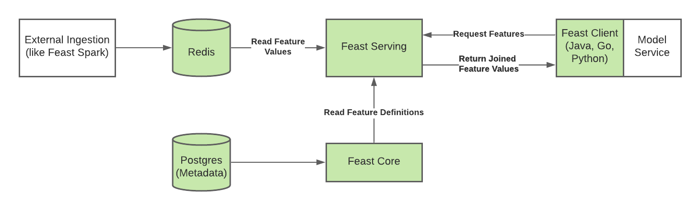

# Feast Java components

### Overview

This repository contains the following Feast components.
* Feast Core: The central feature registry used to define and manage entities and features.
* Feast Serving: A service used to serve the latest feature values to models.
* Feast Java SDK: A client used to retrieve features from Feast Serving.
* Helm Charts: The repository also contains Helm charts to deploy Feast Core and Feast Serving into a Kubernetes cluster.

### Architecture

* Feast Core has a dependency on Postgres.
* Feast Serving has a dependency on an online store (Redis) for retrieving features. The process of ingesting data into the online store (Redis) is decoupled from the process of reading from it. Please see [Feast Spark](https://github.com/feast-dev/feast-spark) for more details about ingesting data into the online store.
* Feast Serving has a dependency on Feast Core.
* The Go and Python Clients are not a part of this repository.

### Contributing
Guides on Contributing:
- [Contribution Process for Feast](https://docs.feast.dev/v/master/contributing/contributing)
- [Development Guide for Feast](https://docs.feast.dev/contributing/development-guide)
- [Development Guide for feast-java (this repository)](CONTRIBUTING.md)

### Installing using Helm
Please see the Helm charts in [charts](infra/charts).
